Khi một OSD bị down, Ceph sẽ không ngay lập tức thực hiện rebalance (tái phân phối dữ liệu) mà sẽ chờ một khoảng thời gian để xác định xem OSD đó có thực sự mất hay không.

Cơ chế hoạt động cụ thể như sau:

#### OSD bị down

Khi một OSD mất kết nối hoặc ngừng hoạt động, Ceph sẽ đánh dấu nó là down và out sau một khoảng thời gian nhất định nếu nó không tự khôi phục.

Trạng thái này sẽ được phản ánh trong ceph health detail và các PG sử dụng OSD đó có thể chuyển sang trạng thái undersized, degraded.

Chờ thời gian để xác nhận mất dữ liệu

Ceph có tham số mon_osd_report_timeout (mặc định 900 giây = 15 phút), trong thời gian này nếu OSD hoạt động trở lại thì hệ thống không thực hiện rebalance.

Nếu OSD không quay lại, Ceph thực hiện backfill & recovery

Nếu sau mon_osd_report_timeout, OSD vẫn không quay lại, Ceph sẽ bắt đầu sao chép lại dữ liệu bị thiếu từ các OSD còn sống sang các OSD khác để đảm bảo mức replica được duy trì.

Quá trình này gọi là backfill & recovery, làm tăng tải IO trên cluster.

#### Khi OSD bị mất hoàn toàn (out)

Nếu OSD mất hoàn toàn và admin chủ động remove OSD khỏi cluster bằng lệnh: ``ceph osd out <osd_id> `` `` ceph osd crush remove osd.<osd_id> `` → Lúc này Ceph sẽ rebalance lại dữ liệu ngay lập tức để đảm bảo số lượng bản sao đúng theo replication size.

    ceph config get mon mon_osd_report_timeout

  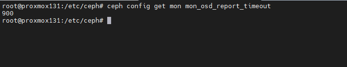

  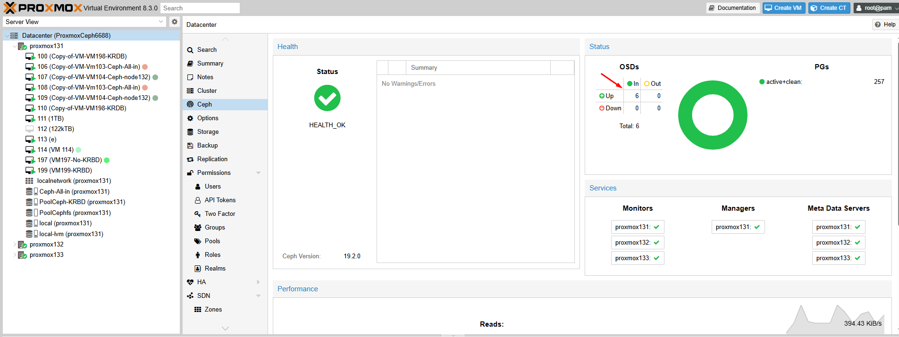


Câu hỏi đặt ra là hệ thống có tự remove OSD ra khỏi Cluster khi vượt quá thời gian của mon_osd_report_timeout hay không?

Khi một OSD bị down và vượt quá thời gian mon_osd_report_timeout, nó không tự động bị remove khỏi cluster mà sẽ được đánh dấu là out sau một thời gian nhất định. Cụ thể:

🔹 Cách Ceph xử lý OSD down lâu

#### OSD bị down

Khi OSD mất kết nối, Ceph sẽ đánh dấu nó là down.

  + Hệ thống vẫn giữ metadata của OSD đó, không loại bỏ ngay.
  + Sau mon_osd_report_timeout (mặc định: 900 giây = 15 phút)
  + Monitor sẽ coi OSD là không phản hồi trong thời gian dài.
  + Các PG chứa OSD này có thể rơi vào trạng thái undersized, degraded, hoặc inconsistent.
  + Sau osd_out_timeout (mặc định: 600 giây = 10 phút)
  + Nếu OSD vẫn chưa quay lại, nó sẽ bị đánh dấu là “out”.
  + Hệ thống bắt đầu rebalance dữ liệu sang các OSD khác để đảm bảo đủ số bản sao (replicas).

OSD vẫn không quay lại?

  + Nó vẫn tồn tại trong cluster, nhưng sẽ không được sử dụng để lưu trữ dữ liệu.
  + Nếu muốn loại bỏ hẳn, bạn phải xóa thủ công bằng: ceph osd purge <osd_id> --yes-i-really-mean-it

Kêt luận

  + mon_osd_report_timeout không tự động xóa OSD, chỉ đánh dấu nó là down.
  + osd_out_timeout sẽ đánh dấu nó là out nếu mất kết nối quá lâu.
  + Ceph sẽ tự động rebalance dữ liệu nếu một OSD bị out.
  + Nếu OSD bị hỏng hoàn toàn, bạn phải xóa thủ công.

#### Xử lý thay thế osd.0 trên 1 máy chủ

  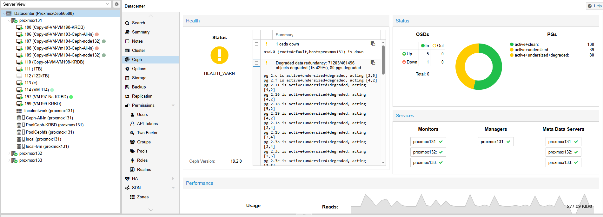

  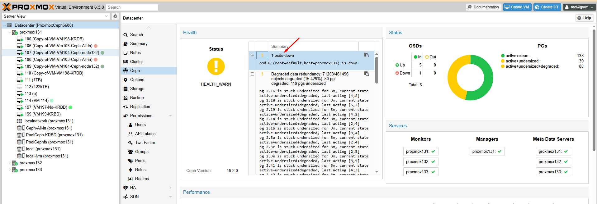

  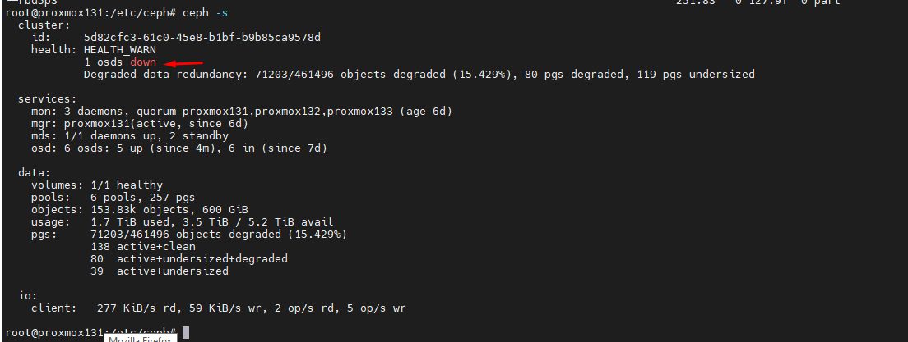

```Bash
root@proxmox131:/etc/ceph# ceph osd out osd.0
marked out osd.0.
root@proxmox131:/etc/ceph# ceph osd crush remove osd.0
removed item id 0 name 'osd.0' from crush map
root@proxmox131:/etc/ceph# ceph osd rm osd.0
removed osd.0
root@proxmox131:/etc/ceph# ceph auth del osd.0

```
  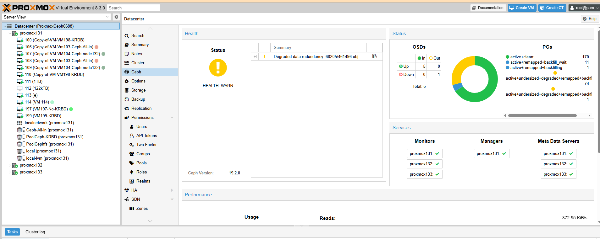

Create OSD mới

  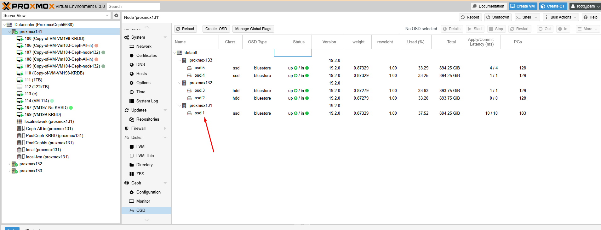

  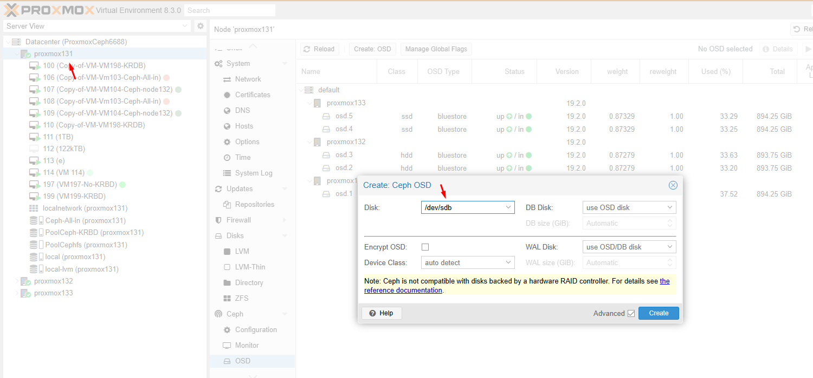

OSD 6 là OSD mới cắm vào để thay thế

  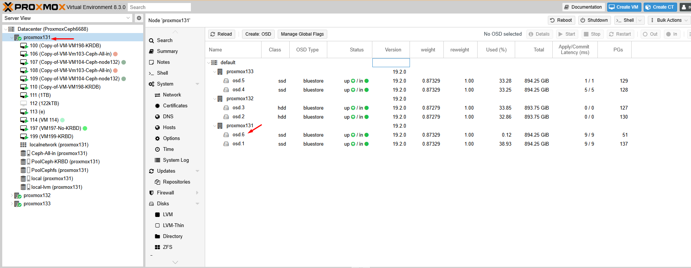

  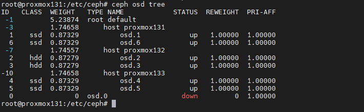

  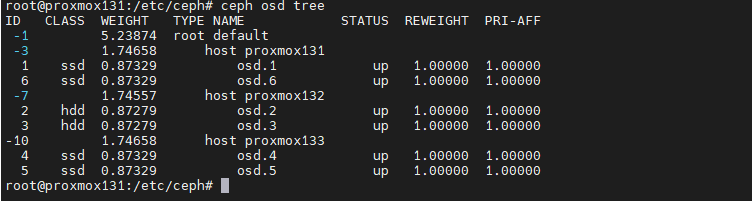

#### Tóm tắt lại:
```Bash
# Đánh dấu OSD 0 là out
ceph osd out osd.0

# Xóa OSD 0 khỏi CRUSH map
ceph osd crush rm osd.0

# Xóa OSD 0 khỏi cụm Ceph
ceph osd rm osd.0

# Xóa khóa xác thực của OSD 0
ceph auth del osd.0

# (Tùy chọn) Xóa dữ liệu của OSD 0
ceph-volume lvm zap /dev/sdb # Thay /dev/sdb bằng đường dẫn thiết bị thực tế

# Kiểm tra trạng thái cụm
ceph -s

```
Đợi 1 chút thời gian là node sẽ hồi phục và chúng ta cần cập nhật lại PG đồng đều

  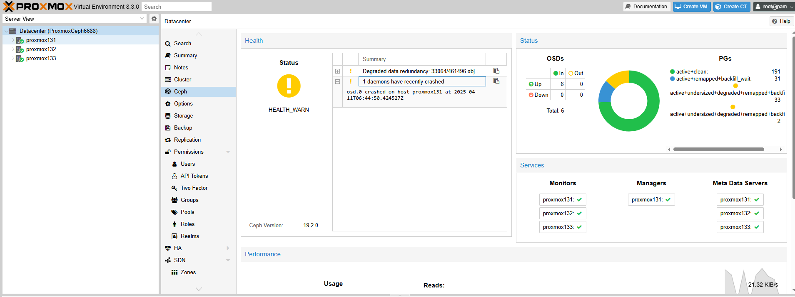

  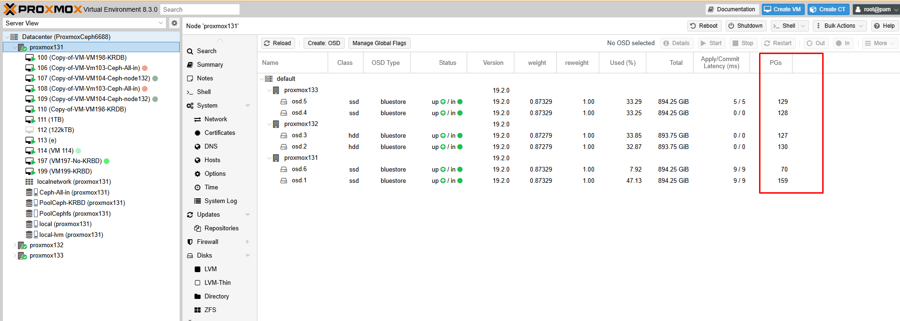

  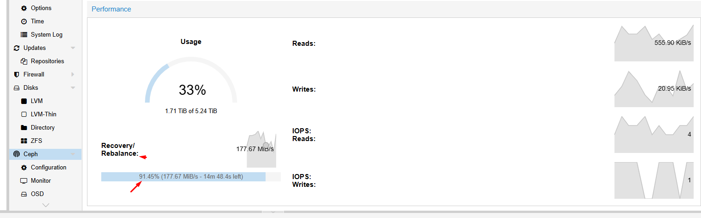

Sau đó mình gỡ thêm 2 ổ và destroy

  

PG đã phân phối lại lần nữa


