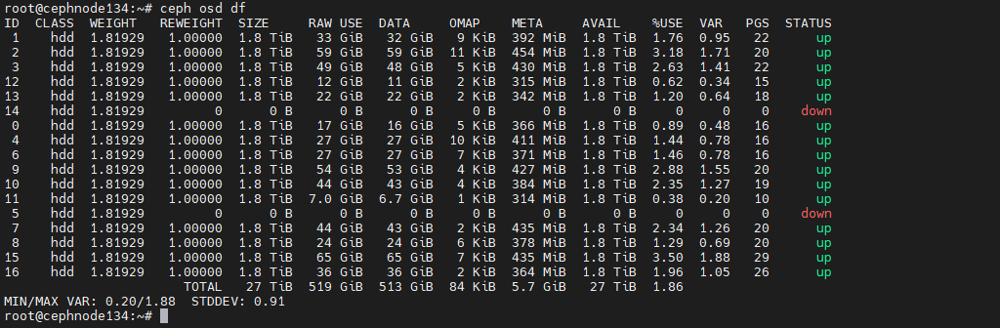

## Không quan tâm dữ liệu

  

ceph osd tree

# Đánh dấu OSD 0 là out
ceph osd out osd.0

# Xóa OSD 0 khỏi CRUSH map
ceph osd crush rm osd.0

# Xóa OSD 0 khỏi cụm Ceph
ceph osd rm osd.0

# Xóa khóa xác thực của OSD 0
ceph auth del osd.0

ceph osd down osd.6
ceph osd out osd.6
ceph osd crush rm osd.6
ceph osd rm osd.6
ceph auth del osd.6

