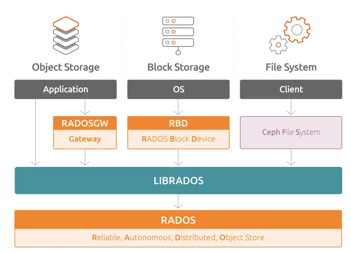
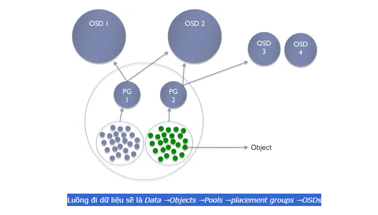
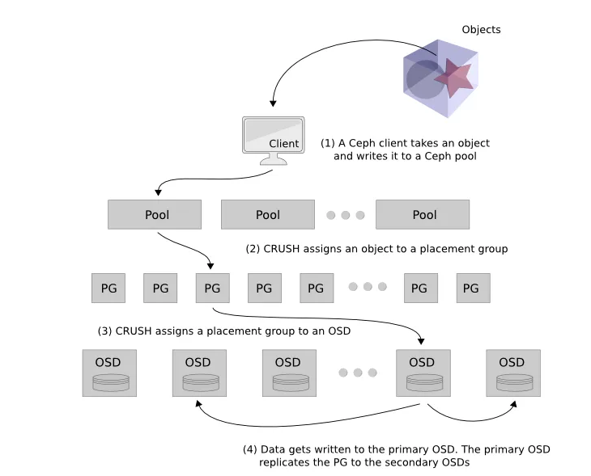

## 1. Giới thiệu tổng quan về Ceph

Ceph là một hệ thống lưu trữ mã nguồn mở, phân tán, mở rộng bằng phần mềm. Hệ thống này sử dụng thuật toán Controlled Replication Under Scalable Hashing (CRUSH).

CRUSH là một thuật toán quan trọng trong Ceph, giúp phân phối dữ liệu một cách hiệu quả và đồng đều trên toàn hệ thống, đồng thời cung cấp khả năng mở rộng linh hoạt. Ceph giúp tối ưu hóa việc lưu trữ và quản lý dữ liệu trong môi trường phân tán và có thể mở rộng theo nhu cầu.

Ceph cung cấp ba loại lưu trữ chính như hình dưới:

  

#### Block Storage thông qua RADOS Block Device (RBD): 

Cho phép lưu trữ dữ liệu dưới dạng các Block, giống như ổ đĩa cứng và sử dụng RADOS Block Device để quản lý.

#### File Storage thông qua CephFS: 

Cho phép tổ chức và lưu trữ dữ liệu dưới dạng các file và thư mục, tương tự như cách chúng ta tổ chức dữ liệu trên hệ thống file system thông thường.

#### Object Storage thông qua RADOS Gateway: 

Cung cấp lưu trữ dưới dạng đối tượng và hỗ trợ giao diện lập trình tương thích với S3 và Swift, hai giao thức phổ biến trong lưu trữ đám mây.

## 2. Ceph hoạt động như thế nào?

Ceph là một hệ thống lưu trữ phần mềm mở rộng, phân tán và độc lập. Các thành phần chính của Ceph nằm trong tầng lưu trữ cốt lõi, gọi là Reliable Autonomous Distributed Object Store (RADOS). RADOS bao gồm các thành phần như Object Storage Daemons (OSDs) và Ceph Monitors (MONs).

Mỗi OSD là độc lập hoàn toàn và tạo ra mối quan hệ ngang hàng để hình thành một cụm. Mỗi OSD thường được ánh xạ với một ổ đĩa vật lý, khác với cách tiếp cận truyền thống đó là sử dụng RAID.

OSD đảm bảo tính dự trữ của lưu trữ bằng cách sao chép dữ liệu sang các OSD khác dựa trên bản đồ CRUSH. Khi một ổ đĩa OSD (Object Storage Daemon) bị hỏng trong hệ thống Ceph, đó có nghĩa là một phần của lưu trữ dữ liệu không còn khả dụng. OSD thực hiện nhiệm vụ chính là lưu trữ và quản lý dữ liệu trên ổ đĩa hoặc thiết bị lưu trữ tương ứng.

Khi một OSD không hoạt động, dữ liệu mà nó quản lý trở nên không thể truy cập. Khi điều này xảy ra, các node giám sát trong hệ thống sẽ phát hiện tình trạng lỗi và bắt đầu quá trình xử lý sự cố. Một phần quan trọng trong quá trình này là cập nhật bản đồ CRUSH.

Bản đồ CRUSH là một phần quan trọng của hệ thống Ceph, và nó quyết định cách dữ liệu được phân phối trên các OSD trong cụm lưu trữ. Khi một OSD bị lỗi, bản đồ CRUSH cần được cập nhật để chỉ định nơi dữ liệu sẽ được sao chép hoặc chuyển đến để duy trì tính dự trữ.

Sau khi bản đồ CRUSH đã được cập nhật, thông điệp về sự thay đổi này sẽ được gửi đến các khách hàng (clients) của hệ thống. Các khách hàng cần biết nơi dữ liệu của họ được lưu trữ để có thể truy cập dữ liệu. Việc cập nhật này giúp khách hàng biết rằng có một thay đổi trong topologia lưu trữ và họ cần liên kết với các OSD khác để lấy dữ liệu.

Khi một ổ đĩa OSD (Object Storage Daemon) bị hỏng trong hệ thống Ceph, đó có nghĩa là một phần của lưu trữ dữ liệu không còn khả dụng. OSD thực hiện nhiệm vụ chính là lưu trữ và quản lý dữ liệu trên ổ đĩa hoặc thiết bị lưu trữ tương ứng. Khi một OSD không hoạt động, dữ liệu mà nó quản lý trở nên không thể truy cập.

Khi điều này xảy ra, các node giám sát trong hệ thống sẽ phát hiện tình trạng lỗi và bắt đầu quá trình xử lý sự cố. Một phần quan trọng trong quá trình này là cập nhật bản đồ CRUSH.

Bản đồ CRUSH là một phần quan trọng của hệ thống Ceph và nó quyết định cách dữ liệu được phân phối trên các OSD trong cụm lưu trữ. Khi một OSD bị lỗi, bản đồ CRUSH cần được cập nhật để chỉ định nơi dữ liệu sẽ được sao chép hoặc chuyển đến để duy trì tính dự trữ.

Sau khi bản đồ CRUSH đã được cập nhật, thông điệp về sự thay đổi này sẽ được gửi đến các khách hàng (clients) của hệ thống. Các khách hàng cần biết nơi dữ liệu của họ được lưu trữ để có thể truy cập dữ liệu. Việc cập nhật này giúp khách hàng biết rằng có một thay đổi trong topologia lưu trữ và họ cần liên kết với các OSD khác để lấy dữ liệu.

OSD không chỉ phản ứng bằng cách ngừng hoạt động khi lỗi xuất hiện, mà còn tham gia vào quá trình khắc phục tình trạng. OSD mới có thể được triển khai để thay thế OSD lỗi và bắt đầu sao chép dữ liệu từ các OSD khác để tái tạo tính dự trữ. Việc này giúp đảm bảo rằng dữ liệu vẫn khả dụng và an toàn ngay cả khi có sự cố với một hoặc nhiều OSD.

### Mối quan hệ giữa đối tượng (object), pool, placement groups, và số lượng OSDs trong hệ thống Ceph.

Trong Ceph, đối tượng chứa trong các pool và được quản lý và phân phối thông qua placement groups, mỗi pool có số lượng placement groups cụ thể. Placement groups liên kết với một số lượng OSDs và sự liên kết này quyết định cách dữ liệu được lưu trữ và xử lý trong hệ thống phân tán của Ceph.

  

#### Đối Tượng (Object):

Trong Ceph, dữ liệu được tổ chức và lưu trữ dưới dạng Object.
Đối tượng có thể là bất kỳ loại dữ liệu nào, chẳng hạn như file, hình ảnh, hoặc bất kỳ dữ liệu nào khác cần được lưu trữ và quản lý.

#### Pool:

Một pool trong Ceph là một không gian lưu trữ đặc biệt dành cho việc lưu trữ các đối tượng.

Các đối tượng được lưu trữ trong một pool cụ thể.

#### Placement Group (PG):

Placement Group là một phần của pool và được sử dụng để phân phối và quản lý dữ liệu.

Mỗi pool chứa một số lượng placement groups. Số lượng PGs được sử dụng để quản lý phân phối dữ liệu và tăng cường hiệu suất.

#### Số Lượng OSDs (Object Storage Devices):

OSDs là các thành phần của hệ thống Ceph chịu trách nhiệm lưu trữ và quản lý dữ liệu.

Mỗi placement group liên kết với một số lượng OSDs, và số lượng OSDs này thường được sử dụng để xác định cách dữ liệu được phân phối và lưu trữ trong hệ thống.

#### Mối Quan Hệ:

Mỗi đối tượng trong một pool sẽ được liên kết với một hoặc nhiều placement groups. Điều này giúp phân phối dữ liệu và công việc xử lý trên các OSDs.

Số lượng placement groups trong pool sẽ ảnh hưởng đến cách dữ liệu được phân phối và cách mỗi OSD liên quan đến việc lưu trữ và xử lý đối tượng.

Ví dụ, nếu replication là ba, mỗi placement groups sẽ liên kết với ba OSD. Một OSD chính và hai OSD phụ. OSD chính sẽ phục vụ dữ liệu và kết nối với OSD phụ để đảm bảo tính dự trữ dữ liệu. Trong trường hợp OSD chính bị hỏng, một OSD phụ có thể được thăng cấp để trở thành OSD chính và phục vụ dữ liệu, đảm bảo khả năng sẵn có cao.

### Monitors.

Một Ceph Monitors chịu trách nhiệm hỗ trợ đạt được một sự thống nhất trong quá trình đưa ra quyết định phân tán bằng cách sử dụng giao thức Paxos. Quan trọng nhớ rằng Ceph Monitors không lưu trữ hoặc xử lý bất kỳ metadata nào. Nó chỉ theo dõi bản đồ CRUSH cho cả khách hàng và các node lưu trữ cá nhân.

Trong Ceph, tính nhất quán được ưu tiên hơn tính sẵn có. Phải có số lượng đa số của các Ceph Monitors được cấu hình để có thể sẵn sáng cho cụm hoạt động. Ví dụ, nếu có hai Ceph Monitors và một Ceph Monitors bị lỗi, chỉ có 50% Ceph Monitors có sẵn nên cụm sẽ không hoạt động. Nhưng nếu có ba Ceph Monitors, cụm sẽ vẫn tồn tại khi một node lỗi và vẫn hoạt động đầy đủ.

### Pool.

Như đã đề cập, Pools là các phân vùng logic để lưu trữ đối tượng. Trong Ceph, các đối tượng thuộc về các pool và các pool được tạo thành từ các placement groups. Mỗi placement groups tương ứng với một danh sách OSDs. Dưới đây là ý chính bạn cần hiểu.

Pool là cách Ceph chia nhỏ lưu trữ. Phân chia này được sử dụng để cô lập dữ liệu của khách hàng cho mỗi dự án (dễ quản lý). Ví dụ, mình đã tạo một pool gọi là Kubernetes và tôi chỉ sử dụng nó cho dữ liệu từ cụm Kubernetes của tôi.

  

