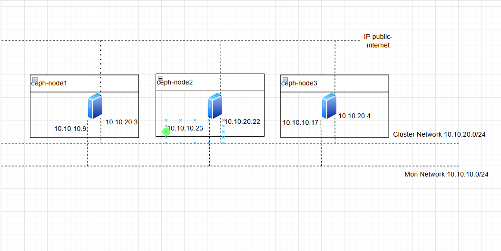
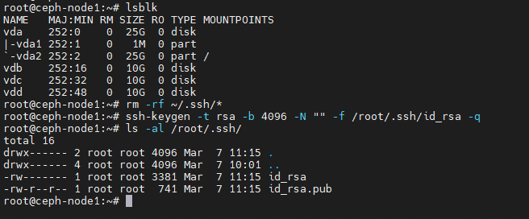
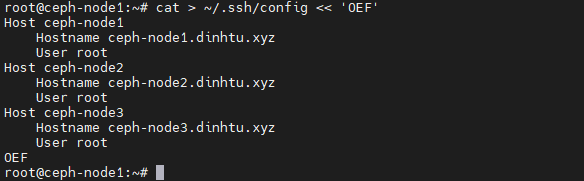
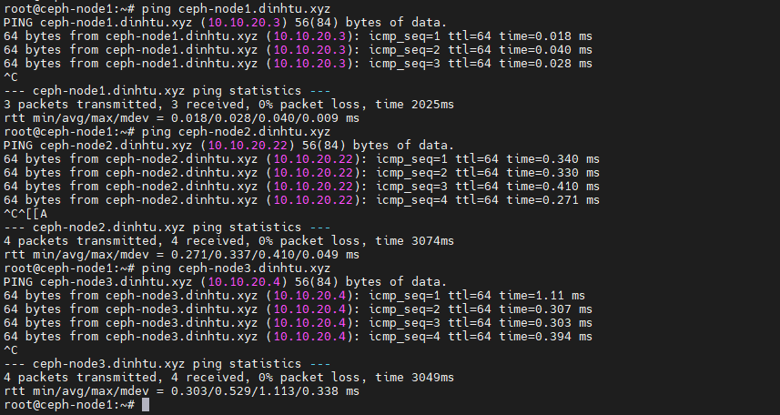
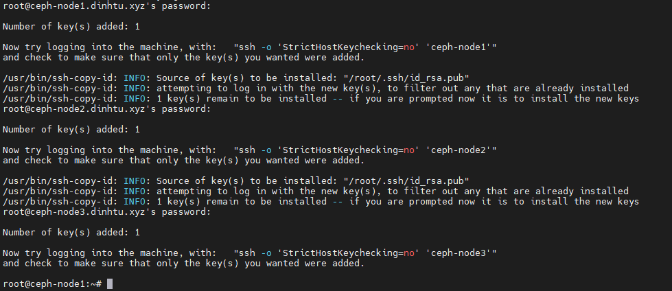
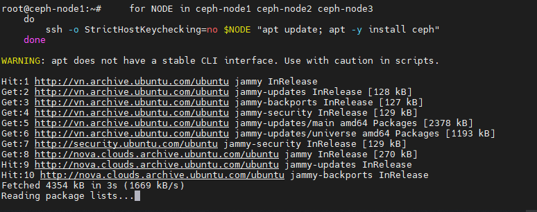
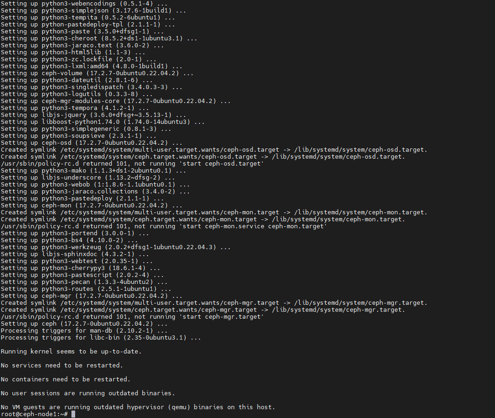
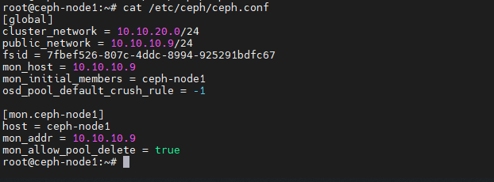

## 1. Tổng quan.

Ceph Cluster là một cụm lưu trữ phân tán, có khả năng mở rộng lớn, cung cấp các dịch vụ lưu trữ như block, file và object storage. Ceph Cluster được thiết kế để tự sửa chữa và quản lý chính nó làm giảm bớt nhu cầu can thiệp của người quản trị hệ thống.

## 2. Quy trình tạo một Ceph Cluster.

Quy trình tạo một Ceph Cluster gồm các bước sau:

Cài đặt phần mềm Ceph: Cài đặt phần mềm Ceph trên tất cả các node trong cụm.

Cấu hình Ceph Monitor: Ceph Monitor giám sát trạng thái của cụm, bao gồm thông tin về tất cả các node và trạng thái của chúng. Bạn cần cấu hình ít nhất một Ceph Monitor để khởi động cụm.

Cấu hình Ceph Manager: Ceph Manager cung cấp các dịch vụ hỗ trợ cho Ceph Monitor, như cung cấp thông tin về trạng thái cụm cho các giao diện người dùng.

Cấu hình Ceph OSD: Ceph OSD (Object Storage Daemons) là những nơi thực sự lưu trữ dữ liệu. Mỗi OSD tương ứng với một ổ đĩa trong cụm. Bạn cần cấu hình ít nhất một OSD để cụm có thể hoạt động.

Tạo và cấu hình Storage Pools: Storage Pools là nhóm các OSD. Bạn cần tạo ít nhất một pool và cấu hình nó để phù hợp với yêu cầu về hiệu suất và độ tin cậy.

Cấu hình Client: Cuối cùng, bạn cần cấu hình client để có thể truy cập vào cụm và sử dụng dịch vụ lưu trữ của nó.

## 3. Thực hành triển khai Ceph Cluster.

Ví dụ ở đây mình sẽ cấu hình Cụm Ceph với sơ đồ 3 Node như sau.

  

Mỗi Node lưu trữ đều có một block device để sử dụng trên các Node Ceph. (sử dụng [/dev/vdb, /dev/vdc, /dev/vdd] trong ví dụ này).

#### Bước 1: Tạo cặp khóa SSH.

Tạo cặp khóa SSH trên Node [Monitor Daemon] (gọi nó là Node quản trị ở đây) và copy nó cho mỗi Node trong cụm. Do mình muốn xóa hết các cặp khóa cũ nên mình sử dụngrm -rf ~/.ssh/* để xóa tất cả các file trong thư mục ~/.ssh, điều này sẽ xóa hết các khóa SSH và các file cấu hình.

Trên ceph-node1 chạy lệnh sau

    rm -rf ~/.ssh/*

Tạo một cặp khóa SSH mới không có mật khẩu và lưu chúng vào thư mục /root/.ssh.

    ssh-keygen -t rsa -b 4096 -N "" -f /root/.ssh/id_rsa -q

Nhớ xác nhận các khóa đã tạo thành công.

  

#### Bước 2 – Thêm thông tin về cách kết nối đến các node trong cụm Ceph.

Tiếp theo, tạo một file cấu hình SSH mới trong ~/.ssh/config với thông tin về cách kết nối đến các node trong cụm Ceph.

    root@ceph-node1:~# cat > ~/.ssh/config << 'OEF'
    Host ceph-node1
        Hostname ceph-node1.dinhtu.xyz
        User root
    Host ceph-node2
        Hostname ceph-node2.dinhtu.xyz
        User root
    Host ceph-node3
        Hostname ceph-node3.dinhtu.xyz
        User root
    OEF
    
  

Đặt quyền truy cập cho file cấu hình SSH để chỉ có người dùng hiện tại mới có thể đọc và ghi vào file.

    root@ceph-node1:~# chmod 600 ~/.ssh/config

#### Bước 3: Trỏ file hosts.

Phần tiếp theo tạo một file /etc/hosts mới với các địa chỉ IP và tên máy chủ cho cụm Ceph. Lưu ý đối với giao tiếp giữa các Node các bạn nên sử dụng IP Private của mỗi Node, đây là IP có băng thông cao sử dụng cho kết nối các cluster trong cum ví dụ như dưới.

    root@ceph-node1:~# cat >> /etc/hosts << 'OEF'
    10.10.20.3 ceph-node1.dinhtu.xyz ceph-node1
    10.10.20.22 ceph-node2.dinhtu.xyz ceph-node2
    10.10.20.4 ceph-node3.dinhtu.xyz ceph-node3
    OEF

Xác nhận kết nối đến các Node bằng domain thành công.

Ví dụ kết quả từ ceph-node1.dinhtu.xyz sang ceph-node2.dinhtu.xyz.

  

#### Bước 4 – Sao chép khóa công khai SSH đến node còn lại trong cụm.

Sử dụng lệnh ``ssh-copy-id`` sao chép khóa công khai SSH đến node trong trong cụm, tính luôn cả ``ceph-node1``, ví dụ của mình là ``ceph-node2`` và ``ceph-node3``.

    ssh-copy-id -o StrictHostKeychecking=no ceph-node1
    ssh-copy-id -o StrictHostKeychecking=no ceph-node2
    ssh-copy-id -o StrictHostKeychecking=no ceph-node3

Tùy chọn ``-o StrictHostKeychecking=no`` ngăn chặn việc kiểm tra dấu vân tay của máy chủ, cho phép kết nối tự động.

Dưới đây là ví dụ đầu ra khi chạy lệnh trên ở một node bất kỳ sẽ tương tự như dưới.

  

Nhập mật khẩu của Node Remote để thực hiện việc sao chép.

#### Bước 5 – Cài đặt Ceph trên các node trong cụm.

Dưới đây là một đoạn shell sử dụng ``for`` để cài đặt Ceph trên mỗi node trong cụm.

    for NODE in ceph-node1 ceph-node2 ceph-node3
    do
        ssh -o StrictHostKeychecking=no $NODE "apt update; apt -y install ceph"
    done 

Ví dụ về đầu ra của đoạn shell.

  

  

Hành động này sẽ giúp bạn đứng có thể từ Node bất kỳ gửi lệnh cài đặt Ceph cho tất cả các Node trong dòng for.

#### Bước 5 – Tạo một UUID mới .

Sử dụng uuidgen để tạo một UUID mới, UUID này có thể được sử dụng như một định danh duy nhất cho cụm Ceph.

    root@ceph-node1:~# uuidgen
    7fbef526-807c-4ddc-8994-925291bdfc67

Bước 6 – Tạo file cấu hình chính cho Ceph.

Tạo một file cấu hình Ceph mới trong ``/etc/ceph/ceph.conf`` với thông tin về cụm, bao gồm network, địa chỉ IP của các node monitor và các tùy chọn khác. Nhớ truyền thông tin UUID đã lấy được ở bước trên vào fsid, ví dụ fsid = ``7fbef526-807c-4ddc-8994-925291bdfc67``.

    root@ceph-node1:~# cat > /etc/ceph/ceph.conf << OEF
    [global]
    cluster_network = 10.10.20.0/24
    public_network = 10.10.10.9/24
    fsid = 7fbef526-807c-4ddc-8994-925291bdfc67
    mon_host = 10.10.10.9
    mon_initial_members = ceph-node1
    osd_pool_default_crush_rule = -1

    [mon.ceph-node1]
    host = ceph-node1
    mon_addr = 10.10.10.9
    mon_allow_pool_delete = true
    OEF

  

