## 1. Tổng quan.

Ceph Cluster là một cụm lưu trữ phân tán, có khả năng mở rộng lớn, cung cấp các dịch vụ lưu trữ như block, file và object storage. Ceph Cluster được thiết kế để tự sửa chữa và quản lý chính nó làm giảm bớt nhu cầu can thiệp của người quản trị hệ thống.

## 2. Quy trình tạo một Ceph Cluster.

Quy trình tạo một Ceph Cluster gồm các bước sau:

  + Cài đặt phần mềm Ceph: Cài đặt phần mềm      Ceph trên tất cả các node trong cụm.

  + Cấu hình Ceph Monitor: Ceph Monitor giám sát trạng thái của cụm, bao gồm thông tin về tất cả các node và trạng thái của chúng. Bạn cần cấu hình ít nhất một Ceph Monitor để khởi động cụm.

  + Cấu hình Ceph Manager: Ceph Manager cung cấp các dịch vụ hỗ trợ cho Ceph Monitor, như cung cấp thông tin về trạng thái cụm cho các giao diện người dùng.

  + Cấu hình Ceph OSD: Ceph OSD (Object Storage Daemons) là những nơi thực sự lưu trữ dữ liệu. Mỗi OSD tương ứng với một ổ đĩa trong cụm. Bạn cần cấu hình ít nhất một OSD để cụm có thể hoạt động.

  + Tạo và cấu hình Storage Pools: Storage Pools là nhóm các OSD. Bạn cần tạo ít nhất một pool và cấu hình nó để phù hợp với yêu cầu về hiệu suất và độ tin cậy.

  + Cấu hình Client: Cuối cùng, bạn cần cấu hình client để có thể truy cập vào cụm và sử dụng dịch vụ lưu trữ của nó.

## 3. Thực hành triển khai Ceph Cluster.

Ví dụ ở đây mình sẽ cấu hình Cụm Ceph với sơ đồ 3 Node như sau.

  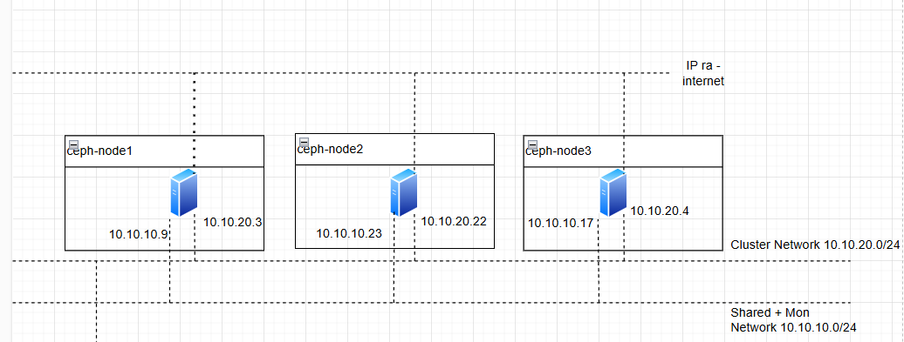

Mỗi Node lưu trữ đều có một block device để sử dụng trên các Node Ceph. (sử dụng [/dev/vdb, /dev/vdc, /dev/vdd] trong ví dụ này).

#### Bước 1: Tạo cặp khóa SSH.

Tạo cặp khóa SSH trên Node [Monitor Daemon] (gọi nó là Node quản trị ở đây) và copy nó cho mỗi Node trong cụm. Do mình muốn xóa hết các cặp khóa cũ nên mình sử dụng ``rm -rf ~/.ssh/*`` để xóa tất cả các file trong thư mục ``~/.ssh``, điều này sẽ xóa hết các khóa SSH và các file cấu hình.

Trên ceph-node1 chạy lệnh sau

    rm -rf ~/.ssh/*

Tạo một cặp khóa SSH mới không có mật khẩu và lưu chúng vào thư mục /root/.ssh.

    ssh-keygen -t rsa -b 4096 -N "" -f  /root/.ssh/id_rsa -q

Nhớ xác nhận các khóa đã tạo thành công.

  

#### Bước 2 – Thêm thông tin về cách kết nối đến các node trong cụm Ceph.

Tiếp theo, tạo một file cấu hình SSH mới trong ~/.ssh/config với thông tin về cách kết nối đến các node trong cụm Ceph.

    root@ceph-node1:~# cat > ~/.ssh/config << 'OEF'
    Host ceph-node1
        Hostname ceph-node1.dinhtu.xyz
        User root
    Host ceph-node2
        Hostname ceph-node2.dinhtu.xyz
        User root
    Host ceph-node3
        Hostname ceph-node3.dinhtu.xyz
        User root
    OEF
    
  

Đặt quyền truy cập cho file cấu hình SSH để chỉ có người dùng hiện tại mới có thể đọc và ghi vào file.

    root@ceph-node1:~# chmod 600 ~/.ssh/config

#### Bước 3: Trỏ file hosts.

Phần tiếp theo tạo một file /etc/hosts mới với các địa chỉ IP và tên máy chủ cho cụm Ceph. Lưu ý đối với giao tiếp giữa các Node các bạn nên sử dụng IP Private của mỗi Node, đây là IP có băng thông cao sử dụng cho kết nối các cluster trong cum ví dụ như dưới.

    root@ceph-node1:~# cat >> /etc/hosts << 'OEF'
    10.10.20.3 ceph-node1.dinhtu.xyz ceph-node1
    10.10.20.22 ceph-node2.dinhtu.xyz ceph-node2
    10.10.20.4 ceph-node3.dinhtu.xyz ceph-node3
    OEF

Xác nhận kết nối đến các Node bằng domain thành công.

Ví dụ kết quả từ ceph-node1.dinhtu.xyz sang ceph-node2.dinhtu.xyz.

  

#### Bước 4 – Sao chép khóa công khai SSH đến node còn lại trong cụm.

Sử dụng lệnh ``ssh-copy-id`` sao chép khóa công khai SSH đến node trong trong cụm, tính luôn cả ``ceph-node1``, ví dụ của mình là ``ceph-node2`` và ``ceph-node3``.

    ssh-copy-id -o StrictHostKeychecking=no ceph-node1
    ssh-copy-id -o StrictHostKeychecking=no ceph-node2
    ssh-copy-id -o StrictHostKeychecking=no ceph-node3

Tùy chọn ``-o StrictHostKeychecking=no`` ngăn chặn việc kiểm tra dấu vân tay của máy chủ, cho phép kết nối tự động.

Dưới đây là ví dụ đầu ra khi chạy lệnh trên ở một node bất kỳ sẽ tương tự như dưới.

  

Nhập mật khẩu của Node Remote để thực hiện việc sao chép.

#### Bước 5 – Cài đặt Ceph trên các node trong cụm.

Dưới đây là một đoạn shell sử dụng ``for`` để cài đặt Ceph trên mỗi node trong cụm.

    for NODE in ceph-node1 ceph-node2 ceph-node3
    do
        ssh -o StrictHostKeychecking=no $NODE "apt update; apt -y install ceph"
    done 

Ví dụ về đầu ra của đoạn shell.

  

  

Hành động này sẽ giúp bạn đứng có thể từ Node bất kỳ gửi lệnh cài đặt Ceph cho tất cả các Node trong dòng for.

#### Bước 5 – Tạo một UUID mới .

Sử dụng uuidgen để tạo một UUID mới, UUID này có thể được sử dụng như một định danh duy nhất cho cụm Ceph.

    root@ceph-node1:~# uuidgen
    7fbef526-807c-4ddc-8994-925291bdfc67

Bước 6 – Tạo file cấu hình chính cho Ceph.

Tạo một file cấu hình Ceph mới trong ``/etc/ceph/ceph.conf`` với thông tin về cụm, bao gồm network, địa chỉ IP của các node monitor và các tùy chọn khác. Nhớ truyền thông tin UUID đã lấy được ở bước trên vào fsid, ví dụ fsid = ``7fbef526-807c-4ddc-8994-925291bdfc67``.

    root@ceph-node1:~# cat > /etc/ceph/ceph.conf << OEF
    [global]
    cluster_network = 10.10.20.0/24
    public_network = 10.10.10.9/24
    fsid = 7fbef526-807c-4ddc-8994-925291bdfc67
    mon_host = 10.10.10.9
    mon_initial_members = ceph-node1
    osd_pool_default_crush_rule = -1

    [mon.ceph-node1]
    host = ceph-node1
    mon_addr = 10.10.10.9
    mon_allow_pool_delete = true
    OEF

  

Dưới đây là giải thích về các tùy chọn trong đoạn cấu hình Ceph ở trên:

  + cluster_network = 10.10.20.0/24: Địa chỉ mạng cho giao tiếp nội bộ giữa các OSD (Object Storage Daemons) trong cụm. Đây là mạng nội bộ mà Ceph sẽ sử dụng để trao đổi dữ liệu.
  + public_network = 10.10.10.9/24: Địa chỉ mạng công khai mà Ceph sẽ sử dụng để giao tiếp với các client và các dịch vụ khác như Ceph Monitor.
  + fsid = 0aed20ae-5941-4578-aedb-c78fdfd75bdf: Định danh duy nhất cho cụm Ceph. Đây là một UUID được tạo ra ngẫu nhiên.
  + mon host = 10.10.10.9: Địa chỉ IP của Ceph Monitor, một thành phần quan trọng giám sát trạng thái của cụm.
  + mon initial members = ceph-node1: Danh sách các node monitor ban đầu. Trong trường hợp này, chỉ có một node monitor là ceph-node1.
  + osd pool default crush rule = -1: Đây là quy tắc CRUSH mặc định cho các pool. CRUSH là thuật toán mà Ceph sử dụng để xác định cách phân phối dữ liệu trên các OSD.
  + [mon.ceph-node1]: Đây là một phần cấu hình cho monitor ceph-node1.
      + host = ceph-node1: Tên host của monitor.
      + mon addr = 10.10.10.9: Địa chỉ IP của monitor.
      + mon allow pool delete = true: Tùy chọn này cho phép xóa các pool. Mặc định, Ceph không cho phép xóa pool để tránh việc xóa dữ liệu không cố ý.

#### Bước 7 – Tạo khóa bí mật cho Ceph Monitor.

Tạo một khóa bí mật cho Ceph Monitor và lưu nó vào file ``/etc/ceph/ceph.mon.keyring``. Tùy chọn ``--cap mon 'allow *'`` cấp quyền cho Monitor thực hiện tất cả các hành động.

    root@ceph-node1:~# ceph-authtool --create-keyring /etc/ceph/ceph.mon.keyring --gen-key -n mon. --cap mon 'allow *'

  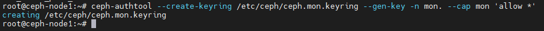

#### Bước 8 – Tạo khóa bí mật cho người quản trị Ceph Cluster.

Tạo một khóa bí mật cho user quản trị Ceph Cluster và lưu nó vào file ``/etc/ceph/ceph.client.admin.keyring``. Tùy chọn --cap cấp quyền cho user quản trị thực hiện tất cả các hành động trên tất cả các thành phần của cụm.

    root@ceph-node1:~# ceph-authtool --create-keyring /etc/ceph/ceph.client.admin.keyring --gen-key -n client.admin --cap mon 'allow *' --cap osd 'allow *' --cap mds 'allow *' --cap mgr 'allow *'

  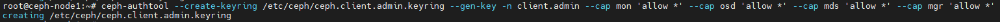

#### Bước 9 – Tạo một khóa bí mật cho quá trình khởi động OSD.

Tạo một khóa bí mật cho quá trình khởi động OSD và lưu nó vào file ``/var/lib/ceph/bootstrap-osd/ceph.keyring``.

    root@ceph-node1:~# ceph-authtool --create-keyring /var/lib/ceph/bootstrap-osd/ceph.keyring --gen-key -n client.bootstrap-osd --cap mon 'profile bootstrap-osd' --cap mgr 'allow r'

  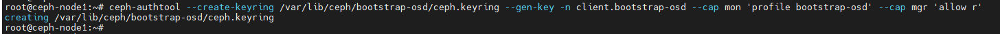

#### Bước 10 – Nhập khóa bí mật của người quản trị vào khóa bí mật của Monitor.

Lệnh ``ceph-authtool`` được sử dụng để quản lý keyrings trong Ceph, một hệ thống lưu trữ phân tán. Keyrings chứa các keys được sử dụng để xác thực các clients và daemons với nhau trong hệ thống Ceph.

Lệnh này sẽ nhập keyring của client admin vào keyring của monitor. Điều này cho phép client admin được xác thực với monitor.

    root@ceph-node1:~# ceph-authtool /etc/ceph/ceph.mon.keyring --import-keyring /etc/ceph/ceph.client.admin.keyring

  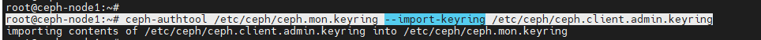

Lệnh này sẽ nhập keyring của ``bootstrap-osd`` vào keyring của monitor. Điều này cho phép ``bootstrap-osd`` được xác thực với monitor.

    root@ceph-node1:~# ceph-authtool /etc/ceph/ceph.mon.keyring --import-keyring /var/lib/ceph/bootstrap-osd/ceph.keyring

  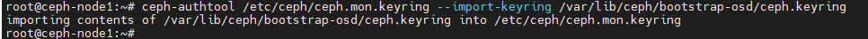

Trong cả hai trường hợp, lệnh ceph-authtool sẽ cập nhật ``/etc/ceph/ceph.mon.keyring`` để bao gồm các keys từ keyring được chỉ định.

#### Bước 11 – Tạo một bản đồ monitor mới với thông tin về tên node, địa chỉ IP và FSID.

Lệnh ``monmaptool`` được sử dụng để tạo và chỉnh sửa bản đồ monitor (monmap) trong hệ thống lưu trữ Ceph. Bản đồ monitor chứa thông tin về tất cả các monitor trong cluster Ceph.

Đầu tiên hãy lấy biến môi trường cần thiết trước.

    FSID=$(grep "^fsid" /etc/ceph/ceph.conf | awk {'print $NF'})
    NODENAME=$(grep "^mon_initial" /etc/ceph/ceph.conf | awk {'print $NF'})
    NODEIP=$(grep "^mon_host" /etc/ceph/ceph.conf | awk {'print $NF'})

Chạy lệnh này để tạo một bản đồ monitor mới và thêm một monitor vào bản đồ đó.

    monmaptool --create --add $NODENAME $NODEIP --fsid $FSID /etc/ceph/monmap

  + --create: Tạo một bản đồ monitor mới.
  + --add $NODENAME $NODEIP: Thêm một monitor mới vào bản đồ. $NODENAME là tên của monitor và $NODEIP là địa chỉ IP của monitor.
  + --fsid $FSID: Đặt FSID (File System ID) cho cluster. FSID là một định danh duy nhất cho mỗi cluster Ceph.
  + /etc/ceph/monmap: Đường dẫn nơi bản đồ monitor sẽ được lưu.

Vì vậy, lệnh này tạo một bản đồ monitor mới với một monitor và FSID được chỉ định và lưu bản đồ đó tại /etc/ceph/monmap.

  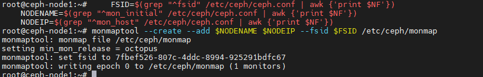

#### Bước 12: Cấu hình Monitor Daemon.

Tạo một thư mục mới cho Monitor Daemon.

    mkdir /var/lib/ceph/mon/ceph-$NODENAME

Khởi tạo Monitor Daemon với thông tin từ bản đồ monitor và khóa bí mật.

    ceph-mon --cluster ceph --mkfs -i $NODENAME --monmap /etc/ceph/monmap --keyring /etc/ceph/ceph.mon.keyring

Thay đổi quyền sở hữu của tất cả các file trong /etc/ceph thành người dùng ceph.

    chown ceph. /etc/ceph/ceph.*
    chown -R ceph. /var/lib/ceph/mon/ceph-$NODENAME /var/lib/ceph/bootstrap-osd

Kích hoạt và khởi động dịch vụ Ceph Monitor.

    root@ceph-node1:~# systemctl enable --now ceph-mon@$NODENAME

Kích hoạt giao thức Messenger v2 cho Ceph Monitor.

    root@ceph-node1:~# ceph mon enable-msgr2

Kích hoạt module tự động điều chỉnh số lượng Placement Groups.

    root@ceph-node1:~# ceph mgr module enable pg_autoscaler
    
  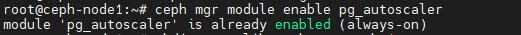

Tạo một thư mục mới cho Manager Daemon.

    root@ceph-node1:~# mkdir /var/lib/ceph/mgr/ceph-$NODENAME

Tạo hoặc lấy khóa xác thực cho Manager Daemon.

    root@ceph-node1:~# ceph auth get-or-create mgr.$NODENAME mon 'allow profile mgr' osd 'allow *' mds 'allow *'

  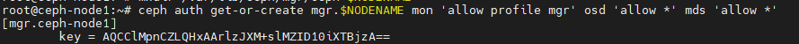

Tạo hoặc lấy khóa xác thực cho Manager Daemon và lưu nó vào file /etc/ceph/ceph.mgr.admin.keyring. Nếu khóa đã tồn tại, lệnh sẽ lấy khóa đó. Nếu không, lệnh sẽ tạo một khóa mới.

    root@ceph-node1:~# ceph auth get-or-create mgr.$NODENAME | tee /etc/ceph/ceph.mgr.admin.keyring
    
  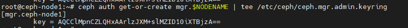

Sao chép file khóa vừa tạo vào thư mục của Manager Daemon.

    root@ceph-node1:~# cp /etc/ceph/ceph.mgr.admin.keyring /var/lib/ceph/mgr/ceph-$NODENAME/keyring

Lệnh này thay đổi quyền sở hữu của file khóa để người dùng ceph có thể truy cập.

    root@ceph-node1:~# chown ceph. /etc/ceph/ceph.mgr.admin.keyring

``chown -R ceph. /var/lib/ceph/mgr/$NODENAME``: Lệnh này thay đổi quyền sở hữu của thư mục Manager Daemon và tất cả các file bên trong để người dùng ceph có thể truy cập.

    root@ceph-node1:~# chown -R ceph. /var/lib/ceph/mgr/ceph-$NODENAME

``systemctl enable --now ceph-mgr@$NODENAME``: Lệnh này kích hoạt và khởi động dịch vụ Ceph Manager. $NODENAME là tên của node mà Manager Daemon đang chạy.

    systemctl enable --now ceph-mgr@$NODENAME

  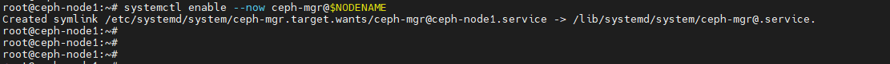

#### Bước cuối – Xác nhận trạng thái cụm.

Sẽ ổn thôi nếu [Monitor Daemon] và [Manager Daemon] hoạt động được bạn sẽ thấy thông báo như sau:

    root@ceph-node1:~# ceph -s

  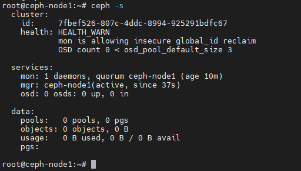

Đối với OSD chúng ta sẽ cấu hình chúng ở phần tiếp theo vì vậy sẽ không có vấn đề gì nếu [HEALTH_WARN] tại thời điểm này.

