Bài Lab sử dụng topo như hình 

  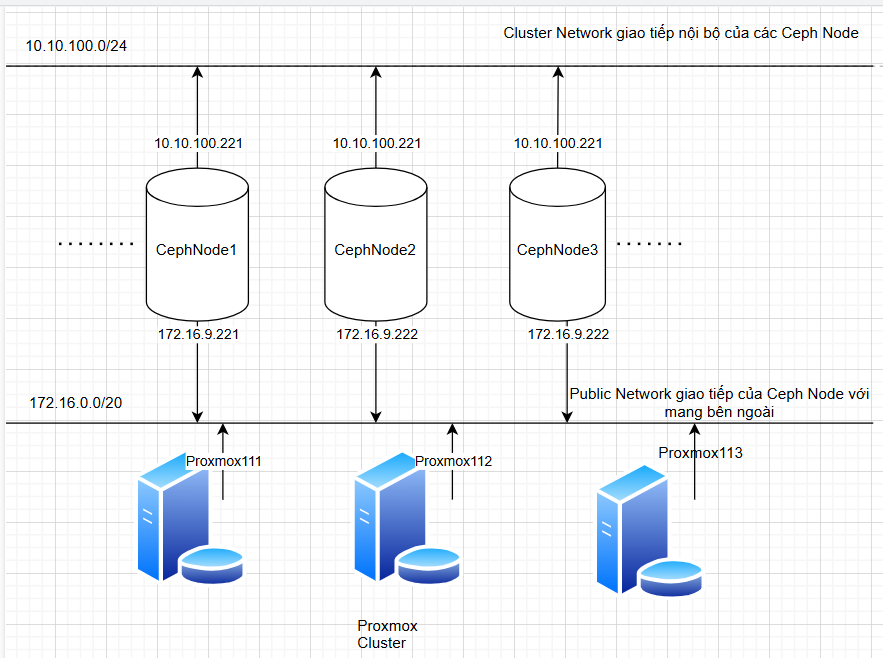

Mình đã gộp các mạng sau trên 1 interfaces:
  + Cluster Network = 10.10.100.0/24
  + Mon Network , Public Network = 172.16.0.0/20

Trong Ceph có 3 mạng được sử dụng đó là:

Trong Ceph có 3 khái niệm mạng quan trọng, phục vụ cho các mục đích khác nhau trong hoạt động của cụm lưu trữ đó là ``Cluster Network`` ``Mon Network`` và ``Public Network`` 
#### Cluster Network (Mạng cụm):

Mục đích:
   
    Mạng này được sử dụng cho lưu lượng dữ liệu giữa các Object Storage Devices (OSDs).
    Đây là nơi dữ liệu thực tế được di chuyển khi đọc, ghi, sao chép và khôi phục.
    Nó chịu trách nhiệm cho việc sao chép dữ liệu giữa các OSD để đảm bảo tính dự phòng và độ tin cậy.
    Nó cũng được sử dụng cho quá trình "backfilling" và "recovery" khi các OSD gặp sự cố.

Đặc điểm:

    Yêu cầu băng thông cao và độ trễ thấp để đảm bảo hiệu suất lưu trữ tối ưu.
    Thường được triển khai trên mạng riêng biệt để tránh xung đột với lưu lượng mạng khác.
    Tối ưu hóa cho việc truyền tải dữ liệu khối lượng lớn.
#### Mon Network (Mạng giám sát):

Mục đích:

    Mạng này được sử dụng cho giao tiếp giữa các Monitor (MON) daemon.
    MON daemon duy trì trạng thái của cụm, bao gồm thông tin về các OSD, pool và CRUSH map.
    Mạng này đảm bảo rằng tất cả các MON daemon có thông tin nhất quán về trạng thái cụm.

    Nó được sử dụng cho việc trao đổi thông tin trạng thái cụm.
Đặc điểm:

    Yêu cầu độ trễ thấp để đảm bảo rằng các MON daemon có thể nhanh chóng đồng bộ hóa thông tin.
    Không yêu cầu băng thông cao như mạng cụm.
    Mạng mon phải đảm bảo sự ổn định.

#### Public Network (Mạng công cộng):

Mục đích:

    Mạng này được sử dụng cho giao tiếp giữa các Ceph client và cụm Ceph.
    Đây là nơi các ứng dụng và người dùng truy cập dữ liệu được lưu trữ trong cụm Ceph.
    Nó xử lý các yêu cầu đọc/ghi dữ liệu từ client đến các OSD.
    Mạng này cho phép Ceph client giao tiếp với các dịch vụ Ceph như RADOS Gateway (RGW), Ceph File System (CephFS) và RADOS Block Device (RBD).

Đặc điểm:

    Băng thông cần thiết phụ thuộc vào khối lượng dữ liệu được truy cập bởi client.
    Độ trễ thấp là quan trọng để đảm bảo hiệu suất truy cập dữ liệu nhanh chóng.
    Mạng này có thể là mạng công cộng (nếu client truy cập từ xa) hoặc mạng riêng (nếu client nằm trong cùng trung tâm dữ liệu).
    Cần đảm bảo đủ băng thông cho các client kết nối đến Ceph cluster.

Tóm lại:

    Public network là cầu nối giữa client và cụm Ceph, cho phép client truy cập và sử dụng dữ liệu được lưu trữ.
    Việc tách biệt mạng này với mạng cluster giúp đảm bảo hiệu suất hoạt động tốt hơn cho cả client và cụm Ceph.
    Cluster network là nơi dữ liệu được di chuyển, trong khi mon network là nơi thông tin trạng thái cụm được trao đổi.
    Cluster network yêu cầu băng thông cao, trong khi mon network yêu cầu độ trễ thấp.

Việc phân biệt rõ ràng ba mạng này giúp tối ưu hóa hiệu suất, bảo mật và độ tin cậy của cụm Ceph.

#### Lưu ý đồng bộ thời gian trên tất cả các máy chủ bằng chrony client(ví dụ)

    timedatectl set-timezone Asia/Ho_Chi_Minh

#### Sơ bộ về server cụm Ceph

Cụm Ceph mình cài đặt trên ubuntu22.04 với 3 node, mỗi node có 6 đĩa OSD , 2 interface network, tên máy và /etc/host ... như các hình ảnh sau:

  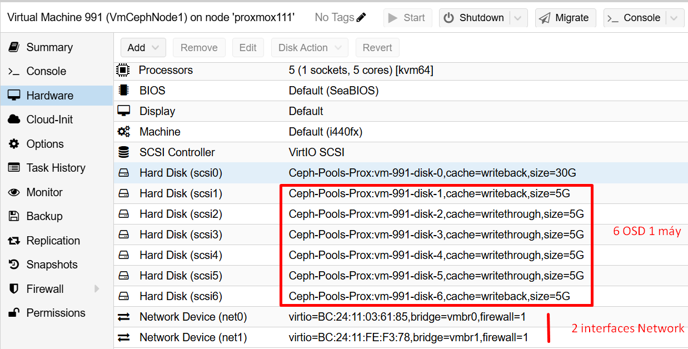

  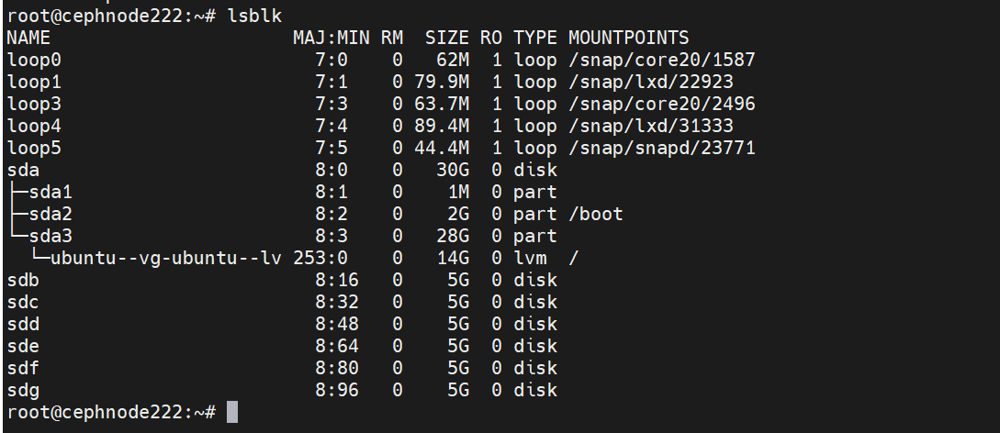

  

  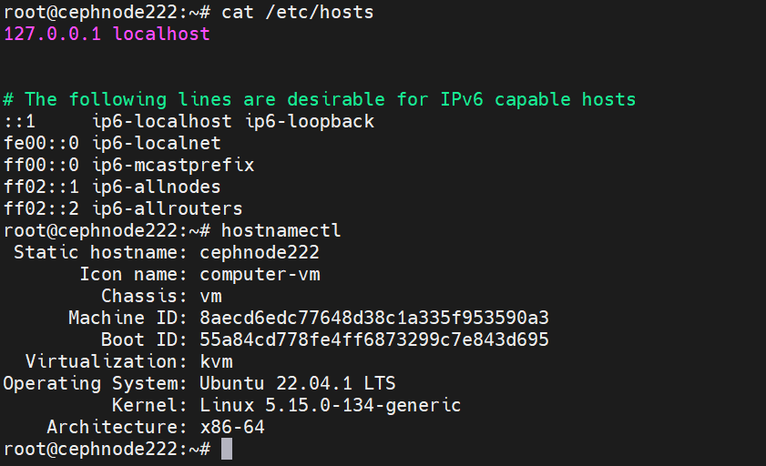

  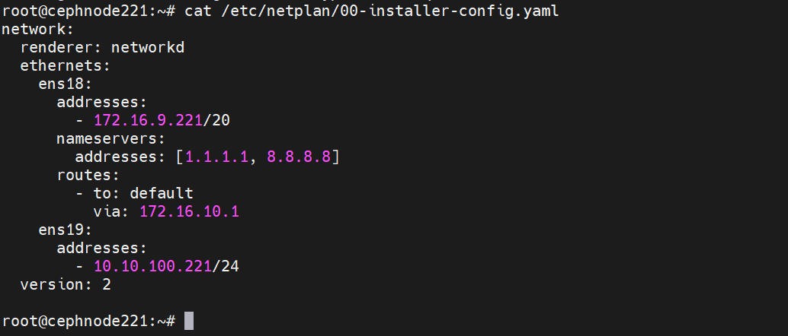
  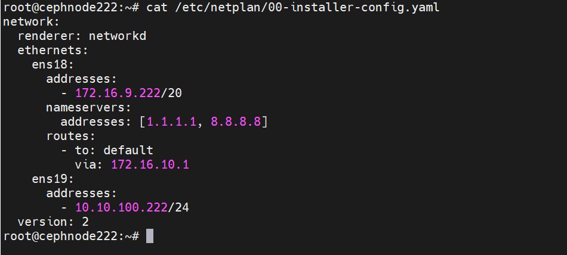
  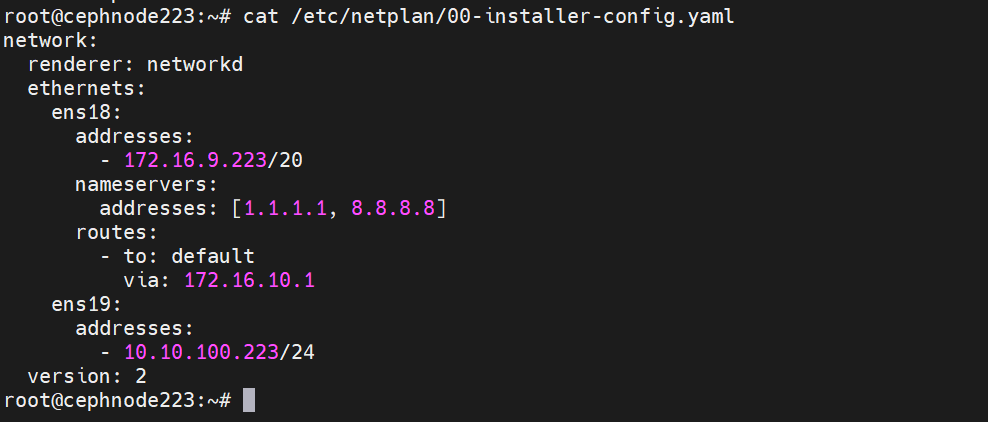

## Bước 1. Cài đặt cụm Ceph

### Bước 1.1: Triển khai Monitor Daemon và Manager Daemon

#### Bước 1.1.1: Tạo cặp khóa SSH.
Tạo cặp khóa SSH trên Node [Monitor Daemon] (gọi nó là Node quản trị ở đây) và copy nó cho mỗi Node trong cụm. Do mình muốn xóa hết các cặp khóa cũ nên mình sử dụng rm -rf ~/.ssh/* để xóa tất cả các file trong thư mục ~/.ssh, điều này sẽ xóa hết các khóa SSH và các file cấu hình.

Trên ceph-node221 chạy lệnh sau

    rm -rf ~/.ssh/*

Tạo một cặp khóa SSH mới không có mật khẩu và lưu chúng vào thư mục /root/.ssh.

    ssh-keygen -t rsa -b 4096 -N "" -f  /root/.ssh/id_rsa -q

Nhớ xác nhận các khóa đã tạo thành công.

    ls -lah /root/.ssh/

  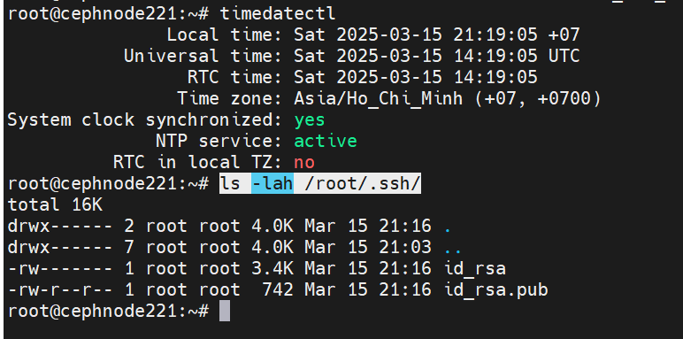

#### Bước 1.1.2: Thêm thông tin về cách kết nối đến các node trong cụm Ceph.

Tiếp theo, tạo một file cấu hình SSH mới trong ~/.ssh/config với thông tin về cách kết nối đến các node trong cụm Ceph.

    cat > ~/.ssh/config << 'OEF'
    Host cephnode221
        Hostname cephnode221.dinhtu.xyz 
        User root
    Host cephnode222
        Hostname cephnode222.dinhtu.xyz 
        User root
    Host cephnode223
        Hostname cephnode223.dinhtu.xyz 
        User root
    OEF

#### Bước 1.1.3: Trỏ file hosts.

Phần tiếp theo tạo một file /etc/hosts mới với các địa chỉ IP và tên máy chủ cho cụm Ceph. Lưu ý đối với giao tiếp giữa các Node các bạn nên sử dụng IP Private của mỗi Node, đây là IP có băng thông cao sử dụng cho kết nối các cluster trong cum ví dụ như dưới.

    cat >> /etc/hosts << 'OEF'
    10.10.100.221 cephnode221.dinhtu.xyz cephnode221
    10.10.100.222 cephnode222.dinhtu.xyz cephnode222
    10.10.100.223 cephnode223.dinhtu.xyz cephnode223
    OEF
Xác nhận kết nối đến các Node bằng domain thành công.

Ví dụ kết quả từ cephnode221.dinhtu.xyz sang cephnode222.dinhtu.xyz.

  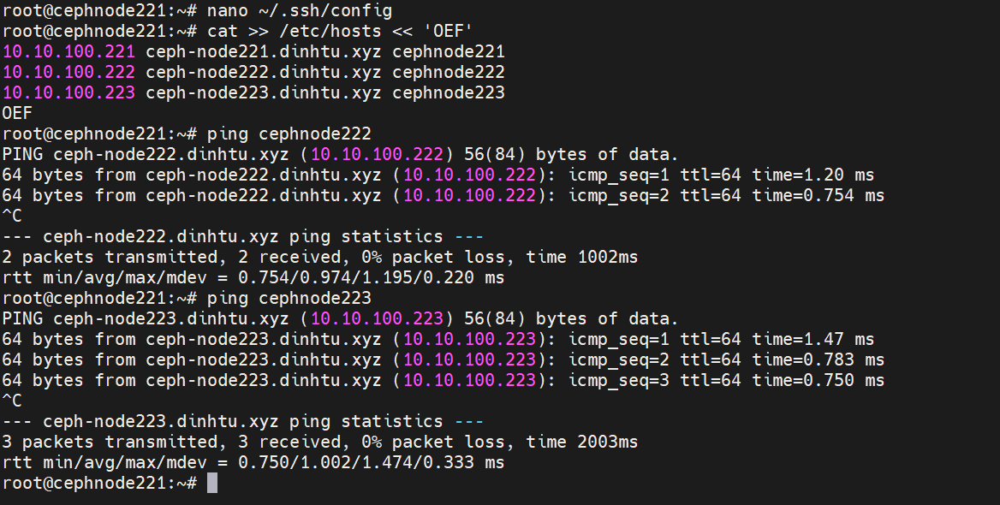

#### Bước 1.1.4: Sao chép khóa công khai SSH đến node còn lại trong cụm.
Sử dụng lệnh ``ssh-copy-id`` sao chép khóa công khai SSH đến node trong trong cụm, tính luôn cả ``cephnode221``, ví dụ của mình là ``cephnode222`` và ``cephnode223``.

    ssh-copy-id -o StrictHostKeychecking=no cephnode221
    ssh-copy-id -o StrictHostKeychecking=no cephnode222
    ssh-copy-id -o StrictHostKeychecking=no cephnode223

Tùy chọn ``-o StrictHostKeychecking=no`` ngăn chặn việc kiểm tra dấu vân tay của máy chủ, cho phép kết nối tự động.

Dưới đây là ví dụ đầu ra khi chạy lệnh trên ở một node bất kỳ sẽ tương tự như dưới.

Nhập mật khẩu của root Node Remote để thực hiện việc sao chép.

  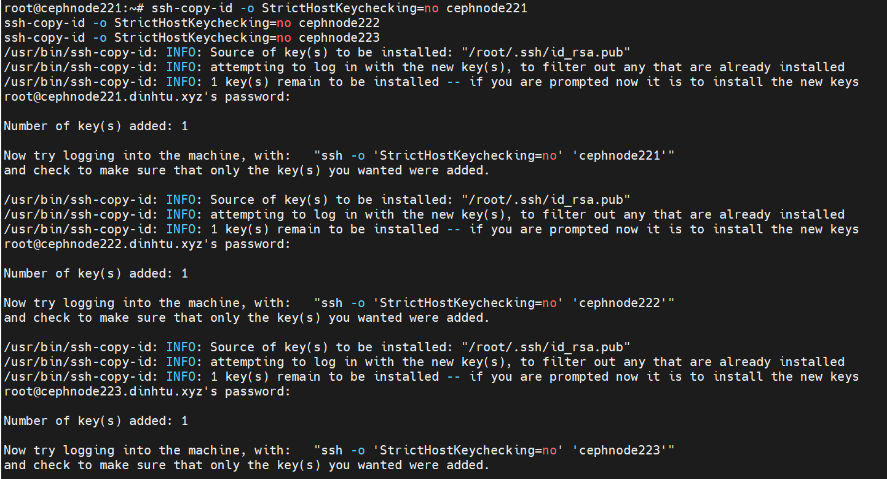

#### Bước 5: Cài đặt Ceph trên các node trong cụm.

Dưới đây là một đoạn shell sử dụng for để cài đặt Ceph trên mỗi node trong cụm.

    for NODE in cephnode221 cephnode222 cephnode223
    do
        ssh -o StrictHostKeychecking=no $NODE "apt update; apt -y install ceph"
    done 

Ví dụ về đầu ra của đoạn shell:

  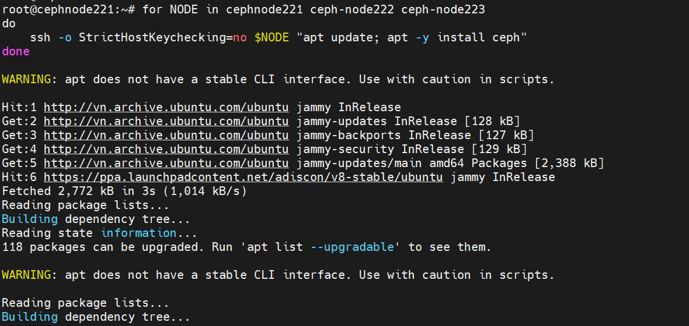
  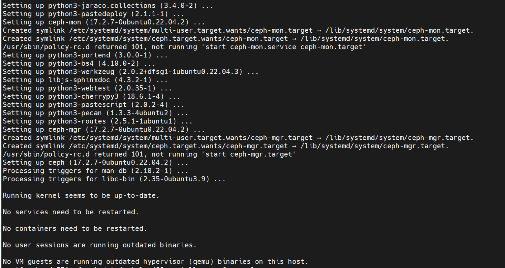

Hành động này sẽ giúp bạn đứng có thể từ Node bất kỳ gửi lệnh cài đặt Ceph cho tất cả các Node trong dòng for.

#### Bước 1.1.5: Tạo một UUID mới để định danh cho cụm.

Sử dụng uuidgen để tạo một UUID mới, UUID này có thể được sử dụng như một định danh duy nhất cho cụm Ceph

    root@ceph-node1:~# uuidgen
    ce6406e1-bc72-4fe0-9f58-0563d3fdab32

#### Bước 1.1.6: Tạo file cấu hình chính cho Ceph.

Tạo một file cấu hình Ceph mới trong /etc/ceph/ceph.conf với thông tin về cụm, bao gồm network, địa chỉ IP của các node monitor và các tùy chọn khác. Nhớ truyền thông tin UUID đã lấy được ở bước trên vào fsid, ví dụ fsid = ce6406e1-bc72-4fe0-9f58-0563d3fdab32.

    cat > /etc/ceph/ceph.conf << OEF
    [global]
    cluster_network = 10.10.100.0/24
    public_network = 172.16.0.0/20
    fsid = ce6406e1-bc72-4fe0-9f58-0563d3fdab32
    mon_host = 172.16.9.221
    mon_initial_members = cephnode221
    osd_pool_default_crush_rule = -1

    [mon.cephnode221]
    host = cephnode221
    mon_addr = 172.16.9.221
    mon_allow_pool_delete = true
    OEF

  

Dưới đây là giải thích về các tùy chọn trong đoạn cấu hình Ceph ở trên:

  + cluster_network = 10.10.100.0/24: Địa chỉ mạng cho giao tiếp nội bộ giữa các OSD (Object Storage Daemons) trong cụm. Đây là mạng nội bộ mà Ceph sẽ sử dụng để trao đổi dữ liệu.
  + public_network = 172.16.0.0/20: Địa chỉ mạng công khai mà Ceph sẽ sử dụng để giao tiếp với các client và các dịch vụ khác như Ceph Monitor.
  + fsid = ce6406e1-bc72-4fe0-9f58-0563d3fdab32: Định danh duy nhất cho cụm Ceph. Đây là một UUID được tạo ra ngẫu nhiên.
  + mon host = 172.16.9.221: Địa chỉ IP của Ceph Monitor, một thành phần quan trọng giám sát trạng thái của cụm.
  + mon initial members = cephnode221: Danh sách các node monitor ban đầu. Trong trường hợp này, chỉ có một node monitor là cephnode221.
  + osd pool default crush rule = -1: Đây là quy tắc CRUSH mặc định cho các pool. CRUSH là thuật toán mà Ceph sử dụng để xác định cách phân phối dữ liệu trên các OSD.
  + [mon.cephnode221]: Đây là một phần cấu hình cho monitor ceph-node1.
      + host = cephnode221: Tên host của monitor.
      + mon addr = 172.16.9.221: Địa chỉ IP của monitor.
      + mon allow pool delete = true: Tùy chọn này cho phép xóa các pool. Mặc định, Ceph không cho phép xóa pool để tránh việc xóa dữ liệu không cố ý.
#### Bước 1.1.7: Tạo khóa bí mật cho Ceph Monitor.

Tạo một khóa bí mật cho Ceph Monitor và lưu nó vào file ``/etc/ceph/ceph.mon.keyring``. Tùy chọn ``--cap mon 'allow *'`` cấp quyền cho Monitor thực hiện tất cả các hành động.

    ceph-authtool --create-keyring /etc/ceph/ceph.mon.keyring --gen-key -n mon. --cap mon 'allow *'

  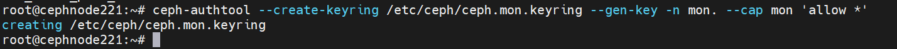

#### Bước 1.1.8: Tạo khóa bí mật cho người quản trị Ceph Cluster.

Tạo một khóa bí mật cho user quản trị Ceph Cluster và lưu nó vào file ``/etc/ceph/ceph.client.admin.keyring``. Tùy chọn ``--cap`` cấp quyền cho user quản trị thực hiện tất cả các hành động trên tất cả các thành phần của cụm.

    ceph-authtool --create-keyring /etc/ceph/ceph.client.admin.keyring --gen-key -n client.admin --cap mon 'allow *' --cap osd 'allow *' --cap mds 'allow *' --cap mgr 'allow *'

  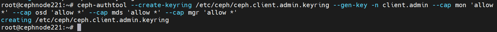

#### Bước 1.1.9: Tạo một khóa bí mật cho quá trình khởi động OSD.

Tạo một khóa bí mật cho quá trình khởi động OSD và lưu nó vào file ``/var/lib/ceph/bootstrap-osd/ceph.keyring``.

  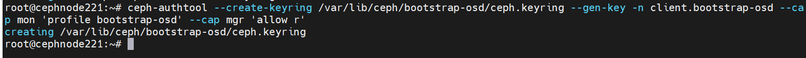

#### Bước 1.1.10 – Nhập khóa bí mật của người quản trị vào khóa bí mật của Monitor.

Lệnh ``ceph-authtool`` được sử dụng để quản lý ``keyrings`` trong Ceph, một hệ thống lưu trữ phân tán. Keyrings chứa các keys được sử dụng để xác thực các clients và daemons với nhau trong hệ thống Ceph.

Lệnh này sẽ nhập keyring của client admin vào keyring của monitor. Điều này cho phép client admin được xác thực với monitor.

    ceph-authtool /etc/ceph/ceph.mon.keyring --import-keyring /etc/ceph/ceph.client.admin.keyring

  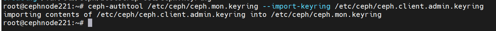

Lệnh này sẽ nhập keyring của bootstrap-osd vào keyring của monitor. Điều này cho phép bootstrap-osd được xác thực với monitor.

  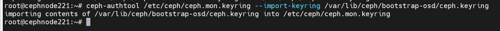

Trong cả hai trường hợp, lệnh ceph-authtool sẽ cập nhật ``/etc/ceph/ceph.mon.keyring`` để bao gồm các keys từ keyring được chỉ định.

#### Bước 1.1.11 – Tạo một bản đồ monitor mới với thông tin về tên node, địa chỉ IP và FSID.

Lệnh monmaptool được sử dụng để tạo và chỉnh sửa bản đồ monitor (monmap) trong hệ thống lưu trữ Ceph. Bản đồ monitor chứa thông tin về tất cả các monitor trong cluster Ceph.

Đầu tiên hãy lấy biến môi trường cần thiết trước.

    FSID=$(grep "^fsid" /etc/ceph/ceph.conf | awk {'print $NF'})
    NODENAME=$(grep "^mon_initial" /etc/ceph/ceph.conf | awk {'print $NF'})
    NODEIP=$(grep "^mon_host" /etc/ceph/ceph.conf | awk {'print $NF'})

Chạy lệnh này để tạo một bản đồ monitor mới và thêm một monitor vào bản đồ đó.

    monmaptool --create --add $NODENAME $NODEIP --fsid $FSID /etc/ceph/monmap

  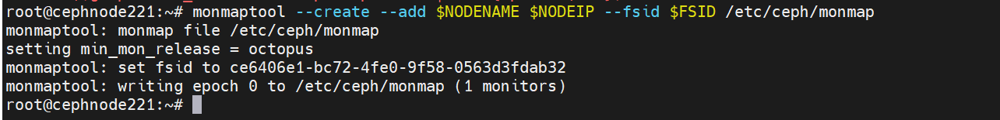

  + --create: Tạo một bản đồ monitor mới.
  + --add $NODENAME $NODEIP: Thêm một monitor mới vào bản đồ. $NODENAME là tên của monitor và $NODEIP là địa chỉ IP của monitor.
  + --fsid $FSID: Đặt FSID (File System ID) cho cluster. FSID là một định danh duy nhất cho mỗi cluster Ceph.
  + /etc/ceph/monmap: Đường dẫn nơi bản đồ monitor sẽ được lưu.

Vì vậy, lệnh này tạo một bản đồ monitor mới với một monitor và FSID được chỉ định và lưu bản đồ đó tại ``/etc/ceph/monmap``.

#### Bước 1.1.12: Cấu hình Monitor Daemon.

Tạo một thư mục mới cho Monitor Daemon.

    mkdir /var/lib/ceph/mon/ceph-$NODENAME

Khởi tạo Monitor Daemon với thông tin từ bản đồ monitor và khóa bí mật.

    ceph-mon --cluster ceph --mkfs -i $NODENAME --monmap /etc/ceph/monmap --keyring /etc/ceph/ceph.mon.keyring

Thay đổi quyền sở hữu của tất cả các file trong /etc/ceph thành người dùng ceph.

    chown ceph. /etc/ceph/ceph.*
    chown -R ceph. /var/lib/ceph/mon/ceph-$NODENAME /var/lib/ceph/bootstrap-osd

Kích hoạt và khởi động dịch vụ Ceph Monitor.

    systemctl enable --now ceph-mon@$NODENAME

Kích hoạt giao thức Messenger v2 cho Ceph Monitor.

    ceph mon enable-msgr2

Kích hoạt module tự động điều chỉnh số lượng Placement Groups.

    ceph mgr module enable pg_autoscaler
    
Tạo một thư mục mới cho Manager Daemon.

    mkdir /var/lib/ceph/mgr/ceph-$NODENAME

Tạo hoặc lấy khóa xác thực cho Manager Daemon.

    ceph auth get-or-create mgr.$NODENAME mon 'allow profile mgr' osd 'allow *' mds 'allow *'

Tạo hoặc lấy khóa xác thực cho Manager Daemon và lưu nó vào file /etc/ceph/ceph.mgr.admin.keyring. Nếu khóa đã tồn tại, lệnh sẽ lấy khóa đó. Nếu không, lệnh sẽ tạo một khóa mới.

    ceph auth get-or-create mgr.$NODENAME | tee /etc/ceph/ceph.mgr.admin.keyring
    
Sao chép file khóa vừa tạo vào thư mục của Manager Daemon.

    cp /etc/ceph/ceph.mgr.admin.keyring /var/lib/ceph/mgr/ceph-$NODENAME/keyring

Lệnh này thay đổi quyền sở hữu của file khóa để người dùng ceph có thể truy cập.

    chown ceph. /etc/ceph/ceph.mgr.admin.keyring

  

``chown -R ceph. /var/lib/ceph/mgr/$NODENAME``: Lệnh này thay đổi quyền sở hữu của thư mục Manager Daemon và tất cả các file bên trong để người dùng ceph có thể truy cập.

    chown -R ceph. /var/lib/ceph/mgr/ceph-$NODENAME

``systemctl enable --now ceph-mgr@$NODENAME``: Lệnh này kích hoạt và khởi động dịch vụ Ceph Manager. $NODENAME là tên của node mà Manager Daemon đang chạy.

    systemctl enable --now ceph-mgr@$NODENAME

  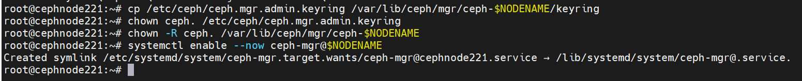

#### Bước 1.1.13: Xác nhận trạng thái cụm.

Sẽ ổn thôi nếu [Monitor Daemon] và [Manager Daemon] hoạt động được bạn sẽ thấy thông báo như sau:

    ceph -s

  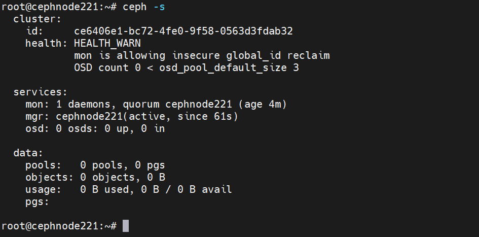

Đối với OSD chúng ta sẽ cấu hình chúng ở phần tiếp theo vì vậy sẽ không có vấn đề gì nếu [HEALTH_WARN] tại thời điểm này.

