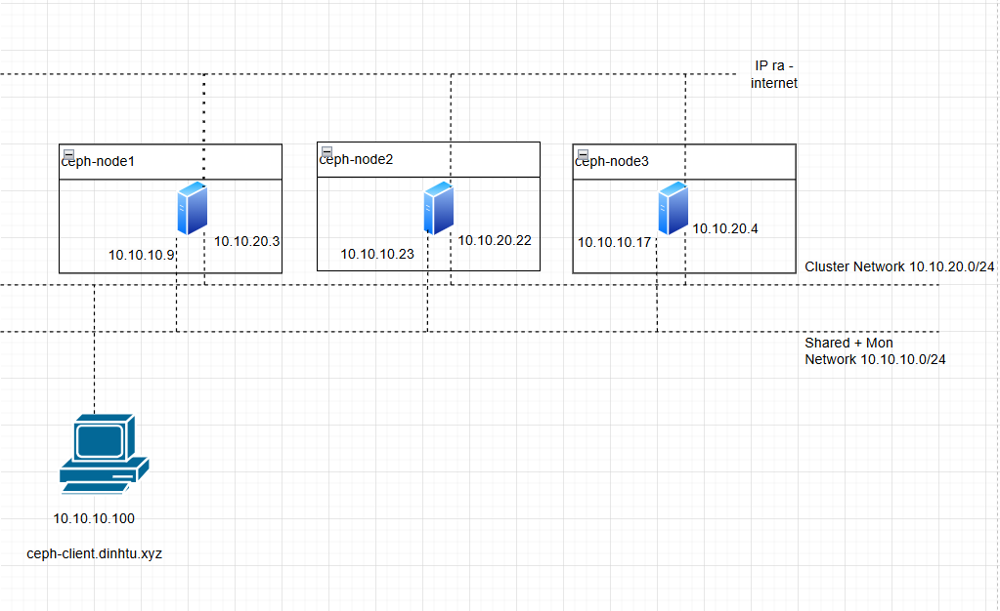

## 1. Tổng quan.

Ceph Block Device (RBD) là một phần của hệ thống lưu trữ phân tán Ceph, cho phép nó hoạt động như một block device, giống như một ổ đĩa cứng vật lý.

RBD hỗ trợ việc chia nhỏ dữ liệu thành các block và phân phối chúng đều qua tất cả các OSD (Object Storage Daemons) trong cụm Ceph. Điều này giúp tăng hiệu suất và độ tin cậy, vì dữ liệu được lưu trữ trên nhiều OSD thay vì một ổ đĩa cứng duy nhất.

RBD cũng hỗ trợ snapshot và clone, cho phép bạn tạo bản sao của dữ liệu tại một thời điểm cụ thể và tạo các block device mới từ các snapshot đó.

RBDs có thể được ánh xạ vào hệ thống tệp cục bộ của bạn như một ổ đĩa cứng thông thường, và bạn có thể tương tác với chúng bằng các lệnh chuẩn như mount, df, v.v.

## 2. Sơ đồ LAB.

Cấu hình Ceph Client [ceph-client.dinhtu.xyz] để sử dụng Ceph Storage như sau.

  

## 3. Tạo block device.

Ví dụ sau đây sẽ tạo một Block Device và mount nó trên Admin Node (ví dụ là ceph-node1.hoanghd.com).

Bước 1 – Cấu hình môi trường cho Ceph Client.

Để tiện thì mình sẽ chuyển khóa chung SSH sang cho Ceph Client và cấu hình nó từ Admin Node.

Hãy thêm nội dung mới vào file cấu hình SSH trong ~/.ssh/config để khai báo thông tin kết nối đến Ceph Client.