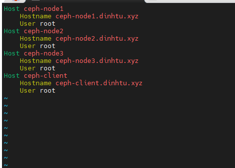
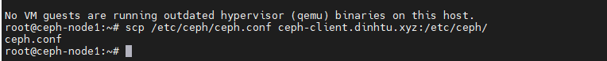
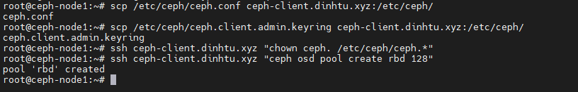
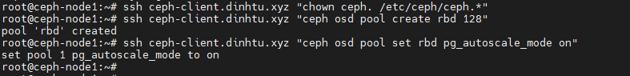

## 1. Tổng quan.

Ceph Block Device (RBD) là một phần của hệ thống lưu trữ phân tán Ceph, cho phép nó hoạt động như một block device, giống như một ổ đĩa cứng vật lý.

RBD hỗ trợ việc chia nhỏ dữ liệu thành các block và phân phối chúng đều qua tất cả các OSD (Object Storage Daemons) trong cụm Ceph. Điều này giúp tăng hiệu suất và độ tin cậy, vì dữ liệu được lưu trữ trên nhiều OSD thay vì một ổ đĩa cứng duy nhất.

RBD cũng hỗ trợ snapshot và clone, cho phép bạn tạo bản sao của dữ liệu tại một thời điểm cụ thể và tạo các block device mới từ các snapshot đó.

RBDs có thể được ánh xạ vào hệ thống tệp cục bộ của bạn như một ổ đĩa cứng thông thường, và bạn có thể tương tác với chúng bằng các lệnh chuẩn như mount, df, v.v.

## 2. Sơ đồ LAB.

Cấu hình Ceph Client [ceph-client.dinhtu.xyz] để sử dụng Ceph Storage như sau.

  

## 3. Tạo block device.

Ví dụ sau đây sẽ tạo một Block Device và mount nó trên Admin Node (ví dụ là ceph-node1.hoanghd.com).

#### Bước 1 – Cấu hình môi trường cho Ceph Client.

Để tiện thì mình sẽ chuyển khóa chung SSH sang cho Ceph Client và cấu hình nó từ Admin Node.

Hãy thêm nội dung mới vào file cấu hình SSH trong ~/.ssh/config để khai báo thông tin kết nối đến Ceph Client.

    cat >> ~/.ssh/config << 'OEF'
    Host ceph-client
        Hostname ceph-client.dinhtu.xyz ceph-client
        User root
    OEF

Bạn có thể xác minh lại nội dung file ~/.ssh/config sau khi thêm nội dung mới.

  

Do mình thêm bằng shell làm quyền của file có thể bị thay đổi nên mình sẽ cấp lại quyền truy cập cho file cấu hình SSH để chỉ có người dùng hiện tại mới có thể đọc và ghi vào file.

    root@ceph-node1:~# chmod 600 ~/.ssh/config

Mình cũng trỏ file hosts về thông tin domain của Ceph Client cho Admin Node.

Mình cũng trỏ file hosts về thông tin domain của Ceph Client cho Admin Node.

    cat >> /etc/hosts << 'OEF'
    10.10.10.13 ceph-client.dinhtu.xyz ceph-client
    OEF

Xác minh lại thêm thông tin file hosts thành công.

    cat /etc/hosts

Giờ mình sẽ copy thông tin sshkey sang cho Ceph Client theo thông tin domain mình đã khai báo.

    ssh-copy-id -o StrictHostKeychecking=no ceph-client.dinhtu.xyz

Cài đặt Ceph Common cho Ceph Client.

    ssh ceph-client.dinhtu.xyz "apt update -y"

    ssh ceph-client.dinhtu.xyz "apt -y install ceph-common"

Copy file ceph.conf từ Admin Node sang Ceph Client.

    scp /etc/ceph/ceph.conf ceph-client.dinhtu.xyz:/etc/ceph/

  

Copy ceph.client.admin.keyring từ Admin Node sang Ceph Client.

    scp /etc/ceph/ceph.client.admin.keyring ceph-client.dinhtu.xyz:/etc/ceph/

Phân quyền thư mục /etc/ceph/ cho Ceph Client.

    ssh ceph-client.dinhtu.xyz "chown ceph. /etc/ceph/ceph.*"

#### Bước 2 – Tạo một Block Device và mount nó vào Ceph Client.

Tạo RBD pool [rbd].

  + Lệnh ceph osd pool create rbd 128 được sử dụng để tạo một pool mới trong Ceph với tên là rbd và số lượng Placement Groups (PGs) là 128.

  + Trong Ceph, một pool là một tập hợp các đối tượng dữ liệu. Mỗi pool chứa một số lượng PGs, mà dữ liệu được chia nhỏ và phân phối đều qua tất cả các OSD (Object Storage Daemons) trong cụm.

    rbd trong lệnh này là tên của pool bạn muốn tạo, và 128 là số lượng PGs bạn muốn gán cho pool. Số lượng PGs cần phải được cân nhắc cẩn thận để tối ưu hóa hiệu suất và sử dụng lưu trữ.

    ssh ceph-client.dinhtu.xyz "ceph osd pool create rbd 128"

  

Lệnh ceph osd pool set rbd pg_autoscale_mode on được sử dụng để bật chế độ tự động mở rộng PG (Placement Groups) cho pool rbd.

Trong Ceph, dữ liệu được chia thành các PG và được phân phối đều qua tất cả các OSD (Object Storage Daemons). Số lượng PG cần phải được cân nhắc cẩn thận để tối ưu hóa hiệu suất và sử dụng lưu trữ.

Chế độ pg_autoscale_mode cho phép Ceph tự động điều chỉnh số lượng PG dựa trên việc sử dụng lưu trữ thực tế. Khi bạn đặt pg_autoscale_mode thành on cho một pool, Ceph sẽ tự động tăng hoặc giảm số lượng PG cho pool đó dựa trên nhu cầu.

    ssh ceph-client.dinhtu.xyz "ceph osd pool set rbd pg_autoscale_mode on"

  

