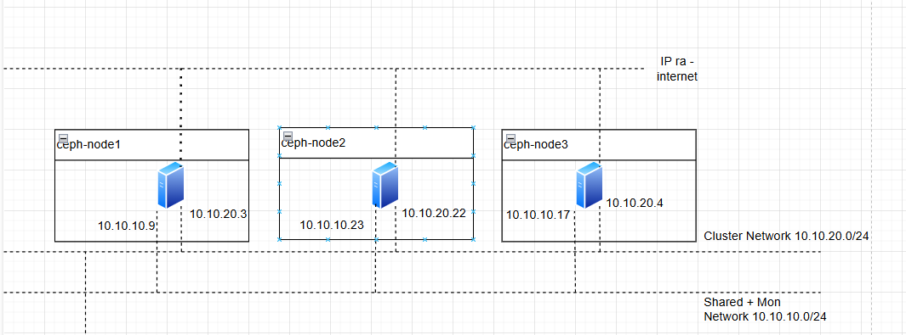
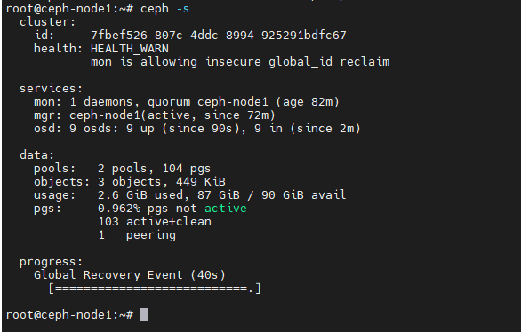
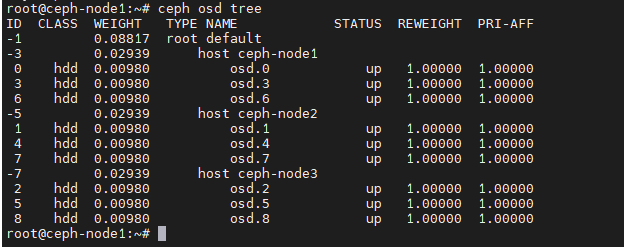
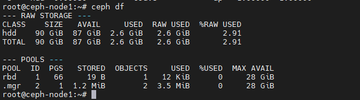
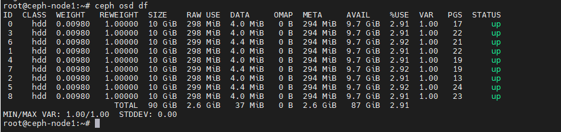
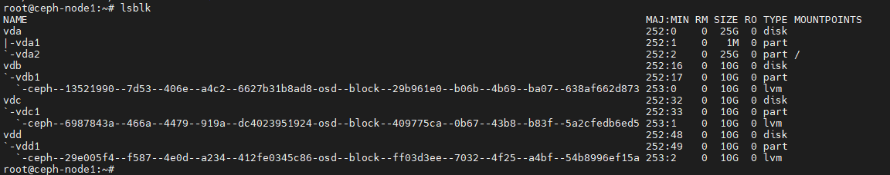
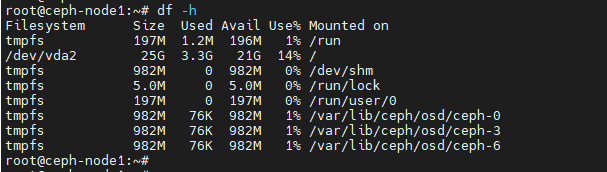

## 1. Tổng quan.

Trong Ceph, mỗi OSD tương ứng với một ổ đĩa và chịu trách nhiệm lưu trữ dữ liệu. Việc cấu hình này bao gồm việc khởi tạo ổ đĩa, cài đặt và khởi động dịch vụ OSD, và đảm bảo rằng nó có thể giao tiếp với phần còn lại của cụm Ceph.

## 2. Sơ đồ LAB.

Để bắt đầu thực hành, bạn hãy xem sơ đồ của tôi ở dưới đây:

  

## 3. Quy trình thêm OSD.

#### Bước 1 – Sao chép các file cấu hình và khóa bí mật.

scp /etc/ceph/ceph.conf <some_node>:/etc/ceph/ceph.conf
scp /etc/ceph/ceph.client.admin.keyring <some_node>:/etc/ceph
scp /var/lib/ceph/bootstrap-osd/ceph.keyring <some_node>:/var/lib/ceph/bootstrap-osd

scp /etc/ceph/ceph.conf ceph-node2:/etc/ceph/ceph.conf
scp /etc/ceph/ceph.client.admin.keyring ceph-node2:/etc/ceph
scp /var/lib/ceph/bootstrap-osd/ceph.keyring ceph-node2:/var/lib/ceph/bootstrap-osd

scp /etc/ceph/ceph.conf ceph-node3:/etc/ceph/ceph.conf
scp /etc/ceph/ceph.client.admin.keyring ceph-node3:/etc/ceph
scp /var/lib/ceph/bootstrap-osd/ceph.keyring ceph-node3:/var/lib/ceph/bootstrap-osd

#### Bước 2 – Thay đổi quyền sở hữu của file.

Thay đổi quyền sở hữu của tất cả các file bắt đầu bằng ceph. trong thư mục /etc/ceph và tất cả các file trong thư mục /var/lib/ceph/bootstrap-osd để người dùng ceph có thể truy cập.

    chown ceph. /etc/ceph/ceph.* /var/lib/ceph/bootstrap-osd/*

#### Bước 3 – Tạo phân vùng cho ổ đĩa sử dụng cho OSD.

Tạo một bảng phân vùng GPT mới trên ổ đĩa, ví dụ/dev/vdb.

    parted --script /dev/vdb 'mklabel gpt'

Tạo một phân vùng mới trên ổ đĩa /dev/vdb, chiếm 100% dung lượng của ổ đĩa.

    parted --script /dev/vdb "mkpart primary 0% 100%"

Tạo một logical volume mới trên phân vùng vừa tạo (/dev/sdb1), để sử dụng cho việc lưu trữ dữ liệu của Ceph.

    ceph-volume lvm create --data /dev/vdb1

Hoặc nếu bạn thao tác cho nhiều node cùng 1 lúc với các tên ổ đĩa ở các node giống nhau thì bạn có thể sử dụng shell dưới đây để rút gọn quy trình thêm các OSD vào Ceph Cluster.

Đoạn shell dưới đây tổng hợp từ đoạn trên [ Bước 1 đến hiện tại] sẽ thực hiện cho ổ đĩa /dev/vdb trên cả 3 node.

for NODE in ceph-node1 ceph-node2 ceph-node3
do
    if [ ! ${NODE} = "ceph-node1" ]
    then
        scp /etc/ceph/ceph.conf ${NODE}:/etc/ceph/ceph.conf
        scp /etc/ceph/ceph.client.admin.keyring ${NODE}:/etc/ceph
        scp /var/lib/ceph/bootstrap-osd/ceph.keyring ${NODE}:/var/lib/ceph/bootstrap-osd
    fi
    ssh $NODE \
    "chown ceph. /etc/ceph/ceph.* /var/lib/ceph/bootstrap-osd/*; \
    parted --script /dev/vdc 'mklabel gpt'; \
    parted --script /dev/vdc "mkpart primary 0% 100%"; \
    ceph-volume lvm create --data /dev/vdc1"
done 

for NODE in ceph-node1 ceph-node2 ceph-node3
do
    ssh $NODE \
    "chown ceph. /etc/ceph/ceph.* /var/lib/ceph/bootstrap-osd/*; \
    parted --script /dev/vdc 'mklabel gpt'; \
    parted --script /dev/vdc "mkpart primary 0% 100%"; \
    ceph-volume lvm create --data /dev/vdc1"
done 

for NODE in ceph-node1 ceph-node2 ceph-node3
do
    ssh $NODE \
    "chown ceph. /etc/ceph/ceph.* /var/lib/ceph/bootstrap-osd/*; \
    parted --script /dev/vdd 'mklabel gpt'; \
    parted --script /dev/vdd "mkpart primary 0% 100%"; \
    ceph-volume lvm create --data /dev/vdd1"
done 

## 4. Kiểm tra kết quả.

Sử dụng lệnh ceph -s.

    ceph -s

Sử dụng lệnh ceph -s để hiển thị trạng thái tổng quan của cụm Ceph, bao gồm số lượng monitor, OSD, cũng như thông tin về việc sử dụng lưu trữ.

  

Nhìn kết quả của ceph -s bạn sẽ thấy có 9 OSDs tương ứng với 3 node đã xuất hiện.

    osd: 9 osds: 9 up (since 90s), 9 in (since 2m)

Sử dụng lệnh ``ceph osd tree`` .

Sử dụng lệnh ceph osd tree để hiển thị cấu trúc cây của các OSD trong cụm. Nó cho thấy mối quan hệ giữa các OSD, host và rack trong cụm, giúp bạn hiểu rõ hơn về cách dữ liệu được phân phối và lưu trữ.

    ceph osd tree

  

Sử dụng lệnh ceph df.

Sử dụng lệnh ceph df để hiển thị thông tin về việc sử dụng lưu trữ trong cụm. Nó cho thấy tổng dung lượng, dung lượng đã sử dụng và dung lượng còn trống của cụm, cũng như thông tin tương tự cho từng storage pool.

    ceph df

  

Sử dụng lệnh ceph osd df:

Sử dụng lệnh ceph osd df để hiển thị thông tin về việc sử dụng lưu trữ của từng OSD. Nó cho thấy dung lượng, dung lượng đã sử dụng, và dung lượng còn trống của từng OSD, giúp bạn xác định xem có OSD nào đang bị quá tải hay không.

    ceph osd df

  

Kiểm tra trạng thái ổ đĩa sau khi thêm ổ đĩa vào Ceph.

Kết quả của lệnh lsblk bạn sẽ thấy ổ đĩa sdb, sdc và sdd trên mỗi node đã được thêm vào Ceph sử dụng cho mục đích OSD.

    lsblk

  

Kết quả tương tự cho lệnh df -h.

    df -h

  

