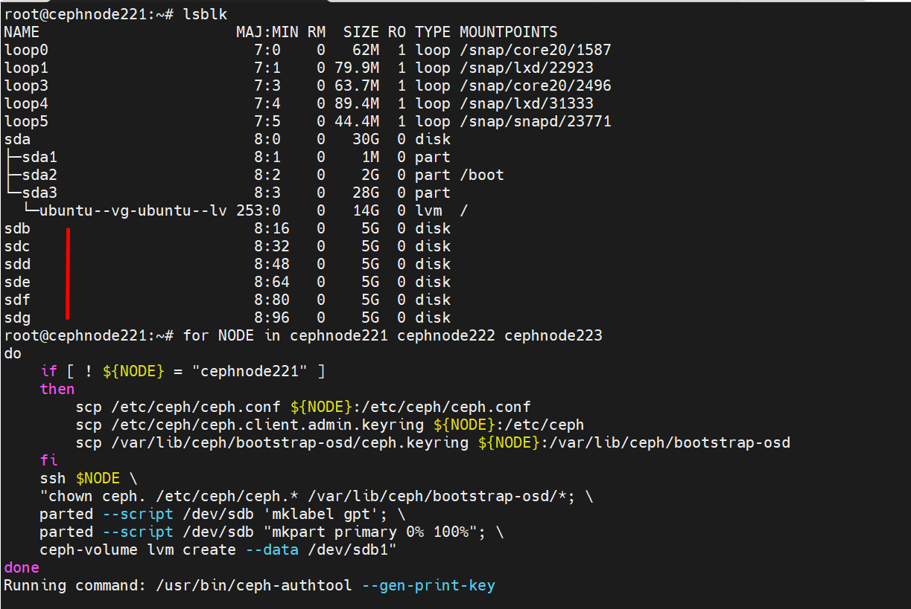
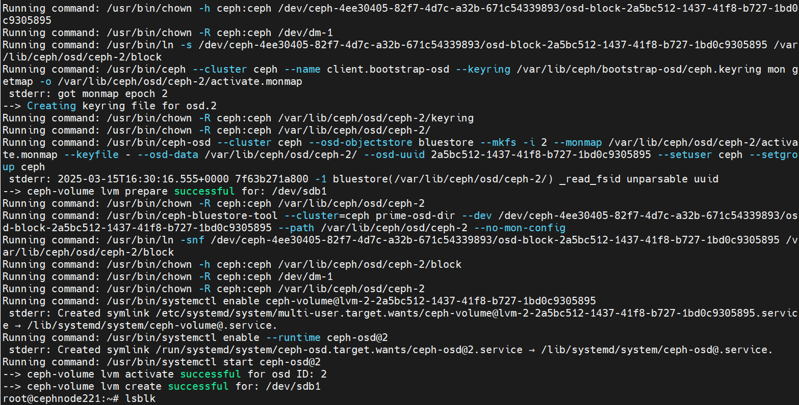
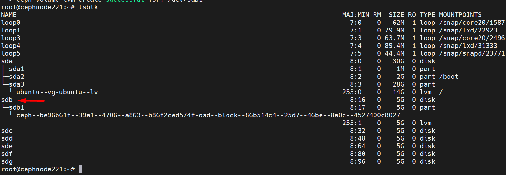
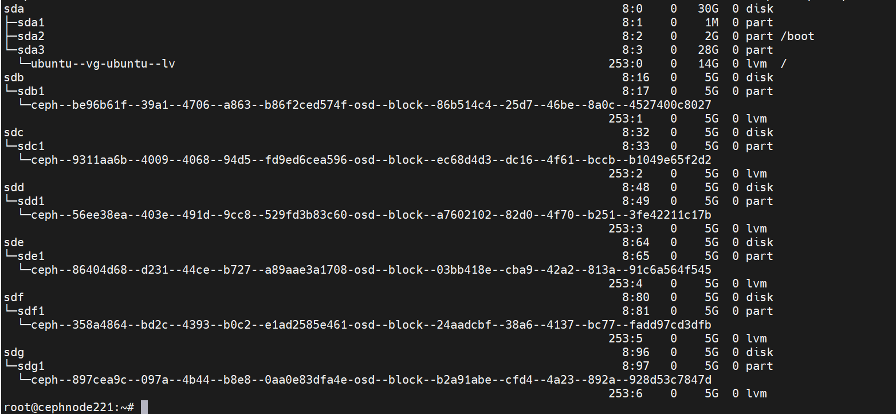
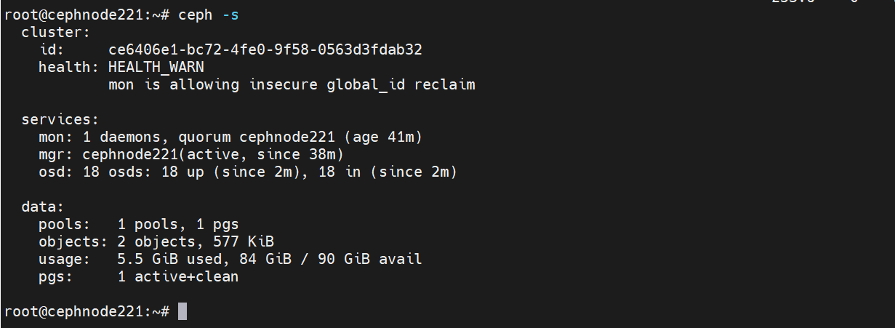
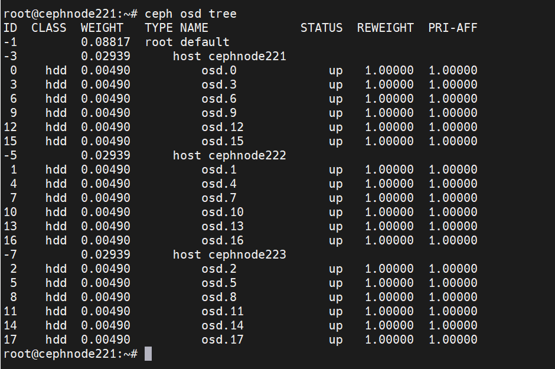
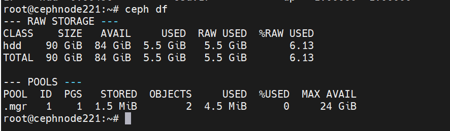
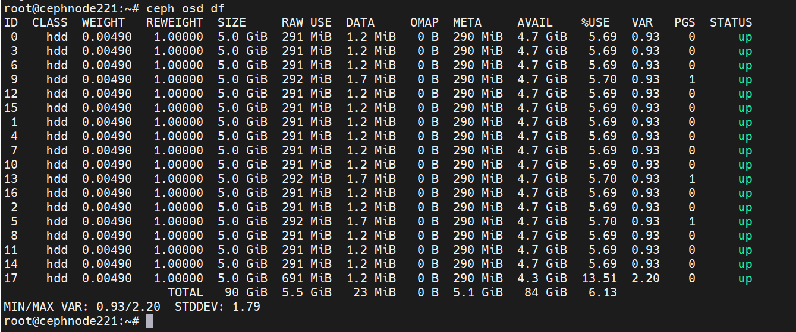

Bài Lab sử dụng topo như hình 

  

Mình đã gộp các mạng sau trên 1 interfaces:
  + Cluster Network = 10.10.100.0/24
  + Mon Network , Public Network = 172.16.0.0/20

### Bước 2.2: Thiết lập các thiết bị lưu trữ đối tượng (OSD)

Trong Ceph, mỗi OSD tương ứng với một ổ đĩa và chịu trách nhiệm lưu trữ dữ liệu. Việc cấu hình này bao gồm việc khởi tạo ổ đĩa, cài đặt và khởi động dịch vụ OSD, và đảm bảo rằng nó có thể giao tiếp với phần còn lại của cụm Ceph.

Dưới đây là quy trình thêm OSD.

#### Bước 2.2.1: Sao chép các file cấu hình và khóa bí mật.

    scp /etc/ceph/ceph.conf <some_node>:/etc/ceph/ceph.conf
    scp /etc/ceph/ceph.client.admin.keyring <some_node>:/etc/ceph
    scp /var/lib/ceph/bootstrap-osd/ceph.keyring <some_node>:/var/lib/ceph/bootstrap-osd

Ví dụ copy sang các node:

    scp /etc/ceph/ceph.conf cephnode222:/etc/ceph/ceph.conf
    scp /etc/ceph/ceph.client.admin.keyring cephnode222:/etc/ceph
    scp /var/lib/ceph/bootstrap-osd/ceph.keyring cephnode222:/var/lib/ceph/bootstrap-osd

    scp /etc/ceph/ceph.conf cephnode223:/etc/ceph/ceph.conf
    scp /etc/ceph/ceph.client.admin.keyring cephnode223:/etc/ceph
    scp /var/lib/ceph/bootstrap-osd/ceph.keyring cephnode223:/var/lib/ceph/bootstrap-osd

#### Bước 2.2.2: Thay đổi quyền sở hữu của file.

Thay đổi quyền sở hữu của tất cả các file bắt đầu bằng ``ceph.`` trong thư mục ``/etc/ceph`` và tất cả các file trong thư mục ``/var/lib/ceph/bootstrap-osd`` để người dùng ceph có thể truy cập.

    chown ceph. /etc/ceph/ceph.* /var/lib/ceph/bootstrap-osd/*

#### Bước 2.2.3: Tạo phân vùng cho ổ đĩa sử dụng cho OSD.

Tạo một bảng phân vùng GPT mới trên ổ đĩa, ví dụ /dev/sdb.

    parted --script /dev/sdb 'mklabel gpt'

Tạo một phân vùng mới trên ổ đĩa /dev/sdb, chiếm 100% dung lượng của ổ đĩa.

    parted --script /dev/sdb "mkpart primary 0% 100%"

Tạo một logical volume mới trên phân vùng vừa tạo (/dev/sdb1), để sử dụng cho việc lưu trữ dữ liệu của Ceph.

    ceph-volume lvm create --data /dev/sdb1

Hoặc nếu bạn thao tác cho nhiều node cùng 1 lúc với các tên ổ đĩa ở các node giống nhau thì bạn có thể sử dụng shell dưới đây để rút gọn quy trình thêm các OSD vào Ceph Cluster.

Đoạn shell dưới đây tổng hợp từ đoạn trên [Bước 2.2.1 đến Bước 2.2.3] sẽ thực hiện cho ổ đĩa /dev/sdb trên cả 3 node.

    for NODE in cephnode221 cephnode222 cephnode223
    do
        if [ ! ${NODE} = "cephnode221" ]
        then
            scp /etc/ceph/ceph.conf ${NODE}:/etc/ceph/ceph.conf
            scp /etc/ceph/ceph.client.admin.keyring ${NODE}:/etc/ceph
            scp /var/lib/ceph/bootstrap-osd/ceph.keyring ${NODE}:/var/lib/ceph/bootstrap-osd
        fi
        ssh $NODE \
        "chown ceph. /etc/ceph/ceph.* /var/lib/ceph/bootstrap-osd/*; \
        parted --script /dev/sdb 'mklabel gpt'; \
        parted --script /dev/sdb "mkpart primary 0% 100%"; \
        ceph-volume lvm create --data /dev/sdb1"
    done 

Đoạn shell này thực hiện các tác vụ sau:

  + Vòng lặp qua các node: Vòng lặp for đi qua danh sách các node (cephnode221, cephnode222, cephnode223).
  + Kiểm tra tên node: Điều kiện if [ ! ${NODE} = "cephnode221" ] kiểm tra xem tên của node hiện tại có phải là cephnode221 hay không. Nếu không phải, thì nó thực hiện các lệnh scp bên dưới.
  + Sao chép các file cấu hình và khóa bí mật: Các lệnh scp sao chép file cấu hình ceph.conf và các khóa bí mật từ node hiện tại đến các node khác trong cụm.
  + Thay đổi quyền sở hữu của các file: Lệnh chown thay đổi quyền sở hữu của các file cấu hình và khóa bí mật để người dùng ceph có thể truy cập.
  + Tạo một bảng phân vùng mới trên ổ đĩa: Lệnh parted tạo một bảng phân vùng GPT mới trên ổ đĩa /dev/sdb.
  + Tạo một phân vùng mới trên ổ đĩa: Lệnh parted tiếp theo tạo một phân vùng mới trên ổ đĩa, chiếm 100% dung lượng của ổ đĩa.
  + Tạo một logical volume cho Ceph: Lệnh ceph-volume tạo một logical volume mới trên phân vùng vừa tạo, để sử dụng cho việc lưu trữ dữ liệu của Ceph.

Trước tiên dùng lệnh lsblk nhìn vào mình sẽ có 6 ổ đĩa sdb sdc sdd sde sdf sdg.

  
  
  

Chúng ta tiếp tục thao tác cho các ổ đĩa sdc

    for NODE in cephnode221 cephnode222 cephnode223
    do
        ssh $NODE \
        "chown ceph. /etc/ceph/ceph.* /var/lib/ceph/bootstrap-osd/*; \
        parted --script /dev/sdc 'mklabel gpt'; \
        parted --script /dev/sdc "mkpart primary 0% 100%"; \
        ceph-volume lvm create --data /dev/sdc1"
    done 

Chúng ta tiếp tục thao tác cho các ổ đĩa sdd

    for NODE in cephnode221 cephnode222 cephnode223
    do
        ssh $NODE \
        "chown ceph. /etc/ceph/ceph.* /var/lib/ceph/bootstrap-osd/*; \
        parted --script /dev/sdd 'mklabel gpt'; \
        parted --script /dev/sdd "mkpart primary 0% 100%"; \
        ceph-volume lvm create --data /dev/sdd1"
    done 

Chúng ta tiếp tục thao tác cho các ổ đĩa sde

    for NODE in cephnode221 cephnode222 cephnode223
    do
        ssh $NODE \
        "chown ceph. /etc/ceph/ceph.* /var/lib/ceph/bootstrap-osd/*; \
        parted --script /dev/sde 'mklabel gpt'; \
        parted --script /dev/sde "mkpart primary 0% 100%"; \
        ceph-volume lvm create --data /dev/sde1"
    done 

Chúng ta tiếp tục thao tác cho các ổ đĩa sdf

    for NODE in cephnode221 cephnode222 cephnode223
    do
        ssh $NODE \
        "chown ceph. /etc/ceph/ceph.* /var/lib/ceph/bootstrap-osd/*; \
        parted --script /dev/sdf 'mklabel gpt'; \
        parted --script /dev/sdf "mkpart primary 0% 100%"; \
        ceph-volume lvm create --data /dev/sdf1"
    done 

Chúng ta tiếp tục thao tác cho các ổ đĩa sdg

    for NODE in cephnode221 cephnode222 cephnode223
    do
        ssh $NODE \
        "chown ceph. /etc/ceph/ceph.* /var/lib/ceph/bootstrap-osd/*; \
        parted --script /dev/sdg 'mklabel gpt'; \
        parted --script /dev/sdg "mkpart primary 0% 100%"; \
        ceph-volume lvm create --data /dev/sdg1"
    done 

Giờ chúng ta xem node Ceph nào cũng đã được xử lý các OSD

  

#### Bước 2.2.4: Kiểm tra kết quả.

##### Sử dụng lệnh ``ceph -s``.

  + Sử dụng lệnh ``ceph -s`` để hiển thị trạng thái tổng quan của cụm Ceph, bao gồm số lượng monitor, OSD, cũng như thông tin về việc sử dụng lưu trữ.

  

Nhìn kết quả của ``ceph -s`` bạn sẽ thấy có 18 OSDs tương ứng với 3 node đã xuất hiện.

##### Sử dụng lệnh ``ceph osd tree`` .

  + Sử dụng lệnh ceph osd tree để hiển thị cấu trúc cây của các OSD trong cụm. Nó cho thấy mối quan hệ giữa các OSD, host và rack trong cụm, giúp bạn hiểu rõ hơn về cách dữ liệu được phân phối và lưu trữ.

  

##### Sử dụng lệnh ``ceph df``.

  + Sử dụng lệnh ceph df để hiển thị thông tin về việc sử dụng lưu trữ trong cụm. Nó cho thấy tổng dung lượng, dung lượng đã sử dụng và dung lượng còn trống của cụm, cũng như thông tin tương tự cho từng storage pool.

  

##### Sử dụng lệnh ``ceph osd df``:

  + Sử dụng lệnh ceph osd df để hiển thị thông tin về việc sử dụng lưu trữ của từng OSD. Nó cho thấy dung lượng, dung lượng đã sử dụng, và dung lượng còn trống của từng OSD, giúp bạn xác định xem có OSD nào đang bị quá tải hay không.

  
##### Kiểm tra trạng thái ổ đĩa sau khi thêm ổ đĩa vào Ceph.

 
 + Kết quả của lệnh ``lsblk`` và ``df -h`` bạn sẽ thấy ổ đĩa ``sdb`` ``sdc`` ``sdd`` ``sde`` ``sdf`` ``sdg`` trên mỗi node đã được thêm vào Ceph sử dụng cho mục đích OSD.
