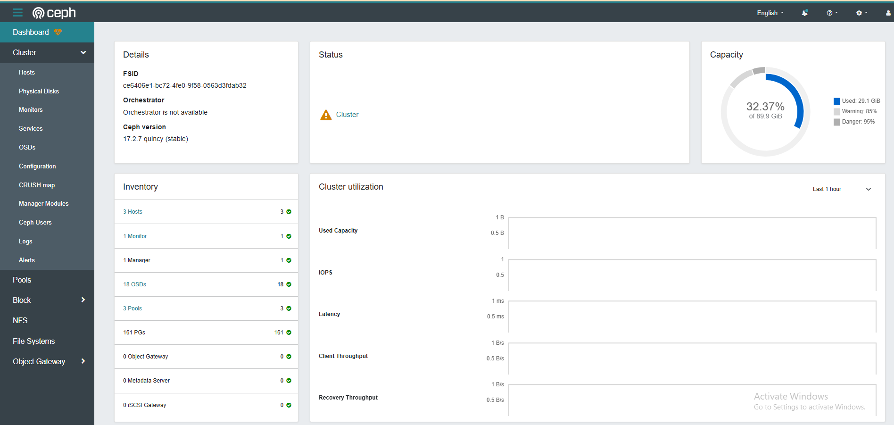
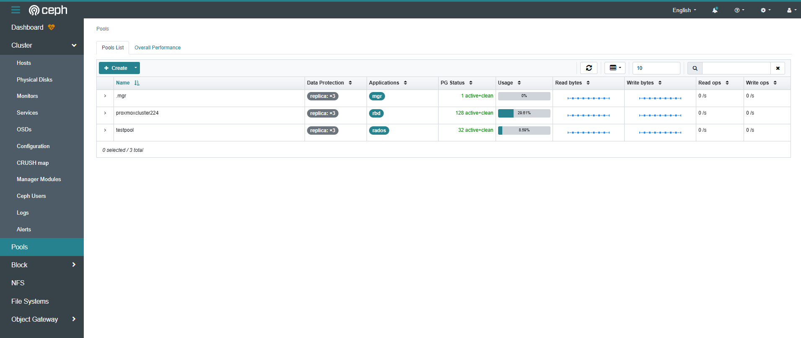
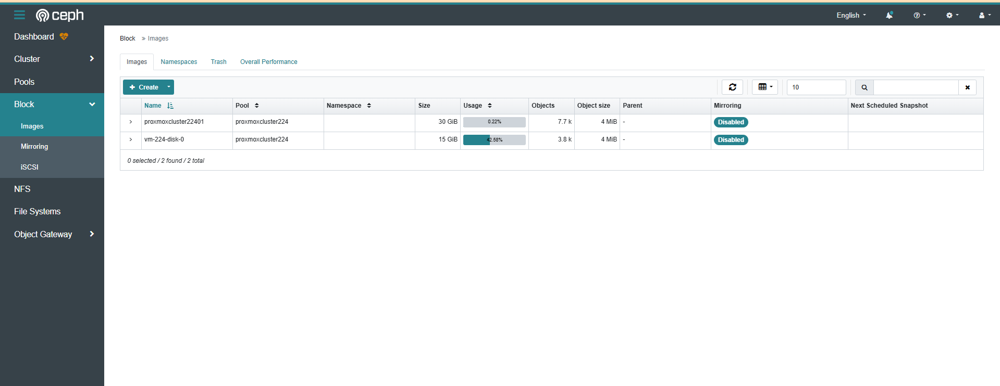
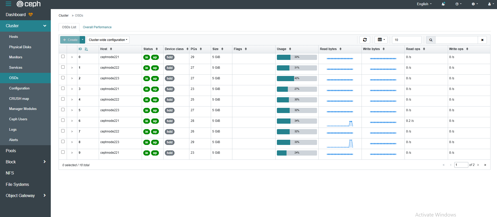
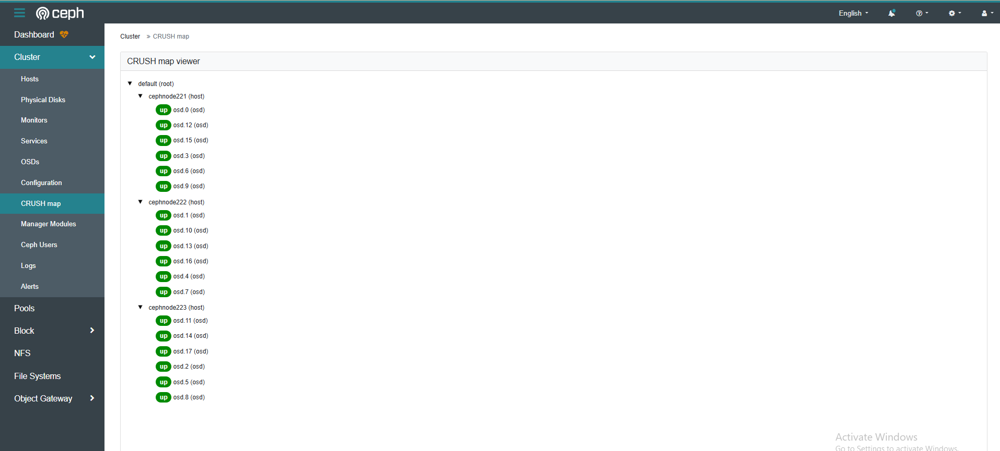

Bài Lab sử dụng topo như hình 

  

Mình đã gộp các mạng sau trên 1 interfaces:
  + Cluster Network = 10.10.100.0/24
  + Mon Network , Public Network = 172.16.0.0/20

## Dưới đây là cách thức enable Dashboard Ceph

Bật mô-đun Dashboard trên Node [Manager Daemon]. 

Ngoài ra, Dashboard yêu cầu SSL

    apt -y install ceph-mgr-dashboard

    dpkg -l python3-cheroot

Output:

    Desired=Unknown/Install/Remove/Purge/Hold
    | Status=Not/Inst/Conf-files/Unpacked/halF-conf/Half-inst/trig-aWait/Trig-pend
    |/ Err?=(none)/Reinst-required (Status,Err: uppercase=bad)
    ||/ Name            Version      Architecture Description
    +++-===============-============-============-=================================
    ii  python3-cheroot 9.0.0+ds1-2  all          Pure-Python HTTP server

Chúng ta có thể truy cập trước trang này sau đó tải phần mềm phù hợp:

http://security.ubuntu.com/ubuntu/pool/main/p/python-cheroot/

    wget http://security.ubuntu.com/ubuntu/pool/main/p/python-cheroot/python3-cheroot_8.5.2+ds1-1ubuntu3.1_all.deb

    dpkg -i python3-cheroot_8.5.2+ds1-1ubuntu3.1_all.deb

    systemctl restart ceph-mgr@node01

    ceph mgr module enable dashboard

Kiểm tra thử

    ceph mgr module ls | grep dashboard

Tạo chứng chỉ tự ký

    ceph dashboard create-self-signed-cert

Tạo user quản trị\

    echo "Passwordcodophuctapcao" > pass.txt

    ceph dashboard ac-user-create tudv -i pass.txt administrator

Xác nhận url dashboard

    ceph mgr services

Truy cập vào URL Dashboard từ Máy tính có Trình duyệt web, sau đó biểu mẫu Đăng nhập Ceph Dashboard sẽ hiển thị.
Đăng nhập với tư cách là người dùng bạn vừa thêm vào. Sau khi đăng nhập, có thể xem nhiều trạng thái khác nhau của Ceph Cluster.

  

  

  

  

  
