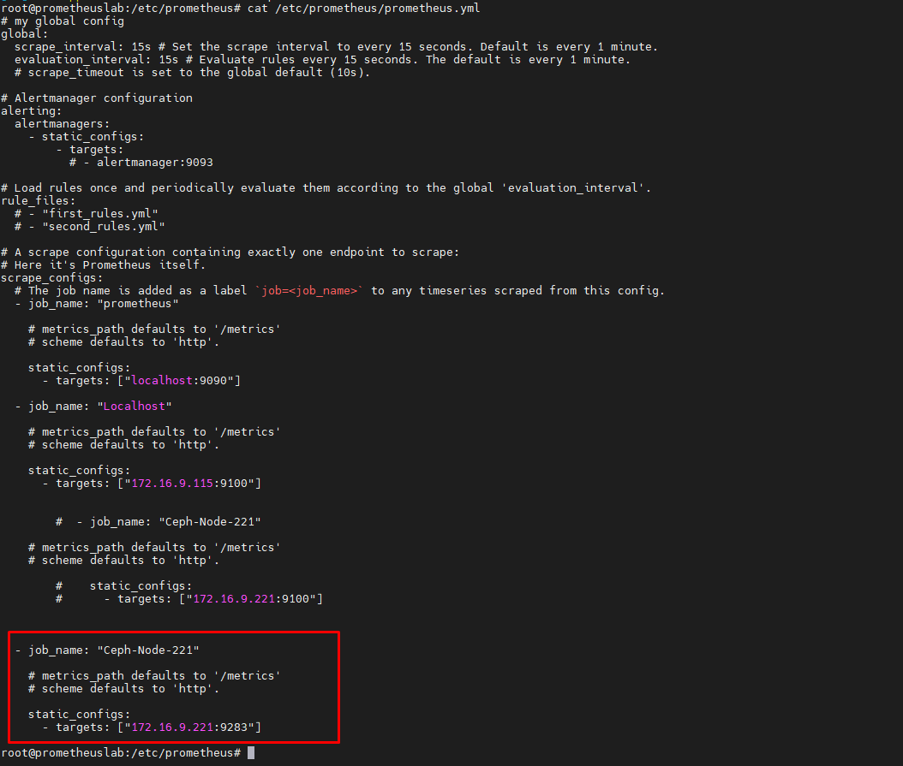
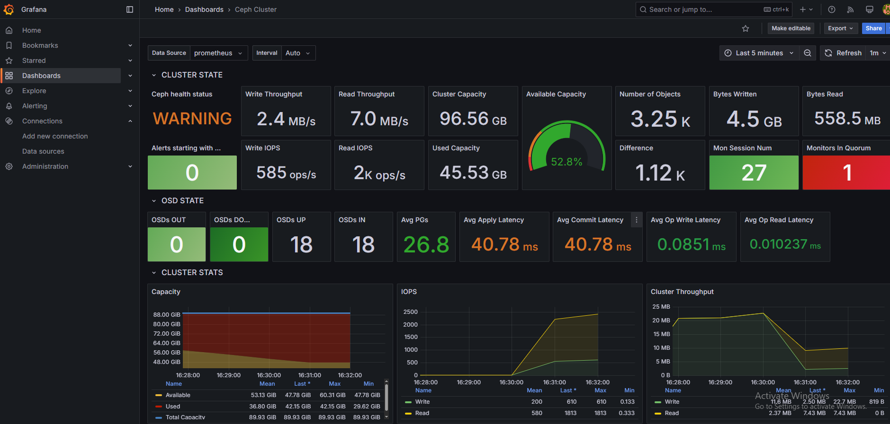
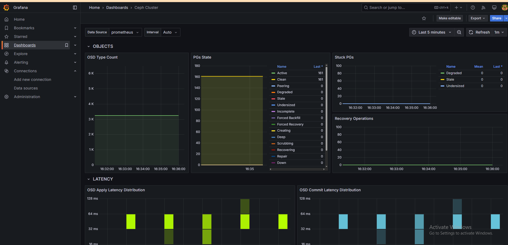

#### Cách 1 - Enable module prometheus của Ceph

Enable trên các node manager

    ceph mgr module enable prometheus

Sau đó vào prometheus server thêm Ceph node manager, ở đây mình chỉ dùng 1 Ceph node manager

  

Qua grafana chọn 1 dashboard

  

  

#### Cách 2 - Hoặc cài exporter ngoài

Pull image của Digital Ocean

https://hub.docker.com/r/digitalocean/ceph_exporter/

    docker pull digitalocean/ceph_exporter

Docker-compose content: ``docker-compose.yml``:

    version: "3.8"
    services:
      ceph_exporter:
        image: digitalocean/ceph_exporter
        volumes:
          - /etc/ceph:/etc/ceph
        ports:
          - "9128:9128"
        restart: unless-stopped

Start:

    docker-compose up -d

  

#### Xem thử cảnh báo ( Gỡ 2 OSD )

  

  

  

  

  

