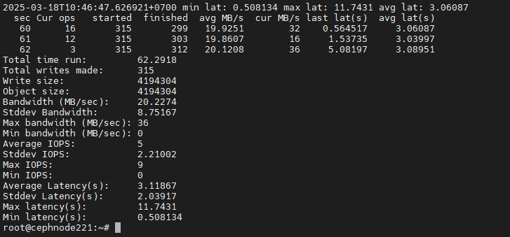
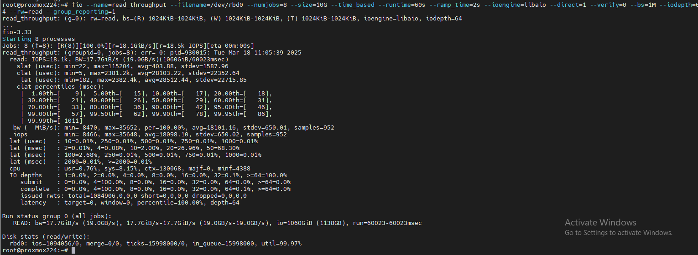

## 1. Tổng Quan Về Benchmark Trong Ceph.

Ceph là một hệ thống lưu trữ phân tán mạnh mẽ, nhưng để đảm bảo hiệu suất tối ưu, chúng ta cần thực hiện benchmark để đo tốc độ đọc/ghi, độ trễ cũng như hiệu suất của RBD (RADOS Block Device). Trong bài viết này, chúng ta sẽ tìm hiểu cách thực hiện benchmark hiệu suất Ceph chi tiết.

Benchmark là quá trình đo lường hiệu suất của hệ thống Ceph, bao gồm:

  + Tốc độ đọc/ghi (Throughput & IOPS)
  + Độ trễ (Latency)
  + Hiệu suất của RBD (Ceph Block Storage)

Việc benchmark giúp xác định khả năng xử lý dữ liệu, phát hiện node thắt cổ chai (bottleneck), tối ưu cấu hình OSD, MON, MDS và CRUSH.

## 2. Các Công Cụ Benchmark Ceph.

Có nhiều công cụ giúp đo hiệu suất Ceph, bao gồm:

  + rados bench: Benchmark trực tiếp trên pool Ceph
  + fio: Benchmark RBD
  + dd: Kiểm tra tốc độ ghi đơn giản
  + ioping: Đo độ trễ I/O

## 3. Benchmark Tốc Độ Đọc/Ghi Với RADOS

Công cụ rados bench được sử dụng để kiểm tra tốc độ đọc/ghi của Ceph object storage.

#### 3.1 Benchmark ghi dữ liệu vào Ceph

    ceph osd pool create testpool 128 128
    ceph osd pool application enable testpool rados
    rados bench -p testpool 60 write --no-cleanup

  + testpool: Pool benchmark
  + 60: Chạy thử nghiệm trong 60 giây
  + write: Kiểm tra tốc độ ghi
  + --no-cleanup: Không xóa dữ liệu ngay sau thử nghiệm

Kết quả mẫu (hình ảnh mang tính chất minh họa do mình dùng ảo hóa 2 lớp để test) :

    Total writes made: 10240
    Bandwidth (MB/sec): 450.02
    Average latency: 0.055 sec

  

#### 3.2 Benchmark đọc dữ liệu từ Ceph

    rados bench -p testpool 60 seq

  + rados bench -p testpool 60 write --no-cleanupseq: Đọc tuần tự
  + Kết quả sẽ thể hiện tốc độ đọc và độ trễ.

#### 3.3 Benchmark đọc ngẫu nhiên

    rados bench -p testpool 60 rand

  + rand: Đọc ngẫu nhiên

## 4. Benchmark RBD (RADOS Block Device)

#### 4.1. Lựa chọn tool benchmark.

RBD là một trong những ứng dụng phổ biến của Ceph, thường được sử dụng trong OpenStack, Proxmox, Kubernetes.

Vì pool POOL_LAB đang được sử dụng cho RBD (RADOS Block Device), bạn không thể sử dụng rados bench để benchmark trực tiếp. Lý do là rados bench hoạt động ở mức object storage, trong khi RBD đã định dạng pool thành block storage.

Tuy nhiên, bạn vẫn có thể benchmark pool bằng cách tạo một RBD image và sử dụng fio để kiểm tra hiệu suất.

#### 4.2. Lựa chọn client để map RBD.

Bạn có thể map RBD image vào một node trong cluster Ceph, nhưng không nên map nó vào Ceph MON vì:

  + Ceph MON (Monitor) chỉ quản lý metadata, không có chức năng xử lý dữ liệu RBD.
  + Hiệu suất có thể bị ảnh hưởng, vì MON thường không có OSD, tức là không trực tiếp lưu trữ dữ liệu.
  + Nguy cơ ảnh hưởng cluster nếu MON bị quá tải do I/O từ benchmark.

👉 Giải pháp hợp lý hơn

Bạn nên map RBD image trên một client bên ngoài Ceph, ví dụ:

  + Một Proxmox node.

  + Một VM hoặc Bare-metal server có cài Ceph client.

  + Một Ceph OSD node (nếu không ảnh hưởng hiệu suất).

📌 Cách map RBD trên một Ceph MON (hoặc client)

Nếu bạn vẫn muốn thử trên MON (hoặc một node bất kỳ trong cluster), bạn cần:

  + Cài đặt Ceph client (nếu chưa có).
  + Xác thực và cấu hình môi trường.
  + Map RBD image.
  + Chạy benchmark.

1️⃣ Cài đặt Ceph client

Nếu node của bạn chưa có Ceph client, hãy cài đặt:

    apt update && apt install -y ceph ceph-common

(Trên CentOS/RHEL: yum install -y ceph ceph-common)

2️⃣ Kiểm tra quyền truy cập

Chạy lệnh sau để đảm bảo node có thể kết nối với Ceph:

    ceph -s

Nếu thấy trạng thái HEALTH_OK hoặc HEALTH_WARN, nghĩa là kết nối được.

3️⃣ Map RBD image

📌 Lấy thông tin keyring (nếu cần): Nếu bạn dùng user khác admin, hãy tạo keyring:

    ceph auth get-key client.admin | sudo tee /etc/ceph/ceph.client.admin.keyring

📌 Map RBD image:

    rbd map test-image --pool POOL_LAB

Map RBD image vào hệ thống

✅ Bạn có thể map RBD vào Ceph MON, nhưng không khuyến khích vì nó không được thiết kế để xử lý I/O.

✅ Nên map RBD trên một Ceph client (Proxmox node, VM, Bare-metal server, hoặc Ceph OSD node).

✅ Benchmark bằng fio trên /dev/rbdX để đo tốc độ đọc/ghi, độ trễ và IOPS.

Nếu bạn cần test trực tiếp trên MON, cứ làm theo hướng dẫn trên. Nhưng nếu có client bên ngoài thì tốt hơn. 🚀

Map RBD image để hệ điều hành nhận diện nó như một block device:

    shell> rbd map test-image --pool POOL_LAB
    /dev/rbd0

Kiểm tra thiết bị được gán:

    shell> rbd showmapped
    id  pool           namespace  image       snap  device
    0   POOL_LAB             test-image  -     /dev/rbd0

Ví dụ đầu ra:

    shell> lsblk | grep ^rbd
    rbd0                      252:0    0   100G  0 disk

Thiết bị /dev/rbd0 sẽ được dùng để benchmark.

#### 4.1. Kiểm tra Pool và tạo Image RBD để benchmark

#### 4.2. Benchmark với fio ( Do là máy test qua lớp ảo hóa nên hình ảnh chỉ mang tính chất tượng trưng

  + Benchmark tốc độ write throughput:

    fio --name=write_throughput --filename=/dev/rbd0 --numjobs=8 \
    --size=10G --time_based --runtime=60s --ramp_time=2s --ioengine=libaio \
    --direct=1 --verify=0 --bs=1M --iodepth=64 --rw=write \
    --group_reporting=1

  

  + Benchmark tốc độ write iops:

    fio --name=write_iops --filename=/dev/rbd0 --size=10G \
    --time_based --runtime=60s --ramp_time=2s --ioengine=libaio --direct=1 --numjobs=8 \
    --verify=0 --bs=4K --iodepth=64 --rw=randwrite --group_reporting=1

  + Benchmark tốc độ read throughput:

    fio --name=read_throughput --filename=/dev/rbd0 --numjobs=8 \
    --size=10G --time_based --runtime=60s --ramp_time=2s --ioengine=libaio \
    --direct=1 --verify=0 --bs=1M --iodepth=64 --rw=read \
    --group_reporting=1

  

  + Benchmark tốc độ read iops.

    fio --name=read_iops --filename=/dev/rbd0 --size=10G \
    --time_based --runtime=60s --ramp_time=2s --ioengine=libaio --direct=1 \
    --verify=0 --bs=4K --iodepth=64 --rw=randread --group_reporting=1
#### 5. OSD Latency: 

Kiểm tra bằng lệnh:

    apt update && apt install -y ioping
    ioping -c 10 .