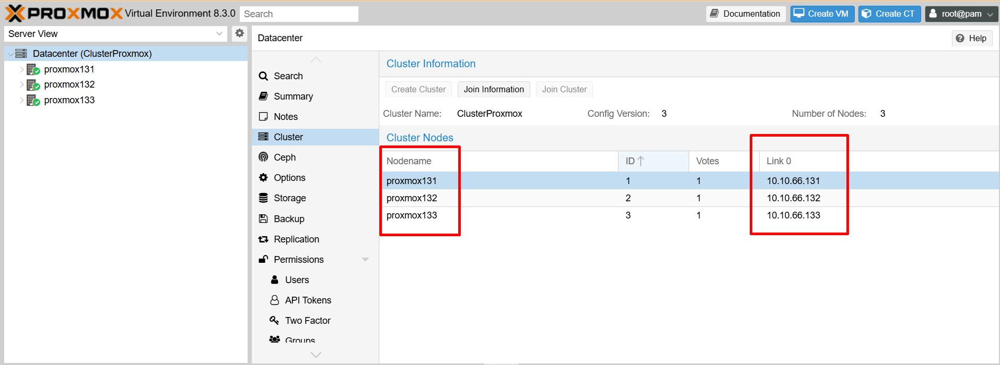
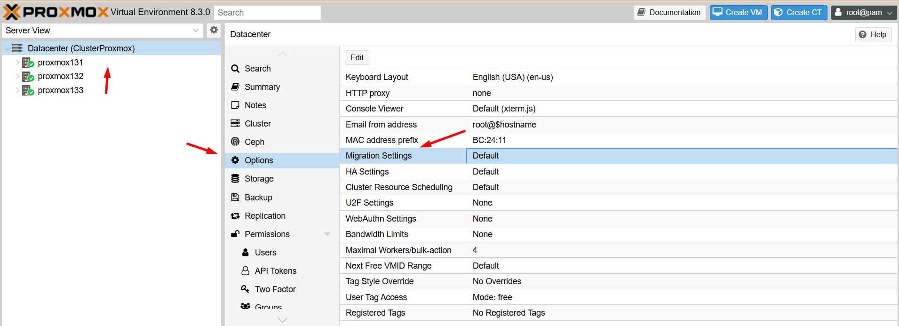
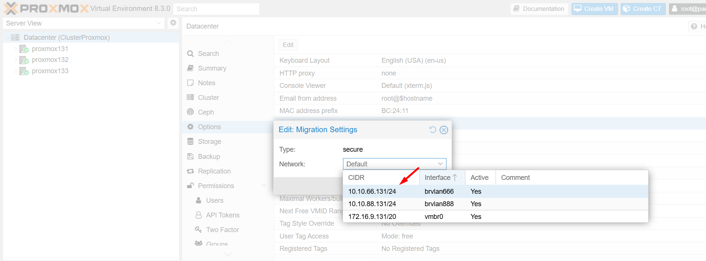
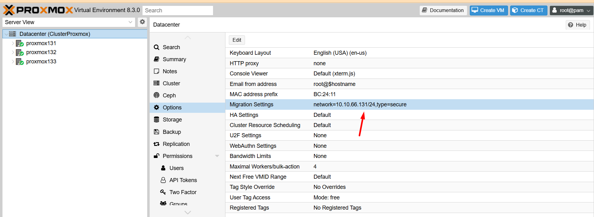

Cụm Proxmox Cluster sử dụng subnet 10.10.66.0/24 để các node Proxmox giao tiếp với nhau:

  

Cấu hình cụm sử dụng mạng 10.10.66.0/24 cho việc Live Migrate VM > Chúng ta xử lý như ảnh:

  

  

  

Mình để chung mạng Proxmox Cluster Corosyn và Live Migrate VM vì chỉ có trường hợp Node online thì mới có Live Migrate VM 