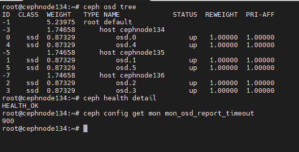

Khi một OSD bị down, Ceph sẽ không ngay lập tức thực hiện rebalance (tái phân phối dữ liệu) mà sẽ chờ một khoảng thời gian để xác định xem OSD đó có thực sự mất hay không.

Cơ chế hoạt động cụ thể như sau:

## OSD bị down

  + Khi một OSD mất kết nối hoặc ngừng hoạt động, Ceph sẽ đánh dấu nó là ``down`` và ``out`` sau một khoảng thời gian nhất định nếu nó không tự khôi phục.

Trạng thái này sẽ được phản ánh trong ``ceph health detail`` và các ``PG`` sử dụng ``OSD`` đó có thể chuyển sang trạng thái ``undersized``, ``degraded``.

  + Thời gian chờ để xác nhận mất dữ liệu

Ceph có tham số ``mon_osd_report_timeout`` (mặc định 900 giây = 15 phút), trong thời gian này nếu OSD hoạt động trở lại thì hệ thống không thực hiện ``rebalance``.

Nếu OSD không quay lại, Ceph thực hiện ``backfill & recovery``

Nếu sau ``mon_osd_report_timeout``, OSD vẫn không quay lại, Ceph sẽ bắt đầu sao chép lại dữ liệu bị thiếu từ các OSD còn sống sang các OSD khác để đảm bảo mức replica được duy trì.

Quá trình này gọi là ``backfill & recovery``, làm tăng tải IO trên cluster.

## Khi OSD bị mất hoàn toàn (out)

Nếu OSD mất hoàn toàn và admin chủ động remove OSD khỏi cluster bằng lệnh: ``ceph osd out <osd_id> `` `` ceph osd crush remove osd.<osd_id> `` → Lúc này Ceph sẽ ``rebalanc``e lại dữ liệu ngay lập tức để đảm bảo số lượng bản sao đúng theo ``replication size``.

    ceph config get mon mon_osd_report_timeout

  

Câu hỏi đặt ra là hệ thống có tự remove OSD ra khỏi Cluster khi vượt quá thời gian của ``mon_osd_report_timeout`` hay không?

Khi một OSD bị down và vượt quá thời gian ``mon_osd_report_timeout``, nó không tự động bị remove khỏi cluster mà sẽ được đánh dấu là out sau một thời gian nhất định. Cụ thể:

🔹 Cách Ceph xử lý OSD down lâu

## OSD bị down

Khi OSD mất kết nối, Ceph sẽ đánh dấu nó là down.

  + Hệ thống vẫn giữ metadata của OSD đó, không loại bỏ ngay.
  + Sau mon_osd_report_timeout (mặc định: 900 giây = 15 phút)
  + Monitor sẽ coi OSD là không phản hồi trong thời gian dài.
  + Các PG chứa OSD này có thể rơi vào trạng thái undersized, degraded, hoặc inconsistent.
  + Sau osd_out_timeout (mặc định: 600 giây = 10 phút)
  + Nếu OSD vẫn chưa quay lại, nó sẽ bị đánh dấu là “out”.
  + Hệ thống bắt đầu rebalance dữ liệu sang các OSD khác để đảm bảo đủ số bản sao (replicas).

OSD vẫn không quay lại?

  + Nó vẫn tồn tại trong cluster, nhưng sẽ không được sử dụng để lưu trữ dữ liệu.
  + Nếu muốn loại bỏ hẳn, bạn phải xóa thủ công bằng: ceph osd purge <osd_id> --yes-i-really-mean-it

Kêt luận

  + mon_osd_report_timeout không tự động xóa OSD, chỉ đánh dấu nó là down.
  + osd_out_timeout sẽ đánh dấu nó là out nếu mất kết nối quá lâu.
  + Ceph sẽ tự động rebalance dữ liệu nếu một OSD bị out.
  + Nếu OSD bị hỏng hoàn toàn, bạn phải xóa thủ công.
Dưới đây là hướng dẫn từng bước để remove OSD.6 và add OSD.7 vào cụm Ceph:

---

## Remove OSD.6 khỏi cụm Ceph

#### 1. Kiểm tra trạng thái cluster
  
   ceph -s
   ceph osd tree
   
#### 2. Đánh dấu OSD.6 là "out" (ngừng phân phối dữ liệu)
  
   ceph osd out osd.6
   
#### 3. Dừng dịch vụ OSD.6
  
   sudo systemctl stop ceph-osd@6
   
#### 4. Xóa OSD.6 khỏi CRUSH map
  
   ceph osd crush remove osd.6
   
#### 5. Xóa auth key của OSD.6
  
   ceph auth del osd.6
   
#### 6. Xóa OSD.6 khỏi cluster
  
   ceph osd rm osd.6
   
#### 7. Kiểm tra lại cluster
  
   ceph -s
   ceph osd tree  # Đảm bảo osd.6 đã biến mất
   
---

## Thêm OSD.7 vào cụm Ceph

``Bash

for NODE in   cephnode13x
do
    ssh $NODE \
    "chown ceph. /etc/ceph/ceph.* /var/lib/ceph/bootstrap-osd/*; \
    parted --script /dev/sdx 'mklabel gpt'; \
    parted --script /dev/sdx "mkpart primary 0% 100%"; \
    ceph-volume lvm create --data /dev/sdx1"
done 

``
Kiểm tra OSD mới
  
   ceph osd tree  # Xác nhận osd.7 đã xuất hiện
   ceph -s        # Đảm bảo cluster ở trạng thái HEALTH_OK
   
Tự động cân bằng dữ liệu

   - Ceph sẽ tự động replicate dữ liệu sang OSD.7. Theo dõi tiến trình:
  
   ceph -w
   
---

## Lưu ý quan trọng

  + Dung lượng clusterer: 

  + Đảm bảo cluster có đủ dung lượng trước khi remove OSD Rebalancingng

  + Quá trình di chuyển dữ liệu có thể gây tải cao. 

  + Thực hiện vào giờ thấp điểm

  + Xác nhận OSD hostst 

Kiểm tra OSD.7 đã được gán đúng host trong CRUSH map:
 
  ceph osd find osd.7
  

