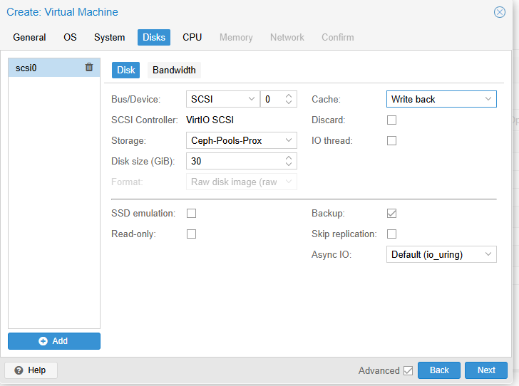

## HA PROXMOX - CEPH

Cho mô hình phân hoạch IP 

  

Mô tả:

HA Proxmox - HA VM có nghĩa đơn giản là dự phòng Node Proxmox chết , VM tự move sang Node khác đang hoạt động

Trong hình vẽ có mô tả như sau:

  - Máy chủ Proxmox111 chạy Proxmox server + Ceph node1 cũng là node manager Ceph, có IP ra internet và monitor là 172.16.9.111 , IP 10.10.100.111 là IP đường Cluster Proxmox + liên lạc của cụm Ceph

    + Về ổ cứng của máy chủ này, do làm LAB nên có 2 ổ /dev/sda làm cài OS , dev/sdb sẽ chạy dịch vụ Ceph node1

  - Máy chủ Proxmox112 chạy Proxmox server + Ceph node2, có IP ra internet và monitor là 172.16.9.112 , IP 10.10.100.112 là IP đường Cluster Proxmox + liên lạc của cụm Ceph

    + Về ổ cứng của máy chủ này, do làm LAB nên có 2 ổ /dev/sda làm cài OS , dev/sdb sẽ chạy dịch vụ Ceph node2

  - Máy chủ Proxmox113 chạy Proxmox server + Ceph node3, có IP ra internet và monitor là 172.16.9.113 , IP 10.10.100.113 là IP đường Cluster Proxmox + liên lạc của cụm Ceph

    + Về ổ cứng của máy chủ này, do làm LAB nên có 2 ổ /dev/sda làm cài OS , dev/sdb sẽ chạy dịch vụ Ceph node3

  - Đường ra internet đang được đấu nối với thiết bị cisco nên mình cũng config luôn cả thiết bị switch này

  - Do hạn chế thiết bị nên không có card gigabit 10G,không có ether-channel , không có đấu stack , không bonding , 

  - Máy chủ có ít cổng mạng nên không tách được các dịch vụ giám sát Corosync (liên quan tính toán HA) của Proxmox, monitor của Ceph , đường storage Ceph ra cá đường riêng ,...

  - Mặc định firewall pve-firewall bật , apparmor bật

  - Cấu hình đồng bộ thời gian trên các máy chủ Proxmox

## Các bước cấu hình

### Bước 1 : Cấu hình Switch Cisco

Thực tế trên Sw cisco mình nối 2 port Gi1/0/11 và port Gi1/0/12 lần lượt với 2 port ethernet eno1 eno2 của Proxmox 111 , 2 port Gi1/0/13 và port Gi1/0/14 lần lượt với 2 port ethernet eno1 eno2 của Proxmox 112 , 2 port Gi1/0/15 và port Gi1/0/16 lần lượt với 2 port ethernet eno1 eno2 của Proxmox 113

Trên sw mình cấu hình thêm như sau, trước đó đang chạy mạng 172.16.9.0/20 VLan1.

    Switch(config)#interface GigabitEthernet 1/0/11
    Switch(config-if)#description -> 172.16.9.111
    Switch(config-if)#no shutdown 

    Switch(config)#interface GigabitEthernet 1/0/13
    Switch(config-if)#description -> 172.16.9.112
    Switch(config-if)#no shutdown 

    Switch(config)#interface GigabitEthernet 1/0/15
    Switch(config-if)#description -> 172.16.9.113
    Switch(config-if)#no shutdown 

    Switch(config)#vlan 100
    Switch(config-vlan)#name VlanProxmoxCephLocal
    Switch(config-vlan)#exit

    Switch(config)#interface GigabitEthernet 1/0/12
    Switch(config-if)#description -> 10.10.100.111
    Switch(config-if)#no shutdown 
    Switch(config-if)#switchport mode access 
    Switch(config-if)#switchport access vlan 100

    Switch(config)#interface vlan 100
    Switch(config-if)#ip address 10.10.100.1 255.255.255.0

    Switch(config)#interface GigabitEthernet 1/0/14
    Switch(config-if)#description -> 10.10.100.112
    Switch(config-if)#no shutdown 
    Switch(config-if)#switchport mode access 
    Switch(config-if)#switchport access vlan 100

    Switch(config)#interface GigabitEthernet 1/0/16
    Switch(config-if)#description -> 10.10.100.113
    Switch(config-if)#no shutdown 
    Switch(config-if)#switchport mode access 
    Switch(config-if)#switchport access vlan 100

    Switch(config-if)#end
    Switch#write memory 
    Building configuration...
    [OK]

### Bước 2 : Cài đặt máy chủ Proxmox111

Sau khi cài đặt máy chủ Proxmox111 , chúng ta sẽ config network của thiết bị này trước

``root@proxmox111:~# nano /etc/network/interfaces``

    auto lo
    iface lo inet loopback

    iface eno1 inet manual

    iface eno2 inet manual

    iface eno3 inet manual

    iface eno4 inet manual

    auto vmbr0
    iface vmbr0 inet static
            address 172.16.9.111/20
            gateway 172.16.10.1
            bridge-ports eno1
            bridge-stp off
            bridge-fd 0

    auto vmbr1
    iface vmbr1 inet static
            address 10.10.100.111/24
           bridge-ports eno2
            bridge-stp off
            bridge-fd 0

    source /etc/network/interfaces.d/*

Sau đó đăng nhập vào ``https://172.16.9.111:8006/``

Tại ``Datacenter`` > ``Proxmox111`` > ``Network`` > ``Create`` > ``Linux VLAN``

  

  

Giải thích : 

  + Chúng ta tạo 1 Linux VLAN tên ``vlan100``
  + Vlan raw device chúng ta tên tên ``vmbr1`` , ``vmbr1`` chính là tên card bridge qua eno2 ở bước cấu hình network Proxmox111 bên trên.

Và sau đó chúng ta reboot lại máy Proxmox111

### Bước 3 : Cài đặt máy chủ Proxmox112 - làm tương tự bên trên Proxmox111

Sau khi cài đặt máy chủ Proxmox112 , chúng ta sẽ config network của thiết bị này trước

``root@proxmox112:~# nano /etc/network/interfaces``

    auto lo
    iface lo inet loopback

    iface eno1 inet manual

    iface eno2 inet manual

    iface eno3 inet manual

    iface eno4 inet manual

    auto vmbr0
    iface vmbr0 inet static
            address 172.16.9.112/20
            gateway 172.16.10.1
            bridge-ports eno1
            bridge-stp off
            bridge-fd 0

    auto vmbr1
    iface vmbr1 inet static
            address 10.10.100.112/24
           bridge-ports eno2
            bridge-stp off
            bridge-fd 0

    source /etc/network/interfaces.d/*

Sau đó đăng nhập vào ``https://172.16.9.112:8006/``

Tại ``Datacenter`` > ``Proxmox112`` > ``Network`` > ``Create`` > ``Linux VLAN``

  

  

Giải thích : 

  + Chúng ta tạo 1 Linux VLAN tên ``vlan100``
  + Vlan raw device chúng ta tên tên ``vmbr1`` , ``vmbr1`` chính là tên card bridge qua eno2 ở bước cấu hình network Proxmox112 bên trên.

Và sau đó chúng ta reboot lại máy Proxmox 112

### Bước 4 : Cài đặt máy chủ Proxmox113 - làm tương tự bên trên Proxmox111

Sau khi cài đặt máy chủ Proxmox113 , chúng ta sẽ config network của thiết bị này trước

``root@proxmox113:~# nano /etc/network/interfaces``

    auto lo
    iface lo inet loopback

    iface eno1 inet manual

    iface eno2 inet manual

    iface eno3 inet manual

    iface eno4 inet manual

    auto vmbr0
    iface vmbr0 inet static
            address 172.16.9.113/20
            gateway 172.16.10.1
            bridge-ports eno1
            bridge-stp off
            bridge-fd 0

    auto vmbr1
    iface vmbr1 inet static
            address 10.10.100.113/24
           bridge-ports eno2
            bridge-stp off
            bridge-fd 0

    source /etc/network/interfaces.d/*

Sau đó đăng nhập vào ``https://172.16.9.113:8006/``

Tại ``Datacenter`` > ``Proxmox113`` > ``Network`` > ``Create`` > ``Linux VLAN``

  

  

Giải thích : 

  + Chúng ta tạo 1 Linux VLAN tên ``vlan100``
  + Vlan raw device chúng ta tên tên ``vmbr1`` , ``vmbr1`` chính là tên card bridge qua eno2 ở bước cấu hình network Proxmox113 bên trên.

Và sau đó chúng ta reboot lại máy Proxmox 113

### Bước 5: Cấu hình jone các Proxmox server vào cụm Proxmox HA 

Views đầu tiên về network các máy sau khi reboot

  + Network Proxmox111:

    root@proxmox111:~# ip route
    default via 172.16.10.1 dev vmbr0 proto kernel onlink
    10.10.100.0/24 dev vmbr1 proto kernel scope link src 10.10.100.111
    172.16.0.0/20 dev vmbr0 proto kernel scope link src 172.16.9.111

  
  

Check xem ping 8.8.8.8 , google.com ok chưa , do default route đang là 172.16.10.1 nên OK

  + Network Proxmox112:

    root@proxmox112:~# ip route
    default via 172.16.10.1 dev vmbr0 proto kernel onlink
    10.10.100.0/24 dev vmbr1 proto kernel scope link src 10.10.100.112
    172.16.0.0/20 dev vmbr0 proto kernel scope link src 172.16.9.112

  
  

Check xem ping 8.8.8.8 , google.com ok chưa , do default route đang là 172.16.10.1 nên OK

  + Network Proxmox113:

  
  

    root@proxmox113:~# ip route
    default via 172.16.10.1 dev vmbr0 proto kernel onlink
    10.10.100.0/24 dev vmbr1 proto kernel scope link src 10.10.100.113
    172.16.0.0/20 dev vmbr0 proto kernel scope link src 172.16.9.113

Check xem ping 8.8.8.8 , google.com ok chưa , do default route đang là 172.16.10.1 nên OK

Để cấu hình Cluster thì cần 2 máy chủ Proxmox, nhưng tham gia HA thì cần 3 máy chủ.

Chọn Proxmox111 IP 172.16.9.111-10.10.100.111 làm Master Proxmox Cluster

#### 5.1 Thao tác trên máy chủ Proxmox111

Tại ``Datacenter`` > ``Cluster`` > ``Create Cluster``

  + Tại ``Cluster Name`` chọn tên  ``ProxCephCluster``
  + Tại ``Cluster Network`` chọn ``Link 1`` và IP ``10.10.100.111``
  + Chọn ``Create``

  

  

Xem thông tin join vào cụm:

  

Chọn Copy infomation , đây là chuỗi khóa để Proxmox khác có thể join cụm

  

#### 5.2 Thao tác trên máy Proxmox112

Tại ``Datacenter`` > ``Cluster`` > ``Join Cluster``

  

Tại ``Information`` chúng ta paste mã đã copy ở Proxmox Master bên trên

Sau khi paste xong 

  + Tại ``Password`` > Điền password ssh của máy chủ master Proxmox111

  + Tại ``Cluster Network`` chọn ``Link 1`` và IP cluster của Proxmox112 là ``10.10.100.112`` 

  + Chọn ``ProxCephCluster``

  

  

Join thành công chúng ta cần Refesh lại trình duyệt của link ``https://172.16.9.112:8006/``

#### 5.3 Thao tác trên máy Proxmox113 - Thao tác tương tự

Tại ``Datacenter`` > ``Cluster`` > ``Join Cluster``

  

Tại ``Information`` chúng ta paste mã đã copy ở Proxmox Master bên trên

Sau khi paste xong 

  + Tại ``Password`` > Điền password ssh của máy chủ master Proxmox111

  + Tại ``Cluster Network`` chọn ``Link 1`` và IP cluster của Proxmox113 là ``10.10.100.113`` 

  + Chọn ``ProxCephCluster``

  

Join thành công chúng ta cần Refesh lại trình duyệt của link ``https://172.16.9.113:8006/``

Sang máy Proxmox111 là máy Master , chúng ta sẽ thấy như này:

  

### Bước 6 : Lựa chọn dịch vụ storage - là storage chứa disk máy ảo.

Với storage chứa máy ảo chúng ta có thể lựa chọn các dịch vụ Share Block Storage như iSCSI là các máy NAS , Windows Server iSCSI , CEPH - Rbd từ xa...
Lựa chọn các máy chủ vSAN, Storage chuyên dụng...

Nhưng với mô hình này, mình sẽ cấu hình các Proxmox trong cụm chạy luôn dịch vụ Ceph và tham gia cụm Ceph.

Mỗi máy chủ Proxmox là 1 node Ceph với Proxmox111 mình lựa chọn làm node manager

#### Bước 6.1 : Cấu hình Ceph trên Proxmox111

Tại ``Proxmox111`` > ``Ceph`` > ``Install Ceph``

  

Chọn ``Ceph version`` mới nhất hiện tại để cài đặt là ``Squid`` và ``Repository`` chọn ``No-Subscription`` >  ``Start Squid installation``

Máy chủ tính toán cần tài nguyên nhất định > Chúng ta gõ Yes ( Y ) - Enter

  

Như này là cài đặt xong, chúng ta click ``Next``

  

Do chỉ có 1 đường cluster network chúng ta cũng chỉ chọn IP local ``10.10.100.111/24`` và ``Next``

Nói chung đường này phải có latency(trễ) thấp và Throughput(thông lượng) cao

  

Finish

  

Bên trên là các thao tác Proxmox bảo người dùng phải xử lý thêm

  + Install Ceph on other nodes
  + Create additional Ceph Monitors
  + Create Ceph OSDs
  + Create Ceph Pools

#### Bước 6.2 : Cài đặt Ceph trên Proxmox111 

Làm tương tự thao tác install bên trên

#### Bước 6.3 : Cài đặt Ceph trên Proxmox111 

Làm tương tự thao tác install bên trên

### Bước 7 - Cài đặt thêm các Monitor Ceph trên các node còn lại

Tại node ``Proxmox112`` chọn ``Ceph`` > ``Monitor`` > ``Creater``

    ``Host`` > ``Proxmox112`` > ``Creater``

  

Tại node Proxmox113 chọn ``Ceph`` > ``Monitor`` > ``Creater``

    ``Host`` > ``Proxmox113`` > ``Creater``

### Bước 8 - Create Ceph OSDs

Như bên trên mình nói, làm LAB nên chỉ có 1 disk thêm là /dev/sdb

Nên mình thao tác nhanh, bạn có thể chia /dev/sdb thành các vdev có disk nhỏ hơn để test iops và các tham số khác như latency và throughput

Tại ``Proxmox111`` chọn ``Ceph`` > ``OSD`` > ``Create OSD`` > tại disk chọn ``/dev/sdb`` > các tham số còn lại để ``mặc định`` và ``Create``

  

F5 lại trang bạn sẽ thấy

  

Tại ``Proxmox112`` chọn ``Ceph`` > ``OSD`` > ``Create OSD`` > tại disk chọn ``/dev/sdb`` > các tham số còn lại để ``mặc định`` và ``Create``

  

Tại ``Proxmox113`` chọn ``Ceph`` > ``OSD`` > ``Create OSD`` > tại disk chọn ``/dev/sdb`` > các tham số còn lại để ``mặc định`` và ``Create``

  

Nhà không có điều kiện lắp ssd và hdd lẫn lộn.

Nhưng lựa chọn tốt nhất là Nvme > SSD > HDD và không dùng RAID CARD

### Bước 9- Create Pools Ceph

Tại ``Proxmox111`` chọn ``Ceph`` > ``Pools`` > ``Create``

  

Ở đây chúng ta đã lựa chọn ``Size`` là ``3`` có nghĩa là Ceph sẽ tạo 3 bản sao của mỗi đối tượng dữ liệu.

Còn ``Min size`` :

  + "Min. Size" (Kích thước tối thiểu) là gì?

    Trong ngữ cảnh của Ceph, "Min. Size" xác định số lượng bản sao tối thiểu của một đối tượng dữ liệu cần thiết để Ceph có thể ghi dữ liệu thành công.
    Nói cách khác, nó quy định số lượng OSD (Object Storage Devices) tối thiểu cần có sẵn và hoạt động để Ceph có thể ghi dữ liệu mới.

  + Tại sao "Min. Size" lại quan trọng?

    Tính sẵn sàng cao: "Min. Size" đảm bảo rằng dữ liệu vẫn có thể được ghi ngay cả khi một số OSD bị lỗi.
    Bảo vệ dữ liệu: Nó giúp ngăn ngừa mất dữ liệu trong trường hợp xảy ra lỗi phần cứng.

  + Có nên đặt "Min. Size" là 3 không?

    Trong trường hợp này, "Size" (Kích thước) được đặt là 3, nghĩa là Ceph sẽ tạo 3 bản sao của mỗi đối tượng dữ liệu.
    "Min. Size" được đặt là 2, nghĩa là Ceph cần ít nhất 2 bản sao hoạt động để ghi dữ liệu.
    Nếu bạn đặt "Min. Size" là 3, điều đó có nghĩa là tất cả 3 OSD phải hoạt động để ghi dữ liệu. Nếu một OSD bị lỗi, Ceph sẽ không thể ghi dữ liệu mới cho đến khi OSD đó được khôi phục.
    Việc nên để min size là 3 hay không phụ thuộc rất lớn vào yêu cầu về tính sẵn sàng và độ tin cậy của hệ thống của bạn.
    Nếu bạn cần tính sẵn sàng cực cao và có khả năng chịu đựng việc giảm hiệu suất khi một OSD bị lỗi, thì việc đặt "Min. Size" là 2 có thể là lựa chọn tốt hơn. Khi đó hệ thống của bạn vẫn hoạt động khi có 1 OSD bị lỗi.
    Nếu bạn ưu tiên tính nhất quán và muốn đảm bảo rằng dữ liệu luôn được ghi vào tất cả các bản sao, thì việc đặt "Min. Size" là 3 sẽ phù hợp hơn. Tuy nhiên điều này sẽ làm hệ thống dừng ghi nếu 1 OSD bị lỗi.
    Trong thực tế, "Min. Size" thường được đặt nhỏ hơn "Size" một đơn vị để đảm bảo tính sẵn sàng cao.

  + Tóm lại:

    "Min. Size" là một cài đặt quan trọng ảnh hưởng đến tính sẵn sàng và độ tin cậy của Ceph Pool.

Mình giải thích rồi, chúng ta để mặc định:

  

F5 lại trang chúng ta có cái nhìn tổng quan

  
  

### Bước 10 - Tạo VM chứa trong Pools Ceph mới tạo

Tạo máy ảo trong pools Ceph, lưu ý về cpu type, cache .

  
  
  
  
  
  
  
  
  

## Bước 11: 

Lựa chọn VM HA

Gỡ ``iso / usb`` đã gắn vào máy nếu có sau đó ``stop`` > ``start`` lại máy.

  

SSh vào máy ảo bỏ mount /etc/apt/sources.list ( nếu có )

Chúng ta click vào ``Datacente`` > ``HA`` , phần ``Resources`` chọn ``Create``

  + Max. Restart: Số lần khởi động lại tối đa trên node khác. 2 là đủ.
  + Max Relocate: Số lần di chuyển tối đa sang node khác. 2 là đủ.
  + Request State: để "started" để VM luôn ở trạng thái chạy

  + Groups ( cực quan trọng vì nó quyết định VM đi đâu nếu Node lỗi - tạo nhóm bên dưới và quay lại đây để thêm VM vào Groups HA tùy chọn )

  

Và bạn thắc mắc VM sẽ được move sang node nào nếu bị lỗi, chúng ta xử lý như sau:

Tại ``Datacenter`` > ``HA`` > ``Groups`` > ``Create``

Trong ảnh bạn cung cấp, cột "Priority" (Ưu tiên) trong phần cấu hình HA Group (Nhóm tính sẵn sàng cao) của Proxmox VE xác định thứ tự ưu tiên của các node trong cluster để chạy các máy ảo (VM) thuộc nhóm HA này.

Giá trị Priority càng cao, node đó càng được ưu tiên chạy VM của nhóm HA.

Khi một VM trong nhóm HA cần khởi động lại (ví dụ: do lỗi node), Proxmox VE sẽ cố gắng khởi động nó trên node có Priority cao nhất còn hoạt động.

Vì vậy Cluster - HA là dự phòng, Proxmox103 là node mình chọn dự phòng, mình sẽ tạo các nhóm để Proxmox103 có giá trị Priority thấp nhất

Còn lại các node mình để Priority bằng nhau.

  

  

  

  

  

  

Tùy từng tình huống số lượng VM , tài nguyên đang chạy trên compute trên các node mà bạn có cài đặt cụ thể, ví dụ cho các node dùng 70% tài nguyên CPU , RAM , và nhóm các node lại thành 1 nhóm HA kết hợp 1 node dự phòng ( nhóm HA 3 node...)

## Bước 12: Test HA VM

- Test Live Migrate VM không downtime (đảm bảo gỡ CD/DVD iso đã gắn vào VM để test):

    VM-test có IP: 172.16.2.x live migrate từ node 1 sang node 2 >> ping VM không thấy mất gói :

- Test Node Down: VM tự chuyển sang node khác 

    Stop đồng thời 1 Node >> xem các VM chuyển đi đâu

  

Chúng ta có thể shutdown port VLAN local

    swcore1(config)#interface gigabitEthernet 1/0/14
    swcore1(config-if)#shutdown

  

Như bên trên mình cấu hình thì VM đang chạy trên Node Proxmox111 chỉ có thể đi sang Node Proxmox113 ,  VM đang chạy trên Node Proxmox112 chỉ có thể đi sang Node Proxmox113

>> Kết quả VM2 sang Node Proxmox113 theo cài đặt

  

Sau đó chúng ta thử bật lại node Proxmox112 để thấy VM tự khởi động lại (di chuyển về Proxmox112 theo giá trị Priority khi đã nhóm cặp bên trên  )

    swcore1(config)#interface gigabitEthernet 1/0/14
    swcore1(config-if)#no shutdown

  

    Stop đồng thời 2 Node >> xem các VM chuyển đi đâu

## Bước 10 : Các vấn đề kiểm thử khác

10.1. Phân bổ IP cho Proxmox HA

 * Mạng 172.16.9.0/24 (Mạng public/management):

   * Đây là mạng dùng để quản lý Proxmox, truy cập web GUI, SSH, và các dịch vụ quản lý khác.

   * proxmox111: 172.16.9.111

   * proxmox112: 172.16.9.112

   * proxmox113: 172.16.9.113

   * Virtual IP (VIP) cho Proxmox HA:

     * Để đảm bảo tính sẵn sàng cao cho Proxmox Web GUI và các dịch vụ quản lý, bạn cần một VIP.

     * Ví dụ: 172.16.9.110

     * VIP này sẽ được gán cho node master của Proxmox HA. Nếu node master bị lỗi, VIP sẽ tự động chuyển sang node khác.

 * Mạng 10.10.100.0/24 (Mạng cluster/private):

   * Đây là mạng dùng cho giao tiếp nội bộ của Proxmox cluster, Ceph, và lưu lượng di chuyển máy ảo (migration).

   * proxmox111: 10.10.100.111

   * proxmox112: 10.10.100.112

   * proxmox113: 10.10.100.113

   * Cluster Ring IP: Mạng này sẽ được sử dụng cho việc giao tiếp của Cluster, do đó cần đảm bảo đường truyền ổn định và có độ trễ thấp.

10.2. Phân bổ IP cho Ceph

 * Ceph sử dụng mạng 10.10.100.0/24 cho giao tiếp nội bộ.

 * Mỗi OSD (Object Storage Device) của Ceph sẽ sử dụng IP của node Proxmox tương ứng.

 * Ceph Monitor IP:

   * Ceph Monitor cần một VIP để đảm bảo tính sẵn sàng cao.

   * Ví dụ: 10.10.100.100

   * VIP này sẽ được gán cho một trong các Ceph Monitor. Nếu Monitor đó bị lỗi, VIP sẽ tự động chuyển sang Monitor khác.

 * Ceph OSD IP:

   * OSD sẽ sử dụng IP của node proxmox đang chạy OSD đó, ví dụ OSD trên proxmox111 sẽ dùng ip 10.10.100.111.

 * Ceph Public Network và Cluster Network:

   * Đối với mạng Ceph, do bạn chỉ có 1 mạng nội bộ, do đó Ceph Public Network và Cluster Network sẽ trùng nhau, sử dụng chung dải mạng 10.10.100.0/24.

10.3. Tính toán các trường hợp lỗi

 * Lỗi node Proxmox:

   * Nếu một node Proxmox bị lỗi, các máy ảo trên node đó sẽ tự động di chuyển sang các node còn lại.

   * VIP của Proxmox HA cũng sẽ tự động chuyển sang node master mới.

   * Ceph OSD trên node lỗi sẽ offline, Ceph sẽ tái cân bằng dữ liệu trên các OSD còn lại.

 * Lỗi mạng 172.16.9.0/24:

   * Mất kết nối quản lý Proxmox.

   * Các máy ảo và dịch vụ Ceph vẫn hoạt động bình thường trên mạng 10.10.100.0/24.

 * Lỗi mạng 10.10.100.0/24:

   * Mất kết nối Proxmox cluster và Ceph.

   * Các máy ảo và dịch vụ Ceph sẽ ngừng hoạt động.

   * Mất khả năng di chuyển máy ảo, và mất khả năng hoạt động của Ceph.

 * Lỗi Ceph Monitor:

   * Nếu một Ceph Monitor bị lỗi, VIP của Ceph Monitor sẽ tự động chuyển sang Monitor khác.

   * Ceph vẫn hoạt động bình thường.

 * Lỗi Ceph OSD:

   * Ceph sẽ tái cân bằng dữ liệu trên các OSD còn lại.

   * Hiệu suất Ceph có thể giảm tạm thời.

10.4. Lưu ý quan trọng

 * Đảm bảo rằng mạng 10.10.100.0/24 có độ trễ thấp và băng thông cao để đảm bảo hiệu suất Ceph và Proxmox cluster.

 * Cấu hình tường lửa phù hợp để bảo vệ Proxmox và Ceph.

 * Thực hiện kiểm tra và sao lưu dữ liệu thường xuyên.

 * Cần đảm bảo DNS hoạt động chính xác trên cả 2 dải mạng, để các node có thể phân giải tên của nhau.

 * Khi chạy Ceph trên cùng node Proxmox, cần đảm bảo đủ tài nguyên, đặc biệt là RAM và CPU.

