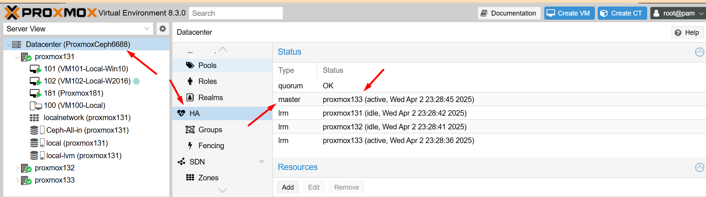
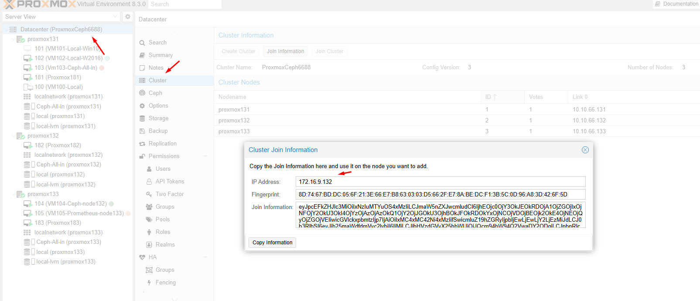
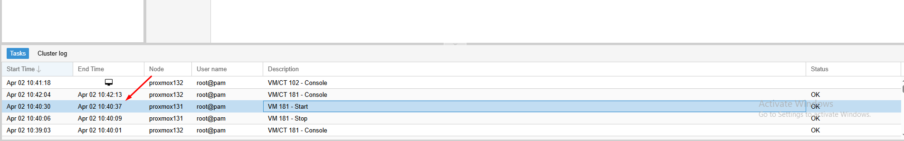
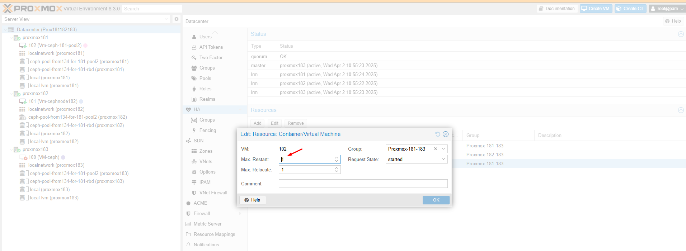
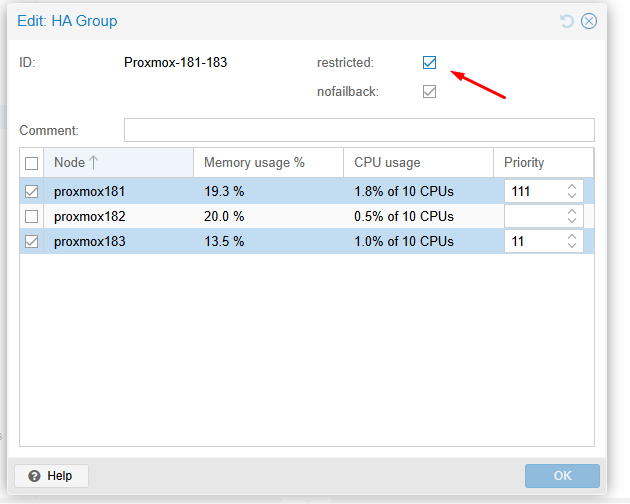

#### 1.Cài proxmox

    https://github.com/tudv1989/THUCTAPNHANHOA2025-HATANG/blob/main/%E1%BA%A2o%20H%C3%B3a/Proxmox/2.C%C3%A0i%20%C4%91%E1%BA%B7t%20proxmox.md

#### 2.Tạo cluster proxmox

Tham khảo bước 1 và bước 2 trong hướng dẫn sau:

    https://github.com/tudv1989/THUCTAPNHANHOA2025-HATANG/blob/main/%E1%BA%A2o%20H%C3%B3a/Proxmox/15.Cluster-HA-Ceph-Proxmox.md

#### 3.Cài Ceph all in one

Tham khảo bước 3 4 5 6 theo link sau:

    https://github.com/tudv1989/THUCTAPNHANHOA2025-HATANG/blob/main/%E1%BA%A2o%20H%C3%B3a/Proxmox/15.Cluster-HA-Ceph-Proxmox.md

#### 4. Thêm storge và cấu hình HA VM

Tham khảo từ bước 9 theo link sau:

    https://github.com/tudv1989/THUCTAPNHANHOA2025-HATANG/blob/main/Tri%E1%BB%83n%20khai%20th%E1%BB%B1c%20t%E1%BA%BF/HA-Cluster-Proxmox/LAB%20tr%C3%AAn%20thi%E1%BA%BFt%20b%E1%BB%8B%20th%E1%BA%ADt.md

#### 5. Cài cụm Ceph từ xa và kết nối

#### 6. Thông tin cụm LAB và test

    sw vlan1 172.16.9.14 admin password 12345678aA@

    sw 10g 172.16.9.100 admin !3CGh4yJj6VSw9A

    remote ceph 172.16.9.134  https://10.10.88.134:8443 root 123456ok1

    ProxmoxCeph all-in-one : 10.10.66.131:8006 > Test Network Proxmox

    ProxmoxClusterOnly : 10.10.66.181:8006 > Test Network Proxmox

    Máy remote 172.16.9.141  để vào xem ceph134 administrator pass 123456ok1A ( tạo trên proxmox 131 )

Test 1 số case:

  + Test đọc ghi - độ trễ máy ảo

     + https://hocvps.com/kiem-tra-hieu-suat-o-cung-voi-fio-va-ioping/

  + Test hiêụ suất Ceph

    + https://github.com/tudv1989/THUCTAPNHANHOA2025-HATANG/blob/main/Storage/CEPH.doc2/6-Benchmark%20Trong%20Ceph.md

  + Proxmox master trong cụm tự động được bầu chọn lại tự động khi node master mất kết nối

  

    Và xem Datacenter > Cluster

  + Cụm proxmox181 đang set thời gian corosync đánh giá node die để kích hoạt HA VM là 300000 miligiay =  5 phút >> test tắt 1 node và đợi 5 phút xem HV tranfer

    Xem token: /etc/pve/corosync.conf >> Phần kiểm tra quan trọng để đánh giá node die >> Liên quan đến time khởi động máy chủ, hoặc vấn đề liên quan đến thời gian nào đó

  + Test HA VM tự chuyển cụm khi 1 node proxmox mất kết nối

  
  

     + Test tham số khởi động của VM khi HA , các tham số Maxrestart = 1 chỉ khởi động 1 lần > VM chuyển về node dự phòng, Maxrestart = 2 - chỉ khởi động 2 lần - VM sẽ chuyển đi 2 lần ( có thể quay về node ban đầu nếu node ban đầu khôi phục - trường hợp có nhiều node dự phòng - tùy cấu hình node, cụm cụ thể ...)

  

  

