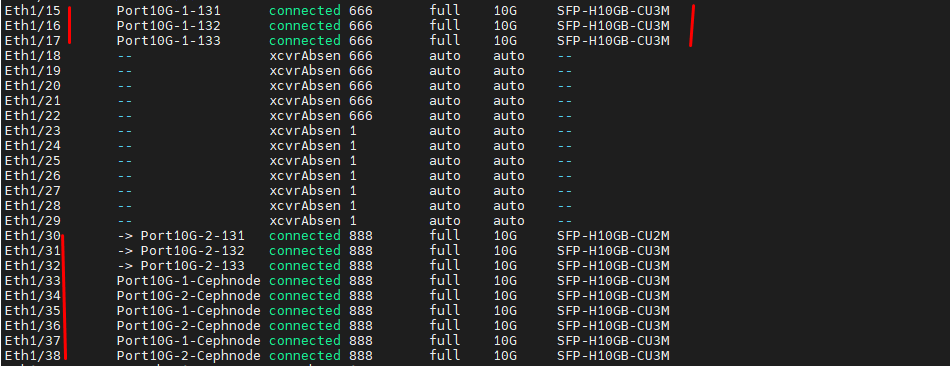
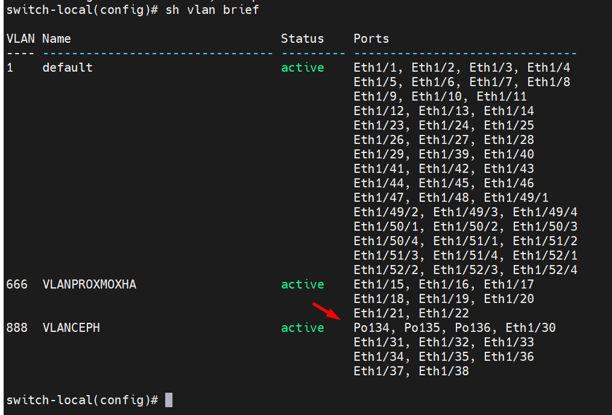
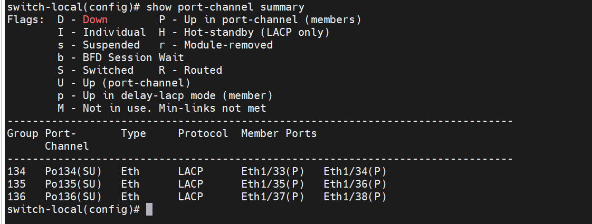
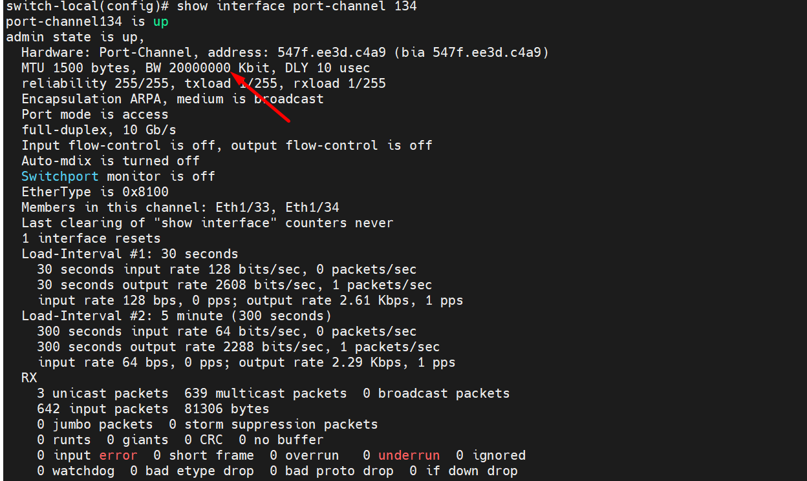

  

    Eth1/15       Port10G-1-131      connected 666       full    10G     SFP-H10GB-CU3M
    Eth1/16       Port10G-1-132      connected 666       full    10G     SFP-H10GB-CU3M
    Eth1/17       Port10G-1-133      connected 666       full    10G     SFP-H10GB-CU3M

    Eth1/30       Port10G-2-131   connected 888       full    10G     SFP-H10GB-CU2M
    Eth1/31       Port10G-2-132   connected 888       full    10G     SFP-H10GB-CU3M
    Eth1/32       Port10G-2-133   connected 888       full    10G     SFP-H10GB-CU3M
    Eth1/33       Port10G-1-Cephnode134 connected 888       full    10G     SFP-H10GB-CU3M
    Eth1/34       Port10G-2-Cephnode134 connected 888       full    10G     SFP-H10GB-CU3M
    Eth1/35       Port10G-1-Cephnode135 connected 888       full    10G     SFP-H10GB-CU3M
    Eth1/36       Port10G-2-Cephnode135 connected 888       full    10G     SFP-H10GB-CU3M
    Eth1/37       Port10G-1-Cephnode136 connected 888       full    10G     SFP-H10GB-CU3M
    Eth1/38       Port10G-2-Cephnode136 connected 888       full    10G     SFP-H10GB-CU3M

## Mô tả mô hình kết nối, đây là mô hình để test 2 kiểu Ceph-ProxmoxCluster-All-in-one và Proxmox kết nối remote Ceph 

Mình có 2 cụm proxmox HA và 2 cụm Ceph

  + Cụm 1 là all in one Ceph + Cluster Proxmox sử dụng IP 172.16.9.131 + 172.16.9.132 + 172.16.9.133 
     + Cụm all in one này sử dụng mạng VLAN 666 -10.10.66.0/24  cho proxmox cluster và VLAN 888 10.10.88.0/24 cho Ceph 
     + Eth1/15 gắn với 172.16.9.131 thông qua port 10G số 1 với tên như ảnh, 131 dùng IP 10.10.66.131 cho mạng proxmox cluster và 10.10.88.131 cho mạng ceph VLAN888 liên kết qua Eth1/30
     + Eth1/16 gắn với 172.16.9.132 thông qua port 10G số 1 với tên như ảnh, 132 dùng IP 10.10.66.132 cho mạng proxmox cluster và 10.10.88.132 cho mạng ceph VLAN888 liên kết qua Eth1/31
     + Eth1/17 gắn với 172.16.9.133 thông qua port 10G số 1 với tên như ảnh, 133 dùng IP 10.10.66.133 cho mạng proxmox cluster và 10.10.88.133 cho mạng ceph VLAN888 liên kết qua Eth1/32
     + Mô hình này chỉ sử dụng Eth1/15 Eth1/16 Eth1/17 Eth1/30 Eth1/31 Eth1/32 và port lên switch để ra internet 172.16.9.131 172.16.9.132 172.16.9.133

  + Cụm 2 là Proxmox Cluster kết nối remote Ceph sử dụng IP 172.16.9.181 + 172.16.9.182 + 172.16.9.183 để ra internet,cụm proxmox cluster thứ 2 này mình sử dụng proxmox ảo 
     + Cụm này sử dụng mạng VLAN 666 - 10.10.66.0/24 cho giao tiếp proxmox cluster và VLAN 888 10.10.88.0/24 cho giao tiếp Ceph
     + 172.16.9.134 là Ceph node1 có 2 cổng 10G cấu hình bonding thành cổng có băng thông 20G sử dụng IP 10.10.88.134 cho Ceph
     + 172.16.9.135 là Ceph node2 có 2 cổng 10G cấu hình bonding thành cổng có băng thông 20G sử dụng IP 10.10.88.135 cho Ceph
     + 172.16.9.136 là Ceph node3 có 2 cổng 10G cấu hình bonding thành cổng có băng thông 20G sử dụng IP 10.10.88.135 cho Ceph

Dưới đây là chi tiết phần cấu hình

```Bash
//Cấu hình với switch 3064

switch-local(config)#vlan 666 //name VLANPROXMOXHA

switch-local(config)#vlan 888 //name VLANCEPH

switch-local(config)#int Eth1/15
switch-local(config)#sw access vlan 666

switch-local(config)#int Eth1/30
switch-local(config)#sw access vlan 888


switch-local(config)# feature lacp //enable lacp

//Khai báo port-channel 134

switch-local(config-if)# interface port-channel 134
switch-local(config-if)# no shutdown
switch-local(config-if)# exit

//Gán Eth1/33 và Eth1/34 vào port-channel 136

switch-local(config)# interface Eth1/33
switch-local(config-if)# channel-group 134 mode active
switch-local(config)# interface Eth1/34
switch-local(config-if)# channel-group 134 mode active

//Khai báo port-channel 135

switch-local(config)# interface port-channel 135
switch-local(config-if)# no shutdown
switch-local(config-if)# exit

//Gán Eth1/35 và Eth1/36 vào port-channel 136

switch-local(config)# interface Eth1/35
switch-local(config-if)# channel-group 135 mode active
switch-local(config-if)# exit
switch-local(config)# interface Eth1/36
switch-local(config-if)# channel-group 135 mode active

//Khai báo port-channel 136

switch-local(config)# interface port-channel 136
switch-local(config-if)# no shutdown
switch-local(config-if)# exit

//Gán Eth1/37 và Eth1/38 vào port-channel 136

switch-local(config)# interface Eth1/37
switch-local(config-if)# channel-group 136 mode active
switch-local(config-if)# exit
switch-local(config)# interface Eth1/38
switch-local(config-if)# channel-group 136 mode active

//Access VLAN 888 với port-channel 134

switch-local(config)# interface port-channel 134
switch-local(config-if)# sw mode access
switch-local(config-if)# sw access vlan 888
switch-local(config-if)# exit

//Access VLAN 888 với port-channel 135

switch-local(config)# interface port-channel 135
switch-local(config-if)# sw access vlan 888
switch-local(config-if)# sw mode access
switch-local(config-if)# exit

//Access VLAN 888 với port-channel 136

switch-local(config-if)# interface port-channel 136
switch-local(config-if)# sw access vlan 888
switch-local(config-if)# sw mode access

//Kết thúc để lưu cấu hình

switch-local(config-if)# end

switch-local# copy running-config startup-config

//Show check

switch-local# show port-channel summary

switch-local# show interface port-channel 134
switch-local# show interface port-channel 135
switch-local# show interface port-channel 136

```
  
  
  
  

