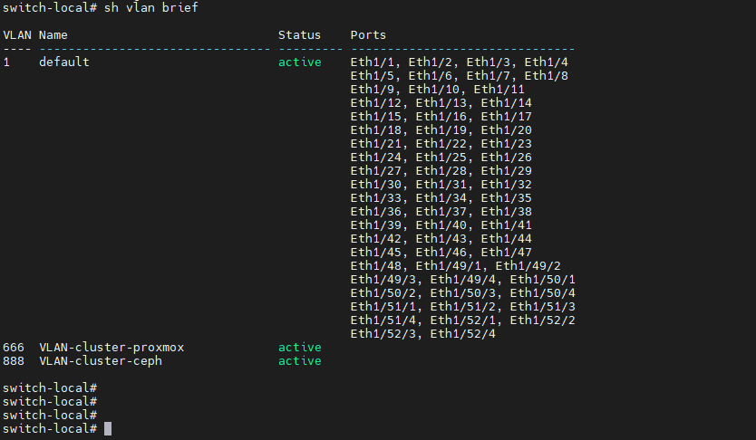
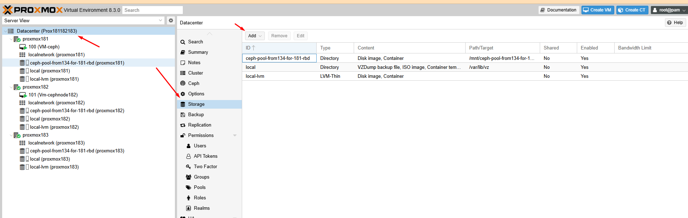
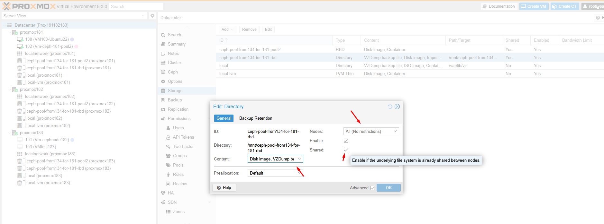

  

Mình sẽ trình bày diễn giải chi tiết

Tạo cặp khóa SSH trên Node [Monitor Daemon] (gọi nó là Node quản trị ở đây) và copy nó cho mỗi Node trong cụm. Do mình muốn xóa hết các cặp khóa cũ nên mình sử dụng rm -rf ~/.ssh/* để xóa tất cả các file trong thư mục ~/.ssh, điều này sẽ xóa hết các khóa SSH và các file cấu hình.

Trên cephnode134 chạy lệnh sau: Tạo một cặp khóa SSH mới không có mật khẩu và lưu chúng vào thư mục /root/.ssh.

```Bash
rm -rf ~/.ssh/*
ssh-keygen -t rsa -b 4096 -N "" -f  /root/.ssh/id_rsa -q
```

Tiếp theo, tạo một file cấu hình SSH mới trong ~/.ssh/config với thông tin về cách kết nối đến các node trong cụm Ceph.

```Bash
cat > ~/.ssh/config << 'OEF'
Host cephnode134
    Hostname cephnode134.dinhtu.xyz 
    User root
Host cephnode135
    Hostname cephnode135.dinhtu.xyz 
    User root
Host cephnode136
    Hostname cephnode136.dinhtu.xyz 
    User root
OEF

```

Phần tiếp theo tạo một file /etc/hosts mới với các địa chỉ IP và tên máy chủ cho cụm Ceph. Lưu ý đối với giao tiếp giữa các Node các bạn nên sử dụng IP Private của mỗi Node, đây là IP có băng thông cao sử dụng cho kết nối các cluster trong cụm ví dụ như dưới.

```Bash

cat >> /etc/hosts << 'OEF'
10.10.88.134 cephnode134.dinhtu.xyz cephnode134
10.10.88.135 cephnode135.dinhtu.xyz cephnode135
10.10.88.136 cephnode136.dinhtu.xyz cephnode136
OEF
```

Sao chép khóa công khai SSH đến node còn lại trong cụm.
Sử dụng lệnh ``ssh-copy-id`` sao chép khóa công khai SSH đến node trong trong cụm, tính luôn cả ``cephnode221``, ví dụ của mình là ``cephnode222`` và ``cephnode223``.

```Bash
ssh-copy-id -o StrictHostKeychecking=no cephnode134
ssh-copy-id -o StrictHostKeychecking=no cephnode135
ssh-copy-id -o StrictHostKeychecking=no cephnode136

```

Tùy chọn ``-o StrictHostKeychecking=no`` ngăn chặn việc kiểm tra dấu vân tay của máy chủ, cho phép kết nối tự động.

Dưới đây là ví dụ đầu ra khi chạy lệnh trên ở một node bất kỳ sẽ tương tự như dưới.

Nhập mật khẩu của root Node Remote để thực hiện việc sao chép.

Dưới đây là một đoạn shell sử dụng for để cài đặt Ceph trên mỗi node trong cụm.

```Bash

for NODE in cephnode134 cephnode135 cephnode136
do
    ssh -o StrictHostKeychecking=no $NODE "apt update; apt -y install ceph"
done 

```

Tạo một UUID mới để định danh cho cụm.

```Bash

uuidgen

```
Tạo một file cấu hình Ceph mới trong /etc/ceph/ceph.conf với thông tin về cụm, bao gồm network, địa chỉ IP của các node monitor và các tùy chọn khác. Nhớ truyền thông tin UUID đã lấy được ở bước trên vào fsid, ví dụ fsid = 06cac32a-9d78-4dd5-aef0-2f6560d29f36

```Bash

cat > /etc/ceph/ceph.conf << OEF
[global]
cluster_network = 10.10.88.0/24
public_network = 10.10.88.0/24
fsid = 06cac32a-9d78-4dd5-aef0-2f6560d29f36
mon_host = 10.10.88.134
mon_initial_members = cephnode134
osd_pool_default_crush_rule = -1

[mon.cephnode134]
host = cephnode134
mon_addr = 10.10.88.134
mon_allow_pool_delete = true
OEF

```

Tạo một khóa bí mật cho Ceph Monitor và lưu nó vào file ``/etc/ceph/ceph.mon.keyring``. Tùy chọn ``--cap mon 'allow *'`` cấp quyền cho Monitor thực hiện tất cả các hành động.

    ceph-authtool --create-keyring /etc/ceph/ceph.mon.keyring --gen-key -n mon. --cap mon 'allow *'

Tạo một khóa bí mật cho user quản trị Ceph Cluster và lưu nó vào file ``/etc/ceph/ceph.client.admin.keyring``. Tùy chọn ``--cap`` cấp quyền cho user quản trị thực hiện tất cả các hành động trên tất cả các thành phần của cụm.

    ceph-authtool --create-keyring /etc/ceph/ceph.client.admin.keyring --gen-key -n client.admin --cap mon 'allow *' --cap osd 'allow *' --cap mds 'allow *' --cap mgr 'allow *'

Tạo một khóa bí mật cho quá trình khởi động OSD và lưu nó vào file ``/var/lib/ceph/bootstrap-osd/ceph.keyring``.

    ceph-authtool --create-keyring /var/lib/ceph/bootstrap-osd/ceph.keyring --gen-key -n client.bootstrap-osd --cap mon 'profile bootstrap-osd' --cap mgr 'allow r'

Nhập khóa bí mật của người quản trị vào khóa bí mật của Monitor.

Lệnh ``ceph-authtool`` được sử dụng để quản lý ``keyrings`` trong Ceph, một hệ thống lưu trữ phân tán. Keyrings chứa các keys được sử dụng để xác thực các clients và daemons với nhau trong hệ thống Ceph.

Lệnh này sẽ nhập keyring của client admin vào keyring của monitor. Điều này cho phép client admin được xác thực với monitor.

    ceph-authtool /etc/ceph/ceph.mon.keyring --import-keyring /etc/ceph/ceph.client.admin.keyring

Lệnh này sẽ nhập keyring của bootstrap-osd vào keyring của monitor. Điều này cho phép bootstrap-osd được xác thực với monitor.

    ceph-authtool /etc/ceph/ceph.mon.keyring --import-keyring /var/lib/ceph/bootstrap-osd/ceph.keyring

Trong cả hai trường hợp, lệnh ceph-authtool sẽ cập nhật ``/etc/ceph/ceph.mon.keyring`` để bao gồm các keys từ keyring được chỉ định.

Tạo một bản đồ monitor mới với thông tin về tên node, địa chỉ IP và FSID.

Lệnh monmaptool được sử dụng để tạo và chỉnh sửa bản đồ monitor (monmap) trong hệ thống lưu trữ Ceph. Bản đồ monitor chứa thông tin về tất cả các monitor trong cluster Ceph.

Đầu tiên hãy lấy biến môi trường cần thiết trước.

    FSID=$(grep "^fsid" /etc/ceph/ceph.conf | awk {'print $NF'})
    NODENAME=$(grep "^mon_initial" /etc/ceph/ceph.conf | awk {'print $NF'})
    NODEIP=$(grep "^mon_host" /etc/ceph/ceph.conf | awk {'print $NF'})

Chạy lệnh này để tạo một bản đồ monitor mới và thêm một monitor vào bản đồ đó.

    monmaptool --create --add $NODENAME $NODEIP --fsid $FSID /etc/ceph/monmap

Tạo một thư mục mới cho Monitor Daemon.

    mkdir /var/lib/ceph/mon/ceph-$NODENAME

Khởi tạo Monitor Daemon với thông tin từ bản đồ monitor và khóa bí mật.

    ceph-mon --cluster ceph --mkfs -i $NODENAME --monmap /etc/ceph/monmap --keyring /etc/ceph/ceph.mon.keyring

Thay đổi quyền sở hữu của tất cả các file trong /etc/ceph thành người dùng ceph.

    chown ceph. /etc/ceph/ceph.*
    chown -R ceph. /var/lib/ceph/mon/ceph-$NODENAME /var/lib/ceph/bootstrap-osd

Kích hoạt và khởi động dịch vụ Ceph Monitor.

    systemctl enable --now ceph-mon@$NODENAME

Kích hoạt giao thức Messenger v2 cho Ceph Monitor.

    ceph mon enable-msgr2

Kích hoạt module tự động điều chỉnh số lượng Placement Groups.

    ceph mgr module enable pg_autoscaler

Tạo một thư mục mới cho Manager Daemon.

    mkdir /var/lib/ceph/mgr/ceph-$NODENAME

Tạo hoặc lấy khóa xác thực cho Manager Daemon.

    ceph auth get-or-create mgr.$NODENAME mon 'allow profile mgr' osd 'allow *' mds 'allow *'

Tạo hoặc lấy khóa xác thực cho Manager Daemon và lưu nó vào file /etc/ceph/ceph.mgr.admin.keyring. Nếu khóa đã tồn tại, lệnh sẽ lấy khóa đó. Nếu không, lệnh sẽ tạo một khóa mới.

    ceph auth get-or-create mgr.$NODENAME | tee /etc/ceph/ceph.mgr.admin.keyring

Sao chép file khóa vừa tạo vào thư mục của Manager Daemon.

    cp /etc/ceph/ceph.mgr.admin.keyring /var/lib/ceph/mgr/ceph-$NODENAME/keyring

Lệnh này thay đổi quyền sở hữu của file khóa để người dùng ceph có thể truy cập.

    chown ceph. /etc/ceph/ceph.mgr.admin.keyring

    chown -R ceph. /var/lib/ceph/mgr/ceph-$NODENAME

    systemctl enable --now ceph-mgr@$NODENAME

Check thử

    ceph -s

#### Thiết lập các thiết bị lưu trữ đối tượng (OSD)

Sao chép các file cấu hình và khóa bí mật.

    scp /etc/ceph/ceph.conf cephnode135:/etc/ceph/ceph.conf
    scp /etc/ceph/ceph.client.admin.keyring cephnode135:/etc/ceph
    scp /var/lib/ceph/bootstrap-osd/ceph.keyring cephnode135:/var/lib/ceph/bootstrap-osd

    scp /etc/ceph/ceph.conf cephnode136:/etc/ceph/ceph.conf
    scp /etc/ceph/ceph.client.admin.keyring cephnode136:/etc/ceph
    scp /var/lib/ceph/bootstrap-osd/ceph.keyring cephnode136:/var/lib/ceph/bootstrap-osd

    root@cephnode134:~# chown ceph. /etc/ceph/ceph.* /var/lib/ceph/bootstrap-osd/*
    root@cephnode135:~# chown ceph. /etc/ceph/ceph.* /var/lib/ceph/bootstrap-osd/*
    root@cephnode136:~# chown ceph. /etc/ceph/ceph.* /var/lib/ceph/bootstrap-osd/*

Dưới đây là mẫu lệnh dùng vòng lặp để copy và phân quyền sau đó tạo phân vùng và nhóm lvm , bạn để ý /dev/sdx

```Bash

for NODE in cephnode134 cephnode135 cephnode136
do
    ssh $NODE \
    "chown ceph. /etc/ceph/ceph.* /var/lib/ceph/bootstrap-osd/*; \
    parted --script /dev/sdb 'mklabel gpt'; \
    parted --script /dev/sdb "mkpart primary 0% 100%"; \
    ceph-volume lvm create --data /dev/sdb1"
done 


for NODE in cephnode134 cephnode135 cephnode136
do
    ssh $NODE \
    "chown ceph. /etc/ceph/ceph.* /var/lib/ceph/bootstrap-osd/*; \
    parted --script /dev/sdc 'mklabel gpt'; \
    parted --script /dev/sdc "mkpart primary 0% 100%"; \
    ceph-volume lvm create --data /dev/sdc1"
done 

for NODE in cephnode134 cephnode135 cephnode136
do
    ssh $NODE \
    "chown ceph. /etc/ceph/ceph.* /var/lib/ceph/bootstrap-osd/*; \
    parted --script /dev/sdd 'mklabel gpt'; \
    parted --script /dev/sdd "mkpart primary 0% 100%"; \
    ceph-volume lvm create --data /dev/sdd1"
done 

for NODE in   cephnode136
do
    ssh $NODE \
    "chown ceph. /etc/ceph/ceph.* /var/lib/ceph/bootstrap-osd/*; \
    parted --script /dev/sdd 'mklabel gpt'; \
    parted --script /dev/sdd "mkpart primary 0% 100%"; \
    ceph-volume lvm create --data /dev/sdd1"
done 

```

Mình tạo kết nối theo 2 kiểu, 1 kiểu kết nối trực tiếp đến Ceph, và 1 kiểu tạo RBD - tạo block device trên ceph client và kết nối ,thực ra kiểu tạo theo RBD này chúng ta có thể tạo VM có disk format là qcow2, khác kiểu 1 chỉ 1 dạng RAW (RAW tốt nhất cho VM tạo trên Ceph)

Trên node Ceph134 tiếp tục các thao tác sau:
```Bash

cat >> ~/.ssh/config << 'OEF'
Host proxmox181
    Hostname proxmox181.dinhtu.xyz
    User root
OEF
```

```Bash
cat >> /etc/hosts << 'OEF'
10.10.88.181 proxmox181.dinhtu.xyz proxmox181
OEF
```
    ssh-copy-id -o StrictHostKeychecking=no proxmox181.dinhtu.xyz

    scp /etc/ceph/ceph.conf proxmox181.dinhtu.xyz:/etc/ceph/

    scp /etc/ceph/ceph.client.admin.keyring proxmox181.dinhtu.xyz:/etc/ceph/

    ssh proxmox181.dinhtu.xyz "chown ceph. /etc/ceph/ceph.*"

#### Kiểu 1 : Connect trực tiếp đến pool tạo 

```Bash

ceph osd pool create ceph-pool-from134-for-181-pool2 128

ssh proxmox181.dinhtu.xyz "ceph osd pool create ceph-pool-from134-for-181-pool2 128"

ssh proxmox181.dinhtu.xyz "ceph osd pool set ceph-pool-from134-for-181-pool2 pg_autoscale_mode on"

ssh proxmox181.dinhtu.xyz "rbd pool init ceph-pool-from134-for-181-pool2"

ssh proxmox181.dinhtu.xyz "ceph osd pool autoscale-status"

```

Sau đó qua giao diện Ceph tạo kết nối

Datacenter > Storage > RBD > 

  
  
Bạn lấy password ceph.client.admin.keyring điền vào, điền đúng tên pool đã tạo

#### Kiểu 2: Tạo connect theo dạng block device, Type Storage Directory với ceph client, dùng làm gì cũng được , image RBD =100 (ceph-pool-from134-for-181-rbd)

Khuyến cáo cách này chỉ là testing và không nên sử dụng , test xong sẽ thấy nhiều vấn đề, kể từ đoạn này đến hết docs

    ssh proxmox181.dinhtu.xyz "ceph osd pool create ceph-pool-from134-for-181 128"

    ssh proxmox181.dinhtu.xyz "ceph osd pool set ceph-pool-from134-for-181 pg_autoscale_mode on"

    ssh proxmox181.dinhtu.xyz "rbd pool init ceph-pool-from134-for-181"

    ssh proxmox181.dinhtu.xyz "ceph osd pool autoscale-status"

Tạo RBD cho proxmox181

    ssh proxmox181.dinhtu.xyz "rbd create --size 100G --pool ceph-pool-from134-for-181 ceph-pool-from134-for-181-rbd"

    ssh proxmox181.dinhtu.xyz "rbd ls -l -p ceph-pool-from134-for-181"

    ssh proxmox181.dinhtu.xyz "rbd map ceph-pool-from134-for-181/ceph-pool-from134-for-181-rbd"

    ssh proxmox181.dinhtu.xyz "rbd showmapped"

    ssh proxmox181.dinhtu.xyz "lsblk"

Nếu bạn ko cần mount thì bỏ qua đoạn mount này, ko thì hãy đến đoạn tạo connect qua giao diện ``Qua đây chúng ta qua giao diện để add storage`` >> Mình làm test và ko mount ( Mount tạo VM vào đó cần storage shared giữa các node - giống Cephfs )

    ssh proxmox181.dinhtu.xyz "mkfs.xfs /dev/rbd0"

    ssh proxmox181.dinhtu.xyz "mkdir -p /mnt/ceph-pool-from134-for-181-rbd"

    ssh proxmox181.dinhtu.xyz "mount /dev/rbd0 /mnt/ceph-pool-from134-for-181-rbd"

    ssh proxmox181.dinhtu.xyz "blkid /dev/rbd0"
    root@cephnode134:~# ssh proxmox181.dinhtu.xyz "blkid /dev/rbd0"
    /dev/rbd0: UUID="62685e35-f756-49af-a296-c220c6887017" BLOCK_SIZE="512" TYPE="xfs"

    ssh proxmox181.dinhtu.xyz "echo '62685e35-f756-49af-a296-c220c6887017 /mnt/ceph-pool-from134-for-181-rbd xfs defaults,_netdev 0 2' |  tee -a /etc/fstab"

Qua đây chúng ta qua giao diện để add storage

  

#### Tạo LVM thử - chỗ này là mình test thử thôi - Mặc định LVM đã chặn cấu hình block device name /dev/rbdxxx theo rules LVM

```Bash

ssh proxmox181.dinhtu.xyz "rbd create --size 100G --pool ceph-pool-from134-for-181 ceph-pool-from134-for-181-rbd1"
ssh proxmox181.dinhtu.xyz "rbd create --size 100G --pool ceph-pool-from134-for-181 ceph-pool-from134-for-181-rbd2"

ssh proxmox181.dinhtu.xyz "rbd map ceph-pool-from134-for-181/ceph-pool-from134-for-181-rbd1"
ssh proxmox181.dinhtu.xyz "rbd map ceph-pool-from134-for-181/ceph-pool-from134-for-181-rbd2"

ssh proxmox181.dinhtu.xyz "rbd showmapped"

root@proxmox181:/mnt# parted /dev/rbd1 mklabel gpt
Information: You may need to update /etc/fstab.

root@proxmox181:/mnt# parted /dev/rbd2 mklabel gpt
Information: You may need to update /etc/fstab.

root@proxmox181:/mnt# sgdisk -N 1 /dev/rbd1
The operation has completed successfully.
root@proxmox181:/mnt# sgdisk -N 1 /dev/rbd2
The operation has completed successfully.

```