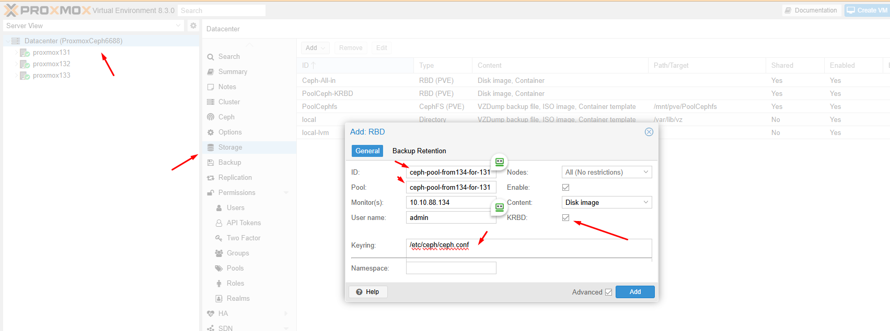

Trên node Ceph134 tiếp tục các thao tác copy config và keyring sang các node Proxmox

cat >> ~/.ssh/config << 'OEF'
Host proxmox131
    Hostname proxmox131.dinhtu.xyz
    User root
OEF

cat >> /etc/hosts << 'OEF'
10.10.88.131 proxmox131.dinhtu.xyz proxmox131
OEF

ssh-copy-id -o StrictHostKeychecking=no proxmox131.dinhtu.xyz

scp /etc/ceph/ceph.conf proxmox131.dinhtu.xyz:/etc/ceph/

scp /etc/ceph/ceph.client.admin.keyring proxmox131.dinhtu.xyz:/etc/ceph/

ssh proxmox131.dinhtu.xyz "chown ceph. /etc/ceph/ceph.*"

cat >> ~/.ssh/config << 'OEF'
Host proxmox132
    Hostname proxmox132.dinhtu.xyz
    User root
OEF

cat >> /etc/hosts << 'OEF'
10.10.88.132 proxmox132.dinhtu.xyz proxmox132
OEF

ssh-copy-id -o StrictHostKeychecking=no proxmox132.dinhtu.xyz

scp /etc/ceph/ceph.conf proxmox132.dinhtu.xyz:/etc/ceph/

scp /etc/ceph/ceph.client.admin.keyring proxmox132.dinhtu.xyz:/etc/ceph/

ssh proxmox132.dinhtu.xyz "chown ceph. /etc/ceph/ceph.*"

cat >> ~/.ssh/config << 'OEF'
Host proxmox133
    Hostname proxmox133.dinhtu.xyz
    User root
OEF

cat >> /etc/hosts << 'OEF'
10.10.88.133 proxmox133.dinhtu.xyz proxmox133
OEF

ssh-copy-id -o StrictHostKeychecking=no proxmox133.dinhtu.xyz

scp /etc/ceph/ceph.conf proxmox133.dinhtu.xyz:/etc/ceph/

scp /etc/ceph/ceph.client.admin.keyring proxmox133.dinhtu.xyz:/etc/ceph/

ssh proxmox133.dinhtu.xyz "chown ceph. /etc/ceph/ceph.*"

Connect đến pool ceph-pool-from134-for-131 qua giao diện:

  

