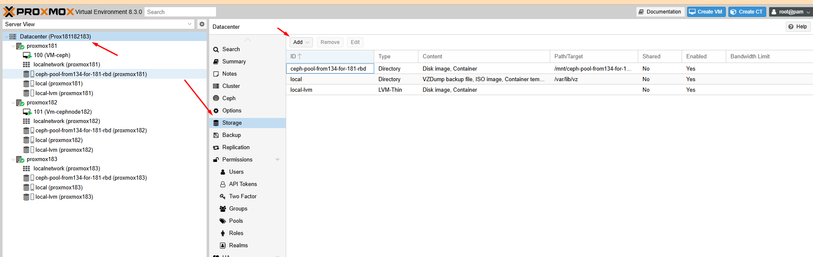

```Bash

rm -rf ~/.ssh/*
ssh-keygen -t rsa -b 4096 -N "" -f  /root/.ssh/id_rsa -q

cat > ~/.ssh/config << 'OEF'
Host cephnode134
    Hostname cephnode134.dinhtu.xyz 
    User root
Host cephnode135
    Hostname cephnode135.dinhtu.xyz 
    User root
Host cephnode136
    Hostname cephnode136.dinhtu.xyz 
    User root
OEF


cat >> /etc/hosts << 'OEF'
10.10.88.134 cephnode134.dinhtu.xyz cephnode134
10.10.88.135 cephnode135.dinhtu.xyz cephnode135
10.10.88.136 cephnode136.dinhtu.xyz cephnode136
OEF


ssh-copy-id -o StrictHostKeychecking=no cephnode134
ssh-copy-id -o StrictHostKeychecking=no cephnode135
ssh-copy-id -o StrictHostKeychecking=no cephnode136


for NODE in cephnode134 cephnode135 cephnode136
do
    ssh -o StrictHostKeychecking=no $NODE "apt update; apt -y install ceph"
done 

uuidgen

cat > /etc/ceph/ceph.conf << OEF
[global]
cluster_network = 10.10.88.0/24
public_network = 10.10.88.0/24
fsid = 06cac32a-9d78-4dd5-aef0-2f6560d29f36
mon_host = 10.10.88.134
mon_initial_members = cephnode134
osd_pool_default_crush_rule = -1

[mon.cephnode134]
host = cephnode134
mon_addr = 10.10.88.134
mon_allow_pool_delete = true
OEF

ceph-authtool --create-keyring /etc/ceph/ceph.mon.keyring --gen-key -n mon. --cap mon 'allow *'

ceph-authtool --create-keyring /etc/ceph/ceph.client.admin.keyring --gen-key -n client.admin --cap mon 'allow *' --cap osd 'allow *' --cap mds 'allow *' --cap mgr 'allow *'

ceph-authtool --create-keyring /var/lib/ceph/bootstrap-osd/ceph.keyring --gen-key -n client.bootstrap-osd --cap mon 'profile bootstrap-osd' --cap mgr 'allow r'

ceph-authtool /etc/ceph/ceph.mon.keyring --import-keyring /etc/ceph/ceph.client.admin.keyring

ceph-authtool /etc/ceph/ceph.mon.keyring --import-keyring /var/lib/ceph/bootstrap-osd/ceph.keyring

FSID=$(grep "^fsid" /etc/ceph/ceph.conf | awk {'print $NF'})
NODENAME=$(grep "^mon_initial" /etc/ceph/ceph.conf | awk {'print $NF'})
NODEIP=$(grep "^mon_host" /etc/ceph/ceph.conf | awk {'print $NF'})

monmaptool --create --add $NODENAME $NODEIP --fsid $FSID /etc/ceph/monmap

mkdir /var/lib/ceph/mon/ceph-$NODENAME

ceph-mon --cluster ceph --mkfs -i $NODENAME --monmap /etc/ceph/monmap --keyring /etc/ceph/ceph.mon.keyring

chown ceph. /etc/ceph/ceph.*
chown -R ceph. /var/lib/ceph/mon/ceph-$NODENAME /var/lib/ceph/bootstrap-osd

systemctl enable --now ceph-mon@$NODENAME

ceph mon enable-msgr2

ceph mgr module enable pg_autoscaler

mkdir /var/lib/ceph/mgr/ceph-$NODENAME

ceph auth get-or-create mgr.$NODENAME mon 'allow profile mgr' osd 'allow *' mds 'allow *'

ceph auth get-or-create mgr.$NODENAME | tee /etc/ceph/ceph.mgr.admin.keyring

cp /etc/ceph/ceph.mgr.admin.keyring /var/lib/ceph/mgr/ceph-$NODENAME/keyring

chown ceph. /etc/ceph/ceph.mgr.admin.keyring

chown -R ceph. /var/lib/ceph/mgr/ceph-$NODENAME

systemctl enable --now ceph-mgr@$NODENAME

ceph -s

scp /etc/ceph/ceph.conf cephnode135:/etc/ceph/ceph.conf
scp /etc/ceph/ceph.client.admin.keyring cephnode135:/etc/ceph
scp /var/lib/ceph/bootstrap-osd/ceph.keyring cephnode135:/var/lib/ceph/bootstrap-osd

scp /etc/ceph/ceph.conf cephnode136:/etc/ceph/ceph.conf
scp /etc/ceph/ceph.client.admin.keyring cephnode136:/etc/ceph
scp /var/lib/ceph/bootstrap-osd/ceph.keyring cephnode136:/var/lib/ceph/bootstrap-osd

root@cephnode134:~# chown ceph. /etc/ceph/ceph.* /var/lib/ceph/bootstrap-osd/*
root@cephnode135:~# chown ceph. /etc/ceph/ceph.* /var/lib/ceph/bootstrap-osd/*
root@cephnode136:~# chown ceph. /etc/ceph/ceph.* /var/lib/ceph/bootstrap-osd/*

for NODE in cephnode134 cephnode135 cephnode136
do
    ssh $NODE \
    "chown ceph. /etc/ceph/ceph.* /var/lib/ceph/bootstrap-osd/*; \
    parted --script /dev/sdb 'mklabel gpt'; \
    parted --script /dev/sdb "mkpart primary 0% 100%"; \
    ceph-volume lvm create --data /dev/sdb1"
done 


for NODE in cephnode134 cephnode135 cephnode136
do
    ssh $NODE \
    "chown ceph. /etc/ceph/ceph.* /var/lib/ceph/bootstrap-osd/*; \
    parted --script /dev/sdc 'mklabel gpt'; \
    parted --script /dev/sdc "mkpart primary 0% 100%"; \
    ceph-volume lvm create --data /dev/sdc1"
done 

for NODE in cephnode134 cephnode135 cephnode136
do
    ssh $NODE \
    "chown ceph. /etc/ceph/ceph.* /var/lib/ceph/bootstrap-osd/*; \
    parted --script /dev/sdd 'mklabel gpt'; \
    parted --script /dev/sdd "mkpart primary 0% 100%"; \
    ceph-volume lvm create --data /dev/sdd1"
done 

for NODE in   cephnode136
do
    ssh $NODE \
    "chown ceph. /etc/ceph/ceph.* /var/lib/ceph/bootstrap-osd/*; \
    parted --script /dev/sdd 'mklabel gpt'; \
    parted --script /dev/sdd "mkpart primary 0% 100%"; \
    ceph-volume lvm create --data /dev/sdd1"
done 

Mình tạo connect ceph thêm cho node proxmox181 độc lập, ở đây là có nhóm cluster của proxmox181.182.183

Mình tạo kết nối theo 2 kiểu, 1 kiểu kết nối trực tiếp đến Ceph, và 1 kiểu tạo RBD - tạo block device trên ceph client và kết nối ,thực ra kiểu tạo theo RBD này chúng ta có thể tạo VM có disk format là qcow2, khác kiểu 1 chỉ 1 dạng RAW (RAW tốt nhất cho VM tạo trên Ceph)

cat >> ~/.ssh/config << 'OEF'
Host proxmox181
    Hostname proxmox181.dinhtu.xyz
    User root
OEF

cat >> /etc/hosts << 'OEF'
10.10.88.181 proxmox181.dinhtu.xyz proxmox181
OEF

ssh-copy-id -o StrictHostKeychecking=no proxmox181.dinhtu.xyz

scp /etc/ceph/ceph.conf proxmox181.dinhtu.xyz:/etc/ceph/

scp /etc/ceph/ceph.client.admin.keyring proxmox181.dinhtu.xyz:/etc/ceph/

ssh proxmox181.dinhtu.xyz "chown ceph. /etc/ceph/ceph.*"

## Kiểu 1: Tạo connect theo dạng block device, Type Storage Directory với ceph client, dùng làm gì cũng được , image RBD =100 (ceph-pool-from134-for-181-rbd)

ssh proxmox181.dinhtu.xyz "ceph osd pool create ceph-pool-from134-for-181 128"

ssh proxmox181.dinhtu.xyz "ceph osd pool set ceph-pool-from134-for-181 pg_autoscale_mode on"

ssh proxmox181.dinhtu.xyz "rbd pool init ceph-pool-from134-for-181"

ssh proxmox181.dinhtu.xyz "ceph osd pool autoscale-status"

Tạo RBD cho proxmox181

ssh proxmox181.dinhtu.xyz "rbd create --size 100G --pool ceph-pool-from134-for-181 ceph-pool-from134-for-181-rbd"

ssh proxmox181.dinhtu.xyz "rbd ls -l -p ceph-pool-from134-for-181"

ssh proxmox181.dinhtu.xyz "rbd map ceph-pool-from134-for-181/ceph-pool-from134-for-181-rbd"

ssh proxmox181.dinhtu.xyz "rbd showmapped"

ssh proxmox181.dinhtu.xyz "lsblk"

ssh proxmox181.dinhtu.xyz "mkfs.xfs /dev/rbd0"

ssh proxmox181.dinhtu.xyz "mkdir -p /mnt/ceph-pool-from134-for-181-rbd"

ssh proxmox181.dinhtu.xyz "mount /dev/rbd0 /mnt/ceph-pool-from134-for-181-rbd"

ssh proxmox181.dinhtu.xyz "blkid /dev/rbd0"
root@cephnode134:~# ssh proxmox181.dinhtu.xyz "blkid /dev/rbd0"
/dev/rbd0: UUID="62685e35-f756-49af-a296-c220c6887017" BLOCK_SIZE="512" TYPE="xfs"


ssh proxmox181.dinhtu.xyz "echo '62685e35-f756-49af-a296-c220c6887017 /mnt/ceph-pool-from134-for-181-rbd xfs defaults 0 2' |  tee -a /etc/fstab"


Qua đây chúng ta qua giao diện để add storage

  

#### Tạo LVM thử - chỗ này là mình test thử thôi

ssh proxmox181.dinhtu.xyz "rbd create --size 100G --pool ceph-pool-from134-for-181 ceph-pool-from134-for-181-rbd1"
ssh proxmox181.dinhtu.xyz "rbd create --size 100G --pool ceph-pool-from134-for-181 ceph-pool-from134-for-181-rbd2"

ssh proxmox181.dinhtu.xyz "rbd map ceph-pool-from134-for-181/ceph-pool-from134-for-181-rbd1"
ssh proxmox181.dinhtu.xyz "rbd map ceph-pool-from134-for-181/ceph-pool-from134-for-181-rbd2"

ssh proxmox181.dinhtu.xyz "rbd showmapped"

root@proxmox181:/mnt# parted /dev/rbd1 mklabel gpt
Information: You may need to update /etc/fstab.

root@proxmox181:/mnt# parted /dev/rbd2 mklabel gpt
Information: You may need to update /etc/fstab.

root@proxmox181:/mnt# sgdisk -N 1 /dev/rbd1
The operation has completed successfully.
root@proxmox181:/mnt# sgdisk -N 1 /dev/rbd2
The operation has completed successfully.


## Kiểu 2 : Connect trực tiếp đến pool tạo 

ceph osd pool create ceph-pool-from134-for-181-pool2 128

ssh proxmox181.dinhtu.xyz "ceph osd pool create ceph-pool-from134-for-181-pool2 128"

ssh proxmox181.dinhtu.xyz "ceph osd pool set ceph-pool-from134-for-181-pool2 pg_autoscale_mode on"

ssh proxmox181.dinhtu.xyz "rbd pool init ceph-pool-from134-for-181-pool2"

ssh proxmox181.dinhtu.xyz "ceph osd pool autoscale-status"

Sau đó qua giao diện Ceph tạo kết nối

Datacenter > Storage > RBD > 

  
  
Bạn lấy password ceph.client.admin.keyring điền vào, điền đúng tên pool đã tạo

```