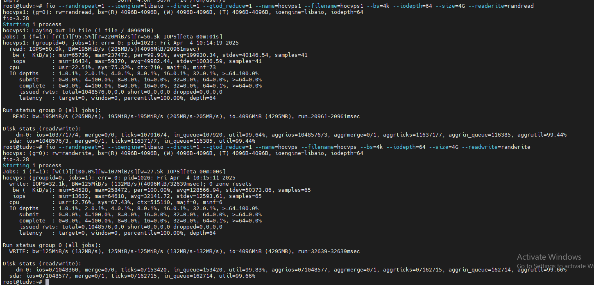

### Benchmark ghi dữ liệu vào Ceph

  

  

  

### Benchmark đọc ngẫu nhiên

  

  

## Benchmark RBD (RADOS Block Device)

#### Benchmark tốc độ write throughput.

```Bash

root@proxmox132:~# fio --name=write_throughput --filename=/dev/rbd0 --numjobs=8 \
--size=10G --time_based --runtime=60s --ramp_time=2s --ioengine=libaio \
--direct=1 --verify=0 --bs=1M --iodepth=64 --rw=write \
--group_reporting=1
write_throughput: (g=0): rw=write, bs=(R) 1024KiB-1024KiB, (W) 1024KiB-1024KiB, (T) 1024KiB-1024KiB, ioengine=libaio, iodepth=64
...
fio-3.33
Starting 8 processes
Jobs: 8 (f=8): [W(8)][56.2%][w=741MiB/s][w=741 IOPS][eta 00m:49s]
write_throughput: (groupid=0, jobs=8): err= 0: pid=1715655: Mon Apr  7 22:14:44 2025
  write: IOPS=771, BW=780MiB/s (818MB/s)(46.3GiB/60837msec); 0 zone resets
    slat (usec): min=38, max=1511, avg=139.17, stdev=66.10
    clat (msec): min=8, max=11355, avg=664.25, stdev=865.07
     lat (msec): min=8, max=11355, avg=664.39, stdev=865.07
    clat percentiles (msec):
     |  1.00th=[   28],  5.00th=[   65], 10.00th=[   96], 20.00th=[  174],
     | 30.00th=[  271], 40.00th=[  334], 50.00th=[  401], 60.00th=[  489],
     | 70.00th=[  676], 80.00th=[  978], 90.00th=[ 1469], 95.00th=[ 2056],
     | 99.00th=[ 3675], 99.50th=[ 5201], 99.90th=[10537], 99.95th=[10671],
     | 99.99th=[11208]
   bw (  KiB/s): min=206848, max=1421968, per=100.00%, avg=800289.05, stdev=27895.75, samples=961
   iops        : min=  202, max= 1388, avg=781.33, stdev=27.24, samples=961
  lat (msec)   : 10=0.02%, 20=0.50%, 50=2.65%, 100=7.59%, 250=16.49%
  lat (msec)   : 500=34.11%, 750=12.14%, 1000=8.02%, 2000=14.33%, >=2000=5.21%
  cpu          : usr=1.05%, sys=0.37%, ctx=26219, majf=0, minf=292
  IO depths    : 1=0.0%, 2=0.0%, 4=0.0%, 8=0.0%, 16=0.0%, 32=0.0%, >=64=100.0%
     submit    : 0=0.0%, 4=100.0%, 8=0.0%, 16=0.0%, 32=0.0%, 64=0.0%, >=64=0.0%
     complete  : 0=0.0%, 4=100.0%, 8=0.0%, 16=0.0%, 32=0.0%, 64=0.1%, >=64=0.0%
     issued rwts: total=0,46930,0,0 short=0,0,0,0 dropped=0,0,0,0
     latency   : target=0, window=0, percentile=100.00%, depth=64

Run status group 0 (all jobs):
  WRITE: bw=780MiB/s (818MB/s), 780MiB/s-780MiB/s (818MB/s-818MB/s), io=46.3GiB (49.7GB), run=60837-60837msec

Disk stats (read/write):
  rbd0: ios=0/48442, merge=0/0, ticks=0/31564499, in_queue=31564499, util=100.00%


```
#### Benchmark tốc độ write iops.

```Bash
root@proxmox132:~# fio --name=write_iops --filename=/dev/rbd0 --size=10G \
--time_based --runtime=60s --ramp_time=2s --ioengine=libaio --direct=1 --numjobs=8 \
--verify=0 --bs=4K --iodepth=64 --rw=randwrite --group_reporting=1
write_iops: (g=0): rw=randwrite, bs=(R) 4096B-4096B, (W) 4096B-4096B, (T) 4096B-4096B, ioengine=libaio, iodepth=64
...
fio-3.33
Starting 8 processes
Jobs: 8 (f=8): [w(8)][100.0%][w=60.0MiB/s][w=15.4k IOPS][eta 00m:00s]
write_iops: (groupid=0, jobs=8): err= 0: pid=1714909: Mon Apr  7 22:13:00 2025
  write: IOPS=16.7k, BW=65.4MiB/s (68.6MB/s)(3927MiB/60022msec); 0 zone resets
    slat (nsec): min=1865, max=522787, avg=7080.80, stdev=3860.62
    clat (usec): min=1451, max=175353, avg=30579.11, stdev=18591.01
     lat (usec): min=1458, max=175359, avg=30586.19, stdev=18591.01
    clat percentiles (msec):
     |  1.00th=[    4],  5.00th=[    7], 10.00th=[    9], 20.00th=[   12],
     | 30.00th=[   16], 40.00th=[   22], 50.00th=[   31], 60.00th=[   37],
     | 70.00th=[   42], 80.00th=[   47], 90.00th=[   55], 95.00th=[   62],
     | 99.00th=[   73], 99.50th=[   80], 99.90th=[  127], 99.95th=[  138],
     | 99.99th=[  157]
   bw (  KiB/s): min=52545, max=76760, per=100.00%, avg=67030.11, stdev=551.90, samples=960
   iops        : min=13135, max=19190, avg=16756.67, stdev=138.01, samples=960
  lat (msec)   : 2=0.01%, 4=1.01%, 10=14.20%, 20=22.60%, 50=46.62%
  lat (msec)   : 100=15.40%, 250=0.20%
  cpu          : usr=1.11%, sys=2.05%, ctx=878405, majf=0, minf=607
  IO depths    : 1=0.0%, 2=0.0%, 4=0.0%, 8=0.0%, 16=0.0%, 32=0.0%, >=64=100.0%
     submit    : 0=0.0%, 4=100.0%, 8=0.0%, 16=0.0%, 32=0.0%, 64=0.0%, >=64=0.0%
     complete  : 0=0.0%, 4=100.0%, 8=0.0%, 16=0.0%, 32=0.0%, 64=0.1%, >=64=0.0%
     issued rwts: total=0,1004687,0,0 short=0,0,0,0 dropped=0,0,0,0
     latency   : target=0, window=0, percentile=100.00%, depth=64

Run status group 0 (all jobs):
  WRITE: bw=65.4MiB/s (68.6MB/s), 65.4MiB/s-65.4MiB/s (68.6MB/s-68.6MB/s), io=3927MiB (4117MB), run=60022-60022msec

Disk stats (read/write):
  rbd0: ios=0/1032448, merge=0/0, ticks=0/31720156, in_queue=31720157, util=99.91%

```

#### Benchmark tốc độ read throughput

```Bash

root@proxmox132:~# fio --name=read_throughput --filename=/dev/rbd0 --numjobs=8 \
--size=10G --time_based --runtime=60s --ramp_time=2s --ioengine=libaio \
--direct=1 --verify=0 --bs=1M --iodepth=64 --rw=read \
--group_reporting=1
read_throughput: (g=0): rw=read, bs=(R) 1024KiB-1024KiB, (W) 1024KiB-1024KiB, (T) 1024KiB-1024KiB, ioengine=libaio, iodepth=64
...
fio-3.33
Starting 8 processes
Jobs: 8 (f=8): [R(8)][100.0%][r=34.8GiB/s][r=35.6k IOPS][eta 00m:00s]
read_throughput: (groupid=0, jobs=8): err= 0: pid=1714223: Mon Apr  7 22:11:18 2025
  read: IOPS=36.1k, BW=35.3GiB/s (37.9GB/s)(2119GiB/60017msec)
    slat (usec): min=21, max=50114, avg=135.05, stdev=508.25
    clat (nsec): min=935, max=223681k, avg=14027076.49, stdev=13146363.09
     lat (usec): min=90, max=223755, avg=14162.12, stdev=13138.66
    clat percentiles (usec):
     |  1.00th=[   141],  5.00th=[   392], 10.00th=[   824], 20.00th=[  2671],
     | 30.00th=[  5080], 40.00th=[  7635], 50.00th=[ 10552], 60.00th=[ 13829],
     | 70.00th=[ 17957], 80.00th=[ 23462], 90.00th=[ 32113], 95.00th=[ 40109],
     | 99.00th=[ 56361], 99.50th=[ 63701], 99.90th=[ 80217], 99.95th=[ 89654],
     | 99.99th=[121111]
   bw (  MiB/s): min=19864, max=53021, per=100.00%, avg=36195.48, stdev=957.61, samples=952
   iops        : min=19861, max=53019, avg=36193.21, stdev=957.64, samples=952
  lat (nsec)   : 1000=0.01%
  lat (usec)   : 2=0.13%, 4=0.04%, 10=0.03%, 20=0.01%, 50=0.09%
  lat (usec)   : 100=0.20%, 250=2.20%, 500=3.91%, 750=2.76%, 1000=2.03%
  lat (msec)   : 2=5.55%, 4=8.67%, 10=22.81%, 20=25.59%, 50=24.09%
  lat (msec)   : 100=1.91%, 250=0.02%
  cpu          : usr=3.79%, sys=37.10%, ctx=364617, majf=0, minf=99306
  IO depths    : 1=0.0%, 2=0.0%, 4=0.0%, 8=0.0%, 16=0.0%, 32=0.0%, >=64=100.0%
     submit    : 0=0.0%, 4=100.0%, 8=0.0%, 16=0.0%, 32=0.0%, 64=0.0%, >=64=0.0%
     complete  : 0=0.0%, 4=100.0%, 8=0.0%, 16=0.0%, 32=0.0%, 64=0.1%, >=64=0.0%
     issued rwts: total=2169045,0,0,0 short=0,0,0,0 dropped=0,0,0,0
     latency   : target=0, window=0, percentile=100.00%, depth=64

Run status group 0 (all jobs):
   READ: bw=35.3GiB/s (37.9GB/s), 35.3GiB/s-35.3GiB/s (37.9GB/s-37.9GB/s), io=2119GiB (2275GB), run=60017-60017msec

Disk stats (read/write):
  rbd0: ios=2217770/0, merge=0/0, ticks=25005926/0, in_queue=25005926, util=100.00%

```
#### Benchmark tốc độ read iops.

```Bash
root@proxmox132:~# fio --name=read_iops --filename=/dev/rbd0 --size=10G \
--time_based --runtime=60s --ramp_time=2s --ioengine=libaio --direct=1 \
--verify=0 --bs=4K --iodepth=64 --rw=randread --group_reporting=1
read_iops: (g=0): rw=randread, bs=(R) 4096B-4096B, (W) 4096B-4096B, (T) 4096B-4096B, ioengine=libaio, iodepth=64
fio-3.33
Starting 1 process
Jobs: 1 (f=1): [r(1)][100.0%][r=785MiB/s][r=201k IOPS][eta 00m:00s]
read_iops: (groupid=0, jobs=1): err= 0: pid=1713245: Mon Apr  7 22:08:49 2025
  read: IOPS=198k, BW=775MiB/s (812MB/s)(45.4GiB/60001msec)
    slat (nsec): min=1636, max=564799, avg=3192.93, stdev=1746.10
    clat (usec): min=2, max=871, avg=319.13, stdev=71.71
     lat (usec): min=8, max=874, avg=322.32, stdev=70.71
    clat percentiles (usec):
     |  1.00th=[  182],  5.00th=[  198], 10.00th=[  217], 20.00th=[  253],
     | 30.00th=[  277], 40.00th=[  293], 50.00th=[  314], 60.00th=[  343],
     | 70.00th=[  379], 80.00th=[  404], 90.00th=[  408], 95.00th=[  412],
     | 99.00th=[  433], 99.50th=[  453], 99.90th=[  482], 99.95th=[  486],
     | 99.99th=[  594]
   bw (  KiB/s): min=683752, max=808600, per=100.00%, avg=793490.19, stdev=25683.27, samples=120
   iops        : min=170938, max=202150, avg=198372.50, stdev=6420.79, samples=120
  lat (usec)   : 4=0.01%, 10=0.01%, 20=0.01%, 50=0.01%, 100=0.01%
  lat (usec)   : 250=18.54%, 500=81.43%, 750=0.03%, 1000=0.01%
  cpu          : usr=24.32%, sys=41.07%, ctx=5127640, majf=0, minf=201
  IO depths    : 1=0.0%, 2=0.0%, 4=0.0%, 8=0.0%, 16=0.0%, 32=0.0%, >=64=100.0%
     submit    : 0=0.0%, 4=100.0%, 8=0.0%, 16=0.0%, 32=0.0%, 64=0.0%, >=64=0.0%
     complete  : 0=0.0%, 4=100.0%, 8=0.0%, 16=0.0%, 32=0.0%, 64=0.1%, >=64=0.0%
     issued rwts: total=11899628,0,0,0 short=0,0,0,0 dropped=0,0,0,0
     latency   : target=0, window=0, percentile=100.00%, depth=64

Run status group 0 (all jobs):
   READ: bw=775MiB/s (812MB/s), 775MiB/s-775MiB/s (812MB/s-812MB/s), io=45.4GiB (48.7GB), run=60001-60001msec

Disk stats (read/write):
  rbd0: ios=12305855/0, merge=0/0, ticks=941313/0, in_queue=941313, util=65.35%

```
### Vài hình ảnh test xong node proxmox khác:

  

  

  

  

  

  

  

  

  

  

### Nếu muốn tối ưu hơn, có thể điều chỉnh osd_op_num_threads_per_shard, osd_op_num_shards, hoặc thử bluestore_cache_size.

### Cách Cải Thiện Hiệu Suất Ceph Sau Benchmark

  + Tăng số lượng OSD: Giúp tăng IOPS
  + Dùng Nvme cho OSD và journal: Giảm độ trễ
  + Cấu hình CRUSH tối ưu: Đảm bảo phân bổ dữ liệu đều
  + Tối ưu PG (Placement Groups): Tránh tình trạng quá tải một OSD

### Kết Luận

Benchmark là bước quan trọng giúp đánh giá và tối ưu hiệu suất Ceph. Bằng cách sử dụng rados bench, fio, dd và ioping, bạn có thể đo lường tốc độ đọc/ghi, độ trễ và hiệu suất RBD để tinh chỉnh hệ thống Ceph một cách hiệu quả.