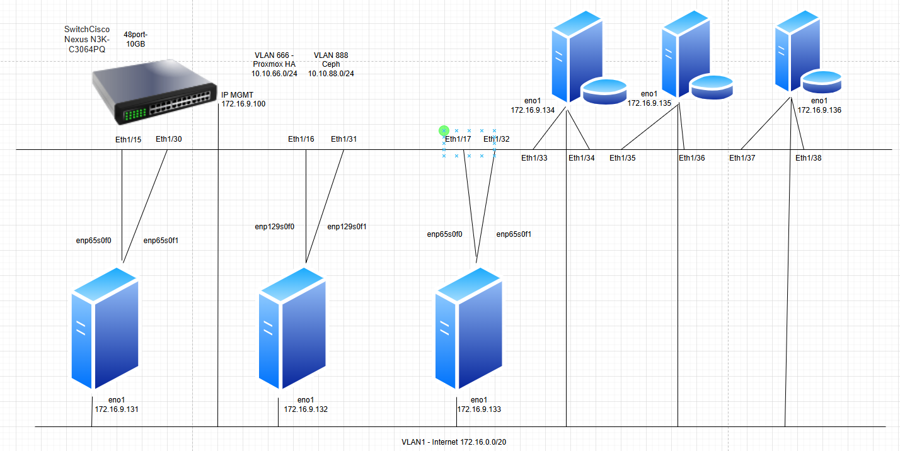

  

    Eth1/15       Port10G-1-131      connected 666       full    10G     SFP-H10GB-CU3M
    Eth1/16       Port10G-1-132      connected 666       full    10G     SFP-H10GB-CU3M
    Eth1/17       Port10G-1-133      connected 666       full    10G     SFP-H10GB-CU3M

    Eth1/30       -> Port10G-2-131   connected 888       full    10G     SFP-H10GB-CU2M
    Eth1/31       -> Port10G-2-132   connected 888       full    10G     SFP-H10GB-CU3M
    Eth1/32       -> Port10G-2-133   connected 888       full    10G     SFP-H10GB-CU3M
    Eth1/33       Port10G-1-Cephnode connected 888       full    10G     SFP-H10GB-CU3M
    Eth1/34       Port10G-2-Cephnode connected 888       full    10G     SFP-H10GB-CU3M
    Eth1/35       Port10G-1-Cephnode connected 888       full    10G     SFP-H10GB-CU3M
    Eth1/36       Port10G-2-Cephnode connected 888       full    10G     SFP-H10GB-CU3M
    Eth1/37       Port10G-1-Cephnode connected 888       full    10G     SFP-H10GB-CU3M
    Eth1/38       Port10G-2-Cephnode connected 888       full    10G     SFP-H10GB-CU3M

```Bash
switch-local(config)#vlan 666 //name VLANPROXMOXHA

switch-local(config)#vlan 888 //name VLANCEPH

switch-local(config)# feature lacp //Enable lacp

switch-local(config-if)# interface port-channel 134
switch-local(config-if)# no shutdown
switch-local(config-if)# exit

switch-local(config)# interface Eth1/33
switch-local(config-if)# channel-group 134 mode active
switch-local(config)# interface Eth1/34
switch-local(config-if)# channel-group 134 mode active

switch-local(config)# interface port-channel 135
switch-local(config-if)# no shutdown
switch-local(config-if)# exit

switch-local(config)# interface Eth1/35
switch-local(config-if)# channel-group 135 mode active
switch-local(config-if)# exit
switch-local(config)# interface Eth1/36
switch-local(config-if)# channel-group 135 mode active


switch-local(config)# interface port-channel 136
switch-local(config-if)# no shutdown
switch-local(config-if)# exit

switch-local(config)# interface Eth1/37
switch-local(config-if)# channel-group 136 mode active
switch-local(config-if)# exit
switch-local(config)# interface Eth1/38
switch-local(config-if)# channel-group 136 mode active

switch-local(config)# interface port-channel 134
switch-local(config-if)# sw mode access
switch-local(config-if)# sw access vlan 888
switch-local(config-if)# exit

switch-local(config)# interface port-channel 135
switch-local(config-if)# sw access vlan 888
switch-local(config-if)# sw mode access


switch-local(config-if)# interface port-channel 136
switch-local(config-if)# sw access vlan 888
switch-local(config-if)# sw mode access
switch-local(config-if)# end

switch-local# copy running-config startup-config

switch-local# show port-channel summary

switch-local# show interface port-channel 134

```
  
  
  
  


