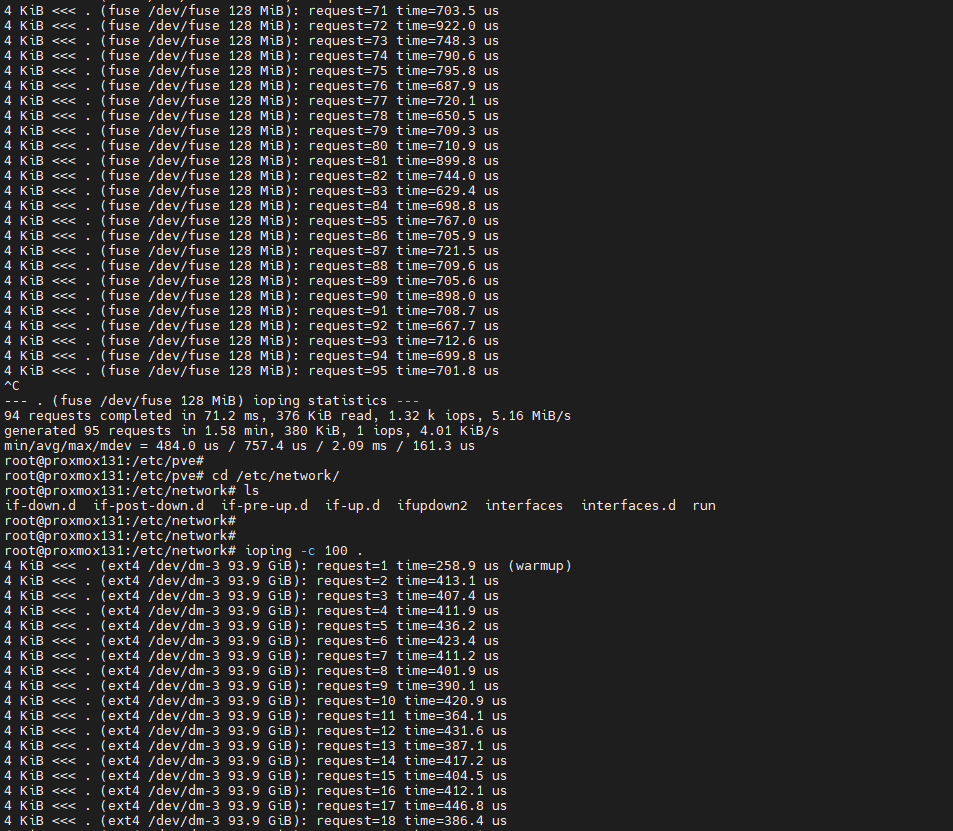

Đã cài đặt MTU 9000 cho các đường proxmox và ceph 10G 

MTU 9000 sử dụng cho mạng Ceph thấy ảnh hưởng rõ rệt

Latency giảm đáng kể , đây là hình ảnh trước và sau khi thay MTU 1500 sang 9000 với mạng cụm Proxmox và Ceph

  

