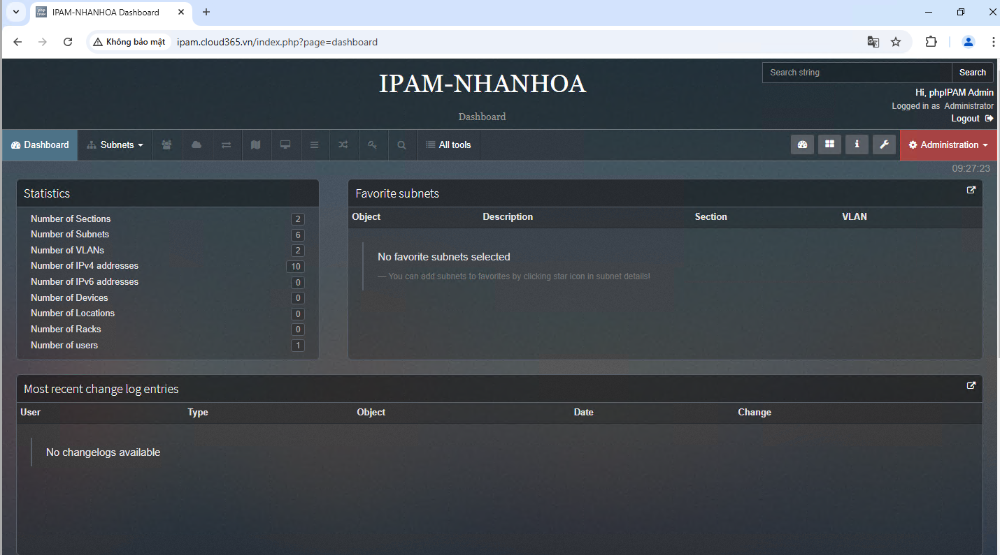
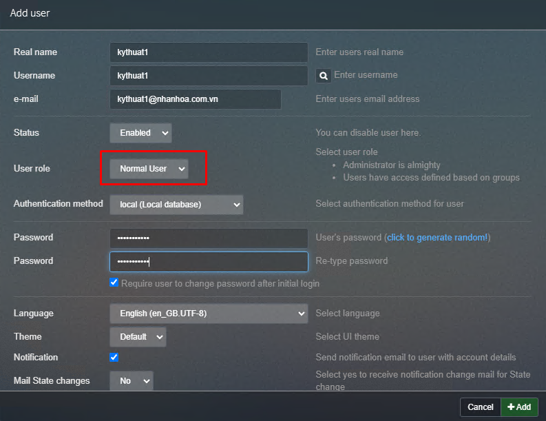
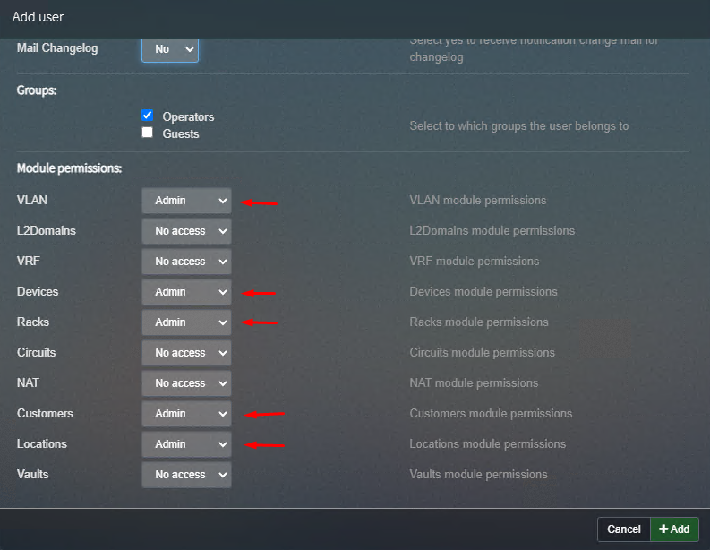
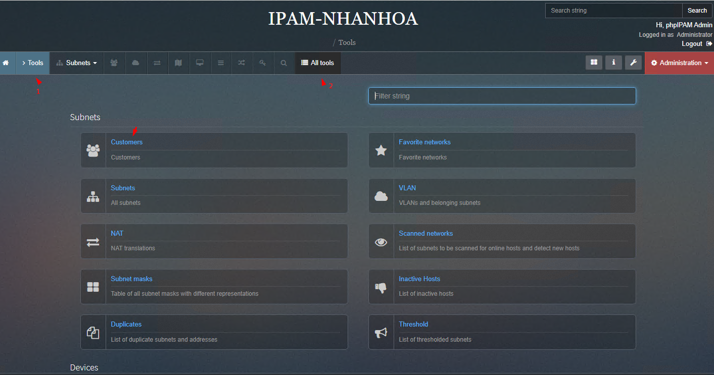
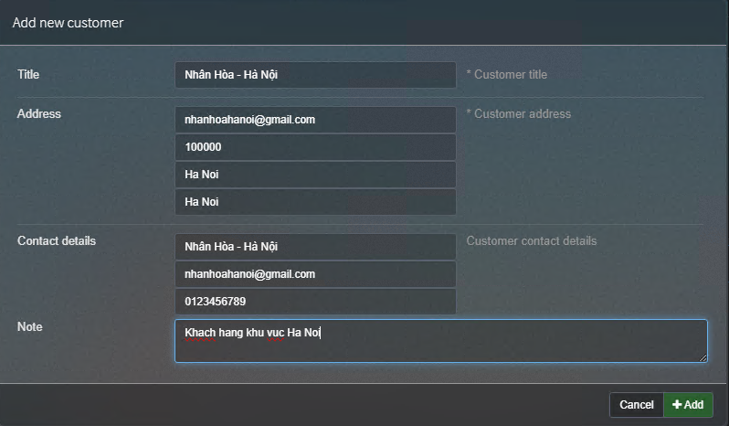
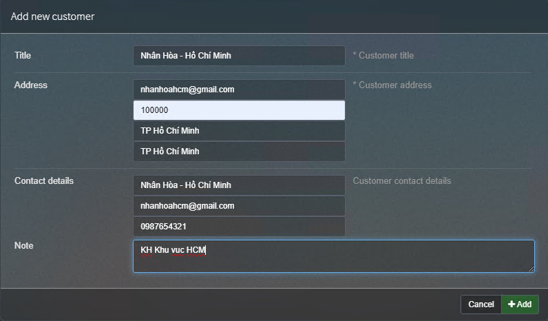

## Tạo tài khoản người dùng quản lý

Ở góc phải màn hình phía bên trên:

    Administration > User

  

Mình tạo 1 tài khoản kythuat1 là User roles Normal thuộc group Operator

  

Chọn các tùy chọn mà bạn muốn người dùng quản lý, ở đây có các vai trò Read , Write(chỉnh sửa hạn chế) và Admin(full quyền)

  

Bạn cũng có thể tạo tài khoản người dùng Read only, tùy nhu cầu.

## Customer 

Là tính năng để phân biệt khách hàng để dễ quản lý

Ví dụ: Nhân Hòa - Hà Nội , Nhân Hòa - Hồ Chí Minh

Ở đây mình tạo thử Nhân Hòa - Hà Nội , HCM

    Tool > All tools > Customer > Add Customer

  

Điền một số thông tin

  

  

## Location - RACK - Device - Circuits

Là các thuật ngữ quen thuộc chỉ : địa chỉ, vị trí nơi đặt các thiết bị ( FPT , CMC , VIETTEL ) , tủ RACK , Thiết bị , Sơ đồ mạng...

#### Location 17 Duy Tân

    Administration > Device management > Location

  

Add -> IPAM sẽ tự lấy tọa độ bản đồ.

