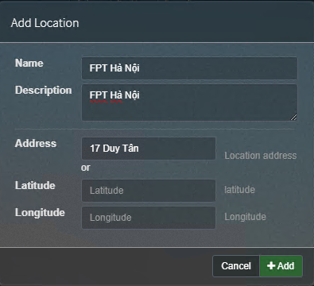
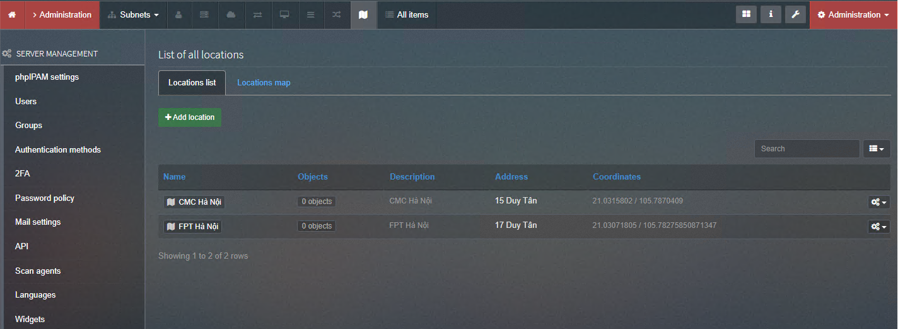
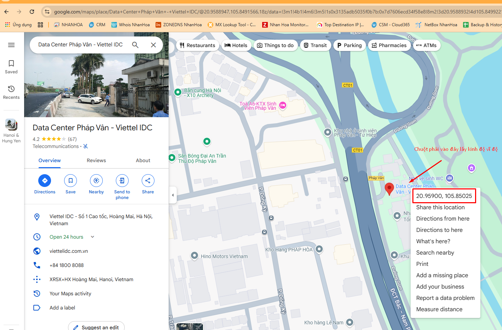
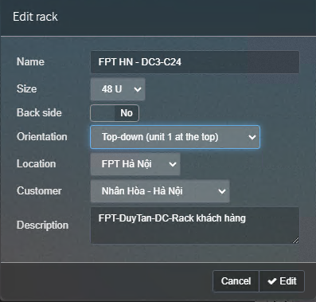
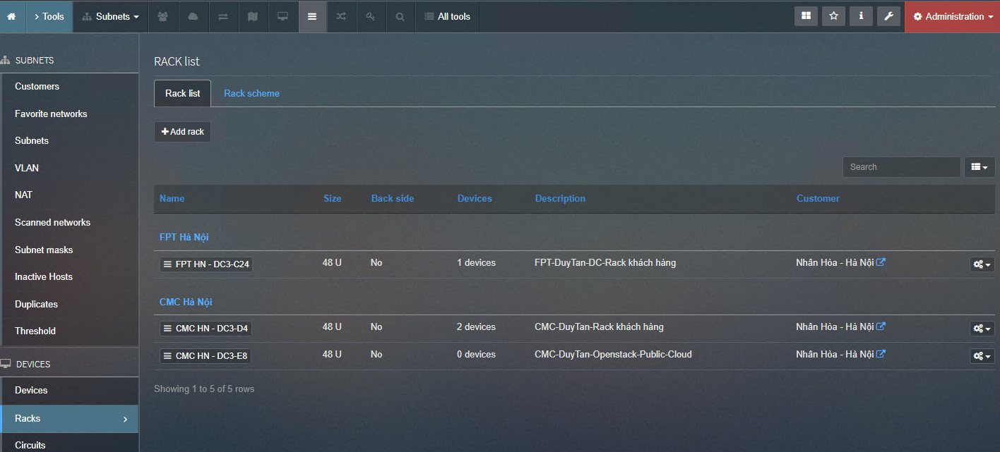
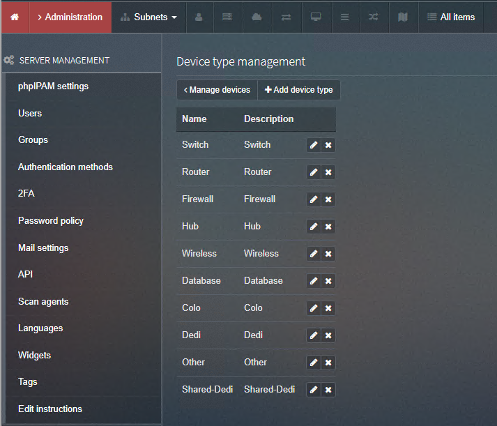
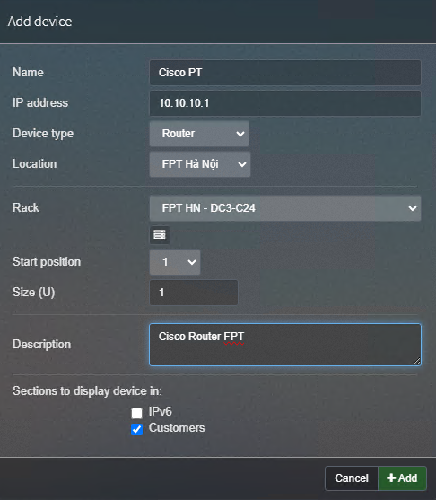
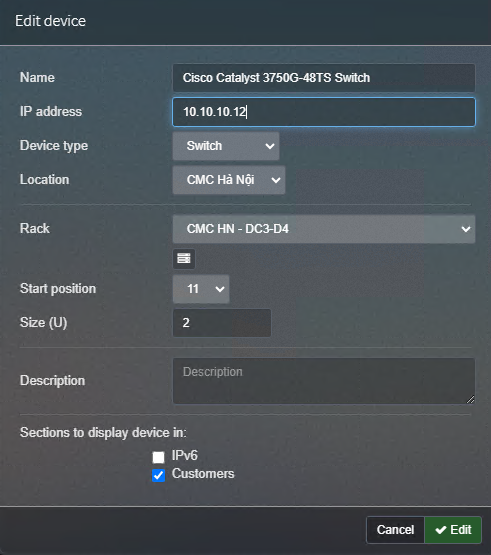
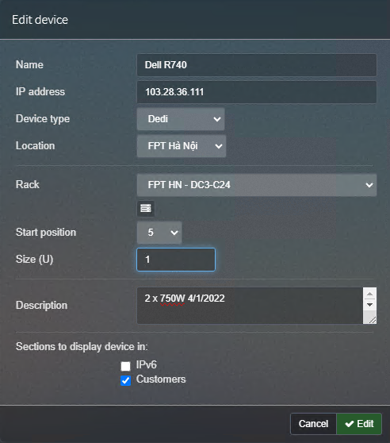
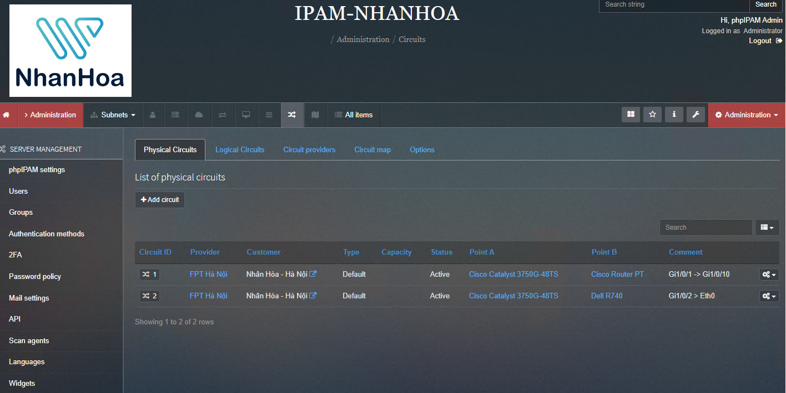

## Location - RACK - Device - Circuits

Là các thuật ngữ quen thuộc chỉ : địa chỉ, vị trí nơi đặt các thiết bị ( FPT , CMC , VIETTEL ) , tủ RACK , Thiết bị , Sơ đồ mạng...

#### Location 17 Duy Tân

    Administration > Device management > Location

  

Add -> IPAM sẽ tự lấy tọa độ bản đồ.

  

Cách lấy tọa độ bằng kinh độ vĩ độ google map

  

#### Rack

Add theo mẫu sau:

    Administration > Device management > Rack

  

  

#### Device

Device type management - định nghĩa loại thiết bị

  

Thêm Router

  

Thêm switch

  

Thêm server

  

#### Xem Rack

  

#### Circuits

Phần này mình chưa rõ lắm, nên làm tạm như sau:

  
