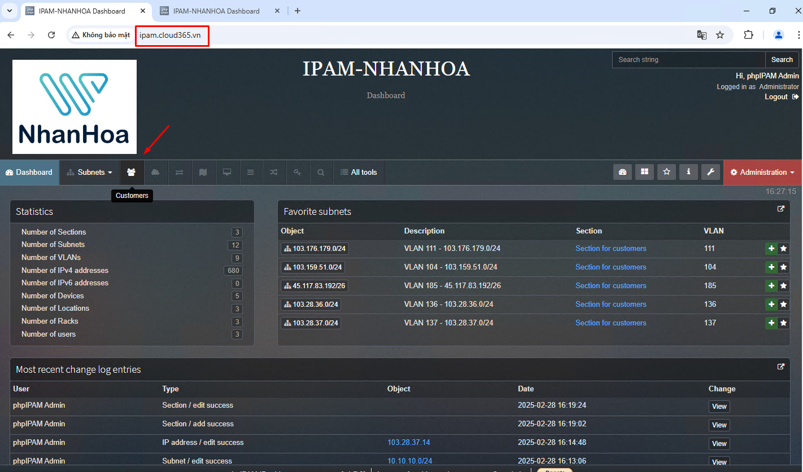
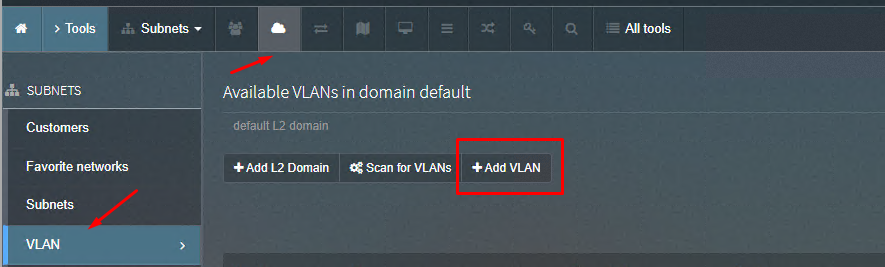
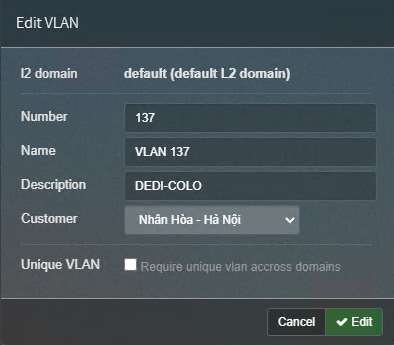
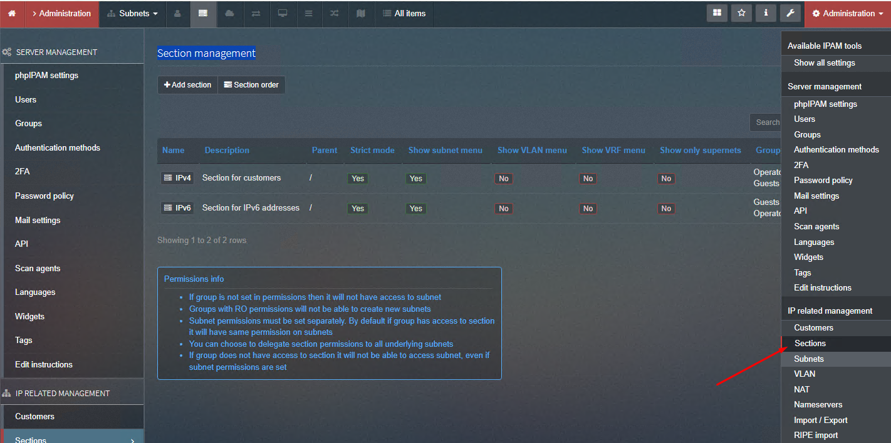

## Khai báo VLAN
Sau khi vào trang chủ, chúng ta vào mục Customer để khai báo 1 VLAN trước

  

Chọn Add VLAN và có thể điền thông tin theo mẫu:

  

  

## Gán dải mạng vào VLAN

  

Ở đây mình nhận thấy có danh mục Section Customers, mình rename sang IPv4

  
