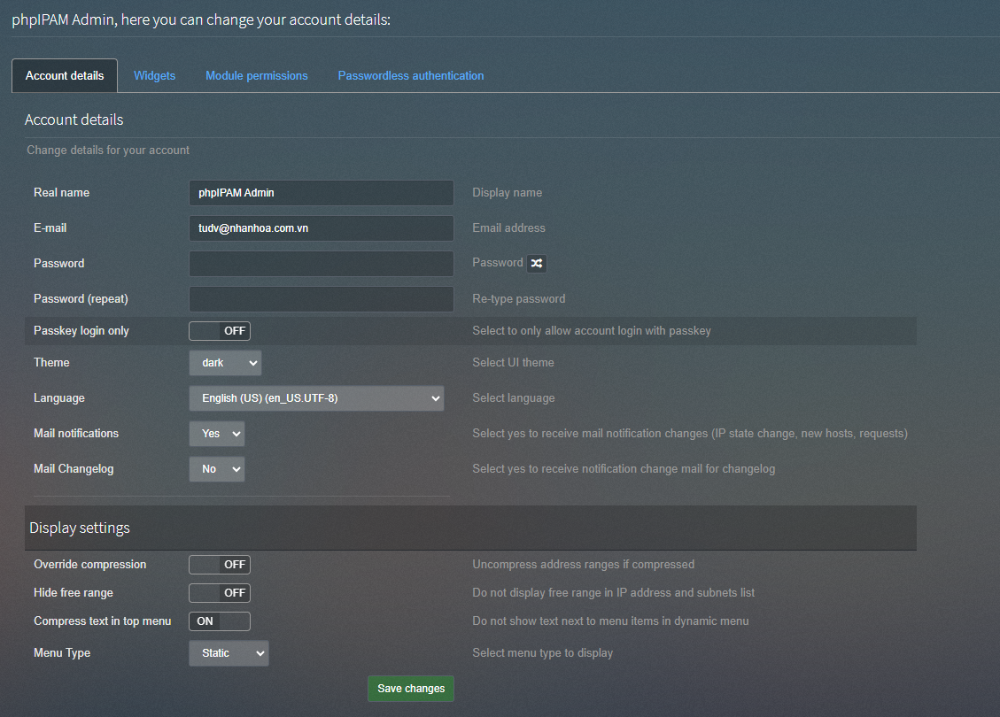
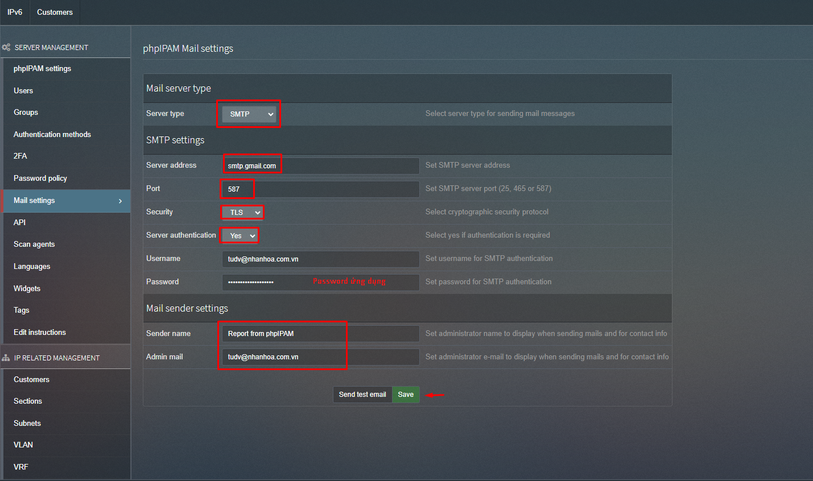

#### 1 - Click vào Hi, phpIPAM Admin trên góc phải màn hình

Sau đó chúng ta sẽ điền các thông tin email của admin.

Có 1 số tùy chọn:

    Real name : 
    Email- : email 
    Mail notifications : Nhận thông tin thay đổi IP state change, new hosts, requests
    Mail Changelog : Nhận thông báo khi có changelog

  

#### 2 - Tiếp theo chúng ta chỉnh sửa Email setting

Tại mục administration chúng ta chọn email setting ,các tùy chọn cơ bản:

    Mail server type : Chọn SMTP

    SMTP settings: Cấu hình máy chủ và tài khoản SMTP

    Mail sender settings : Report to admin email

  