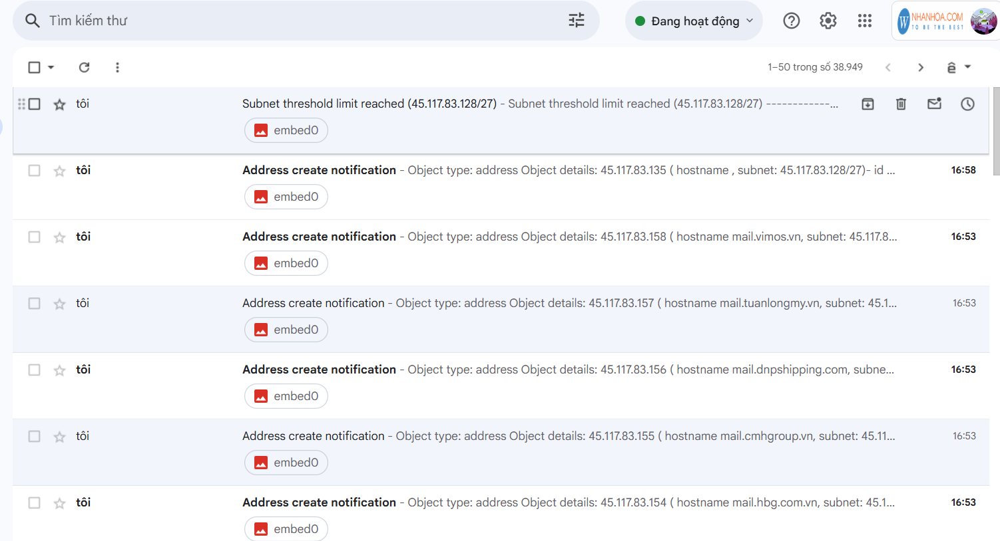
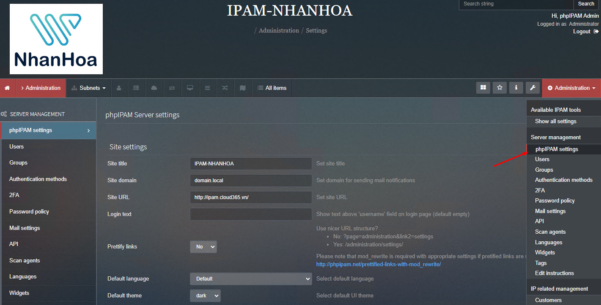
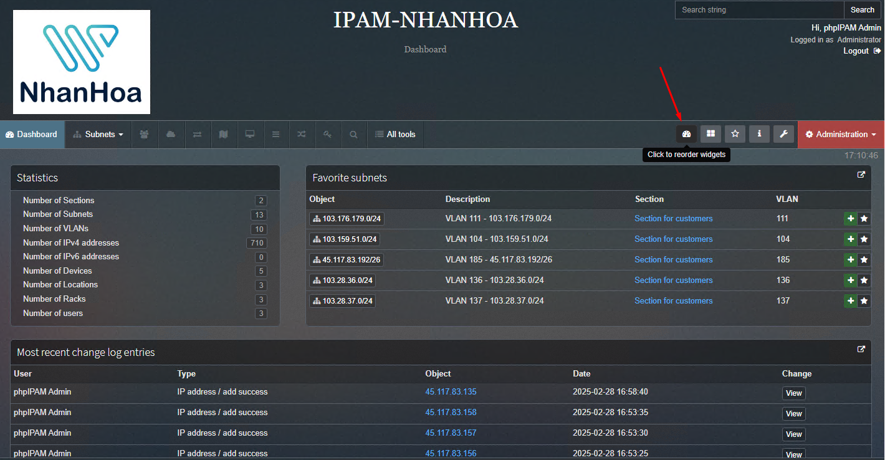

## Logo
Tại Administation góc phải bên trên chúng ta chọn phpIPAM setting

Tại Display settings chúng ta upload logo

  

## Widgets

Giao diện chính là nơi chúng ta nhìn nhiều nhất ( Trang chủ )

Nên chúng ta sẽ xử lý chọn lựa hiển thị những gì hay làm việc nhất

Ở đây có mục thống kê Statistics IP, Subnet >> Giữ nguyên

Mục Favorite subnets >> Chọn VLAN bạn hay làm việc nhất, chỉ cần tick vào mục sau cho ngôi sao sáng:

  

Có thể click vào mục sau để custom:

  
