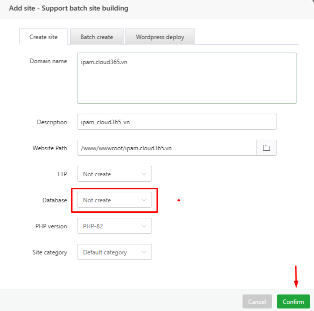
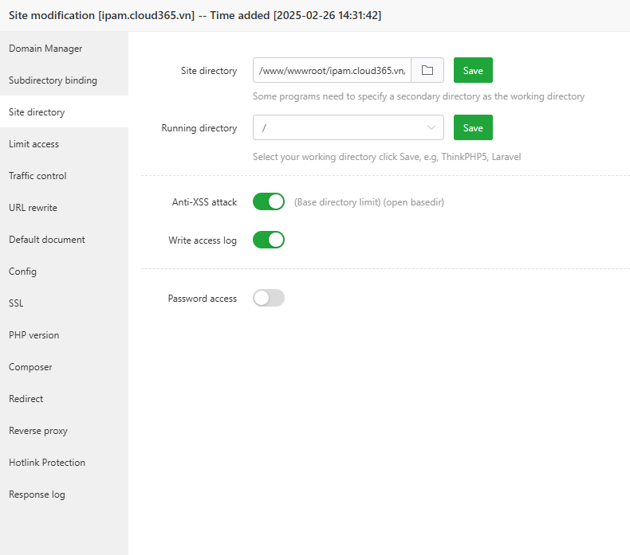

## Lời nói đầu về phpIPAM

  phpIPAM sử dụng code php và chạy trên LAMP stack hoặc LEMP stack, đây là stack quen thuộc đối với bản thân tôi.
  
  Mục tiêu của hướng dẫn này là giúp bạn cài đặt và Cấu hình phpIPAM trên Ubuntu 22.04 Linux distribution.
  
  phpIPAM là một ứng dụng quản lý địa chỉ IP web (IPAM) mã nguồn mở dựa trên php.
  
  phpIPAM cung cấp khả năng quản lý địa chỉ IP nhẹ, hiện đại và hữu ích. phpIPAM sử dụng cơ sở dữ liệu MySQL và thư viện jQuery, Ajax và các tính năng HTML5/CSS3.
  
  phpIPAM có các tính năng sau:

  + Quản lý địa chỉ IP IPv4/IPv6
  + Quản lý phân vùng / mạng con
  + Hiển thị không gian trống tự động cho các mạng con
  + Hiển thị mạng con trực quan
  + Quét mạng con tự động / Kiểm tra trạng thái IP
  + Tích hợp PowerDNS
  + Hỗ trợ NAT
  + Quản lý VLAN
  + Quản lý VRF
  + Máy tính IPv4 / IPv6
  + Tìm kiếm cơ sở dữ liệu IP
  + Thông báo qua email
  + Hỗ trợ trường tùy chỉnh
  + Bản dịch
  + Nhật ký thay đổi
  + Quản lý RACK
  + Xác thực tên miền (AD, LDAP, Radius)
  + Quyền cho từng nhóm/mạng con
  + Quản lý thiết bị/loại thiết bị
  + Nhập mạng con RIPE
  + Nhập mạng con XLS / CVS
  + Mô-đun yêu cầu IP
  + Giao diện lập trình ứng dụng REST
  + Mô-đun vị trí

## Cài đặt phpIPAM trên Ubuntu 22.04

  phpIPAM có một số phụ thuộc mà chúng ta cần cài đặt trước khi có thể cài đặt và cấu hình phpIPAM:
  + Máy chủ MySQL / MariaDB
  + php / php-fpm cho nginx
  + Module php
  + Máy chủ web Apache / nginx
  + Tên miền phpIPAM –  phpipam.ipam.cloud365.vn (nên thay thế bằng tên miền của bạn)

## Sử dụng aaPanel-LAMP để cài đặt 

#### Thêm tên miền website vào aaPanel

  

  Mở terminal hoặc ssh vào máy chủ

    cd /www/wwwroot/ipam.cloud365.vn

    mkdir phpipam

    cd phpipam

    git clone --recursive https://github.com/phpipam/phpipam.git .

    cd /www/wwwroot/

    chown www:www /www/wwwroot/ -R 

  Đến đây mình cũng sửa lại docroot của website qua giao diện của aaPanel

  

  Docroot của web sẽ là /www/wwwroot/ipam.cloud365.vn/phpipam

#### Cấu hình phpIPAM kết nối với cơ sở dữ liệu trước:

    cd /www/wwwroot/ipam.cloud365.vn/phpipam

    cp config.dist.php config.php

    nano config.php
  
/**
 * database connection details
 ******************************/
$db['host'] = '127.0.0.1';
$db['user'] = 'phpipam';
$db['pass'] = 'At4LRMG1lAyz0Lf';
$db['name'] = 'phpipam';
$db['port'] = 3306;