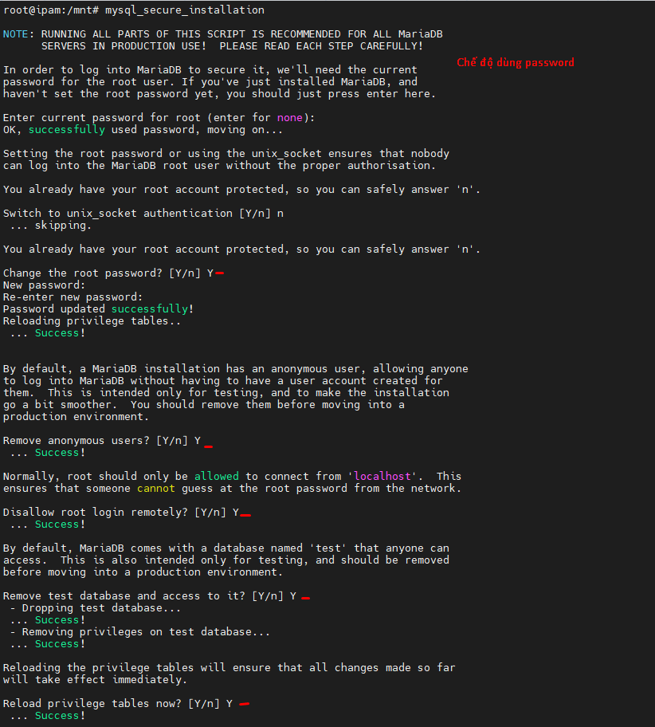
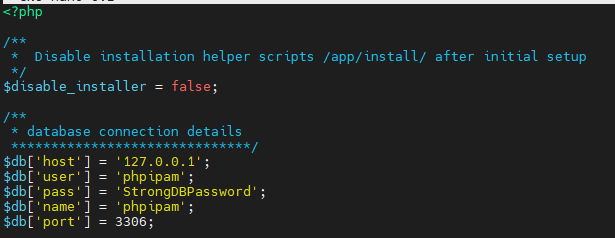
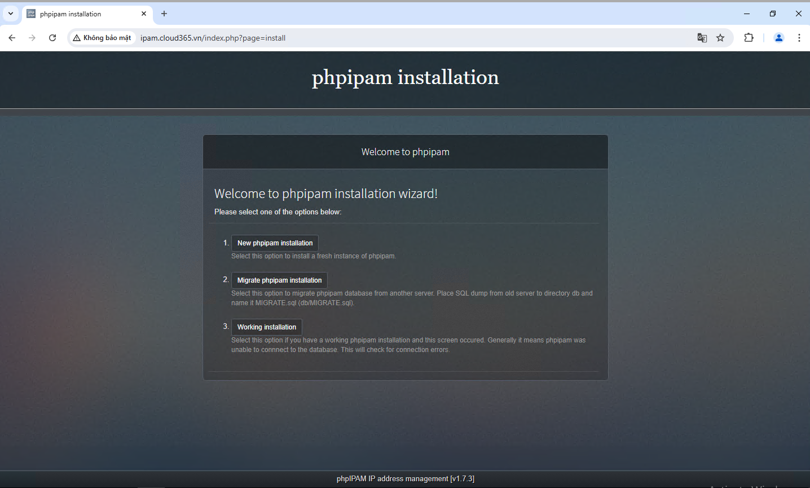
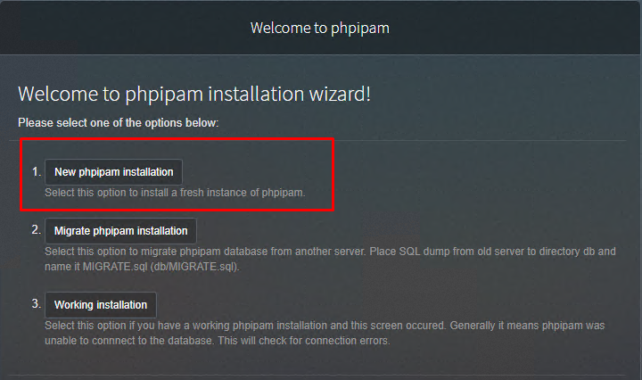
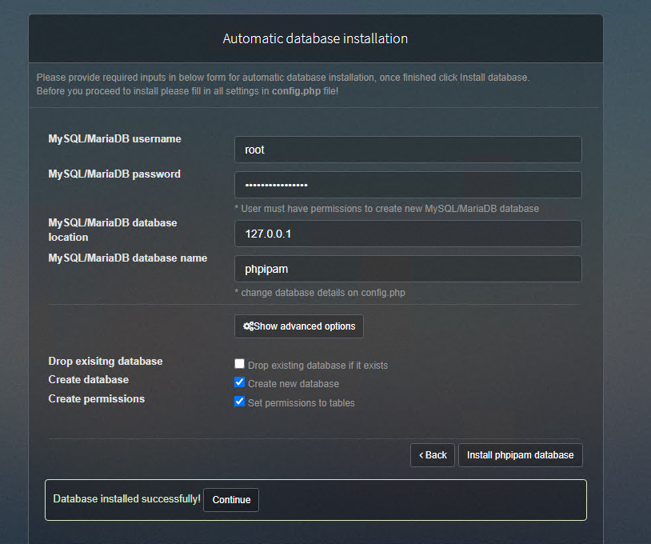
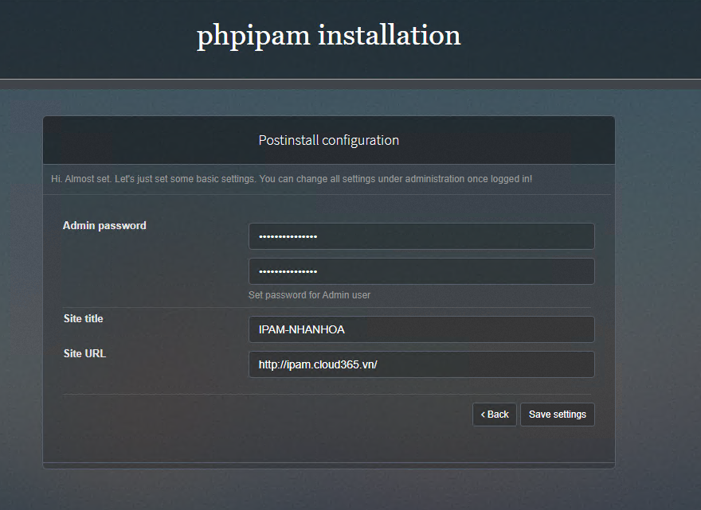

## Lời nói đầu về phpIPAM

  phpIPAM sử dụng code php và chạy trên LAMP stack hoặc LEMP stack, đây là stack quen thuộc đối với bản thân tôi.
  
  Mục tiêu của hướng dẫn này là giúp bạn cài đặt và Cấu hình phpIPAM trên Ubuntu 22.04 Linux distribution.
  
  phpIPAM là một ứng dụng quản lý địa chỉ IP web (IPAM) mã nguồn mở dựa trên php.
  
  phpIPAM cung cấp khả năng quản lý địa chỉ IP nhẹ, hiện đại và hữu ích. phpIPAM sử dụng cơ sở dữ liệu MySQL và thư viện jQuery, Ajax và các tính năng HTML5/CSS3.
  
  phpIPAM có các tính năng sau:

  + Quản lý địa chỉ IP IPv4/IPv6
  + Quản lý phân vùng / mạng con
  + Hiển thị không gian trống tự động cho các mạng con
  + Hiển thị mạng con trực quan
  + Quét mạng con tự động / Kiểm tra trạng thái IP
  + Tích hợp PowerDNS
  + Hỗ trợ NAT
  + Quản lý VLAN
  + Quản lý VRF
  + Máy tính IPv4 / IPv6
  + Tìm kiếm cơ sở dữ liệu IP
  + Thông báo qua email
  + Hỗ trợ trường tùy chỉnh
  + Bản dịch
  + Nhật ký thay đổi
  + Quản lý RACK
  + Xác thực tên miền (AD, LDAP, Radius)
  + Quyền cho từng nhóm/mạng con
  + Quản lý thiết bị/loại thiết bị
  + Nhập mạng con RIPE
  + Nhập mạng con XLS / CVS
  + Mô-đun yêu cầu IP
  + Giao diện lập trình ứng dụng REST
  + Mô-đun vị trí

## Cài đặt phpIPAM trên Ubuntu 22.04

  phpIPAM có một số phụ thuộc mà chúng ta cần cài đặt trước khi có thể cài đặt và cấu hình phpIPAM:
  + Máy chủ MySQL / MariaDB
  + php / php-fpm cho nginx
  + Module php
  + Máy chủ web Apache / nginx
  + Tên miền phpIPAM –  phpipam.dinhtu.xyz (nên thay thế bằng tên miền của bạn)

## Bước 1- Cài đặt MariaDB Server

  Bắt đầu bằng việc cài đặt máy chủ cơ sở dữ liệu MariaDB:

    apt update && apt upgrade -y
    reboot
    apt install mariadb-server mariadb-client -y

  Đảm bảo dịch vụ mariadb được khởi động và thiết lập để khởi động khi khởi động:
    
    systemctl enable mariadb
    systemctl start mariadb

  Bảo mật máy chủ cơ sở dữ liệu bằng cách thiết lập mật khẩu gốc(ở đây mình phải dùng mật khẩu rồi):
  
    mysql_secure_installation

  Switch to unix_socket authentication [Y/n] Y

  
  
## Bước 2: Cài đặt PHP và các module cần thiết
   
  Cài đặt:

    apt -y install php php-{mysql,curl,gd,intl,pear,imap,memcache,pspell,tidy,xmlrpc,mbstring,gmp,json,xml,fpm}

  Mặc định repos OS của mình cài đặt php81 hoặc bạn có thể chủ động cài đặt theo php mong muốn

  service php8.1-fpm start
  systemctl enable php8.1-fpm

## Bước 3: Cài đặt phpIPAM trên Ubuntu

Đảm bảo git đã được cài đặt

    apt -y install git

Sao chép mã phpIPAM từ github

    git clone --recursive https://github.com/phpipam/phpipam.git /var/www/html/phpipam

Chuyển sang thư mục sao chép.

    cd /var/www/html/phpipam

Bạn cũng có thể tải phpipam từ  kho lưu trữ Sourceforge chính thức  và giải nén vào thư mục máy chủ web của bạn.

    wget https://tenet.dl.sourceforge.net/project/phpipam/phpipam-<VERSION>.tar
    tar xvf phpipam-<VERSION>.tar
    mv phpipam /var/www/html

## Bước 4: Cấu hình phpIPAM trên Ubuntu

Thay đổi thư mục làm việc của bạn thành /var/www/html/phpipam và sao chép config.dist.php vào config.php, sau đó chỉnh sửa.

    cd /var/www/html/phpipam
    cp config.dist.php config.php

Chỉnh sửa tệp để cấu hình thông tin xác thực cơ sở dữ liệu như đã thêm vào  Bước 1:

    nano config.php

Nội dung tùy bạn sửa đổi

    * database connection details
    ******************************/
    $db['host'] = 'localhost';
    $db['user'] = 'phpipam';
    $db['pass'] = 'StrongDBPassword';
    $db['name'] = 'phpipam';
    $db['port'] = 3306;

  

#### Tùy chọn 1 : Sử dụng máy chủ web Apache

Nếu bạn muốn sử dụng máy chủ web Apache, trước tiên hãy cài đặt nó bằng cách sử dụng:

    systemctl stop nginx && sudo systemctl disable nginx
    apt -y install apache2
    a2dissite 000-default.conf
    a2enmod rewrite
    systemctl restart apache2

Cài đặt module apache php:

    apt -y install libapache2-mod-php php-curl php-xmlrpc php-intl php-gd

Thêm cấu hình Apache phpipam:

    nano /etc/apache2/sites-available/phpipam.conf

Sau đây là nội dung:

   <VirtualHost *:80>
    ServerAdmin admin@ipam.cloud365.vn
    DocumentRoot "/var/www/html/phpipam"
    ServerName ipam.cloud365.vn
    ServerAlias www.ipam.cloud365.vn
    <Directory "/var/www/html/phpipam">
        Options Indexes FollowSymLinks
        AllowOverride All
        Require all granted
    </Directory>
    ErrorLog "/var/log/apache2/phpipam-error_log"
    CustomLog "/var/log/apache2/phpipam-access_log" combined
    </VirtualHost>

Thiết lập quyền thư mục:

    chown -R www-data:www-data /var/www/html

Kích hoạt trang web:

    a2ensite phpipam

Khởi động lại máy chủ Apache để thực hiện thay đổi.

    systemctl restart apache2

#### Tùy chọn 2: Sử dụng máy chủ web Nginx (Bỏ qua nếu bạn đã chọn & cấu hình apache trong tùy chọn 1)

Cài đặt nginx bằng lệnh:

    systemctl stop apache2 && systemctl disable apache2
    apt -y install nginx

Cấu hình nginx:

    nano /etc/nginx/conf.d/phpipam.conf

Thêm nội dung:

    server {
        listen       80;
        # root directory
        server_name ipam.cloud365.vn  www.ipam.cloud365.vn;
        index        index.php;
        root   /var/www/html/phpipam;

        location / {
                try_files $uri $uri/ /index.php$is_args$args;
            }

        location ~ \.php$ {
                try_files $uri =404;
                fastcgi_split_path_info ^(.+\.php)(/.+)$;
                fastcgi_pass   unix:/run/php/php8.1-fpm.sock;
                fastcgi_param SCRIPT_FILENAME $document_root$fastcgi_script_name;
                fastcgi_index index.php;
                include fastcgi_params;
            }

            }

Thay đổi quyền sở hữu thư mục /var/www/ thành người dùng và nhóm www-data.

    chown -R www-data:www-data /var/www/html
    systemctl restart nginx
    systemctl enable nginx

Tạo các tác vụ cron chạy ping tự động khám phá và kiểm tra ping

    $ crontab -e
    */15 * * * * /usr/bin/php /var/www/html/phpipam/functions/scripts/pingCheck.php
    */15 * * * * /usr/bin/php /var/www/html/phpipam/functions/scripts/discoveryCheck.php

## Bước 5: Hoàn tất cài đặt phpIPAM trên Ubuntu

Bắt đầu quá trình cài đặt bằng cách truy cập  http://ipam.cloud365.vn , thay thế  ipam.cloud365.vn  bằng tên miền hợp lệ của bạn. URL cũng có thể là  http://cloud365.vn/phpipam ; hoặc Địa chỉ IP thay vì tên DNS tùy thuộc vào cấu hình của bạn

  

Chọn cài đặt mới:  

  

Tùy chọn:

  

Đặt Admin password:

  

Như vậy chúng ta đã cài đặt xong phpIPAM

  