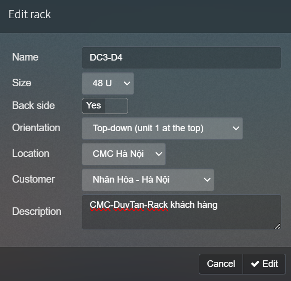
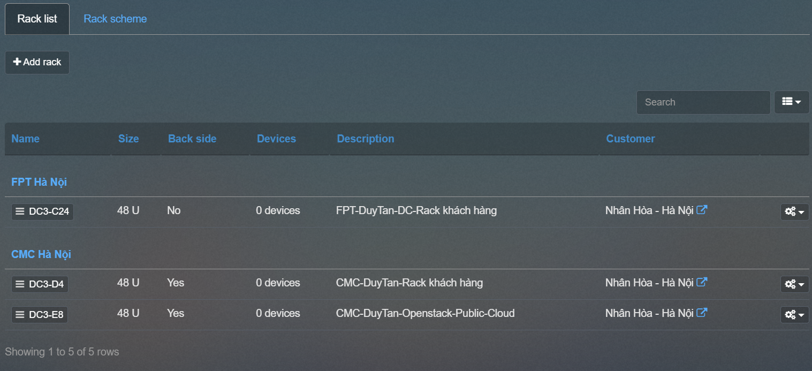

## Location - RACK - Device - Circuits

Là các thuật ngữ quen thuộc chỉ : địa chỉ, vị trí nơi đặt các thiết bị ( FPT , CMC , VIETTEL ) , tủ RACK , Thiết bị , Sơ đồ mạng...

#### Location 17 Duy Tân

    Administration > Device management > Location

  

Add -> IPAM sẽ tự lấy tọa độ bản đồ.

  

#### Rack

Add theo mẫu sau:

    Administration > Device management > Rack

  

  