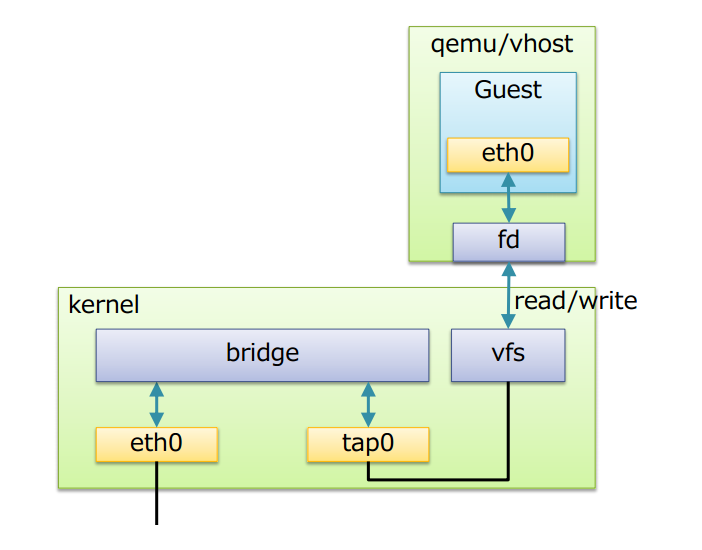

# Linux Bridge

### Khái niệm - ứng dụng

Linux bridge là 1 phần mềm được tích hợp sẵn vào trong nhân Linux để giải quyết vấn đề ảo hóa phần network trong các máy vật lý. Về mặt logic Linux bridge sẽ tạo ra 1 con switch ảo để cho các VM kết nối được vào và có thể nói chuyện được với nhau cũng như sử dụng để ra mạng ngoài

Ngoài ra khi tìm hiểu Linux bridge còn có 1 số thuật ngữ như:
- Port: tương tự như cổng của 1 con switch thật
- Bridge: ở đây là switch ảo 
- Tap: hay còn gọi là tap interface, là giao diện mạng để các VM kết nối với switch do Linux bridge tạo ra (nó hoạt động ở lớp 2 của mô hình OSI)
- fd: Forward data có nhiệm vụ chuyển dữ liệu từ VM tới switch

### Kiến trúc



### Chức năng của 1 switch ảo do Linux bridge tạo ra

- STP: là giao thức chống loop gói tin trong switch
- VLAN: tạo VLAN, là tính năng rất quan trọng trong 1 switch
- FDB: là tính năng chuyển gói tin theo database được xây dựng giúp tăng tốc độ switch

### Công cụ và lệnh làm việc với Linux bridge

- Linux bridge được hỗ trợ từ version nhân kernel 2.4 trở lên. Để sử dụng và quản lý các tính năng của Linux bridge, cần cài đặt gói bridge-utilities

```sh
# Ubuntu
apt-get install bridge-ultils -y
# CentOS
yum install bridge-ultils -y
```

### Hạn chế

- Linux Bridge là cơ chế ảo hóa mặc định trong KVM. Nó rất dễ cấu hình và quản lý, tuy nhiên lại không thường được dùng cho mục đích ảo hóa vì bị hạn chế 1 số các tính năng
- Linux Bridge không hỗ trợ Tunneling và OpenFlow protocols. Điều này khiến nó bị hạn chế trong việc mở rộng các chức năng. Đó cũng là lý do vì sao Open vSwitch xuất hiện

### Bridge management commandline

|Hành động|BRCTL|BRIDGE|
|:-|:-|:-|
|Tạo 1 bridge|```brctl addbr <bridge>```||
|Xóa đi 1 bridge|```brctl delbr <bridge>```||
|Thêm 1 interface (port) vào bridge|```brctl addif <bridge> <ifname>```||
|Xóa đi một interface (port) trên bridge|```brctl delbr <bridge>```||

### FDB management commandline

|Hành động|BRCTL|BRIDGE|
|:-|:-|:-|
|Hiển thị danh sách địa MAC trong FDB|```brctl showmacs <bridge>```|```bridge fdb show```|
|Thiết lập thời gian ageing của fdb|```brctl setageingtime <bridge> <time>```||
|Sets FDB garbage collector interval|```brctl setgcint <brname> <time>```||
|Thêm FDB entry||```bridge fdb add dev <interface> [dst, vni, port, via]```|
|Gắn FDB entry||```bridge fdb append (tham số giống với thêm entry)```|
|Xóa FDB entry||```bridge fdb delete (tham số giống thêm entry)```|

### STP management commandline

|Hành động|BRCTL|BRIDGE|
|:-|:-|:-|
|Bật/tắt STP|```brctl stp <bridge> <state>```||
|Cài đặt độ ưu tiên bridge|```brctl setbridgeprio <bridge> <priority>```||
|Cài đặt thời gian trễ forward|```brctl setfd <bridge> <time>```||
|Cài đặt thời gian bridge 'hello'|```brctl sethello <bridge> <time>```||
|Cài đặt tuổi tối đa của tin nhắn bridge|```brctl setmaxage <bridge> <time>```||
|Cài đặt giá trị cost của cổng trên bridge|```brctl setpathcost <bridge> <port> <cost>```|```bridge link set dev <port> cost <cost>```|
|Cài đặt độ ưu tiên cổng của bridge|```brctl setportprio <bridge> <port> <priority>```|```bridge link set dev <port> priority <priority>```|
|Thiết lập cho phép cổng thực hiện STP BDPUs||```bridge link set dev <port> guard [on,off]```|
|Thiết lập cho phép bridge phản hồi lại cổng mà nó nhận được gói tin||```bridge link set dev <port> hairpin [on,off]```|
|Bật/tắt tùy chọn fastleave trên cổng||```bridge lin set dev <port> fastleave [on,off]```|
|Setting FTP port state||```bridge link set dev <port> state <state>```|

### VLAN management commandline

|Hành động|BRCTL|BRIDGE|
|Creating new VLAN filter entry||```bridge vlan add dev <dev> [vid, pvid, untagged, self, master]```|
|Delete VLAN filter entry||```bridge vlan delete dev <dev>``` (tham số như bên trên)|
|List VLAN configuration||```bridge vlan show```|