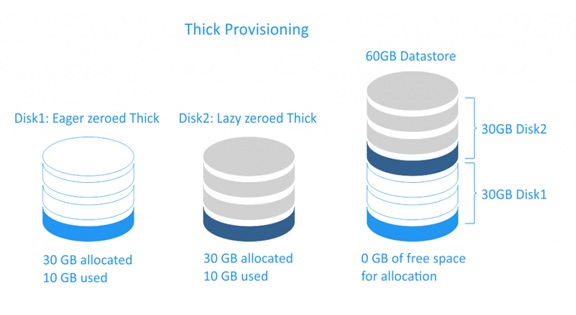

# Phân biệt Thick Provisioning và Thin Provisioning

Khi khởi tạo VM (Virtual Machine) có bước lựa chọn định dạng phân vùng lưu trữ cho VM như: Thin Provisioned, Thick Provisioned Lazy Zeroe, Thick Provisioned Eadger Zeroed. Để VM đạt được hiệu quả tốt nhất, ta phải hiểu và chọn định dạng phân vùng cho phù hợp

Điểm khác nhau rõ ràng nhất là sự chiếm dụng tài nguyên của lưu trữ của server

Ví dụ: ta tạo VM 100 GB, chọn định dạng Thick thì VM sẽ chiếm đúng 100 GB của server, chọn Thin thì VM sẽ chiếm dụng đúng dung lượng mà nó đang lưu trữ (và tối đa là 100 GB)

Hiệu suất thì Thick Provisioned Eager Zeroed sẽ có hiệu suất tốt nhất, sau đó đến Thick Provisioned Lazy Zeroe và sau cùng là Thin Provisioned

### Thick Provisioning

Với Thick Provisioning, dung lượng lưu trữ đĩa ảo hoàn chỉnh được phân bổ trước nên bộ nhớ vật lý khi đĩa ảo được tạo. Đĩa ảo được cấp Thick Provisioning tiêu thụ tất cả không gian được phân bổ cho nó trong kho dữ liệu ngay từ đầu, do đó không gian để sử dụng bởi các máy ảo khác là không có sẵn

Có 2 kiểu thick-provisioned virtual disks:

- Lazy Zeroed disk: là 1 đĩa ảo dùng tất cả không gian của nó tại thời điểm tạo, nhưng không gian này có thể chứa 1 số dữ liệu cũ trên phương tiện vật lý. Dữ liệu cũ này không bị xóa hoặc ghi đè lên, do đó, cần phải được "zeroed out" trước khi dữ liệu mới có thể được ghi vào các khối. Loại disk này có thể được tạo nhanh hơn nhưng hiệu suất của nó sẽ thấp hơn

- Eager Zeroed disk: khác vs Lazy Zeroed (ghi 0 vào trước khi ghi dữ liệu lên đĩa), Eager Zeroed sẽ ghi 0 lên đĩa ngay tại thời điểm tạo đĩa, tức là toàn bộ dữ liệu có sẵn sẽ bị xóa sạch. Việc tạo đĩa có thể sẽ mất thời gian, nhưng hiệu suất của chúng sẽ nhanh hơn trong lần ghi đầu tiên

Thick Provisioned Eager Zeroed cũng giống như Full Format, định dạng này thực hiện việc ghi giá trị 0 lên tất cả các sector, đồng nghĩa với việc sao chép dữ liệu vào sẽ chỉ việc ghi thêm giá trị 1 lên. Thick Provisioned Lazy Zeroed thì như Quick Format, sao chép dữ liệu đến đâu sẽ ghi đến đó

### Thin Provisioning

Đĩa ảo được tạo ra kiểu thin provisioning chỉ tiêu thụ không gian cần thiết ban đầu và tăng theo thời gian, theo nhu cầu. Ví dụ cấp 100 GB cho máy ảo, máy ảo sử dụng đến đâu sẽ chiếm ổ cứng đến đó

Lưu ý rằng khi xóa dữ liệu của mình khỏi ổ đĩa ảo được cấp thin provisioning, kích thước đĩa sẽ không tự động giảm. Điều này là do hđh chỉ xóa các tham chiếu tới địa chỉ của khối dữ liệu đó, khiến cho hđh hiểu rằng các tệp này "đã xóa" và có thể free để ghi dữ liệu mới vào

### Ưu/nhược điểm

- Thick provisioning: Tốc độ đọc/ghi của VM có phần nhanh hơn, do được cấp phát cố định 1 khoản trên ổ cứng, giúp quản lý dễ dàng

- Thin provisioning: Tốc độ đọc/ghi VM có phần chậm hơn Thick provisioning, quản lý cũng phức tạp hơn. Nhưng có ưu điểm là linh động trong quản lý ổ đĩa, phần dung lượng giải phóng có thể dễ dàng chia sẻ giữa các VM. Đặc biệt nếu phải backup restore sẽ nhanh hơn rất nhiều