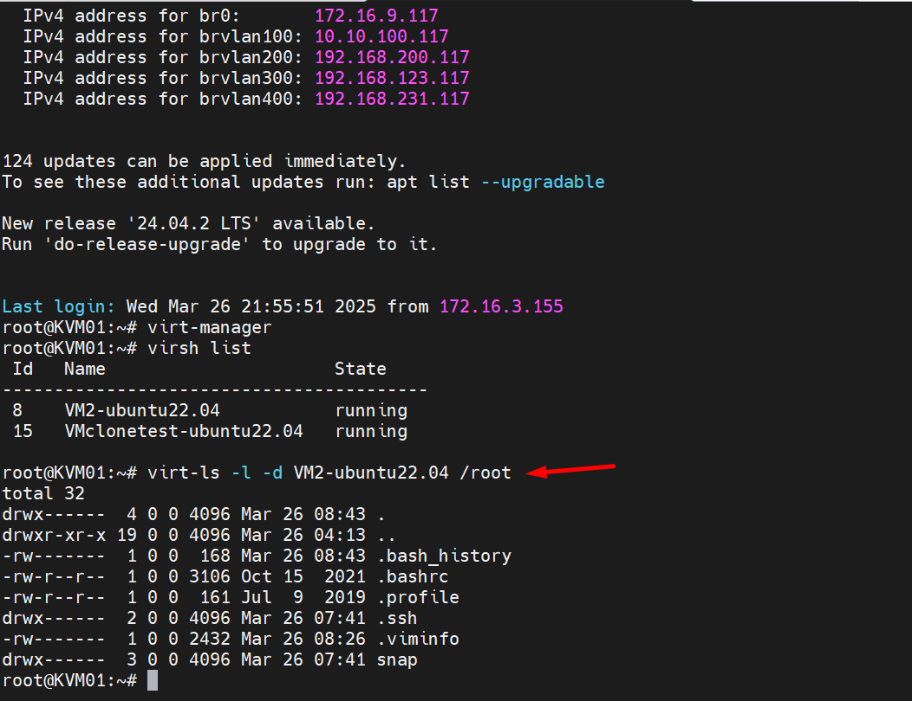
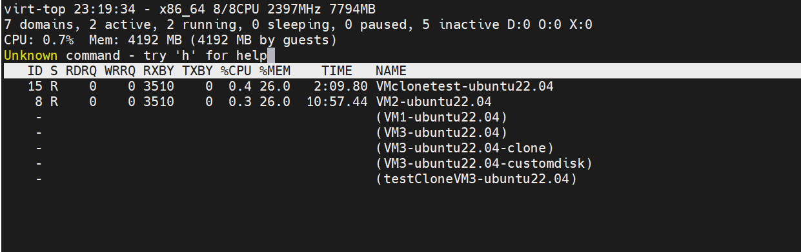

# Tìm hiểu 1 số lệnh cơ bản với virt-tools

virt-tools là một bộ công cụ dòng lệnh mã nguồn mở được sử dụng để quản lý máy ảo (VM) trong môi trường ảo hóa KVM (Kernel-based Virtual Machine). Chúng cung cấp một loạt các chức năng để tạo, chỉnh sửa, giám sát và quản lý máy ảo, giúp người dùng tương tác với libvirt (thư viện ảo hóa) từ dòng lệnh.

Dưới đây là một số công cụ quan trọng trong bộ virt-tools và chức năng của chúng:

  + virt-install: Được sử dụng để tạo máy ảo mới từ dòng lệnh. Nó hỗ trợ nhiều phương pháp cài đặt, bao gồm cài đặt từ ISO, cài đặt mạng và cài đặt từ kho lưu trữ.
  + virt-clone: Được sử dụng để tạo bản sao của máy ảo hiện có. Điều này rất hữu ích để tạo các template máy ảo hoặc nhân bản các máy ảo hiện có.
  + virt-viewer: Được sử dụng để kết nối với giao diện đồ họa của máy ảo. Nó hỗ trợ nhiều giao thức, bao gồm VNC và SPICE.
  + virt-manager: Mặc dù có giao diện đồ họa, virt-manager là một phần của bộ virt-tools và cung cấp một giao diện người dùng đồ họa để quản lý máy ảo.
  + virsh: Đây là một công cụ dòng lệnh mạnh mẽ để quản lý máy ảo. Nó có thể được sử dụng để bắt đầu, dừng, tạm dừng, khôi phục và xóa máy ảo, cũng như để xem thông tin về máy ảo và quản lý mạng ảo.
  + virt-convert: Dùng để chuyển đổi các định dạng ảnh đĩa ảo.
  + virt-df: Hiển thị dung lượng đĩa của máy ảo đang chạy.
  + virt-top: Hiển thị các thống kê sử dụng tài nguyên của máy ảo.

Lợi ích của việc sử dụng virt-tools:

  + Tự động hóa: Các công cụ dòng lệnh có thể được sử dụng để tự động hóa các tác vụ quản lý máy ảo, giúp tiết kiệm thời gian và công sức.
  + Tính linh hoạt: virt-tools cung cấp một loạt các tùy chọn và cấu hình, cho phép người dùng tùy chỉnh máy ảo của họ cho phù hợp với nhu cầu cụ thể.
  + Khả năng mở rộng: virt-tools có thể được sử dụng để quản lý một số lượng lớn máy ảo, khiến chúng phù hợp cho cả môi trường nhỏ và lớn.
  + Quản lý từ xa: Nhiều công cụ của virt-tools có thể quản lý máy ảo từ xa.

- Cài đặt virt-tools

```sh
apt update -y
apt install virt-manager virt-top virt-viewer virtinst bridge-utils cpu-checker libvirt-clients -y
```

- Hiển thị cấu trúc 1 thư mục nào đó trong 1 VM

```sh
virt-ls -l -d <tên_máy_ảo> /root

virt-ls -l -d VM2-ubuntu22.04 /root
```

  

- Xem nội dung file trong VM

```sh
virt-cat -d <tên_máy_ảo> /etc/passwd
virt-cat -d VM2-ubuntu22.04 /etc/passwd
```

- Edit file trong VM ( Khi edit phải tắt máy ảo )

```sh
virt-edit -d <tên_máy_ảo> /etc/fstab
virt-edit -d VM2-ubuntu22.04 /etc/fstab
```

- Hiển thị dung lượng disk VM

```sh
virt-df -d <tên_máy_ảo>
virt-df -d VM2-ubuntu22.04
```

- Hiển thị trạng thái của các máy ảo

```sh
virt-top
```
  