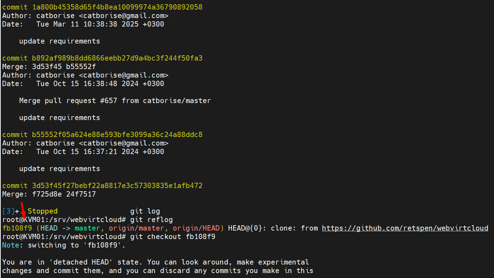
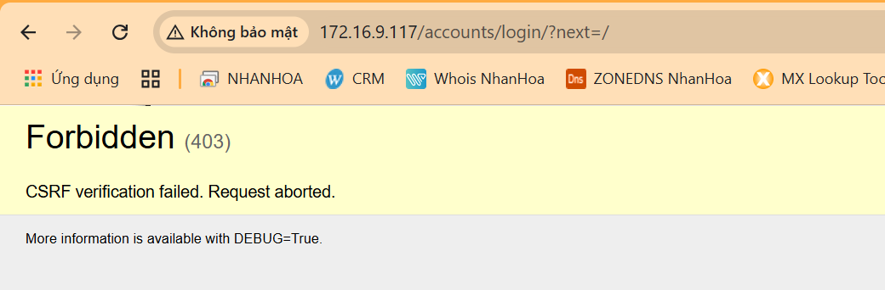

# Cài đặt WebVirtCloud quản lý hạ tầng KVM

Sử dụng WebVirtCloud giúp ta quản lý tập trung hạ tầng KVM 1 cách hiệu quả

Trước đây chúng ta thường sử dụng các công cụ như virt-manager, webvirt, kimchi hay virsh,... để quản trị các máy chủ KVM. Nhưng mỗi phần mềm đều tồn tại những điểm yếu nhất định, WebVirtCloud có thể sẽ giải quyết các vấn đề còn tồn đọng đó

### Tại server cài KVM

    apt install -y python3 python3-pip libvirt-dev libxml2-dev libxslt-dev sqlite3 git python3-virtualenv
    apt-get -y install python3-dev python3-lxml libvirt-dev zlib1g-dev libxslt1-dev supervisor libsasl2-modules gcc pkg-config python3-guestfs libsasl2-dev libldap2-dev libssl-dev

Để kết nối KVM đến WebVirtCloud, cần thêm 1 số bước sau:
- Chỉnh sửa file cấu hình libvirt như sau:

```sh
vi /etc/libvirt/libvirt.conf
```

```sh
listen_tls = 0
listen_tcp = 1
tcp_port = "16509"
listen_addr = "0.0.0.0"
auth_tcp = "none"
```

- Chỉnh sửa file /etc/default/libvirtd

Bỏ dấu # ở dòng sau:

```sh
LIBVIRTD_ARGS="--listen"
```

- Cho phép port 16509 của libvirt và dải 5900-5999 của VNC đi qua ufw

```sh
ufw allow 16509/tcp
ufw allow 5900:5999/tcp
```

- Restart lại dịch vụ ```libvirt```

```sh
systemctl restart libvirtd
systemctl enable libvirtd
```

### Cài WebVirtCloud

- Cài các package cần thiết

- Tạo thư mục và clone source code từ trang chủ về

```sh
cd /srv
git clone https://github.com/retspen/webvirtcloud && cd webvirtcloud
git log
git checkout fb108f9
cp webvirtcloud/settings.py.template webvirtcloud/settings.py
```
Xác định commit cụ thể có mã hash là fb108f9

  
  

- Thay thế secret key + thay đổi chuỗi secret key trong file settings.py bằng 1 đoạn string ngẫu nhiên mà chỉ có bạn là người sở hữu ```sh vi webvirtcloud/settings.py```

```sh
# Sửa tham số SECRET_KEY
SECRET_KEY = "dinhvantu"
```

- Cài đặt WebVirtCloud

```sh
rm -rf venv/
pip uninstall virtualenv
pip install virtualenv
apt install libldap2-dev libsasl2-dev -y
virtualenv venv
source venv/bin/activate
venv/bin/pip install -r conf/requirements.txt
apt install nginx -y
cp conf/nginx/webvirtcloud.conf /etc/nginx/conf.d/
cp conf/supervisor/webvirtcloud.conf /etc/supervisor/conf.d
venv/bin/python manage.py migrate
```
  
  
  
  
  
  
  

- Thêm các cấu hình sau vào cuối file ``/etc/supervisor/conf.d/webvirtcloud.conf``

```sh
[program:webvirtcloud]
command=/srv/webvirtcloud/venv/bin/gunicorn webvirtcloud.wsgi:application -c /srv/webvirtcloud/gunicorn.conf.py
directory=/srv/webvirtcloud
user=www-data
autostart=true
autorestart=true
redirect_stderr=true

[program:novncd]
command=/srv/webvirtcloud/venv/bin/python3 /srv/webvirtcloud/console/novncd
directory=/srv/webvirtcloud
user=www-data
autostart=true
autorestart=true
redirect_stderr=true

[program:socketiod]
command=/srv/webvirtcloud/venv/bin/python3 /srv/webvirtcloud/console/socketiod -d
directory=/srv/webvirtcloud
user=www-data
autostart=true
autorestart=true
redirect_stderr=true

```
```sh
chown -R www-data:www-data /srv/webvirtcloud
rm /etc/nginx/sites-enabled/default
```
- Restart và Enable các service

```sh
service nginx restart
systemctl enable nginx
service supervisor restart
systemctl enable supervisor
service nginx status
service supervisor status

```
Setup libvirt and KVM on server

    wget -O - https://bit.ly/36baWUu | sudo sh

- Truy cập vào trang quản trị WebVirtCloud bằng địa chỉ ip của server

- Đăng nhập bằng tài khoản và mật khẩu đều là admin

  

Fix 

    root@KVM01:/srv/webvirtcloud/webvirtcloud# vi /srv/webvirtcloud/webvirtcloud/settings.py

  

    service nginx restart
    service supervisor restart

  