## Managing KVM Virtual Machines with Cockpit Web Console in Linux

Dưới đây là vài dòng lệnh cài đặt đơn giản

```Bash

apt update

apt install cockpit -y

apt install cockpit-machines -y

systemctl start cockpit

systemctl status cockpit

netstat -pnltu | grep 9090

ufw allow 9090/tcp

ufw reload

apt upgrade -y // Cài đặt xong upgrade các packages cho trạng thái tốt nhất.

```

## Access

    https://server-ip:9090

Một vài hình ảnh:

  

  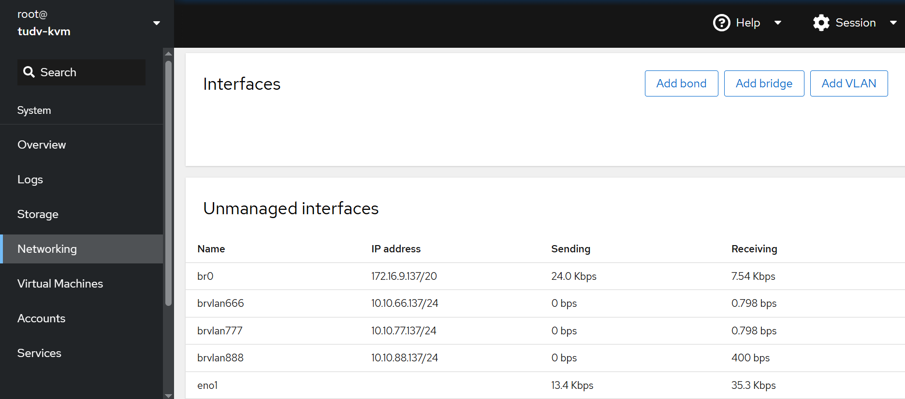

  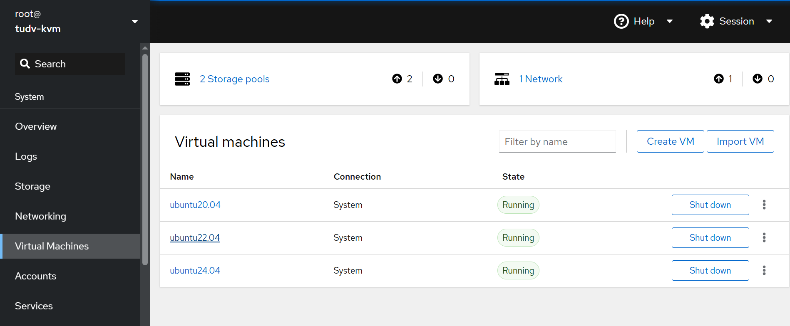

  

  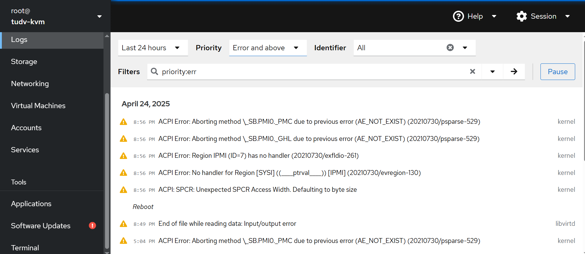

  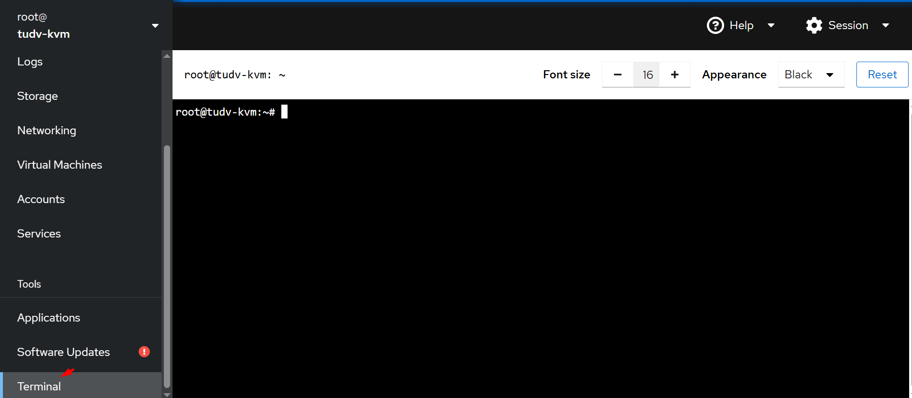

  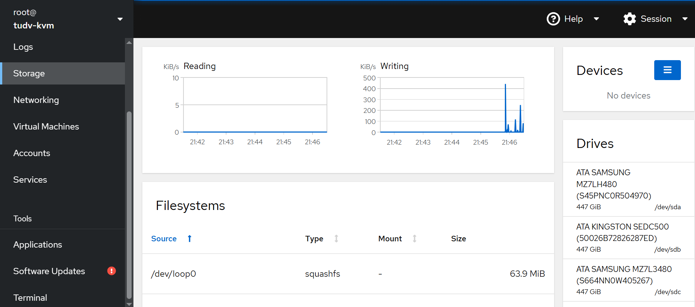

  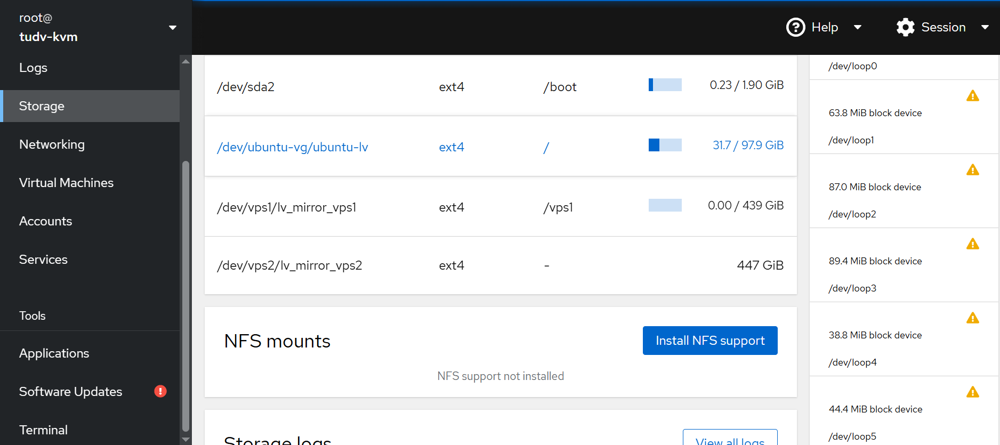 

Chỗ VM Import, mình thử copy 1 file qcow2 của Ubuntu22.04 ra /mnt sau đó import

  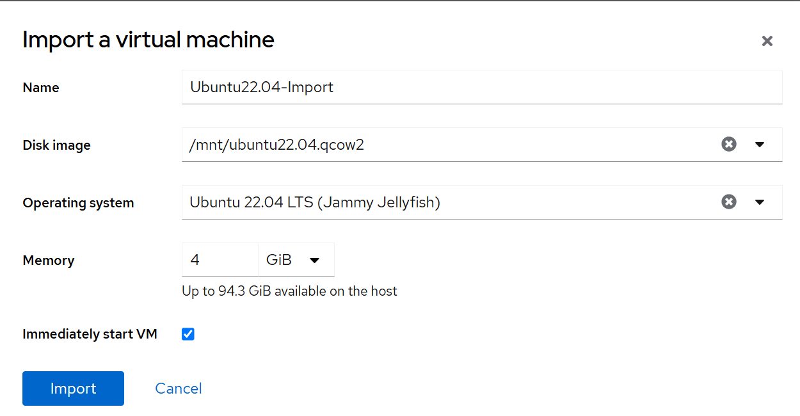 

Import thành công:

  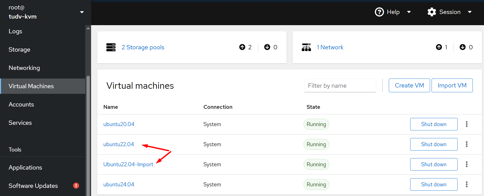 

Máy ảo mới import có đường dẫn disk tại ``/mnt/ubuntu22.04.qcow2``, sau khi import xong, chúng ta ``stop và start`` máy ảo
để máy ảo nhận IP động mới.

  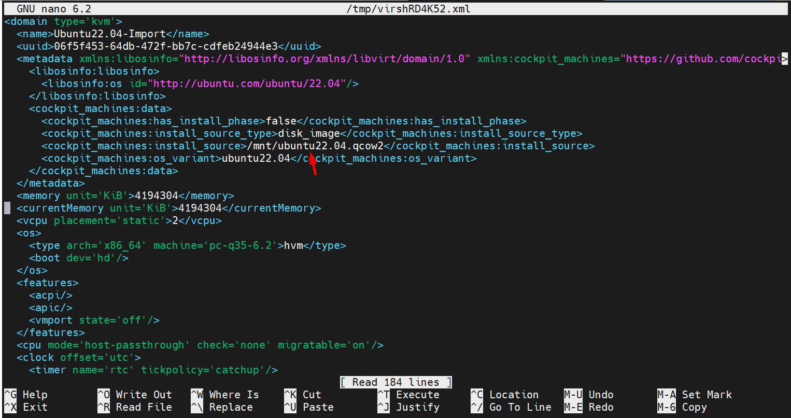

Tạo VM:


Tạo từ Cockpit

  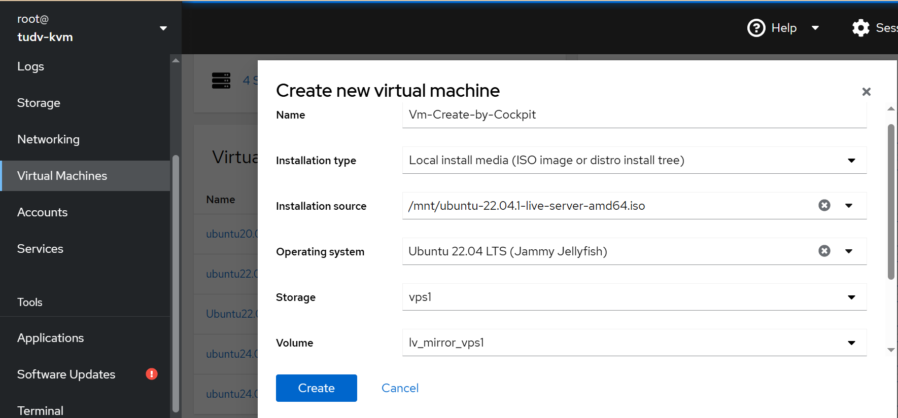 

  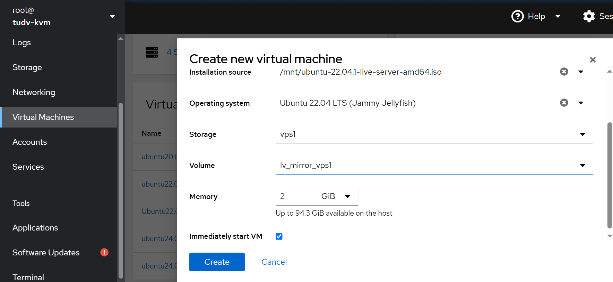 

Chúng ta click vào VM để console:

  
