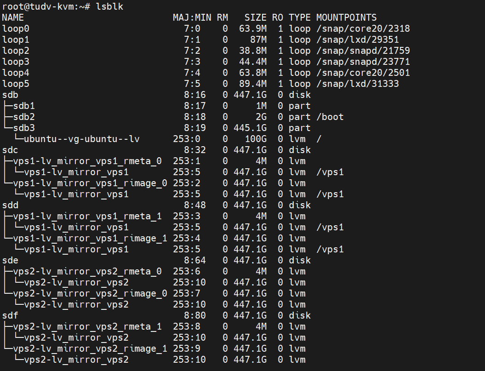

## Template KVM

Dưới đây là template KVM mẫu

```Bash

[root@localhost libvirt]# df -h
Filesystem                  Size  Used Avail Use% Mounted on
devtmpfs                    126G     0  126G   0% /dev
tmpfs                       126G     0  126G   0% /dev/shm
tmpfs                       126G  2.2G  124G   2% /run
tmpfs                       126G     0  126G   0% /sys/fs/cgroup
/dev/mapper/almalinux-root  870G   52G  774G   7% /
/dev/sda1                   974M  220M  687M  25% /boot
/dev/sdf1                   1.7T  688G  878G  44% /backup
/dev/sdg1                   1.7T  766G  801G  49% /backup1
tmpfs                        26G     0   26G   0% /run/user/0


[root@localhost libvirt]# pvs
  PV         VG        Fmt  Attr PSize    PFree
  /dev/sda2  almalinux lvm2 a--  <892.75g       0
  /dev/sdb1  vps       lvm2 a--  <893.72g <458.72g
  /dev/sdc1  vps1      lvm2 a--  <893.72g <193.72g
  /dev/sdd1  vps2      lvm2 a--  <893.72g <506.72g
  /dev/sde1  vps3      lvm2 a--  <893.72g <298.72g
[root@localhost libvirt]# vgs
  VG        #PV #LV #SN Attr   VSize    VFree
  almalinux   1   2   0 wz--n- <892.75g       0
  vps         1   8   0 wz--n- <893.72g <458.72g
  vps1        1   6   0 wz--n- <893.72g <193.72g
  vps2        1   6   0 wz--n- <893.72g <506.72g
  vps3        1   6   0 wz--n- <893.72g <298.72g
[root@localhost libvirt]# lvs
  LV             VG        Attr       LSize    Pool Origin Data%  Meta%  Move Log Cpy%Sync Convert
  root           almalinux -wi-ao---- <884.75g
  swap           almalinux -wi-ao----    8.00g
  kvm1346_img    vps       -wi-ao----   15.00g
  kvm1350_img    vps       -wi-a-----   50.00g
  kvm1355_img    vps       -wi-ao----   50.00g
  kvm1356_img    vps       -wi-a-----   50.00g
  kvm1360_img    vps       -wi-ao----   20.00g
  kvm1373_img    vps       -wi-ao----   50.00g
  kvm1377_img    vps       -wi-ao----  100.00g
  kvm1380_img    vps       -wi-ao----  100.00g
  kvm1347_img    vps1      -wi-ao----   25.00g
  kvm1348_img    vps1      -wi-ao----   50.00g
  kvm1349_img    vps1      -wi-ao----   15.00g
  kvm1356_img    vps1      -wi-a-----   50.00g
  kvm1362_img    vps1      -wi-ao----   60.00g
  kvm1366_img    vps1      -wi-ao----  500.00g
  kvm1351_img    vps2      -wi-ao----   25.00g
  kvm1352_img    vps2      -wi-a-----   80.00g
  kvm1353_img    vps2      -wi-ao----   42.00g
  kvm1354_img    vps2      -wi-ao----   80.00g
  kvm1374_img    vps2      -wi-ao----   60.00g
  kvm1375_img    vps2      -wi-ao----  100.00g
  kvm1357_img    vps3      -wi-ao----   50.00g
  kvm1359_img    vps3      -wi-ao----   25.00g
  kvm1363_img    vps3      -wi-a-----  140.00g
  kvm1363_img_91 vps3      -wi-a-----  100.00g
  kvm1368_img    vps3      -wi-ao----   80.00g
  kvm1369_img    vps3      -wi-ao----  200.00g

```

Mình sẽ tạo 1 KVM tương tự:

```Bash

root@tudv-kvm:~# lsblk
NAME                      MAJ:MIN RM   SIZE RO TYPE MOUNTPOINTS
loop0                       7:0    0  63.9M  1 loop /snap/core20/2318
loop1                       7:1    0    87M  1 loop /snap/lxd/29351
loop2                       7:2    0  38.8M  1 loop /snap/snapd/21759
sdb                         8:16   0 447.1G  0 disk
├─sdb1                      8:17   0     1M  0 part
├─sdb2                      8:18   0     2G  0 part /boot
└─sdb3                      8:19   0 445.1G  0 part
  └─ubuntu--vg-ubuntu--lv 253:0    0   100G  0 lvm  /
sdc                         8:32   0 447.1G  0 disk
sdd                         8:48   0 447.1G  0 disk
sde                         8:64   0 447.1G  0 disk
sdf                         8:80   0 447.1G  0 disk

```
#### 1. Tạo Physical Volumes (PVs) (nếu bạn chưa làm):

Đảm bảo rằng cả /dev/sdc và /dev/sdd đã được tạo thành PVs. Nếu chưa, hãy thực hiện:

    pvcreate /dev/sdc
    pvcreate /dev/sdd
    pvcreate /dev/sde
    pvcreate /dev/sdf

Hoặc

    pvcreate /dev/sdc  /dev/sdd /dev/sde /dev/sdf

```Bash

root@tudv-kvm:~# pvs
  PV         VG        Fmt  Attr PSize   PFree
  /dev/sdb3  ubuntu-vg lvm2 a--  445.12g 345.12g
  /dev/sdc             lvm2 ---  447.13g 447.13g
  /dev/sdd             lvm2 ---  447.13g 447.13g
  /dev/sde             lvm2 ---  447.13g 447.13g
  /dev/sdf             lvm2 ---  447.13g 447.13g

```

#### 2. Tạo Volume Group (VG):

Tạo 2 VG bao gồm cả hai PVs, ví dụ chúng ta sẽ đặt tên cho VG là vps1 và vps2:

    vgcreate vps1 /dev/sdc /dev/sdd
    vgcreate vps2 /dev/sde /dev/sdf

Hình ảnh:

```Bash

root@tudv-kvm:~# vgcreate vps1 /dev/sdc /dev/sdd
  vgcreate vps2 /dev/sde /dev/sdf
  WARNING: Devices have inconsistent physical block sizes (512 and 4096).
  Volume group "vps1" successfully created
  WARNING: Devices have inconsistent physical block sizes (512 and 4096).
  Volume group "vps2" successfully created

root@tudv-kvm:~# vgs
  VG        #PV #LV #SN Attr   VSize    VFree
  ubuntu-vg   1   1   0 wz--n-  445.12g  345.12g
  vps1        2   0   0 wz--n- <894.26g <894.26g
  vps2        2   0   0 wz--n- <894.26g <894.26g

```

#### 3. Tạo Logical Volume (LV) mirror:

Bây giờ, bạn có thể tạo LV mirror từ VG vps1 và vps2. Chúng ta sẽ đặt tên cho LV là lv_mirror_vps1 và lv_mirror_vps2 và sử dụng toàn bộ dung lượng có sẵn trong VG.

    lvcreate -n lv_mirror_vps1 -m 1 -l 100%VG vps1

    lvcreate -n lv_mirror_vps2 -m 1 -l 100%VG vps2

Hình ảnh:

```Bash

root@tudv-kvm:~# lvs
  LV             VG        Attr       LSize   Pool Origin Data%  Meta%  Move Log Cpy%Sync Convert
  ubuntu-lv      ubuntu-vg -wi-ao---- 100.00g
  lv_mirror_vps1 vps1      rwi-a-r--- 447.12g                                    2.65
  lv_mirror_vps2 vps2      rwi-a-r--- 447.12g                                    1.11

```

Giải thích các tùy chọn:

  + lvcreate: Đây là lệnh để tạo một Logical Volume (LV) trong hệ thống Logical Volume Manager (LVM).

  + -n lv_mirror_vps1: Tùy chọn -n được sử dụng để chỉ định tên cho Logical Volume mới. Trong trường hợp này, LV sẽ được đặt tên là lv_mirror_vps1.

  + -m 1: Tùy chọn -m được sử dụng để tạo một Logical Volume mirror. Giá trị 1 có nghĩa là bạn muốn tạo một bản sao (mirror) của dữ liệu, dẫn đến việc dữ liệu sẽ được ghi đồng thời lên hai thiết bị vật lý khác nhau. Điều này cung cấp khả năng chịu lỗi: nếu một trong hai thiết bị gặp sự cố, dữ liệu vẫn có thể được truy cập từ thiết bị còn lại. Tổng cộng, LV mirror sẽ chiếm gấp đôi dung lượng bạn dự định sử dụng cho dữ liệu thực tế.

  + -l 100%VG: Tùy chọn -l (viết tắt của --extents) được sử dụng để chỉ định kích thước của Logical Volume dựa trên số lượng Logical Extents (LEs) có sẵn trong Volume Group.

  + 100%VG: Giá trị này có nghĩa là bạn muốn sử dụng tất cả các Logical Extents đang có sẵn trong Volume Group được chỉ định (trong trường hợp này là vps1) cho Logical Volume lv_mirror_vps1.

  + vps1: Đây là tên của Volume Group mà bạn muốn tạo Logical Volume trên đó. LVM sẽ lấy dung lượng từ Volume Group này để tạo LV.

#### 4. Kích hoạt Logical Volume (nếu cần):

LV thường được kích hoạt tự động sau khi tạo. Tuy nhiên, bạn có thể kích hoạt nó một cách явно (explicitly) nếu cần:

    lvchange -ay /dev/vps1/lv_mirror_vps1
    lvchange -ay /dev/vps2/lv_mirror_vps2

#### 5. Tạo Filesystem trên Logical Volume:

Sau khi LV mirror được tạo, bạn cần tạo một hệ thống tệp (filesystem) trên nó. Ví dụ, để tạo hệ thống tệp ext4:

    mkfs.ext4 /dev/vps1/lv_mirror_vps1
    mkfs.ext4 /dev/vps2/lv_mirror_vps2

#### 6. Mount Filesystem:

Cuối cùng, bạn cần mount filesystem vào một thư mục để có thể sử dụng nó:

    mkdir /vps1
    mount /dev/vps1/lv_mirror_vps1 /vps1

Ở đây mình không mount vps2/lv_mirror_vps2

Để đảm bảo LV mirror được mount tự động sau khi khởi động lại, bạn cần thêm một dòng vào tệp /etc/fstab. Mở tệp này bằng trình soạn thảo văn bản (ví dụ: nano hoặc vim) với quyền root:

    nano /etc/fstab

Thêm dòng sau vào cuối tệp:

    /dev/mapper/vps1-lv_mirror_vps1 /vps1 ext4 defaults 0 0

Lưu và đóng tệp.

  
