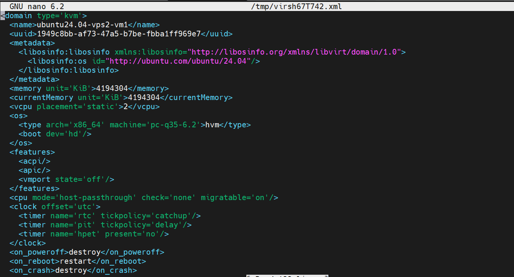
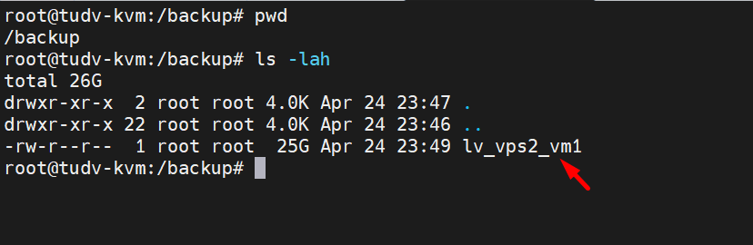

## Backup
Khi máy ảo được tạo và gắn disk là các logical volum

Ví dụ: 

Mình tạo máy ảo ``ubuntu24.04-vps2-vm1`` trong VG ``vps2`` gắn với LV tên ``lv_vps2_vm1``

Thì backup máy ảo ở đây chính là backup logical volum:

    dd if=/dev/vps2/lv_vps2_vm1 of=/backup/lv_vps2_vm1 bs=4M status=progress

Lệnh trên sẽ backup LV tên ``lv_vps2_vm1`` trong VG tên ``vps2`` , lưu backup tại ``/backup`` và đặt tên backup là ``lv_vps2_vm1``

```Bash

root@tudv-kvm:/dev/vps2# vgs
  VG        #PV #LV #SN Attr   VSize    VFree
  ubuntu-vg   1   1   0 wz--n-  445.12g 345.12g
  vps1        2   1   0 wz--n- <894.26g      0
  vps2        2   2   0 wz--n- <894.26g 819.25g
root@tudv-kvm:/dev/vps2# lvs
  LV                 VG        Attr       LSize   Pool Origin Data%  Meta%  Move Log Cpy%Sync Convert
  ubuntu-lv          ubuntu-vg -wi-ao---- 100.00g
  lv_mirror_vps1     vps1      rwi-aor--- 447.12g                                    100.00
  lv_vps2_mirror_vm2 vps2      rwi-a-r---  25.00g                                    100.00
  lv_vps2_vm1        vps2      -wi-ao----  25.00g
root@tudv-kvm:/dev/vps2# virsh list
 Id   Name                   State
--------------------------------------
 4    Vm-Create-by-Cockpit   running
 5    ubuntu24.04-vps2-vm1   running
 6    ubuntu24.04            running
 7    Ubuntu22.04-Import     running
 8    ubuntu22.04            running
 9    ubuntu20.04            running

```

   
   

## Restore

   
  
Chúng ta dùng dd , ở đây lệnh của mình sẽ là:

     virsh shutdown ubuntu24.04-vps2-vm1

     dd if=/backup/lv_vps2_vm1 of=/dev/vps2/lv_vps2_vm1 bs=4M status=progress
	 
	 virsh start ubuntu24.04-vps2-vm1

Khi bạn muốn khôi phục một máy ảo KVM mà đĩa ảo của nó được lưu trữ trên Logical Volume (LV) /dev/vg0/lv_data bằng cách sử dụng lệnh dd, bạn cần thực hiện các bước sau một cách cẩn thận để đảm bảo quá trình khôi phục diễn ra suôn sẻ và không gây mất dữ liệu.

#### Quy trình khôi phục bằng dd:

Xác định vị trí backup: Đầu tiên, bạn cần xác định nơi bạn đã lưu trữ bản backup của LV /dev/vg0/lv_data. Giả sử bạn đã tạo một file ảnh backup có tên là lv_data.img.

Đảm bảo máy ảo đích đã tắt: Máy ảo mà bạn muốn khôi phục dữ liệu vào phải ở trạng thái tắt hoàn toàn. Việc ghi trực tiếp vào đĩa ảo đang được sử dụng có thể gây ra hỏng dữ liệu nghiêm trọng.

Xác định LV đích: Xác định LV mà bạn muốn khôi phục dữ liệu vào. Trong trường hợp này, nó là /dev/vg0/lv_data. Hãy chắc chắn rằng đây là LV chính xác.

Sử dụng lệnh dd để ghi dữ liệu backup vào LV đích: Chạy lệnh dd với quyền root để ghi dữ liệu từ file backup trở lại LV.


    dd if=/path/to/your/backup/lv_data.img of=/dev/vg0/lv_data bs=4M status=progress
	
Giải thích các tùy chọn:

  + if=/path/to/your/backup/lv_data.img: Đường dẫn đến file ảnh backup của LV. Thay thế bằng đường dẫn thực tế đến file backup của bạn.
  + of=/dev/vg0/lv_data: Đường dẫn đến LV đích mà bạn muốn khôi phục dữ liệu vào. Đảm bảo đây là LV chính xác của máy ảo bạn muốn khôi phục.
  + bs=4M: Kích thước block (block size) cho việc đọc và ghi dữ liệu. Bạn có thể điều chỉnh giá trị này (ví dụ: 1M, 8M) để có hiệu suất tốt hơn.
  + status=progress: Hiển thị tiến trình của quá trình sao chép (tùy chọn, nhưng rất hữu ích để theo dõi).

Chờ cho quá trình dd hoàn tất: Quá trình này có thể mất một khoảng thời gian đáng kể tùy thuộc vào kích thước của bản backup. Hãy kiên nhẫn và đợi cho đến khi lệnh dd hoàn thành mà không có lỗi.

Kiểm tra (tùy chọn nhưng nên thực hiện): Sau khi quá trình dd hoàn tất, bạn có thể muốn thực hiện một số kiểm tra (nếu có thể) để đảm bảo dữ liệu đã được khôi phục đúng cách. Điều này có thể bao gồm việc so sánh kích thước hoặc hash của LV đã khôi phục với bản backup ban đầu (nếu bạn có thông tin này).

  + Khởi động máy ảo: Sau khi bạn tin rằng quá trình khôi phục đã thành công, bạn có thể thử khởi động lại máy ảo trong KVM.

Những điều quan trọng cần lưu ý:

  + Tính nhất quán của dữ liệu: Nếu máy ảo đang chạy và có hoạt động ghi dữ liệu trong quá trình bạn tạo bản backup bằng dd, dữ liệu backup có thể không nhất quán. Để đảm bảo tính nhất quán, tốt nhất là tắt máy ảo trước khi tạo bản backup.
  + Kích thước phải khớp: Đảm bảo rằng kích thước của LV đích (/dev/vg0/lv_data) ít nhất phải bằng hoặc lớn hơn kích thước của dữ liệu bạn đã backup. Nếu LV đích nhỏ hơn, bạn có thể bị mất dữ liệu hoặc quá trình ghi bị lỗi.
  + Ghi đè dữ liệu hiện có: Lệnh dd sẽ ghi đè toàn bộ dữ liệu hiện có trên LV đích bằng dữ liệu từ file backup. Hãy chắc chắn rằng bạn muốn thực hiện điều này.
  + Thời gian: Quá trình dd có thể mất rất nhiều thời gian, đặc biệt đối với các LV lớn. Hãy lên kế hoạch cho thời gian ngừng hoạt động của máy ảo.
  + Không có thông báo lỗi chi tiết: Lệnh dd thường không cung cấp thông báo lỗi chi tiết nếu có vấn đề xảy ra trong quá trình sao chép. Theo dõi cẩn thận và kiểm tra sau khi hoàn tất.
  + Phương pháp tốt hơn cho backup VM: Mặc dù dd có thể được sử dụng, các công cụ quản lý ảo hóa (như virsh save/virsh restore hoặc các công cụ backup chuyên dụng cho KVM) thường cung cấp các phương pháp backup và restore hiệu quả hơn, bao gồm cả việc xử lý trạng thái máy ảo và đảm bảo tính nhất quán.