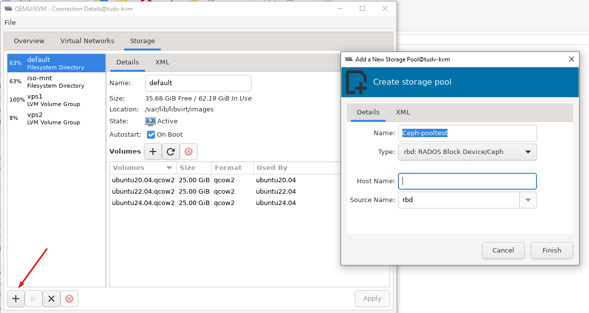

Dưới đây là các bước thực hiện kết nối KVM đến 1 cụm Ceph

#### 1. Cài đặt gói ``ceph-common``

Cài đặt:

    apt install ceph-common -y

#### 2. Copy config cũng như file xác minh , thao tác trên Ceph node manager:


```Bash

cat > ~/.ssh/config << 'OEF'
Host kvmnode137
    Hostname kvmnode137.dinhtu.xyz 
    User root
OEF

```

#### 4. Phần tiếp theo tạo một file ``/etc/hosts`` mới với các địa chỉ IP và tên máy chủ cho cụm KVM. Lưu ý đối với giao tiếp giữa các Node các bạn nên sử dụng IP Private của mỗi Node, đây là IP có băng thông cao sử dụng cho kết nối các cluster trong cụm ví dụ như dưới.

Ví dụ:

```Bash

cat >> /etc/hosts << 'OEF'
10.10.88.137 kvmnode137.dinhtu.xyz kvmnode137
OEF

```

#### 5. Sao chép khóa công khai SSH đến node còn lại trong cụm.

Sử dụng lệnh ``ssh-copy-id`` sao chép khóa công khai SSH đến node trong trong cụm, tính luôn cả ``kvmnode137``, ví dụ của mình là ``kvmnode138`` và ``kvmnode139``.
Ví dụ:

```Bash

ssh-copy-id -o StrictHostKeychecking=no kvmnode137

```

Tùy chọn ``-o StrictHostKeychecking=no`` ngăn chặn việc kiểm tra dấu vân tay của máy chủ, cho phép kết nối tự động.
 

scp /etc/ceph/ceph.conf kvmnode137.dinhtu.xyz:/etc/ceph/

scp /etc/ceph/ceph.client.admin.keyring kvmnode137.dinhtu.xyz:/etc/ceph/

ssh kvmnode137.dinhtu.xyz "chown ceph. /etc/ceph/ceph.*"


  

#### 6. Qua virt-manager để thêm storage RBD

  