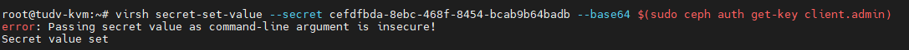

Dưới đây là các bước thực hiện kết nối KVM đến 1 cụm Ceph

List pool KVM

    virsh pool-list --all

    apt list | grep libvirt-daemon-driver-storage

    apt install libvirt-daemon-driver-storage-rbd -y

#### 1. Cài đặt gói ``ceph-common``

Cài đặt:

    apt install ceph-common -y

#### 2. Copy config cũng như file xác minh , thao tác trên Ceph node manager:


```Bash

cat > ~/.ssh/config << 'OEF'
Host kvmnode137
    Hostname kvmnode137.dinhtu.xyz 
    User root
OEF

```

#### 4. Thao tác trên Ceph Node Mgr

Phần tiếp theo tạo một file ``/etc/hosts`` mới với các địa chỉ IP và tên máy chủ cho cụm KVM. Lưu ý đối với giao tiếp giữa các Node các bạn nên sử dụng IP Private của mỗi Node, đây là IP có băng thông cao sử dụng cho kết nối các cluster trong cụm ví dụ như dưới.

Ví dụ:

```Bash

cat >> /etc/hosts << 'OEF'
10.10.88.137 kvmnode137.dinhtu.xyz kvmnode137
OEF

```

#### 5. Thao tác trên Ceph Node Mgr

Sao chép khóa công khai SSH đến node còn lại trong cụm.

Sử dụng lệnh ``ssh-copy-id`` sao chép khóa công khai SSH đến node trong trong cụm, tính luôn cả ``kvmnode137``, ví dụ của mình là ``kvmnode138`` và ``kvmnode139``.

Ví dụ:

```Bash

ssh-copy-id -o StrictHostKeychecking=no kvmnode137

```

Tùy chọn ``-o StrictHostKeychecking=no`` ngăn chặn việc kiểm tra dấu vân tay của máy chủ, cho phép kết nối tự động.
 

```Bash

scp /etc/ceph/ceph.conf kvmnode137.dinhtu.xyz:/etc/ceph/

scp /etc/ceph/ceph.client.admin.keyring kvmnode137.dinhtu.xyz:/etc/ceph/

ssh kvmnode137.dinhtu.xyz "chown ceph. /etc/ceph/ceph.*"

```

  

```Bash

    chmod 600 /etc/ceph/ceph.client.admin.keyring
    chown root:libvirt /etc/ceph/ceph.client.admin.keyring
    usermod -aG ceph libvirt-qemu
    systemctl restart libvirtd

```

#### 7. Thao tác trên CLI của KVM node - Tạo libvirt secret cho Ceph

Tạo file XML định nghĩa secret (/etc/ceph/ceph-secret.xml):

```Bash

<secret ephemeral='no' private='no'>
  <usage type='ceph'>
    <name>client.admin secret</name>
  </usage>
</secret>

```

Định nghĩa secret trong libvirt:

    virsh secret-define --file /etc/ceph/ceph-secret.xml

  

Lệnh sẽ trả về UUID của secret (ví dụ: cefdfbda-8ebc-468f-8454-bcab9b64badb created).

Thiết lập giá trị secret (sử dụng key của client.admin):

    virsh secret-set-value --secret cefdfbda-8ebc-468f-8454-bcab9b64badb created --base64 $(sudo ceph auth get-key client.admin)

  

Kiểm tra secret đã tạo:

    virsh secret-list

---

#### 8. Tạo storage pool trong KVM

Tạo file XML định nghĩa pool (/etc/ceph/testpool.xml):

```Bash

<pool type='rbd'>
  <name>testpool</name>
  <source>
    <host name='10.10.88.134' port='6789'/>
    <name>testpool</name>
    <auth type='ceph' username='admin'>
      <secret uuid='cefdfbda-8ebc-468f-8454-bcab9b64badb'/>
    </auth>
  </source>
</pool>

```

Tạo và kích hoạt pool:


    virsh pool-define /etc/ceph/testpool.xml
    virsh pool-start testpool
    virsh pool-autostart testpool


  

---

#### 9. Kiểm tra kết nối

Kiểm tra pool đã hoạt động:

    virsh pool-info testpool

Kiểm tra danh sách image trong pool:

    rbd -p testpool ls

  


#### 10. Tạo máy ảo trong Pool

  

  

#### 11. Xóa pool:

Xóa dữ liệu kết nối Ceph đến pool testpool trên KVM bằng virsh, bạn cần:

  + Liệt kê và (tùy chọn) xóa các volume thuộc pool testpool.

    virsh vol-delete --pool testpool myvm1_disk.qcow2
    virsh vol-delete --pool testpool myvm2_disk.raw

  + (Nếu cần) Deactivate pool testpool.

    virsh pool-destroy testpool

  + Undefine pool testpool.

    virsh pool-undefine testpool
