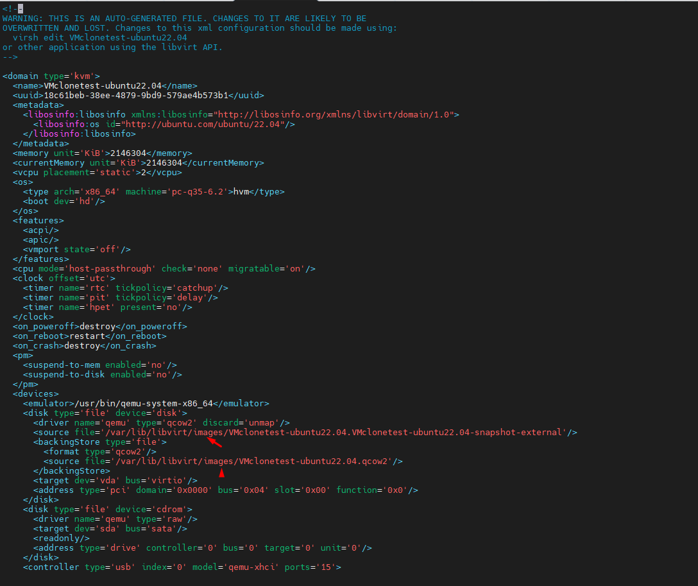
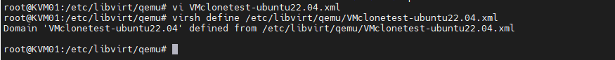

Mình đang có máy ảo ``VMclonetest-ubuntu22.04``
Images path tại ``/var/lib/libvirt/kvmimages``
Config VM tại ``/etc/libvirt/qemu/``

Mục đích chuyển: Chuyển ``VMclonetest-ubuntu22.04.qcow2`` từ ``/var/lib/libvirt/kvmimages`` sang đường dẫn mặc định ``/var/lib/libvirt/images/``

+ Tắt máy ảo:

+ Copy disk:

root@KVM01:/var/lib/libvirt/kvmimages# cp -rp VMclonetest-ubuntu22.04.qcow2 /var/lib/libvirt/images/
root@KVM01:/var/lib/libvirt/kvmimages# cp -rp VMclonetest-ubuntu22.04.VMclonetest-ubuntu22.04-snapshot-external /var/lib/libvirt/images

+ Chỉnh sửa file XML của máy ảo 

root@KVM01:/etc/libvirt/qemu# vi /etc/libvirt/qemu/VMclonetest-ubuntu22.04.xml

Chúng ta sẽ chỉnh sửa lại phần đường dẫn disk qcow2 của VM

  

+ Define lai máy ảo

virsh define /etc/libvirt/qemu/VMclonetest-ubuntu22.04.xml

  

+ Start máy ảo:

root@KVM01:/etc/libvirt/qemu# virsh start VMclonetest-ubuntu22.04

