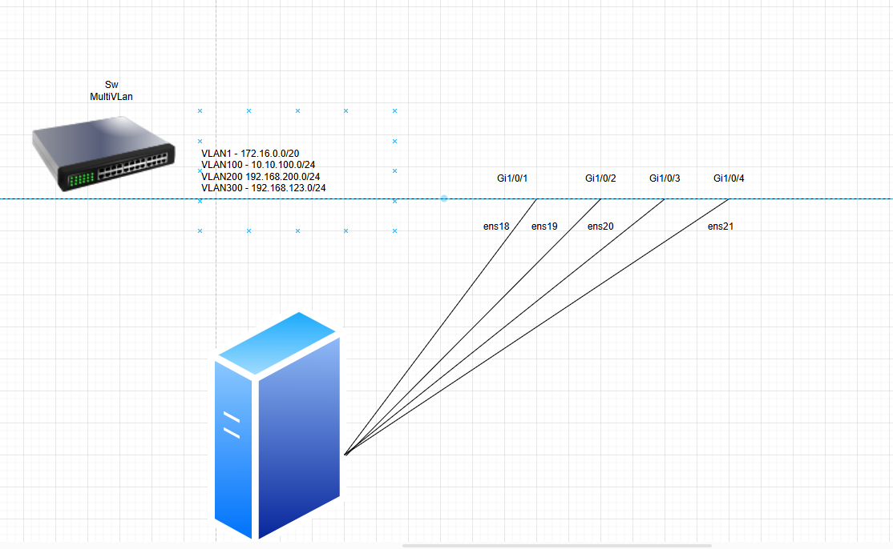
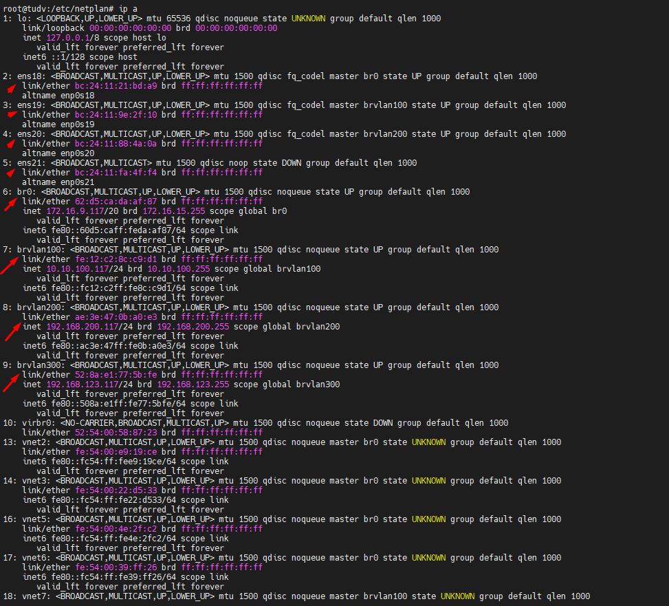
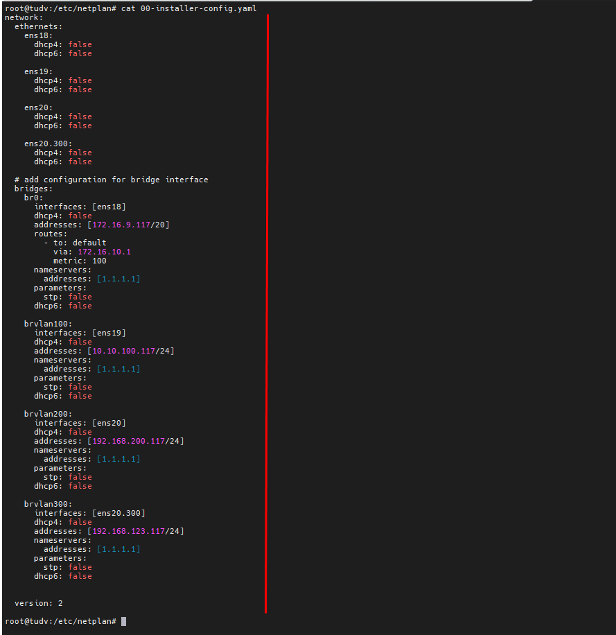
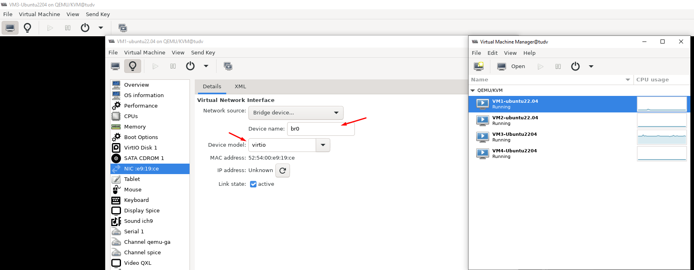
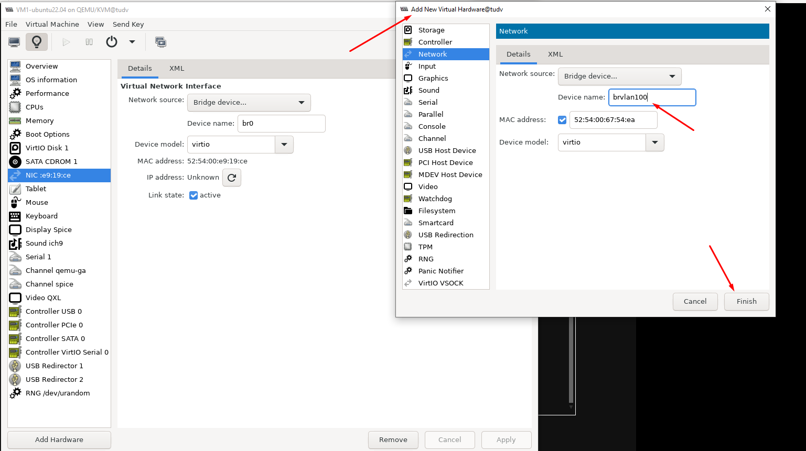
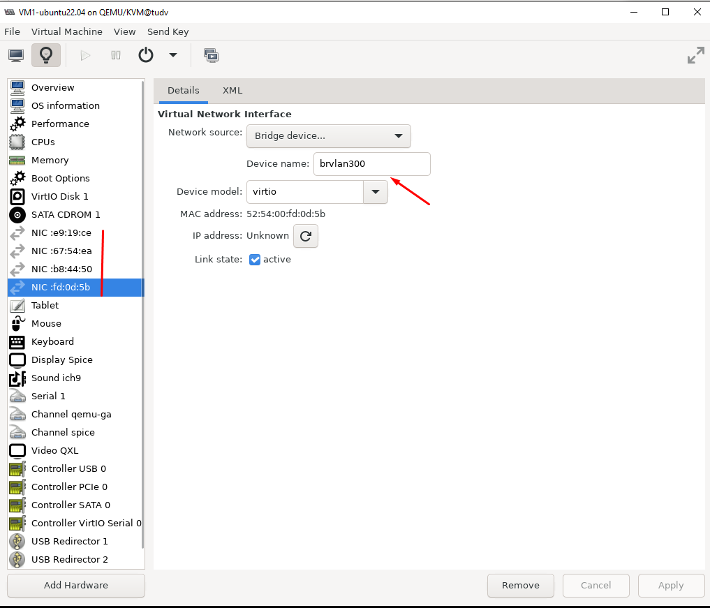

# Cấu hình Bridge VLAN trên KVM

Đây là topo network của máy KVM master * Ubuntu 22.04

  

### 1. Cấu hình card mạng bridge ở máy vật lý

- Đầu tiên là chỉnh sửa interface đang cắm với switch, ở đây là ```ens18 ens19 ens20 ens21```

cd /etc/netplan
nano  00-installer-config.yaml

Nội dung như sau:

    network:
      ethernets:
        ens18:
          dhcp4: false
          dhcp6: false

        ens19:
          dhcp4: false
          dhcp6: false

        ens20:
          dhcp4: false
          dhcp6: false

        ens20.300:
          dhcp4: false
          dhcp6: false

        ens21:
          dhcp4: false
          dhcp6: false

      # add configuration for bridge interface
      bridges:
        br0:
          interfaces: [ens18]
          dhcp4: false
          addresses: [172.16.9.117/20]
          routes:
            - to: default
              via: 172.16.10.1
              metric: 100
          nameservers:
            addresses: [1.1.1.1]
          parameters:
            stp: false
          dhcp6: false

        brvlan100:
          interfaces: [ens19]
          dhcp4: false
          addresses: [10.10.100.117/24]
          nameservers:
            addresses: [1.1.1.1]
          parameters:
            stp: false
          dhcp6: false

        brvlan200:
          interfaces: [ens20]
          dhcp4: false
          addresses: [192.168.200.117/24]
          nameservers:
            addresses: [1.1.1.1]
          parameters:
            stp: false
          dhcp6: false

        brvlan300:
          interfaces: [ens20.300]
          dhcp4: false
          addresses: [192.168.123.117/24]
          nameservers:
            addresses: [1.1.1.1]
          parameters:
            stp: false
          dhcp6: false

      version: 2

Sau đó khởi động lại network

    netplan apply

  

Nhìn vào nội dung file yaml trên thể hiện các ý chính sau:

Các card ``ens18`` ``ens19`` ``ens20`` được cấu hình IP tĩnh tương ứng và dự phòng ``ens21``

``ens18`` là interface vật lý chạy dải mạng 172.16.0.0/20 với bridge card tên ``br0`` có IP 172.16.9.117/20

``ens19`` là interface vật lý chạy dải mạng 10.10.100.0/24 với bridge card tên ``brvlan100`` có IP 10.10.100.117/24

``ens20`` là interface vật lý chạy dải mạng 192.168.200.0/24 với bridge card tên ``brvlan200`` có IP 192.168.200.117/24

``ens20.300`` là sub-interface vật lý ảo chạy dải mạng 192.168.123.0/24 với bridge card tên ``brvlan300`` có IP 192.168.123.117/24

  


### 2. Cấu hình card mạng của máy ảo

- Cấu hình như sau, lưu ý là phần ```Device model``` phải để là ```VirtIO```

  

  

  

- Vậy là OK rồi, chú ý IPADDR dùng chính xác dải của vlan đó và bridge đúng interface