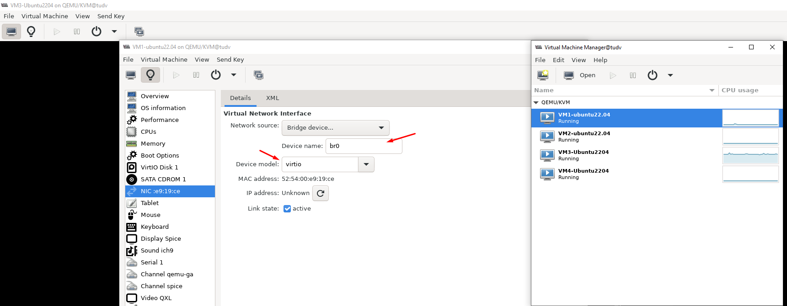

Mình tạo 2 máy Ubuntu22.04 mục đích test MultiVLAN
Trên máy Ubuntu22.04 có thể hoạt động với 4 mạng:
- VLAN1: 172.16.0.0/20 
- VLAN100: 10.10.100.0/24
- VLAN200: 192.168.200.0/24
- VLAN300: 192.168.123.0/24

Trên máy đã có sẵn 4 interfaces ``enp1s0`` ``enp7s0`` ``enp8s0`` ``enp9s0``

Config network static như sau:

Trước đó mình đã thêm 3 bridge cho VM

  

  

  

## UbuntuVM1:

root@tudv:/etc/netplan# ``cat 00-installer-config.yaml``

network:
  renderer: networkd
  ethernets:
    enp1s0:
      addresses:
        - 172.16.9.245/20
      nameservers:
        addresses: [1.1.1.1, 8.8.8.8]
      routes:
        - to: default
          via: 172.16.10.1
    enp7s0:
      addresses:
        - 10.10.100.245/24
    enp9s0:
      addresses:
        - 192.168.200.245/24
    enp8s0:
      addresses:
        - 192.168.123.245/24

  version: 2

## UbuntuVM2:

root@tudv:/etc/netplan# cat ``00-installer-config.yaml``

network:
  renderer: networkd
  ethernets:
    enp1s0:
      addresses:
        - 172.16.9.246/20
      nameservers:
        addresses: [1.1.1.1, 8.8.8.8]
      routes:
        - to: default
          via: 172.16.10.1
    enp7s0:
      addresses:
        - 10.10.100.246/24
    enp9s0:
      addresses:
        - 192.168.200.246/24
    enp8s0:
      addresses:
        - 192.168.123.246/24

  version: 2

## Test

  

  
