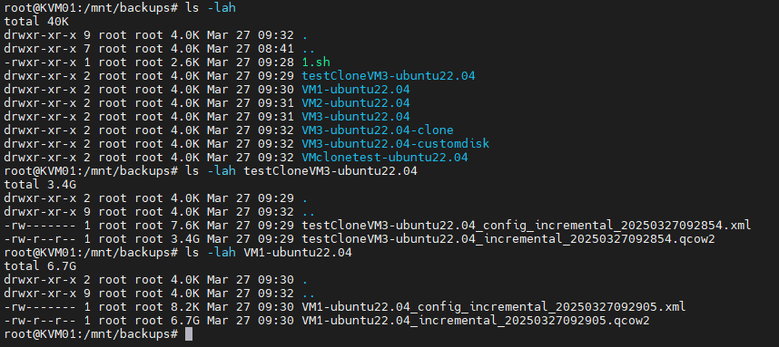
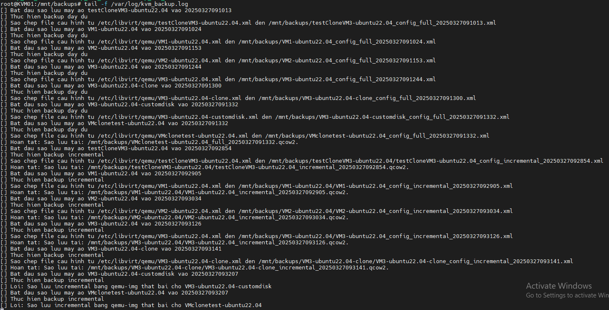

Tạo một script tự động sao lưu máy ảo của node KVM. Script này sẽ sao lưu các máy ảo mỗi ngày - Full và backup gia tăng mỗi 3 tiếng

### 1. Cài Đặt Công Cụ Cần Thiết

Trước tiên, đảm bảo rằng bạn đã cài đặt `qemu-kvm` và `libvirt` trên hệ thống của bạn. Nếu chưa, bạn có thể cài đặt bằng cách:

```bash
apt update
apt install qemu-kvm libvirt-daemon-system libvirt-clients
```

### 2. Tạo Script Sao Lưu

Mở terminal và tạo một file script mới:

```bash
nano /mnt/backups/backup_all_vm.sh
```

Dán đoạn mã sau vào file:
```bash
#!/bin/bash

# Ten may ao can sao luu
VM_NAME=$(virsh list --all --name)

# Cau hinh
LOG_FILE="/var/log/kvm_backup.log" # Duong dan file log
LAST_FULL_BACKUP_DATE_FILE="/tmp/last_full_backup_date" # File luu ngay sao luu day du cuoi cung

# Ham ghi log
log() {
    echo "[$($(date +"%Y-%m-%d %H:%M:%S"))] $1" >> $LOG_FILE
}

# Lay so phut da troi ke tu luc dau
START_TIME_FILE="/tmp/backup_start_time"

if [ ! -f "$START_TIME_FILE" ]; then
    date +%s > "$START_TIME_FILE"
fi

START_TIME=$(cat "$START_TIME_FILE")
CURRENT_TIME=$(date +%s)
DIFF_TIME=$((CURRENT_TIME - START_TIME))
DIFF_MINUTES=$((DIFF_TIME / 60))

# Vong lap for de sao luu tung may ao
for vm in $VM_NAME; do

    DATE=$(date +"%Y%m%d%H%M%S") # Tao thoi gian sao luu
    CURRENT_DATE=$(date +"%Y%m%d") # Lay ngay hien tai

    # Cau hinh cho tung VM
    mkdir -p /mnt/backups/"$vm" # Tao thu muc rieng cho tung VM
    BACKUP_DIR="/mnt/backups/$vm" # Duong dan luu tru backup cho tung VM

    log "Bat dau sao luu may ao $vm vao $DATE"

    # Thuc hien backup
    IMAGE_PATH="/var/lib/libvirt/images/${vm}.qcow2" # Duong dan file anh dia
    CONFIG_PATH="/etc/libvirt/qemu/${vm}.xml" # Duong dan file cau hinh

    if [ -f "$LAST_FULL_BACKUP_DATE_FILE" ]; then
        LAST_FULL_BACKUP_DATE=$(cat "$LAST_FULL_BACKUP_DATE_FILE")
    else
        LAST_FULL_BACKUP_DATE="19700101" # Ngay bat dau neu file khong ton tai
    fi

    if [ "$DIFF_MINUTES" -lt 180 ] && [ "$CURRENT_DATE" == "$LAST_FULL_BACKUP_DATE" ]; then # 3 tieng va cung ngay
        BACKUP_IMAGE="${BACKUP_DIR}/${vm}_incremental_${DATE}.qcow2"
        BACKUP_CONFIG="${BACKUP_DIR}/${vm}_config_incremental_${DATE}.xml"

        log "Thuc hien backup incremental"

        # Sao chep file anh dia bang qemu-img
        qemu-img convert -O qcow2 "$IMAGE_PATH" "$BACKUP_IMAGE"
        if [ $? -ne 0 ]; then
            log "Loi: Sao luu incremental bang qemu-img that bai cho $vm"
            continue # Bo qua VM nay neu loi
        fi

        log "Sao chep file cau hinh tu $CONFIG_PATH den $BACKUP_CONFIG"
        cp "$CONFIG_PATH" "$BACKUP_CONFIG"
        if [ $? -ne 0 ]; then
            log "Loi: Sao chep file cau hinh that bai cho $vm"
            continue # Bo qua VM nay neu loi
        fi
    else
        BACKUP_IMAGE="${BACKUP_DIR}/${vm}_full_${DATE}.qcow2"
        BACKUP_CONFIG="${BACKUP_DIR}/${vm}_config_full_${DATE}.xml"

        log "Thuc hien backup day du"

        qemu-img convert -O qcow2 "$IMAGE_PATH" "$BACKUP_IMAGE"
        if [ $? -ne 0 ]; then
            log "Loi: Sao luu day du bang qemu-img that bai cho $vm"
            continue # Bo qua VM nay neu loi
        fi

        log "Sao chep file cau hinh tu $CONFIG_PATH den $BACKUP_CONFIG"
        cp "$CONFIG_PATH" "$BACKUP_CONFIG"
        if [ $? -ne 0 ]; then
            log "Loi: Sao chep file cau hinh that bai cho $vm"
            continue # Bo qua VM nay neu loi
        fi

        rm "$START_TIME_FILE"
        echo "$CURRENT_DATE" > "$LAST_FULL_BACKUP_DATE_FILE" # Cap nhat ngay sao luu day du
    fi

    log "Hoan tat: Sao luu tai: ${BACKUP_IMAGE}."
done


```
### 3. Cấp Quyền Thực Thi Cho Script

Sau khi lưu file, bạn cần cấp quyền thực thi cho script:

```bash
chmod +x /mnt/backups/backup_all_vm.sh
```

### 4. Chạy Script

Bạn có thể chạy script bằng lệnh:

```bash
bash /mnt/backups/backup_all_vm.sh
```

### 5. Tự Động Hóa Sao Lưu

Để tự động chạy script mỗi 2 phút, bạn có thể sử dụng `cron`. Mở crontab để chỉnh sửa:

```bash
sudo crontab -e
```

Thêm dòng sau vào cuối file để chạy script mỗi 2 phút:

```bash
*/2 * * * * /mnt/backups/backup_all_vm.sh
```

### 6. Kiểm Tra Kết Quả Sao Lưu

Sau khi chạy script hoặc khi cron tự động chạy, bạn có thể kiểm tra thư mục `/mnt/backups` để xem các file sao lưu được tạo ra. 

### 7. Xem Log

Các thông tin log sẽ được lưu vào file `/var/log/kvm_backup.log`, bạn có thể xem file log này để kiểm tra các thông tin về quá trình sao lưu.

```bash
cat /var/log/kvm_backup.log
```
  

Một số VM file disk không nằm trong /var/lib/libvirt/images/ nên báo lỗi

  
  


