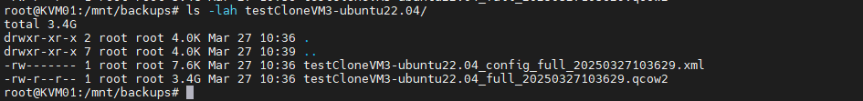
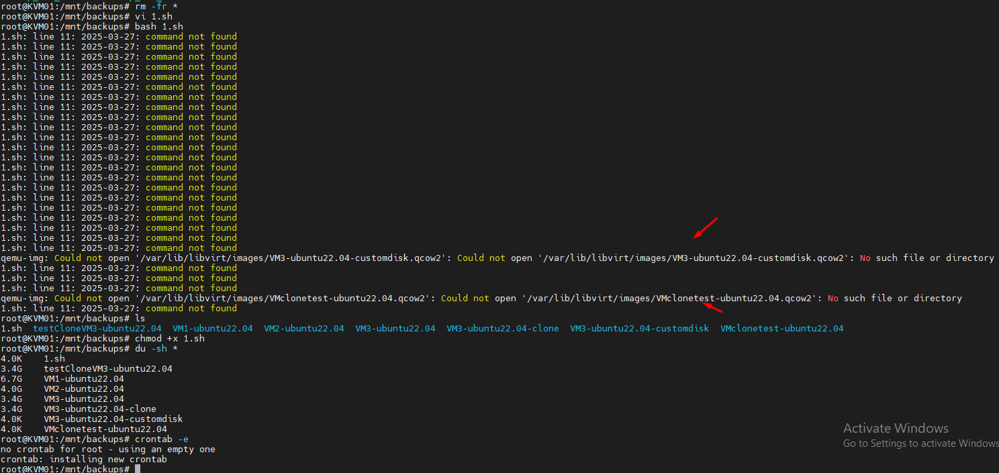
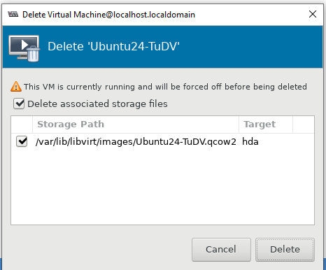
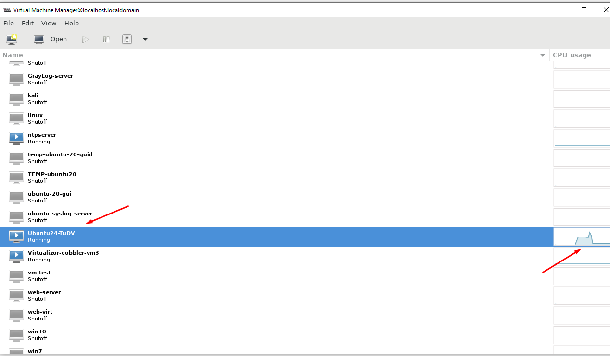

## I - Tạo một script tự động sao lưu máy ảo của node KVM.

#### 1. Cài Đặt Công Cụ Cần Thiết

Trước tiên, đảm bảo rằng bạn đã cài đặt `qemu-kvm` và `libvirt` trên hệ thống của bạn. Nếu chưa, bạn có thể cài đặt bằng cách:

```bash
apt update
apt install qemu-kvm libvirt-daemon-system libvirt-clients
```

#### 2. Tạo Script Sao Lưu

Script này sẽ sao lưu các máy ảo ``mỗi ngày dạng full `` và ``backup gia tăng`` mỗi ``3 tiếng``

```bash
0 */3 * * * /opt/backup_all_vm.sh
```
Mở terminal và tạo một file script mới:

```bash
nano /opt/backup_all_vm.sh
```

Dán đoạn mã sau vào file:
```bash
#!/bin/bash

# Ten may ao can sao luu
VM_NAME=$(virsh list --all --name)

# Cau hinh
LOG_FILE="/var/log/kvm_backup.log" # Duong dan file log
LAST_FULL_BACKUP_DATE_FILE="/tmp/last_full_backup_date" # File luu ngay sao luu day du cuoi cung

# Ham ghi log
log() {
    echo "[$($(date +"%Y-%m-%d %H:%M:%S"))] $1" >> $LOG_FILE
}

# Lay so phut da troi ke tu luc dau
START_TIME_FILE="/tmp/backup_start_time"

if [ ! -f "$START_TIME_FILE" ]; then
    date +%s > "$START_TIME_FILE"
fi

START_TIME=$(cat "$START_TIME_FILE")
CURRENT_TIME=$(date +%s)
DIFF_TIME=$((CURRENT_TIME - START_TIME))
DIFF_MINUTES=$((DIFF_TIME / 60))

# Vong lap for de sao luu tung may ao
for vm in $VM_NAME; do

    DATE=$(date +"%Y%m%d%H%M%S") # Tao thoi gian sao luu
    CURRENT_DATE=$(date +"%Y%m%d") # Lay ngay hien tai

    # Cau hinh cho tung VM
    mkdir -p /mnt/backups/"$vm" # Tao thu muc rieng cho tung VM
    BACKUP_DIR="/mnt/backups/$vm" # Duong dan luu tru backup cho tung VM

    log "Bat dau sao luu may ao $vm vao $DATE"

    # Thuc hien backup
    IMAGE_PATH="/var/lib/libvirt/images/${vm}.qcow2" # Duong dan file anh dia
    CONFIG_PATH="/etc/libvirt/qemu/${vm}.xml" # Duong dan file cau hinh

    if [ -f "$LAST_FULL_BACKUP_DATE_FILE" ]; then
        LAST_FULL_BACKUP_DATE=$(cat "$LAST_FULL_BACKUP_DATE_FILE")
    else
        LAST_FULL_BACKUP_DATE="19700101" # Ngay bat dau neu file khong ton tai
    fi

    if [ "$DIFF_MINUTES" -lt 180 ] && [ "$CURRENT_DATE" == "$LAST_FULL_BACKUP_DATE" ]; then # 3 tieng va cung ngay
        BACKUP_IMAGE="${BACKUP_DIR}/${vm}_incremental_${DATE}.qcow2"
        BACKUP_CONFIG="${BACKUP_DIR}/${vm}_config_incremental_${DATE}.xml"

        log "Thuc hien backup incremental"

        # Sao chep file anh dia bang qemu-img
        qemu-img convert -O qcow2 "$IMAGE_PATH" "$BACKUP_IMAGE"
        if [ $? -ne 0 ]; then
            log "Loi: Sao luu incremental bang qemu-img that bai cho $vm"
            continue # Bo qua VM nay neu loi
        fi

        log "Sao chep file cau hinh tu $CONFIG_PATH den $BACKUP_CONFIG"
        cp "$CONFIG_PATH" "$BACKUP_CONFIG"
        if [ $? -ne 0 ]; then
            log "Loi: Sao chep file cau hinh that bai cho $vm"
            continue # Bo qua VM nay neu loi
        fi
    else
        BACKUP_IMAGE="${BACKUP_DIR}/${vm}_full_${DATE}.qcow2"
        BACKUP_CONFIG="${BACKUP_DIR}/${vm}_config_full_${DATE}.xml"

        log "Thuc hien backup day du"

        qemu-img convert -O qcow2 "$IMAGE_PATH" "$BACKUP_IMAGE"
        if [ $? -ne 0 ]; then
            log "Loi: Sao luu day du bang qemu-img that bai cho $vm"
            continue # Bo qua VM nay neu loi
        fi

        log "Sao chep file cau hinh tu $CONFIG_PATH den $BACKUP_CONFIG"
        cp "$CONFIG_PATH" "$BACKUP_CONFIG"
        if [ $? -ne 0 ]; then
            log "Loi: Sao chep file cau hinh that bai cho $vm"
            continue # Bo qua VM nay neu loi
        fi

        rm "$START_TIME_FILE"
        echo "$CURRENT_DATE" > "$LAST_FULL_BACKUP_DATE_FILE" # Cap nhat ngay sao luu day du
    fi

    log "Hoan tat: Sao luu tai: ${BACKUP_IMAGE}."
done


```
#### 3. Cấp Quyền Thực Thi Cho Script

Sau khi lưu file, bạn cần cấp quyền thực thi cho script:

```bash
chmod +x /opt/backup_all_vm.sh
```

#### 4. Chạy Script

Bạn có thể chạy script bằng lệnh:

```bash
bash /opt/backup_all_vm.sh
```

#### 5. Kiểm Tra Kết Quả Sao Lưu

Sau khi chạy script hoặc khi cron tự động chạy, bạn có thể kiểm tra thư mục `/mnt/backups` để xem các file sao lưu được tạo ra. 

#### 6. Xem Log

Các thông tin log sẽ được lưu vào file `/var/log/kvm_backup.log`, bạn có thể xem file log này để kiểm tra các thông tin về quá trình sao lưu.

```bash
cat /var/log/kvm_backup.log
```
  

Một số VM file disk không nằm trong /var/lib/libvirt/images/ nên báo lỗi.

  
  

## II - Restore máy ảo

Lý thuyết:

#### 1. Sao chép tệp sao lưu:

Nếu bạn đang khôi phục trên node khác, hãy sao chép các tệp ``VMx.qcow2`` và ``VMx.xml`` vào node đích.

####  2. Tạo thư mục lưu trữ máy ảo:

Tạo một thư mục để lưu trữ tệp đĩa ảo và tệp cấu hình của máy ảo đã khôi phục. Ví dụ:
Bash

mkdir -p /var/lib/libvirt/images/restored_vms

#### 3. Sao chép tệp sao lưu vào thư mục lưu trữ:

Sao chép tệp ``qcow2`` đã backup vào thư mục /var/lib/libvirt/images/restored_vms/.

Đổi tên tệp thành tên máy ảo bạn muốn khôi phục. Ví dụ:

#### 4. Tạo tệp cấu hình máy ảo (XML):

Sao chép tệp cấu hình ``xml`` của máy ảo vào thư mục /etc/libvirt/qemu/.

Đổi tên tệp thành tên máy ảo bạn muốn khôi phục. Ví dụ:

#### 5. Chỉnh sửa tệp cấu hình máy ảo (XML):

Mở tệp ``/etc/libvirt/qemu/restored_vm.xml`` bằng trình soạn thảo văn bản.
Tìm và thay đổi các đường dẫn đến tệp đĩa ảo và các tệp cấu hình khác (nếu có) để trỏ đến các tệp đã sao chép ở bước 3 và 4 và đảm bảo rằng tên máy ảo trong tệp XML khớp với tên tệp đĩa ảo và tệp cấu hình.

Lưu và đóng tệp.

#### 6. Định nghĩa máy ảo:

Sử dụng lệnh virsh define để định nghĩa máy ảo từ tệp cấu hình XML:

    virsh define /etc/libvirt/qemu/restored_vm.xml

### 7. Khởi động máy ảo:

Sử dụng lệnh virsh start để khởi động máy ảo đã khôi phục:

    virsh start restored_vm

### 8. Kiểm tra máy ảo:

Sử dụng lệnh ``virsh list --all`` để kiểm tra trạng thái của máy ảo.
Kết nối đến máy ảo bằng virsh console hoặc SSH để đảm bảo rằng nó hoạt động bình thường.

Lưu ý:

  + Đảm bảo rằng bạn có đủ dung lượng lưu trữ trên node đích để khôi phục máy ảo.
  + Nếu bạn đang khôi phục trên node khác, hãy đảm bảo rằng node đích có cùng phiên bản KVM và libvirt với node nguồn.
  + Nếu máy ảo sử dụng mạng bridge, hãy đảm bảo rằng bridge đã được cấu hình chính xác trên node đích.

Khôi phục từ bản sao lưu gia tăng (incremental):

  + Nếu bạn muốn khôi phục từ bản sao lưu gia tăng, bạn cần khôi phục bản sao lưu đầy đủ trước, sau đó áp dụng các bản sao lưu gia tăng theo thứ tự thời gian.
  + Sử dụng lệnh qemu-img convert để áp dụng từng bản sao lưu gia tăng vào bản sao lưu đầy đủ.
  + Sau khi áp dụng tất cả các bản sao lưu gia tăng, bạn có thể tạo tệp cấu hình XML và khởi động máy ảo như trên.

### 9. Ví dụ restore máy ảo Ubuntu24-TuDV

 - Restore máy ảo trên cùng node hoặc khác node KVM phải giống nhau về môi trường ``cùng phiên bản KVM và libvirt``

Backup file ``qcow2`` và ``xml`` của máy ảo vào thư muc /opt

```bash
qemu-img convert -O qcow2 /var/lib/libvirt/images/Ubuntu24-TuDV.qcow2  /opt/Bk1-Ubuntu24-TuDV.qcow2
cp /etc/libvirt/qemu/Ubuntu24-TuDV.xml /opt/Bk1-Ubuntu24-TuDV.xml
```

Mình sẽ destroy máy ảo Ubuntu24-TuDV sau khi đã có 2 file backup: ``Bk1-Ubuntu24-TuDV.qcow2 và Bk1-Ubuntu24-TuDV.xml ra /opt``

  

Đã xóa xong máy ảo

Tiếp theo : sao chép tệp sao lưu vào thư mục lưu trữ:
```bash
cp /opt/Bk1-Ubuntu24-TuDV.qcow2 /var/lib/libvirt/images/Ubuntu24-TuDV.qcow2
cp /opt/Bk1-Ubuntu24-TuDV.xml /etc/libvirt/qemu/Ubuntu24-TuDV.xml
```
Định nghĩa máy ảo và start máy ảo:
```bash
virsh define  /etc/libvirt/qemu/Ubuntu24-TuDV.xml

virsh start Ubuntu24-TuDV
```
Hình ảnh máy ảo đã được khôi phục:

  


### 10. Restore máy ảo này trên node khác:

