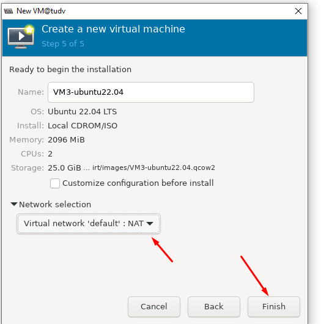

# KVM default NAT-based networking

NAT-based networking thường được cung cấp và enable mặc định bởi hầu hết các bản phân phối Linux mà hỗ trợ KVM virtualization.

Cấu hình network này sử dụng 1 Linux bridge kết hợp với Network Address Translation (NAT) để cho phép 1 guest OS có thể kết nối ra ngoài được, bất kể loại network là gì (có dây, không dây, dial-up,...).

Giống với các lựa chọn bridge mềm khác, NAT-based networking cho phép các KVM guest chia sẻ cùng bridge để giao tiếp ngay cả khi nếu bridge này không kết nối đến 1 interface nào ở KVM host, hoặc nếu KVM host không có network vật lý nào được thiết lập.

Trong khi NAT là 1 lựa chọn rất thuận tiện và linh hoạt, cho phép 1 guest OS dễ dàng kết nối đến mạng internet, thì nó lại có đặc điểm khiến nó có thể kém hợp lý hơn trong nhiều trường hợp hay trong doanh nghiệp.

Đầu tiên, mặc định, bridge mà cấu hình cho NAT-based connectivity thường sử dụng private IP từ dải ```192.168.x.x```. Địa chỉ trong dải này không được phân phối cho bất kỳ tổ chức cụ thể nào cả và bất kể ai sử dụng chúng đồng nghĩa với chưa được sự đồng thuận của regional Internet registry. Sử dụng 1 dải ```192.168.x.x``` cho phép 1 bản phân phối Linux tránh đi nhiều tasks và sự phức tạp khi cấu hình liên quan tới tiết kiệm tài nguyên và quản lý (thứ được cho là nhức nhối hàng đầu ở thời điểm hiện tại).

Thứ 2, các interfaces mà sử dụng NAT, mặc định sẽ không nhìn thấy được bên ngoài host KVM. Điều này có nghĩa là các hệ thống bên ngoài và các thành phần mạng của chúng không biết được cách để định tuyến traffic đến 1 KVM guest OS trên KVM host riêng biệt.

Thứ 3, việc sử dụng NAT cùng bridge sẽ tạo thêm các phát sinh, thứ mà sẽ ảnh hưởng đến thông lượng hay độ trễ của mạng, cũng như tăng mức tiêu thụ CPU và memory của máy chủ. Hành vi của NAT thường được hiện thực hóa bằng cách sử dụng Linux firewall bằng các quy tắc static và dynamic. Việc sử dụng firewall đặt ra các yêu cầu bổ sung cho hệ thống.

Với hầu hết các bản phân phối Linux, NAT-based networking thường được cấu hình và khả dụng theo mặc định khi OS được cài đặt. Thông thường, tên của NAT bridge mặc định là ```virbr0``` và tên của network mặc định là ```default```.

  

Để liệt kê network nào được định nghĩa với libvirt daemon cho KVM guest sử dụng, có thể dùng lệnh sau:

```sh
virsh net-list
```

Đường dẫn cấu hình network NAT mặc định tại ``/etc/libvirt/qemu/networks/default.xml`` , chúng ta có thể thay đổi thông tin IP cấp phát cho dải mạng NAT ở đây

    root@KVM01:/etc/netplan# cd /etc/libvirt/qemu/networks/

    root@KVM01:/etc/libvirt/qemu/networks# ls
    autostart  default.xml  newnatnetwork.xml
    root@KVM01:/etc/libvirt/qemu/networks# cat default.xml
    <!--
    WARNING: THIS IS AN AUTO-GENERATED FILE. CHANGES TO IT ARE LIKELY TO BE
    OVERWRITTEN AND LOST. Changes to this xml configuration should be made using:
      virsh net-edit default
    or other application using the libvirt API.
    -->

    <network>
      <name>default</name>
      <uuid>19cf40ba-5273-43fc-9fef-2e026ba119d9</uuid>
      <forward mode='nat'/>
      <bridge name='virbr0' stp='on' delay='0'/>
      <mac address='52:54:00:58:87:23'/>
      <ip address='192.168.122.1' netmask='255.255.255.0'>
        <dhcp>
          <range start='192.168.122.2' end='192.168.122.254'/>
        </dhcp>
      </ip>
    </network>
    root@KVM01:/etc/libvirt/qemu/networks# pwd
    /etc/libvirt/qemu/networks

Với ``virbr0`` là card mạng mặc định được tạo ra khi bạn cài KVM

KVM guest muốn sử dụng NAT bridge mặc định sẽ cần thêm hoặc chỉnh sửa phần network trong libvirt XML configuration file, ví dụ:

```sh
<interface type="bridge"> 
    <source bridge="bridge-name"/>
    <model type="virtio"/>
    <driver name="vhost"/>
</interface>
```

Để định nghĩa 1 NAT bridge mới, hãy sử dụng các bước sau:

Để tạo một mạng ảo (virtual network) trên KVM bằng `libvirt` với file XML, bạn có thể làm theo hướng dẫn sau:

### Bước 1: Tạo File XML Mạng Ảo

Dưới đây là một ví dụ về file XML để tạo một mạng ảo tên là `hotonly` với subnet `192.168.19.0/24`. Tạo một file `hotonly.xml` với nội dung sau:


```xml
<network>
  <name>hotonly</name>
  <uuid>08bcf54a-26ea-4cf0-941e-5543adc55286</uuid>
  <bridge name='virbr1' stp='on' delay='0'/>
  <mac address='52:54:00:ec:ad:17'/>
  <domain name='hotonly'/>
  <ip address='192.168.19.1' netmask='255.255.255.0'>
    <dhcp>
      <range start='192.168.19.128' end='192.168.19.254'/>
    </dhcp>
  </ip>
</network>

```

Trong đó:
- `<name>my-network</name>`: Đặt tên cho mạng ảo.
- `<bridge name='virbr1' ... />`: Tạo bridge `virbr1` cho mạng này.
- `<ip address='192.168.19.1' netmask='255.255.255.0'>`: Đặt địa chỉ IP và subnet cho bridge.
- `<dhcp><range start='192.168.19.10' end='192.168.19.100'/></dhcp>`: Cấu hình DHCP

### Bước 2: Tạo Mạng Ảo Qua `virsh`

Sử dụng `virsh` để tạo và kích hoạt mạng ảo từ file XML vừa tạo:

1. **Tạo mạng**:
   ```bash
   sudo virsh net-define hotonly.xml
   ```

2. **Kích hoạt mạng**:
   ```bash
   sudo virsh net-start hotonly
   ```

3. **Thiết lập mạng tự động bật khi khởi động lại hệ thống**:
   ```bash
   sudo virsh net-autostart hotonly
   ```

### Bước 3: Kiểm tra Mạng Ảo

Bạn có thể kiểm tra mạng vừa tạo bằng lệnh:

```bash
sudo virsh net-list --all
```

Mạng `hotonly` sẽ hiển thị trong danh sách các mạng ảo đã được cấu hình. Bây giờ, bạn có thể cấu hình các máy ảo của mình để sử dụng mạng này thông qua bridge `virbr1`.

2. **Kiểm tra các bridge hiện có**:
   Kiểm tra các bridge trên hệ thống bằng lệnh:
   ```bash
   brctl show
   ```
   Hoặc:
   ```bash
   ip link show
   ```


### Bước 3: Xóa Mạng Cũ (Nếu Cần)

Nếu bạn đã định nghĩa một mạng nhưng không sử dụng nó, bạn có thể xóa nó:

```bash
sudo virsh net-destroy <name>
sudo virsh net-undefine <name>
```

Thay `<name>` bằng tên của mạng mà bạn muốn xóa.

### Bước 4: Tạo Lại Mạng Nếu Cần

Nếu bạn đã chỉnh sửa file XML hoặc muốn tạo lại một mạng mới, hãy làm theo các bước sau:

1. **Định nghĩa mạng**:
   ```bash
   sudo virsh net-define /etc/libvirt/qemu/networks/hotonly.xml
   ```

2. **Kích hoạt mạng**:
   ```bash
   sudo virsh net-start hotonly
   ```

3. **Thiết lập tự động khởi động**:
   ```bash
   sudo virsh net-autostart hotonly
   ```

### Lưu ý:
- Đảm bảo rằng bạn có quyền truy cập đầy đủ để thực hiện các lệnh này.
- Nếu bridge `br0` đã tồn tại nhưng bạn không cần nó nữa, bạn có thể xóa nó bằng cách sử dụng `brctl delbr br0` (cẩn thận với điều này vì nó sẽ làm mất kết nối mạng cho bất kỳ dịch vụ nào đang sử dụng bridge đó).
