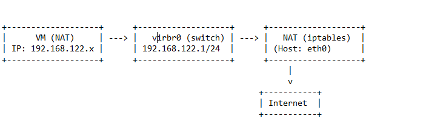
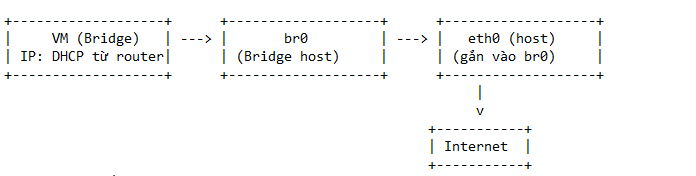
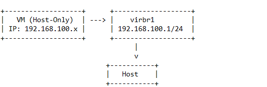

### Phân tích đường đi gói tin trong KVM với 3 chế độ card mạng: NAT, Bridge, Host-Only  

#### 1. Tổng quan các chế độ mạng trong KVM
| Chế độ  | Kết nối ra Internet | Giao tiếp với Host | Giao tiếp với LAN | DHCP Server          | Switch ảo      |
|------------|-----------------------|----------------------|----------------------|-------------------------|-------------------|
| NAT    | Có (qua host)         | Có                   | Không                | dnsmasq (mặc định)    | virbr0          |
| Bridge | Có (trực tiếp)        | Có                   | Có                   | DHCP vật lý/router      | br0 (tạo thủ công) |
| Host-Only | Không               | Có                   | Không                | dnsmasq (tùy chọn)    | virbr1          |

---

## 1. Chế độ NAT (Mặc định)

### Đường đi gói tin

    VM (eth0) → virbr0 (switch ảo) → NAT (iptables/nftables) → eth0 (host) → Internet

#### Các điểm đi qua (Network Points):

1. **VM** (với card mạng eth0).  
2. **Switch ảo virbr0** (do Libvirt tạo tự động).  
3. **NAT Enginene** (sử dụng iptables/nftables trên host). 
4. **Card mạng vật lý eth0** (hoặc ens3, enp0s3 tùy host)
5. **Internet**. 

**Layout**

  

#### **Chi tiết khi sử dụng NAT**

  + DHCP Server: dnsmasq (chạy trên host, cấp IP cho VM từ dải 192.168.122.0/24).  

  + NAT Rules:  
 
    iptables -t nat -L -v  # Xem rules NAT
  
  - Gói tin từ VM ra internet được SNAT (đổi IP VM → IP host).  
  - Gói tin từ Intenet vào VM cần Port Forwarding (nếu muốn).  

#### **Nếu không tạo bridge (virbr0), VM có ra Internet không?**

❌ **Không**, vì:

- virbr0 là **switch ảo** kết nối VM với NAT engine.  
- Nếu không có virbr0, VM không có DHCP Server.  
- **DHCP Server** (dnsmasq) cũng chạy trên virbr0, nếu không có nó, VM không  Chế độ Bridge

## 2. Chế độ Bridge

**Đường đi gói tin**

    VM (eth0) → br0 (bridge) → eth0 (host) → Switch vật lý → Internet

**Các điểm đi qua**:

1. **VM** ( với card mạng eth0 )  
2. **Bridge br0** (gắn với card mạng vật lý eth0).  
3. **Card mạng vật lý eth0** (trên host).  
4. **Switch/Layout lý** → Internet.  

#### **Layout**

  

#### **Đặc điểm**
- VM nhận IP Không qua NAT(router/máy chủ DHCP).  
- Không qua NAT-Switch ảo br0c (nếu mạng cho phép).  
- Switch ảo br0 kết nối trực tiếp với card vật lý (eth0).  

#### **Nếu không tạo bridge (br0), VM có ra Internet được không?**

❌ **Không**, vì:

- VM cần bridge để kết nối với card mạng vật lý.  
- Nếu không có bridge, VM bị **cô lập** (chỉ giao tiếp nội bộ host).  

---
## 3. Chế độ Host-Only

### Đường đi gói tin

    VM (eth0) → virbr1 (switch ảo) → Host (vnetX)

#### Các điểm đi qua:

1. **VM** (với card mạng eth0).  

2. **Switch ảo virbr1** (do Libvirt tạo).  

3. **Hostst** (thông qua interface vnetX).  

**Layout**

  

**Đặc điểm**

  + Không ra Internetet, chỉ giao tiếp với host và các VM cùng mạng. 

  + DHCP Serverer: Có thể dùng dnsmasq (tùy cấu hình). 

  + Ứng dụng: Lab nội bộ, testing.  

---
## 4. Mối quan hệ giữa Switch ảo và Card mạng thật

Trong ảo hóa KVM (Kernel-based Virtual Machine), Switch ảo (Virtual Switch) đóng vai trò là một trung tâm kết nối mạng ảo, cho phép các máy ảo (VMs) giao tiếp với nhau và với mạng bên ngoài thông qua Card mạng thật (Physical Network Interface Card - NIC) của máy chủ vật lý. Mối quan hệ giữa chúng có thể được mô tả như sau:

#### 1. Card mạng thật (Physical NIC): Cổng vật lý ra thế giới mạng

  + Đây là phần cứng thực tế trên máy chủ vật lý, được kết nối với mạng LAN hoặc internet thông qua cáp mạng.
  + Nó có địa chỉ MAC vật lý duy nhất.
  + Hệ điều hành máy chủ vật lý sử dụng driver để quản lý và tương tác với card mạng thật này.

#### 2. Switch ảo (Virtual Switch): Bộ chuyển mạch mạng phần mềm

  + Đây là một thành phần phần mềm được tạo ra bởi KVM (thông qua các công cụ như bridge-utils hoặc libvirt).
  + Nó hoạt động ở lớp liên kết dữ liệu (Layer 2) của mô hình OSI, tương tự như một switch vật lý.
  + Switch ảo không có phần cứng vật lý tương ứng; nó tồn tại hoàn toàn trong phần mềm.
  + Nó cho phép tạo ra nhiều cổng ảo (virtual ports) mà các card mạng ảo (virtual NICs) của các máy ảo có thể kết nối vào.

**Mối quan hệ và cách chúng tương tác:**

  + Kết nối logic: Switch ảo được liên kết logic với một hoặc nhiều card mạng thật của máy chủ. Điều này cho phép lưu lượng mạng từ các máy ảo có thể đi ra và vào mạng vật lý thông qua card mạng thật đó.
  + Đóng vai trò trung gian: Switch ảo hoạt động như một cầu nối (bridge) hoặc một bộ định tuyến (router) đơn giản ở lớp 2. Khi một máy ảo gửi dữ liệu ra mạng, lưu lượng này sẽ đi qua card mạng ảo của nó, đến switch ảo, và sau đó được chuyển tiếp ra card mạng thật để đến đích. Ngược lại, lưu lượng mạng từ bên ngoài đến card mạng thật có thể được switch ảo định tuyến đến card mạng ảo của máy ảo đích dựa trên địa chỉ MAC ảo.
  + Chia sẻ tài nguyên: Một card mạng thật duy nhất có thể được chia sẻ bởi nhiều switch ảo (mặc dù cấu hình phổ biến là một switch ảo liên kết với một hoặc nhiều card mạng thật). Mỗi switch ảo sau đó có thể phục vụ nhiều máy ảo. Điều này cho phép tận dụng tối đa tài nguyên phần cứng.
  + Cô lập mạng: Các switch ảo khác nhau có thể được cấu hình để tạo ra các mạng ảo riêng biệt và cô lập. Các máy ảo kết nối vào các switch ảo khác nhau sẽ không thể giao tiếp trực tiếp với nhau trừ khi có cấu hình định tuyến đặc biệt.
  + Các chế độ kết nối mạng ảo: KVM hỗ trợ nhiều chế độ kết nối mạng ảo, và switch ảo đóng vai trò trung tâm trong hầu hết các chế độ này:
     + Bridged Networking (Cầu nối mạng): Switch ảo được "cầu nối" với một card mạng thật. Các máy ảo sẽ xuất hiện trên cùng một mạng vật lý với máy chủ và các thiết bị khác, có địa chỉ IP riêng từ DHCP server của mạng vật lý.
     + NAT (Network Address Translation): Switch ảo hoạt động như một router NAT. Các máy ảo chia sẻ địa chỉ IP của máy chủ khi giao tiếp với mạng bên ngoài. Máy chủ thực hiện việc chuyển đổi địa chỉ và cổng.
     + Internal Networking (Mạng nội bộ): Switch ảo tạo ra một mạng riêng chỉ dành cho các máy ảo kết nối vào nó. Các máy ảo này có thể giao tiếp với nhau nhưng không thể trực tiếp truy cập mạng bên ngoài.
     + Routed Networking (Định tuyến mạng): Cấu hình phức tạp hơn, cho phép định tuyến lưu lượng giữa các mạng ảo và mạng vật lý.

## 5. Kết luận

**NAT**: VM ra Internet qua NAT engine (iptables), phù hợp cho máy ảo cá nhân. 

**Bridge**: VM kết nối trực tiếp với mạng vật lý, phù hợp cho server. 

**Host-Onlyly**: Chỉ giao tiếp nội bộ, dùng cho lab/testing. 

**Switch ảo** (virbr0, br0) là thành pbắt buộc để VM kết nối mạng. 

**Card mạng thật** (eth0) là cổng ra Internet cuối cùng.  

>Kiểm tra cấu hình mạng KVM**:  

    virsh net-list --all           # Liệt kê các mạng ảo
    brctl show                    # Xem bridge
    ip a                          # Kiểm tra interface
