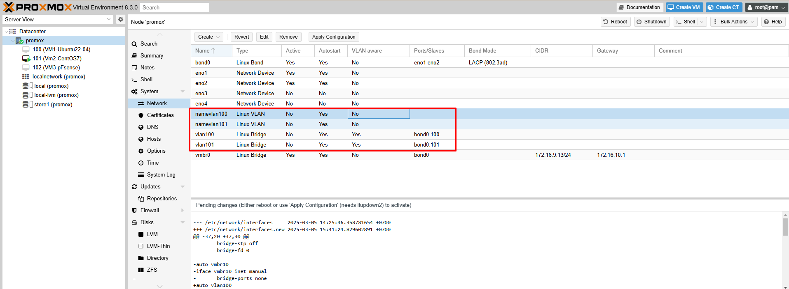
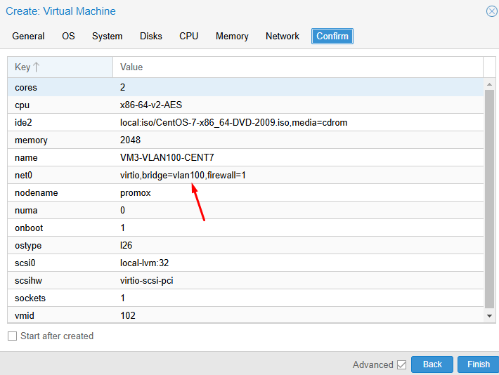
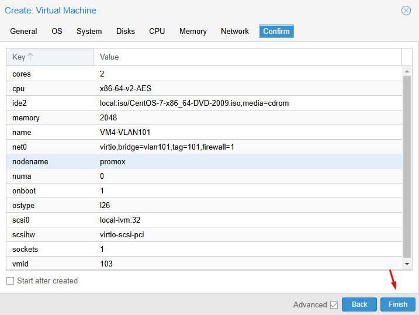
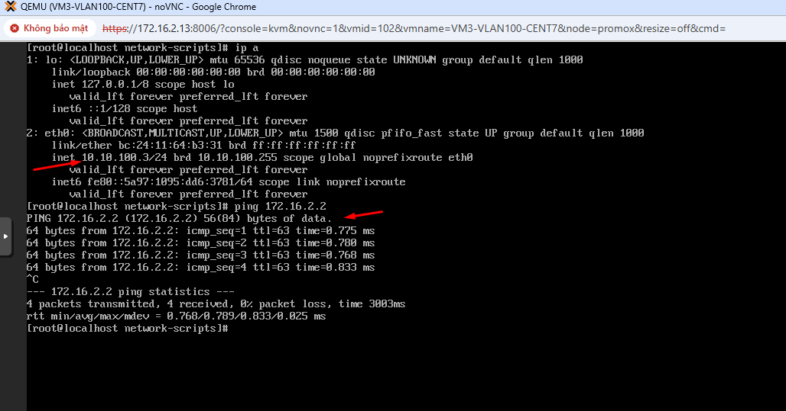
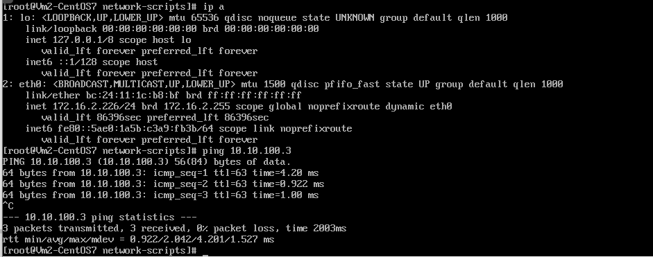

## 1. Network Flat (Mạng phẳng)

#### Khái niệm:

Network Flat là mô hình mạng đơn giản nhất, trong đó tất cả các máy ảo (VMs) và container chia sẻ cùng một mạng LAN vật lý.
Trong Proxmox, điều này thường được thực hiện bằng cách sử dụng một bridge (cầu nối) kết nối các VMs/containers với một interface mạng vật lý.
Tất cả các VMs/containers sẽ nằm trong cùng một broadcast domain, nghĩa là chúng có thể giao tiếp trực tiếp với nhau mà không cần router.

#### Ưu điểm:

Đơn giản, dễ cấu hình.
Hiệu suất cao, độ trễ thấp.
Phù hợp cho các môi trường nhỏ hoặc các ứng dụng không yêu cầu phân đoạn mạng phức tạp.

#### Nhược điểm:

Bảo mật kém, vì tất cả các thiết bị đều nằm trong cùng một mạng.
Khả năng mở rộng hạn chế, vì lưu lượng broadcast có thể gây tắc nghẽn mạng.
Khó quản lý khi số lượng VMs/containers tăng lên.

Trong Proxmox:

Khi bạn tạo một bridge (ví dụ: vmbr0) và gán một interface mạng vật lý vào bridge đó, bạn đã tạo một Network Flat.
Tất cả các VMs/containers kết nối với bridge này sẽ nằm trong cùng một mạng LAN.

## 2. Multi VLAN (Nhiều VLAN)

#### Khái niệm:

Multi VLAN cho phép bạn chia một mạng LAN vật lý thành nhiều mạng LAN logic riêng biệt (VLANs).
Mỗi VLAN hoạt động như một mạng LAN độc lập, có broadcast domain riêng.
Các VMs/containers trong các VLAN khác nhau không thể giao tiếp trực tiếp với nhau, trừ khi có router.

#### Ưu điểm:

Tăng cường bảo mật bằng cách cô lập các mạng khác nhau.
Cải thiện hiệu suất bằng cách giảm lưu lượng broadcast.
Quản lý linh hoạt hơn, cho phép phân đoạn mạng theo chức năng hoặc phòng ban.
Khả năng mở rộng tốt hơn.

#### Nhược điểm:

Cấu hình phức tạp hơn.
Yêu cầu switch mạng hỗ trợ VLAN tagging (802.1Q).

Trong Proxmox:

Để sử dụng Multi VLAN, bạn cần cấu hình VLAN tagging trên switch mạng vật lý.
Sau đó, bạn có thể tạo các bridge VLAN trong Proxmox bằng cách chỉ định VLAN ID (ví dụ: vmbr10 cho VLAN 10, vmbr20 cho VLAN 20).
Các VMs/containers kết nối với bridge VLAN sẽ được gán vào VLAN tương ứng.
Proxmox hỗ trợ cấu hình VLAN thông qua việc thêm 1 thẻ VLAN ID vào trong cấu hình của Bridge Network.

Ví dụ:

Bạn có thể tạo VLAN 10 cho mạng quản lý, VLAN 20 cho mạng máy chủ web và VLAN 30 cho mạng máy chủ cơ sở dữ liệu.
Điều này giúp cô lập các mạng khác nhau, tăng cường bảo mật và cải thiện hiệu suất.

Tóm lại:

Network Flat là mô hình mạng đơn giản, phù hợp cho các môi trường nhỏ.
Multi VLAN là mô hình mạng phức tạp hơn, nhưng cung cấp nhiều lợi ích về bảo mật, hiệu suất và khả năng mở rộng.
Tùy thuộc vào yêu cầu của ứng dụng và môi trường, bạn có thể chọn mô hình mạng phù hợp.

## Cách cấu hình Network Flat và Multi VLAN trong ảo hóa Proxmox:

#### Network Flat:

Trong Proxmox, mặc định sẽ có một mạng ảo (virtual network) tên là ``vmbr0`` được tạo ra.
Để cấu hình Network Flat, chỉ cần gán các máy ảo/container vào "vmbr0" như một mạng chung.

Các bước cấu hình:

  + Trong Proxmox Web UI, vào ``Network`` -> ``Bridges`` và chọn ``vmbr0``.
  + Trong tab ``General``, đảm bảo ``Type`` được chọn là ``Bridge``.
  + Trong tab ``Ports``, không cần thêm bất kỳ cổng nào, vì ``vmbr0`` sẽ là mạng chung.
  + Lưu cấu hình.

Khi tạo hoặc chỉnh sửa máy ảo/container, chọn ``vmbr0`` làm mạng cầu nối ảo cho chúng.

#### Multi VLAN:

Để cấu hình Multi VLAN, bạn cần tạo các mạng ảo (virtual network) riêng biệt và gán chúng vào các VLAN khác nhau.

Các bước cấu hình:

  + Trong Proxmox Web UI, vào ``Network`` -> ``Bridges`` và chọn ``Create Bridge``.
  + Đặt tên cho bridge, ví dụ: ``vmbr1``, ``vmbr2``, ...
  + Trong tab ``General``, chọn "Type" là ``Bridge`` và nhập ID VLAN tương ứng (ví dụ: VLAN 10 cho ``vmbr1``, VLAN 20 cho ``vmbr2``, ...).
  + Trong tab ``Ports``, không cần thêm bất kỳ cổng nào, vì các máy ảo/container sẽ được gán vào các bridge này.
  + Lưu cấu hình.

Khi tạo hoặc chỉnh sửa máy ảo/container, chọn mạng ảo tương ứng (vmbr1, vmbr2, ...) để gán chúng vào các VLAN khác nhau.

## Config chi tiết (Đã bonding eno1 và eno2 thành bond0 mode 802.3ad)

#### Khai báo 2 bridge tên vlan100 và vlan101 và 2 vlan tên namevlan100 bridge qua vlan100 và namevlan101 bridge qua vlan101 như sau:

  

#### VLAN 1 chạy qua:

root@promox:~# ``cat /etc/network/interfaces``
    auto lo
    iface lo inet loopback

    iface eno1 inet manual

    iface eno2 inet manual

    auto bond0
    iface bond0 inet manual
        bond-slaves eno1 eno2
        bond-miimon 100
        bond-mode 802.3ad
        bond-xmit-hash-policy layer2+3

    auto vmbr0
    iface vmbr0 inet static
        address 172.16.9.13/24
        gateway 172.16.10.1
        bridge-ports bond0
        bridge-stp off
        bridge-fd 0
    source /etc/network/interfaces.d/*

#### VLAN 1 và VLAN 100 chạy qua:

root@promox:~# ``cat /etc/network/interfaces``

    auto lo
    iface lo inet loopback

    iface eno1 inet manual

    iface eno2 inet manual

    auto bond0
    iface bond0 inet manual
        bond-slaves eno1 eno2
        bond-miimon 100
        bond-mode 802.3ad
        bond-xmit-hash-policy layer2+3

    iface bond0.100 inet manual
    auto vmbr0v100
    iface vmbr0v100 inet static
        address 10.10.100.2/24
        gateway 10.10.100.1
        bridge-ports bond0.100
        bridge-stp off
        bridge-fd 0

    auto vmbr0
    iface vmbr0 inet static
        address 172.16.9.13/24
        gateway 172.16.10.1
        bridge-ports bond0
        bridge-stp off
        bridge-fd 0
    source /etc/network/interfaces.d/*

#### VLAN 1 và VLAN 100 và VLAN 101 chạy qua:

root@promox:~# ``cat /etc/network/interfaces``

    auto lo
    iface lo inet loopback

    iface eno1 inet manual

    iface eno2 inet manual

    auto bond0
    iface bond0 inet manual
        bond-slaves eno1 eno2
        bond-miimon 100
        bond-mode 802.3ad
        bond-xmit-hash-policy layer2+3

    iface bond0.100 inet manual
    auto vmbr0v100
    iface vmbr0v100 inet static
        address 10.10.100.2/24
        gateway 10.10.100.1
        bridge-ports bond0.100
        bridge-stp off
        bridge-fd 0

    iface bond0.101 inet manual
    auto vmbr0v101
    iface vmbr0v101 inet static
        address 10.10.101.2/24
        gateway 10.10.101.1
        bridge-ports bond0.101
        bridge-stp off
        bridge-fd 0

    auto vmbr0
    iface vmbr0 inet static
        address 172.16.9.13/24
        gateway 172.16.10.1
        bridge-ports bond0
        bridge-stp off
        bridge-fd 0
    source /etc/network/interfaces.d/*

#### Test tạo VM thuộc VLAN 100 và VLAN 101 ( đặt IP tĩnh cho VM )

Trên swcore đang cắm đường bonding với máy Proxmox,tôi đã cấu hình sw cấp IP động cho VLAN 100 và VLAN 101

    swcore1(config)#vlan 100
    swcore1(config-vlan)#exit
    swcore1(config)#vlan 101
    swcore1(config-vlan)#exit
    swcore1(config)#ip dhcp pool vlan100
    swcore1(dhcp-config)#network 10.10.100.0 255.255.255.0
    swcore1(dhcp-config)#default-router 10.10.100.1
    swcore1(dhcp-config)#dns-server 8.8.4.4
    swcore1(dhcp-config)#exit
    swcore1(config)#ip dhcp pool dhcpvlan101
    swcore1(dhcp-config)#network 10.10.101.0 255.255.255.0
    swcore1(dhcp-config)#default-router 10.10.101.1
    swcore1(dhcp-config)#dns-server 8.8.4.4

    swcore1(config)#interface vlan 100
    swcore1(config-if)#ip address 10.10.100.1 255.255.255.0
    swcore1(config-if)#no shutdown
    swcore1(config-if)#exit

    swcore1(config)#interface vlan 101
    swcore1(config-if)#ip address 10.10.101.1 255.255.255.0
    swcore1(config-if)#no shutdown
    swcore1(config-if)#exit
    swcore1(config)#ip routing

    swcore1(dhcp-config)#end
    swcore1#write mem
    
Tạo 1 VM, gắn VM vào bridge vlan100

  

Tạo 1 VM, gắn VM vào bridge vlan101

  

Hình ảnh kiểm tra ping thông VM 

  

  

