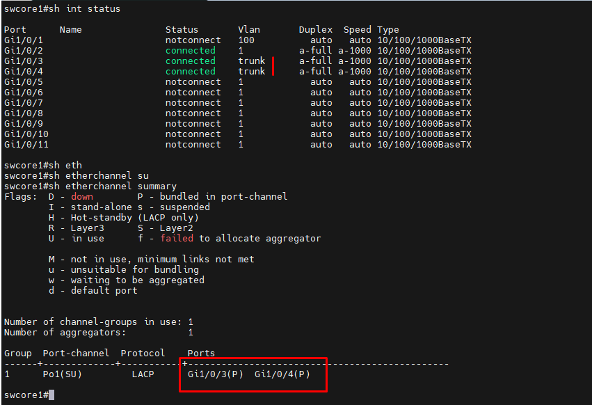
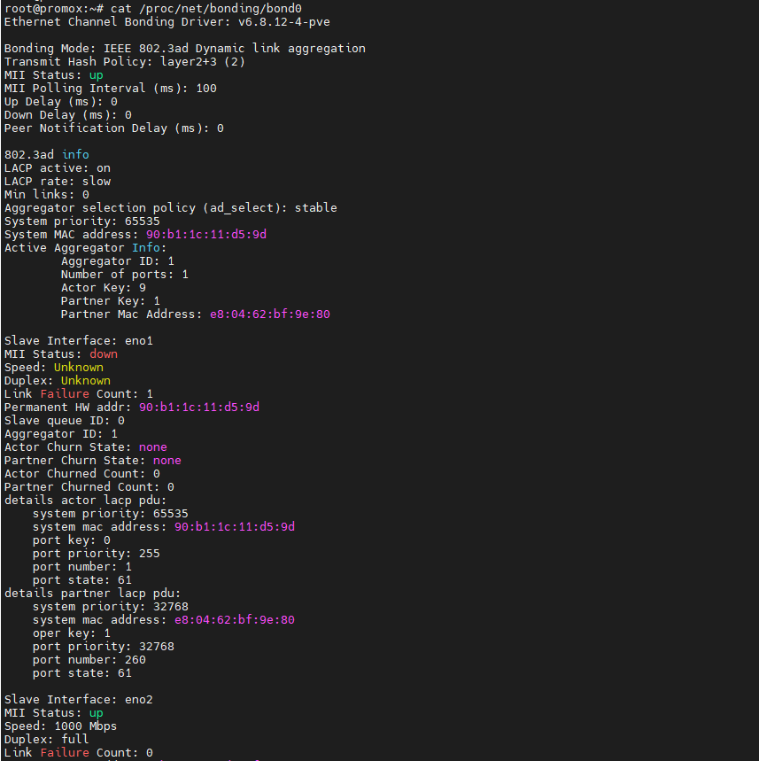
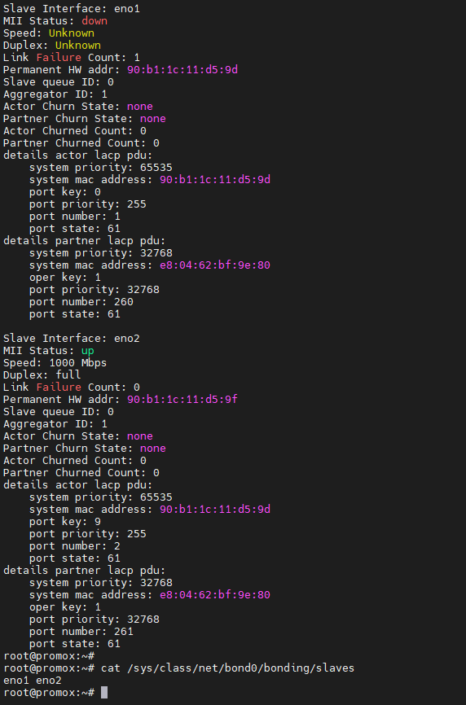

Ở đây mình sẽ thực hiện bond interface giao tiếp trực tiếp với node Proxmox này eno1 và eno2

Phía uplink của máy Proxmox node đấu nối với switch cisco

Mình config trên cisco như sau:

## Cấu hình switch Cisco nhóm port Gi1/0/3-4 thành Po1

    swcore1(config)#interface range Gi1/0/3-4

    swcore1(config-if-range)#no shutdown

    swcore1(config-if-range)#channel-group 1 mode active

    swcore1(config)# channel-protocol lacp

    swcore1(config)#interface port-channel 1

    swcore1(config-if)#sw trunk encapsulation dot1q

    swcore1(config-if)#sw mode trunk

    swcore1(config-if)#end
    swcore1#wr mem
    Building configuration...
    [OK]

  

## Ví dụ bond sử dụng bridge mode 802.3ad

``cat /etc/network/interfaces``

    auto lo
    iface lo inet loopback

    iface eno1 inet manual

    iface eno2 inet manual

    auto bond0
    iface bond0 inet manual
        bond-slaves eno1 eno2
        bond-miimon 100
        bond-mode 802.3ad
        bond-xmit-hash-policy layer2+3

    auto vmbr0
    iface vmbr0 inet static
        address 172.16.2.13/24
        gateway 172.16.10.1
        bridge-ports bond0
        bridge-stp off
        bridge-fd 0

    source /etc/network/interfaces.d/*

## Khởi động lại máy

  

  